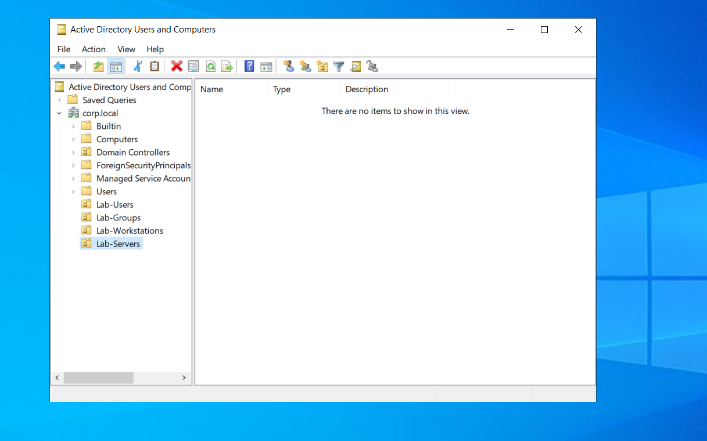
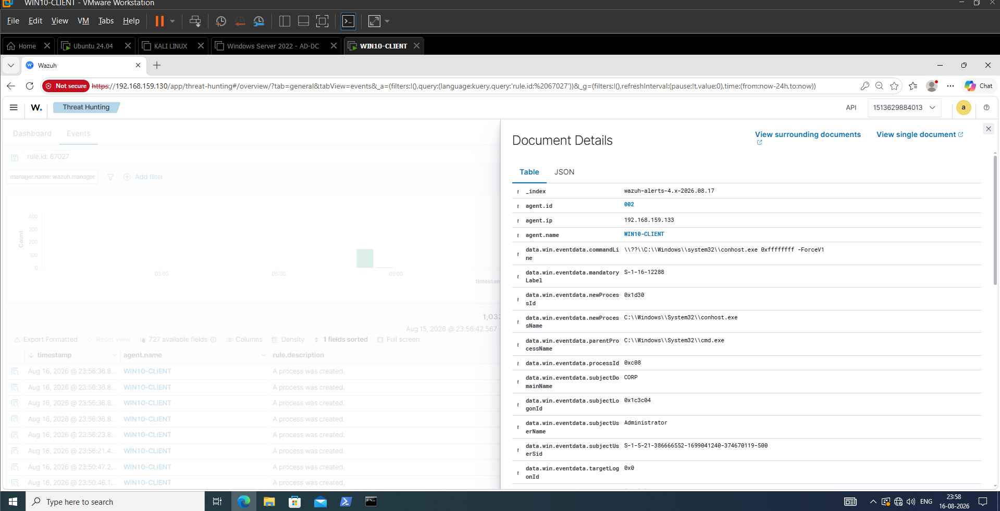
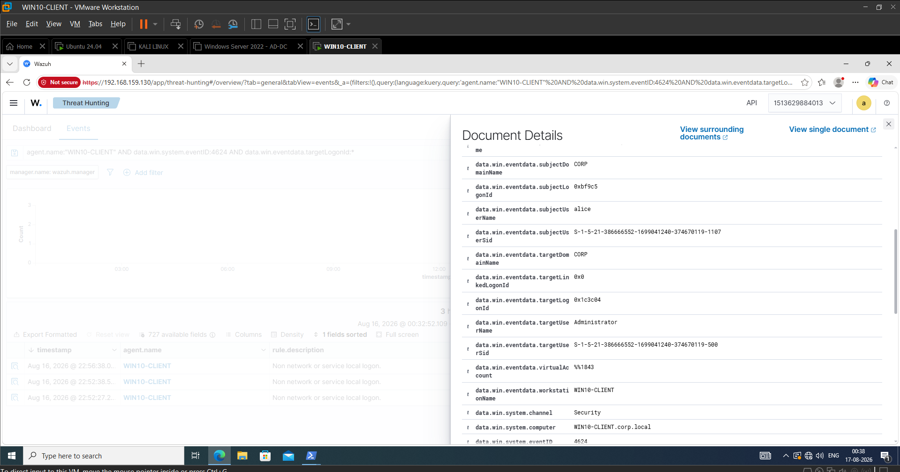

# Active Directory Attack & Detection Lab

A self-built Active Directory enterprise environment — domain controller, domain-joined Windows client, Sysmon endpoint telemetry, and Wazuh SIEM ingestion — documented day by day with commands, verification output, and screenshots.

**Status: 🚧 In Development — Day 04 of a multi-phase build**
Active Directory, the domain-joined endpoint, Sysmon telemetry, and Wazuh SIEM ingestion are built and verified. No attack simulation has been performed yet — Kali Linux is provisioned as the intended attacker VM but has not been used. Detection rules and MITRE ATT&CK mapping have not started.

---

## Project Overview

Most beginner AD labs stop at "installed a domain controller." This project goes further: build a small enterprise-style Active Directory domain, join a Windows 10 endpoint, generate real Windows authentication and process telemetry, deploy Sysmon for endpoint-level visibility, and forward that telemetry into a Wazuh SIEM — all before a single attack is run.

The reasoning behind that order: you can't meaningfully investigate an attack against telemetry you haven't first proven works. Each phase so far has centered on the same core SOC skill — correlating Windows Security Event ID `4624` (successful logon) with subsequent process activity using the **Logon ID** as the correlation key, first through the native Windows Event Log, then through Sysmon, then through Wazuh's centralized dashboard.

The next phase of the project introduces controlled attacks from the Kali Linux VM against this environment, with detection rules and MITRE ATT&CK mapping built against the telemetry pipeline established here.

---

## Lab Environment

| Component | Role | Platform | Details |
|---|---|---|---|
| `AD-DC` | Domain Controller | Windows Server 2022 Standard Evaluation | `192.168.159.10`, domain `corp.local` (NetBIOS `CORP`) |
| `WIN10-CLIENT` | Domain-joined endpoint | Windows 10 | `192.168.159.133`, Sysmon-instrumented, Wazuh Agent `002` |
| Wazuh Manager | SIEM | Ubuntu (existing infra, reused) | `192.168.159.130` |
| Attacker VM | Planned attack source | Kali Linux | Not yet used |
| Host | Hypervisor | Windows 11 + VMware Workstation 17 | NAT network |

---

## Lab Architecture

```text
Windows 11 Host
       |
VMware Workstation
       |
   +---+------------------------------+
   |                                  |
   v                                  v
Windows Server 2022                Windows 10
AD-DC (Domain Controller)          WIN10-CLIENT
corp.local / CORP                  domain-joined, Sysmon-instrumented
   |                                  |
   v                                  v
Active Directory                   Sysmon + Windows Security Logs
Lab-Users, Lab-Groups,                   |
Lab-Workstations, Lab-Servers            v
                                    Wazuh Agent (002)
                                          |
                                          v
                                    Wazuh Manager (Ubuntu, 192.168.159.130)
                                          |
                                          v
                                    Wazuh Dashboard

Kali Linux (Attacker) — provisioned, not yet used for attack simulation
```

---

## Technology Stack

- **Identity / AD:** Windows Server 2022, Active Directory Domain Services, AD-integrated DNS
- **Endpoint:** Windows 10, Sysmon, Windows Security Auditing
- **SIEM / Telemetry:** Wazuh 4.14.6 (Manager + Agent)
- **Attack tooling (provisioned, unused):** Kali Linux
- **Virtualization:** VMware Workstation 17 (NAT networking)
- **Documentation:** Markdown, Git/GitHub

---

## What's Actually Built

### Day 00 — Infrastructure Foundation
Windows Server 2022 VM provisioned (2 vCPU, 4 GB RAM, 80 GB disk), installed, renamed to `AD-DC`, static IPv4 configured, gateway and external connectivity verified via `ping`. Repository and documentation workflow established.

### Day 01 — Active Directory Foundation
AD DS role installed, server promoted to the first Domain Controller of a new forest (`corp.local` / `CORP`), AD-integrated DNS deployed and verified. Custom OU structure (`Lab-Users`, `Lab-Groups`, `Lab-Workstations`, `Lab-Servers`) created. Two domain users (`alice`, `bob`) and two security groups (`SOC-Analysts`, `IT-Admins`) created and membership verified. `WIN10-CLIENT` computer object joined to the domain. Full baseline independently re-verified with `Get-ADUser`, `Get-ADGroupMember`, `Get-ADComputer`, `Get-ADOrganizationalUnit`.

### Day 02 — Windows 10 Domain Client & Security Auditing
`WIN10-CLIENT` domain-joined and authenticated as `CORP\alice`. Windows Security auditing enabled. Investigated Event ID `4624` (successful logon), `4625` (failed logon), and `4688` (process creation) for both Notepad and PowerShell execution. Correlated a `4624` logon event to a subsequent `4688` process-creation event using the shared **Logon ID** (`0x5999f`) — establishing that username alone is an insufficient correlation key.

### Day 03 — Sysmon Deployment & Process Telemetry
Sysmon installed and verified as running on `WIN10-CLIENT`. Investigated Sysmon Event ID `1` (process creation) for Notepad, then correlated it to a Windows Security `4624` logon event for `CORP\alice` using Logon ID. Performed process-tree analysis on a `cmd.exe` chain and established a known-good process-creation baseline for later comparison.

### Day 04 — Wazuh SIEM Integration & Cross-Source Correlation
Verified network connectivity from `WIN10-CLIENT` to the Wazuh Manager, deployed the Wazuh Agent, and enrolled it as Agent `002`. Validated the Sysmon XML configuration under Wazuh. Confirmed the full telemetry pipeline (`WIN10-CLIENT → Sysmon → Wazuh Agent → Wazuh Manager → Dashboard`) by generating Notepad and `cmd.exe /c whoami` process-creation events and viewing them in the Wazuh Dashboard. Reconstructed the process tree `powershell.exe → cmd.exe → whoami.exe` and correlated it to Windows Security Event `4624` for `CORP\Administrator` using the shared Logon ID `0x1C3C04`.

### Not built yet (planned)
- Controlled attack simulation from the Kali Linux VM (Kerberoasting, password spraying, AS-REP roasting, lateral movement, privilege escalation)
- Custom Wazuh detection/correlation rules
- MITRE ATT&CK technique mapping
- SOC-style investigation write-ups / incident reports

---

## Attack & Detection Workflow (Target State)

The environment and telemetry pipeline built through Day 04 exist to support this workflow, which has not yet been exercised end-to-end with a real attack:

```text
Attack Simulation (Kali Linux) — not yet run
        ↓
Windows Endpoint (WIN10-CLIENT)
        ↓
Security / Sysmon Telemetry
        ↓
Wazuh Agent → Wazuh Manager → Dashboard
        ↓
Event Correlation (Logon ID)
        ↓
Detection — not yet built
        ↓
Investigation
```

What's already proven, using benign test activity (Notepad, `whoami`) instead of real attacks: the telemetry generates correctly, reaches Wazuh, and can be correlated across sources using the Logon ID.

---

## Evidence

### Active Directory Setup



*Custom OU structure (`Lab-Users`, `Lab-Groups`, `Lab-Workstations`, `Lab-Servers`) confirmed via PowerShell.*

### Endpoint Domain Join & Authentication


*`WIN10-CLIENT` joined to `corp.local` and authenticated as `CORP\alice`.*

### Authentication-to-Process Correlation (Windows Security Logs)


*Event ID `4624` for `CORP\alice`, Logon ID `0x5999f` — later matched against a `4688` process-creation event to link a user to a specific process.*

### Sysmon Process-Tree Analysis


*Sysmon-based parent-child process relationship analysis, forming the baseline used for later anomaly comparison.*

### Wazuh Ingestion of Sysmon Telemetry



*`cmd.exe /c whoami` process-creation event, generated on `WIN10-CLIENT` and confirmed in the Wazuh Dashboard — validating the full endpoint-to-SIEM telemetry pipeline.*

### Cross-Source Logon ID Correlation



*Windows Security Event `4624` (Logon ID `0x1C3C04`, `CORP\Administrator`) matched against the same Logon ID in Sysmon process telemetry — linking an authentication session to the process activity it generated.*

---

## Detection & Investigation Concepts Demonstrated

- **Event ID `4624` / `4625`** — successful and failed logon investigation
- **Event ID `4688`** (Windows Security) and **Event ID `1`** (Sysmon) — process creation from two different telemetry sources
- **Logon ID correlation** — the core technique used throughout: matching a Logon ID between an authentication event and later process events, because username alone can match multiple unrelated sessions
- **Process-tree / parent-child analysis** — reconstructing execution chains (e.g. `powershell.exe → cmd.exe → whoami.exe`) rather than evaluating a process in isolation
- **Baseline establishment** — capturing known-good process behavior before any attack activity exists, so future anomalies have something to be compared against
- **Cross-source correlation** — matching the same Logon ID across native Windows Security logs, Sysmon, and the centralized Wazuh Dashboard

No MITRE ATT&CK mapping is included yet — no attack has been simulated, so there is nothing to map.

---

## Repository Structure

```text
Project-03-AD-Attack-Detection-Lab/
├── README.md
├── docs/
│   ├── Day00.md    # Server provisioning & network setup
│   ├── Day01.md    # AD domain, OUs, users, groups, workstation join
│   ├── Day02.md    # Domain client join, Windows Security auditing
│   ├── Day03.md    # Sysmon deployment & process telemetry
│   └── Day04.md    # Wazuh SIEM integration & cross-source correlation
└── screenshots/
    ├── Day00/      # 10 screenshots
    ├── Day01/      # 23 screenshots
    ├── Day02/      # 15 screenshots
    ├── Day03/      # 12 screenshots
    └── Day04/      # 17 screenshots
```

77 screenshots are currently captured across five phases, following a consistent `DayXX-Number-Description.png` naming convention. Folders for attack simulation, detection rules, architecture diagrams, and reports (`attacks/`, `detections/`, `architecture/`, `diagrams/`, `reports/`, `scripts/`) are planned but not yet created — they'll be added when that work actually starts, rather than committed empty in advance.

---

## Documentation

Every step below is backed by a command (or GUI action), its output, and a screenshot — full detail lives in `docs/`:

- [`docs/Day00.md`](docs/Day00.md) — Windows Server provisioning and network setup
- [`docs/Day01.md`](docs/Day01.md) — Active Directory domain, OU, identity, and workstation build-out
- [`docs/Day02.md`](docs/Day02.md) — Domain client join and Windows Security auditing
- [`docs/Day03.md`](docs/Day03.md) — Sysmon deployment and process telemetry
- [`docs/Day04.md`](docs/Day04.md) — Wazuh SIEM integration and cross-source correlation

---

## Skills Demonstrated

**Active Directory / Windows Server**
Domain Controller deployment, AD-integrated DNS, OU design, user/group management, PowerShell-based verification (`Get-ADUser`, `Get-ADGroupMember`, `Get-ADComputer`, `Get-ADOrganizationalUnit`).

**Endpoint Monitoring**
Sysmon deployment and service verification, Windows Security auditing configuration, process-creation telemetry (Event `4688`, Sysmon Event `1`).

**SOC Investigation Methodology**
Logon ID correlation, process-tree / parent-child analysis, authentication-to-process correlation, baseline establishment.

**SIEM Operations**
Wazuh Agent deployment and enrollment, Sysmon configuration validation in Wazuh, cross-source event correlation via the Wazuh Dashboard.

**Lab Engineering**
VMware Workstation VM provisioning, static IP/network configuration, multi-VM domain environment design.

---

## Roadmap

### Completed
- Active Directory domain, OUs, users, groups (Day 00–01)
- Domain-joined Windows 10 endpoint with Windows Security auditing (Day 02)
- Sysmon deployment and endpoint process telemetry (Day 03)
- Wazuh SIEM integration and cross-source Logon ID correlation (Day 04)

### Currently Working On
- Preparing the Kali Linux attacker VM for controlled attack simulation

### Planned
- Controlled attack simulation (Kerberoasting, password spraying, AS-REP roasting, lateral movement, privilege escalation)
- Custom Wazuh detection/correlation rules
- MITRE ATT&CK technique mapping
- SOC-style investigation write-ups

---

## Why This Project Matters

SOC and Blue Team work is fundamentally about connecting authentication activity to endpoint behavior — not reading isolated alerts. Every phase of this lab has been built around that principle: proving that a Logon ID can reliably link a Windows logon session to the processes it spawned, first in the native Event Log, then in Sysmon, then in a centralized SIEM. That's the same correlation logic used to investigate lateral movement, credential misuse, and post-exploitation activity in a real environment — the attacks planned for the next phase will be investigated using the exact telemetry pipeline validated here.

---

## Author

**Ananthan D**
B.Tech Information Technology, University College of Engineering, Kariavattom
[GitHub](https://github.com/ananthancyber)