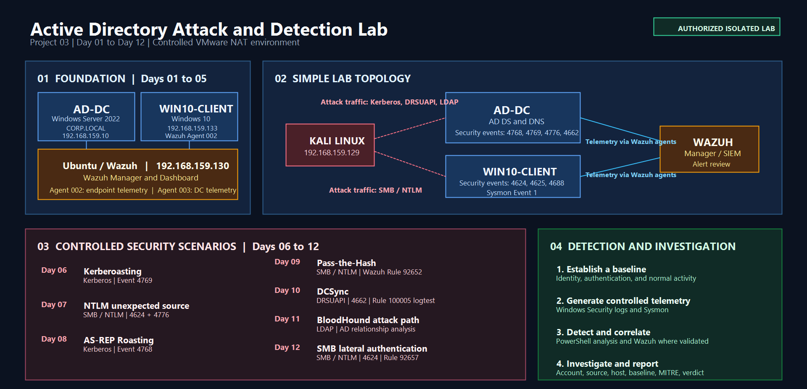
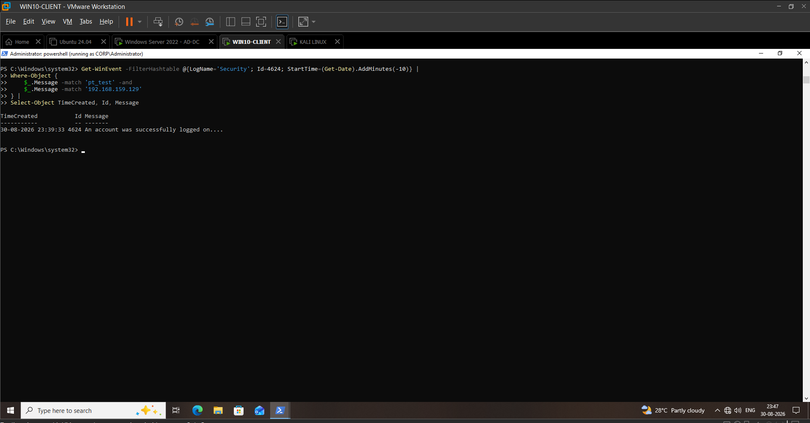
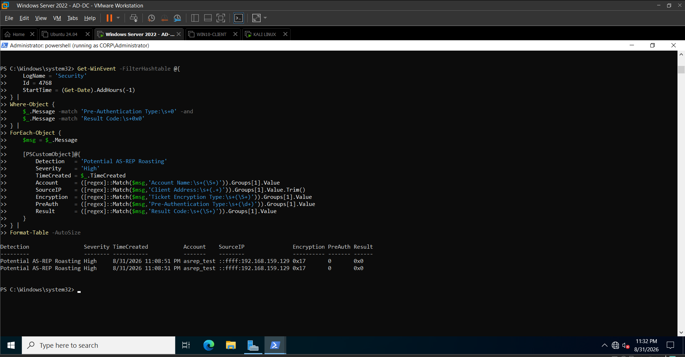
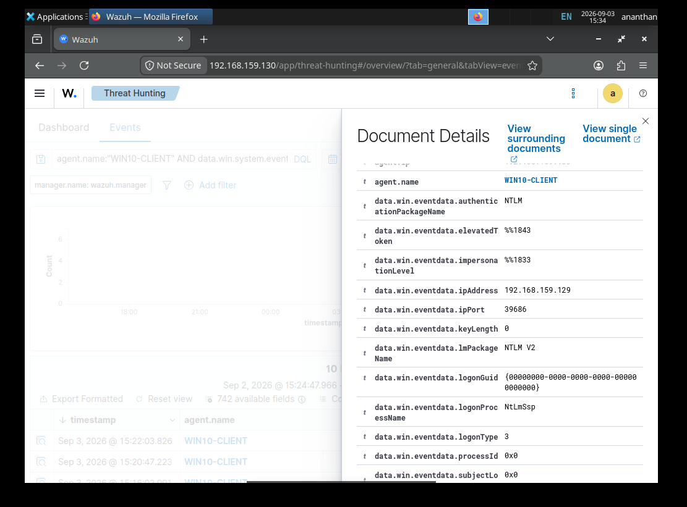
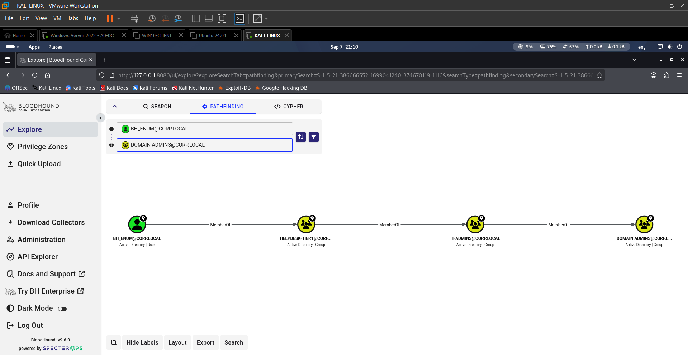

# Active Directory Attack & Detection Lab

> **Project 03 — A controlled Active Directory security lab demonstrating attack simulation, Windows telemetry collection, Wazuh-based detection, identity analysis, SOC investigation, and evidence-driven reporting.**

## Overview

This project is an end-to-end **Active Directory Attack & Detection Lab** built in an isolated VMware environment.

The lab was designed to reproduce realistic Active Directory attack and authentication scenarios, collect the resulting Windows security telemetry, analyze the activity using Wazuh and native Windows event logs, correlate multiple data sources, and document the investigation from a SOC analyst perspective.

The project follows a complete security workflow:

**Build → Baseline → Simulate → Collect Telemetry → Detect → Correlate → Investigate → Report**

The environment combines:

- Windows Server 2022 Active Directory Domain Controller
- Windows 10 domain-joined endpoint
- Kali Linux attack and security-testing workstation
- Ubuntu-based Wazuh SIEM
- Windows Security Event Logs
- Sysmon endpoint telemetry
- Wazuh agents, rules, correlation, and alerting
- BloodHound identity and attack-path analysis
- MITRE ATT&CK mapping
- Evidence-driven SOC investigation reports

---

## Project Objectives

- Build and validate a functional Active Directory domain environment.
- Establish identity, authentication, privilege, policy, Kerberos, endpoint, and network baselines.
- Configure Windows Security auditing and Sysmon telemetry.
- Forward Windows endpoint and Domain Controller telemetry into Wazuh.
- Simulate controlled Active Directory attack techniques from Kali Linux.
- Analyze authentication and directory-service telemetry.
- Develop behavioral detection logic using event context and baseline deviation.
- Correlate endpoint and Domain Controller events during investigations.
- Validate Wazuh detection logic where applicable.
- Perform identity and attack-path analysis using BloodHound.
- Map observed techniques to MITRE ATT&CK.
- Produce professional attack documentation, detection specifications, evidence, and SOC investigation reports.

---

## Overall Architecture

### Environment

| System | Operating System | IP Address | Role |
| --- | --- | --- | --- |
| AD-DC | Windows Server 2022 | `192.168.159.10` | Active Directory Domain Controller |
| WIN10-CLIENT | Windows 10 | `192.168.159.133` | Domain-joined endpoint |
| Kali Linux | Kali Linux | `192.168.159.129` | Attack simulation and security testing |
| Ubuntu / Wazuh | Ubuntu 26.04 LTS | `192.168.159.130` | Wazuh Manager and SIEM |

### Active Directory

| Component | Value |
| --- | --- |
| Domain | `CORP.LOCAL` |
| NetBIOS | `CORP` |
| Domain Controller | `AD-DC.corp.local` |
| Network | `192.168.159.0/24` |
| Wazuh Agent — WIN10 | `002` |
| Wazuh Agent — AD-DC | `003` |

---

## Architecture Flow

**Kali Linux**

`192.168.159.129`

↓

**Controlled Attack / Authentication Activity**

Kerberos · NTLM · SMB · DRSUAPI · Active Directory enumeration

↓

**Active Directory Environment**

`AD-DC` · `WIN10-CLIENT`

↓

**Windows Telemetry**

Security Events · Sysmon · Authentication Events · Directory Service Events

↓

**Wazuh**

Log Collection · Decoding · Detection Rules · Correlation · Alerts

↓

**SOC Investigation**

Triage · Correlation · Baseline Comparison · MITRE Mapping · Analyst Verdict

↓

**Evidence & Reporting**

Screenshots · Attack Documentation · Detection Documentation · Investigation Reports

---

# Project Timeline

## Foundation — Days 00 to 05

| Day | Focus |
| --- | --- |
| Day 00 | Project foundation and lab planning |
| Day 01 | Active Directory Domain Controller deployment |
| Day 02 | Windows endpoint deployment and domain integration |
| Day 03 | Sysmon and Windows process telemetry |
| Day 04 | Wazuh telemetry ingestion and event validation |
| Day 05 | Active Directory enumeration and security baseline |

## Attack & Detection — Days 06 to 12

| Day | Scenario | Primary Telemetry / Analysis |
| --- | --- | --- |
| Day 06 | Kerberoasting | Event `4769` |
| Day 07 | Unexpected-source NTLM authentication | Events `4624` + `4776` |
| Day 08 | AS-REP Roasting | Event `4768` |
| Day 09 | Pass-the-Hash | Event `4624` + `4776` + Wazuh |
| Day 10 | DCSync | Event `4662` + replication rights |
| Day 11 | BloodHound attack-path analysis | AD identity and relationship data |
| Day 12 | SMB lateral authentication | Event `4624` + Wazuh |

---

# Security Scenarios

## 1. Kerberoasting — Day 06

A dedicated service account, `CORP\svc_sql`, was configured with the SPN:

`MSSQLSvc/AD-DC.corp.local:1433`

From Kali Linux, the low-privileged account `alice` used Impacket `GetUserSPNs` to enumerate service accounts and request a Kerberos service ticket.

The returned ticket material was captured for analysis and was not cracked.

### Detection Focus

Windows Security Event `4769` was analyzed for:

- Successful TGS requests
- Requesting account
- Target service account
- SPN
- Source IP
- Encryption type
- Baseline deviation

RC4 encryption type `0x17` was anomalous against the established lab baseline and was therefore treated as an investigation signal rather than standalone proof of malicious activity.

### MITRE ATT&CK

**T1558.003 — Kerberoasting**

### Documentation

- [Attack Documentation](attacks/Kerberoasting.md)
- [Detection Documentation](detections/Kerberoasting-4769.md)
- [Investigation Report](reports/Kerberoasting-Investigation.md)

---

## 2. Unexpected-Source NTLM Authentication — Day 07

A dedicated test account, `CORP\pt_test`, was first used from the normal Windows endpoint to establish an authentication baseline.

The same account was then used from Kali Linux through SMB, producing successful NTLM authentication from an unexpected source.

### Detection Focus

The investigation correlated:

- Event `4624` on the endpoint
- Logon Type `3`
- NTLM / NTLM V2
- Source IP
- Source workstation
- Account identity
- Event `4776` on the Domain Controller
- Authentication success
- Established account/source baseline

The key detection concept was **behavioral deviation**:

`Expected Account → Expected Source`

versus

`Same Account → Unexpected Source`

NTLM itself was not treated as malicious. The combination of successful authentication, source deviation, and correlated Domain Controller validation created the investigation signal.

### MITRE ATT&CK

**T1078 — Valid Accounts**

### Documentation

- [Attack Documentation](attacks/NTLM-Authentication-Test.md)
- [Detection Documentation](detections/NTLM-Unexpected-Source-4624-4776.md)
- [Investigation Report](reports/NTLM-Investigation.md)

---

## 3. AS-REP Roasting — Day 08

A dedicated account, `CORP\asrep_test`, was configured without Kerberos pre-authentication.

From Kali Linux, an AS-REP request was performed against the Domain Controller.

The resulting AS-REP material was captured for analysis.

### Detection Focus

Windows Security Event `4768` was analyzed using:

- Account name
- Client address
- Result code
- Pre-Authentication Type
- Ticket Encryption Type
- Event frequency
- Baseline comparison

The key behavioral indicator was:

`Pre-Authentication Type = 0`

The detection logic was based on the event behavior rather than a hard-coded account name.

### MITRE ATT&CK

**T1558.004 — AS-REP Roasting**

### Documentation

- [Attack Documentation](attacks/ASREP-Roasting.md)
- [Detection Documentation](detections/ASREP-Roasting-4768.md)
- [Investigation Report](reports/ASREP-Roasting-Investigation.md)

---

## 4. Pass-the-Hash — Day 09

A controlled Pass-the-Hash authentication scenario was performed using the dedicated `CORP\pt_test` account.

The authentication was performed from Kali Linux against the Windows endpoint through SMB.

The resulting authentication telemetry was analyzed across the endpoint and Domain Controller.

### Detection Focus

Primary telemetry included:

- Windows Security Event `4624`
- Logon Type `3`
- NTLM / NTLM V2
- Source IP
- Source workstation
- Target account
- Domain Controller Event `4776`
- Wazuh Rule `92652`

Wazuh Rule `92652` provided successful remote logon detection based on the Windows authentication telemetry.

The investigation deliberately distinguished **successful remote NTLM authentication** from definitive proof of Pass-the-Hash. Context, source, authentication type, and the controlled attack condition were used together.

### MITRE ATT&CK

**T1550.002 — Pass the Hash**

### Documentation

- [Attack Documentation](attacks/Pass-the-Hash.md)
- [Detection Documentation](detections/Pass-the-Hash-92652.md)
- [Investigation Report](reports/Pass-the-Hash-Investigation.md)

---

## 5. DCSync — Day 10

A controlled DCSync simulation was performed against the Active Directory Domain Controller using DRSUAPI functionality.

The attack generated Directory Service Access telemetry containing replication-related access rights.

### Detection Focus

Windows Security Event `4662` was analyzed for:

- Access Mask `0x100`
- Directory Service Access
- Subject account
- Object properties
- Active Directory replication rights
- Source context
- Legitimate Domain Controller replication behavior

The following replication-related GUIDs were used during analysis:

- `1131f6aa-9c07-11d1-f79f-00c04fc2dcd2`
- `1131f6ad-9c07-11d1-f79f-00c04fc2dcd2`
- `89e95b76-444d-4c62-991a-0facbeda640c`

The detection logic was independently validated using Wazuh `logtest` against representative Event `4662` telemetry.

### MITRE ATT&CK

**T1003.006 — DCSync**

### Documentation

- [Attack Documentation](attacks/DCSync.md)
- [Detection Documentation](detections/DCSync-4662.md)
- [Investigation Report](reports/DCSync-Investigation.md)

---

## 6. BloodHound Attack-Path Analysis — Day 11

BloodHound was used to analyze Active Directory identity relationships and identify privilege escalation paths.

A low-privileged enumeration account, `bh_enum`, was established and analyzed against the Active Directory privilege structure.

A controlled group-membership misconfiguration created the following attack path:

`BH_ENUM → Helpdesk-Tier1 → IT-Admins → Domain Admins`

The relationship chain was independently validated and the resulting effective privilege was confirmed.

### Remediation Validation

The controlled misconfiguration was removed:

- `bh_enum` removed from `Helpdesk-Tier1`
- `Helpdesk-Tier1` removed from `IT-Admins`
- `Helpdesk-Tier1` deleted
- `bh_enum` retained only normal domain membership
- Active Directory relationships were recollected
- BloodHound data was re-ingested
- The previous attack path was no longer present

### Analysis Focus

- Identity relationships
- Group nesting
- Privileged groups
- Tier Zero assets
- Effective privileges
- Attack-path discovery
- Remediation validation

### Documentation

- [Attack-Path Analysis](attacks/BloodHound-Attack-Path-Analysis.md)
- [Detection / Analysis Documentation](detections/BloodHound-Attack-Path-Detection.md)
- [Investigation Report](reports/BloodHound-Attack-Path-Investigation.md)

---

## 7. SMB Lateral Authentication — Day 12

A controlled SMB authentication was performed from Kali Linux to the Windows 10 endpoint using the low-privileged `bh_enum` account.

The authentication generated a successful Windows network logon.

### Detection Focus

Windows Security Event `4624` was analyzed for:

- Target account
- Source IP
- Source workstation
- Logon Type `3`
- NTLM
- NTLM V2
- Authentication package
- Successful authentication

Wazuh Rule `92657` identified the successful remote logon and provided centralized alert visibility for SOC investigation.

The alert represents a **successful remote authentication investigation trigger**, rather than automatic proof of malicious lateral movement.

### MITRE ATT&CK

**T1021.002 — SMB/Windows Admin Shares**

### Documentation

- [Attack Documentation](attacks/Lateral-Movement-SMB.md)
- [Detection Documentation](detections/Lateral-Movement-92657.md)
- [Investigation Report](reports/Lateral-Movement-Investigation.md)

---

# Detection Coverage

| Scenario | MITRE ATT&CK | Primary Telemetry | Detection / Analysis | Validation |
| --- | --- | --- | --- | --- |
| Kerberoasting | `T1558.003` | `4769` | RC4 / TGS request behavioral analysis | Validated |
| Unexpected-source NTLM | `T1078` | `4624` + `4776` | Source/account baseline correlation | Validated |
| AS-REP Roasting | `T1558.004` | `4768` | Pre-Authentication Type `0` | Validated |
| Pass-the-Hash | `T1550.002` | `4624` + `4776` | Wazuh Rule `92652` + authentication context | Validated |
| DCSync | `T1003.006` | `4662` | Replication-rights analysis + Rule `100005` logic validation | Validated |
| BloodHound |  | AD identity data | Attack-path and privilege analysis | Validated |
| SMB lateral authentication | `T1021.002` | `4624` | Wazuh Rule `92657` + remote authentication context | Validated |

For the complete project-wide matrix, see:

[Detection Coverage Matrix](docs/Detection-Coverage-Matrix.md)

---

# Telemetry Architecture

## Windows Security Events

The project analyzes multiple Windows Security Event IDs across the Domain Controller and Windows endpoint.

| Event ID | Purpose in the Project |
| --- | --- |
| `4624` | Successful authentication / remote logon analysis |
| `4625` | Failed authentication analysis |
| `4688` | Process creation analysis |
| `4768` | Kerberos authentication / AS-REP Roasting analysis |
| `4769` | Kerberos TGS request / Kerberoasting analysis |
| `4776` | Domain Controller credential validation / NTLM correlation |
| `4662` | Directory Service Access / DCSync analysis |

## Sysmon

Sysmon provides endpoint process telemetry, including:

- Process creation
- Parent-child process relationships
- Command-line context
- Process execution visibility
- Supporting endpoint investigation data

The project specifically validates Sysmon Event `1` visibility through Wazuh.

## Wazuh

Wazuh provides centralized security monitoring through:

- Agent-based telemetry collection
- Event decoding
- Built-in detection rules
- Custom detection logic
- Event correlation
- Alert generation
- Dashboard investigation
- SOC-oriented alert review

Relevant Wazuh validation includes:

- Agent `002` — `WIN10-CLIENT`
- Agent `003` — `AD-DC`
- Rule `92652` — successful remote logon detection
- Rule `92657` — successful remote authentication detection
- Rule `100005` — DCSync detection logic independently validated with `wazuh-logtest`

---

# SOC Investigation Methodology

Each scenario follows a repeatable analyst workflow.

### 1. Establish the Baseline

Identify:

- Normal users
- Normal source hosts
- Normal authentication behavior
- Normal Kerberos activity
- Normal privilege relationships
- Normal endpoint activity

### 2. Generate Controlled Activity

Execute the scenario from the isolated Kali environment.

### 3. Collect Telemetry

Capture:

- Windows Security Events
- Sysmon events
- Authentication data
- Directory Service events
- Wazuh telemetry

### 4. Detect

Identify behavioral indicators using:

- Event IDs
- Authentication types
- Logon types
- Encryption types
- Pre-authentication types
- Source IPs
- Account identity
- Replication rights
- Wazuh detection rules

### 5. Correlate

Correlate multiple fields and telemetry sources rather than relying on a single indicator.

### 6. Investigate

Evaluate:

- Who performed the activity?
- What account was involved?
- What system generated the activity?
- What was the destination?
- What authentication mechanism was used?
- What changed from the established baseline?
- Which MITRE ATT&CK technique applies?
- What evidence supports the finding?

### 7. Produce an Analyst Verdict

Each investigation documents the observed activity, supporting evidence, detection logic, MITRE ATT&CK mapping, and analyst assessment.

---

# Evidence-Driven Documentation

The project maintains separate documentation for attack execution, detection engineering, and SOC investigation.

## Attack Documentation

The `attacks/` directory contains the methodology and observed behavior for each controlled scenario.

Examples:

- `attacks/Kerberoasting.md`
- `attacks/NTLM-Authentication-Test.md`
- `attacks/ASREP-Roasting.md`
- `attacks/Pass-the-Hash.md`
- `attacks/DCSync.md`
- `attacks/BloodHound-Attack-Path-Analysis.md`
- `attacks/Lateral-Movement-SMB.md`

## Detection Documentation

The `detections/` directory documents detection logic, telemetry, indicators, behavioral conditions, and validation.

Examples:

- `detections/Kerberoasting-4769.md`
- `detections/NTLM-Unexpected-Source-4624-4776.md`
- `detections/ASREP-Roasting-4768.md`
- `detections/Pass-the-Hash-92652.md`
- `detections/DCSync-4662.md`
- `detections/BloodHound-Attack-Path-Detection.md`
- `detections/Lateral-Movement-92657.md`

## Investigation Reports

The `reports/` directory contains SOC-style investigation reports.

Each report documents:

- Executive summary
- Incident classification
- Environment
- Baseline
- Attack execution
- Telemetry
- Detection logic
- Correlation
- Timeline
- Analyst reasoning
- MITRE ATT&CK mapping
- Impact assessment
- Response considerations
- Evidence
- Final verdict

---

# Evidence Highlights

### Active Directory Structure

### Sysmon Process Telemetry

### Wazuh Process Monitoring

### Kerberoasting

### NTLM Unexpected Source

### AS-REP Roasting

### Pass-the-Hash

### DCSync

### BloodHound Attack Path

### Lateral Authentication

---

# Repository Structure

- `README.md` — Project overview and architecture
- `architecture/` — Overall project architecture source and image
- `attacks/` — Controlled attack methodology and observations
- `detections/` — Detection engineering documentation
- `reports/` — SOC investigation reports
- `docs/` — Day-by-day implementation and validation documentation
- `diagrams/` — Detection and attack-flow diagrams
- `screenshots/` — Evidence captured throughout the project
- `Detection-Coverage-Matrix.md` — Project-wide detection coverage

The project documentation covers **Day 00 through Day 12**.

---

# Skills Demonstrated

## Active Directory

- Active Directory Domain Services
- DNS
- Organizational Units
- Users and groups
- Group nesting
- Privileged group analysis
- Domain joining
- Group Policy analysis
- Account policy analysis
- Kerberos
- LDAP
- Directory Service auditing

## Blue Team / SOC

- Security event analysis
- Authentication investigation
- Endpoint telemetry analysis
- SIEM monitoring
- Alert triage
- Event correlation
- Baseline analysis
- False-positive reasoning
- Incident investigation
- Evidence collection
- Analyst verdict development

## Detection Engineering

- Behavioral detection logic
- Windows Event ID analysis
- Source/account correlation
- Authentication context analysis
- Kerberos encryption analysis
- Kerberos pre-authentication analysis
- Directory Service Access analysis
- Wazuh rule analysis
- Wazuh `logtest` validation
- MITRE ATT&CK mapping

## Offensive Security Understanding

- Kerberoasting
- AS-REP Roasting
- NTLM authentication
- Pass-the-Hash
- DCSync
- SMB authentication
- Active Directory enumeration
- BloodHound attack-path analysis

## Investigation & Reporting

- Timeline construction
- Identity correlation
- Source attribution
- Host correlation
- Baseline comparison
- Detection validation
- Evidence management
- SOC investigation reporting
- Security documentation

---

# MITRE ATT&CK Coverage

| Technique | ID | Project Scenario |
| --- | --- | --- |
| Kerberoasting | `T1558.003` | Day 06 |
| AS-REP Roasting | `T1558.004` | Day 08 |
| Valid Accounts | `T1078` | Day 07 |
| Pass the Hash | `T1550.002` | Day 09 |
| DCSync | `T1003.006` | Day 10 |
| SMB/Windows Admin Shares | `T1021.002` | Day 12 |

The project combines these techniques with Windows authentication, Kerberos, directory-service, endpoint, and identity telemetry to demonstrate how offensive activity can be investigated from a defensive perspective.

---

# Key Project Takeaways

This project demonstrates the complete relationship between:

**Identity**

→ Active Directory users, groups, privileges, Kerberos, and authentication

**Attack Activity**

→ Controlled credential-access, authentication, replication, and lateral-authentication scenarios

**Telemetry**

→ Windows Security Events, Sysmon, authentication records, and directory-service events

**Detection**

→ Behavioral indicators, contextual analysis, Wazuh rules, and event correlation

**Investigation**

→ Account, source, host, event, baseline, timeline, and MITRE analysis

**Documentation**

→ Evidence, detection specifications, attack documentation, and SOC investigation reports

The result is a practical **offense-to-detection-to-investigation workflow** designed around the responsibilities and analytical thinking expected in a SOC environment.

---

# Project Workflow

**Day 00–05**

Foundation → Active Directory → Endpoint → Sysmon → Wazuh → Baseline

↓

**Day 06–12**

Attack Simulation → Windows Telemetry → Detection → Correlation → Investigation

↓

**Final Output**

Evidence → MITRE ATT&CK Mapping → SOC Reports → Detection Coverage

---

