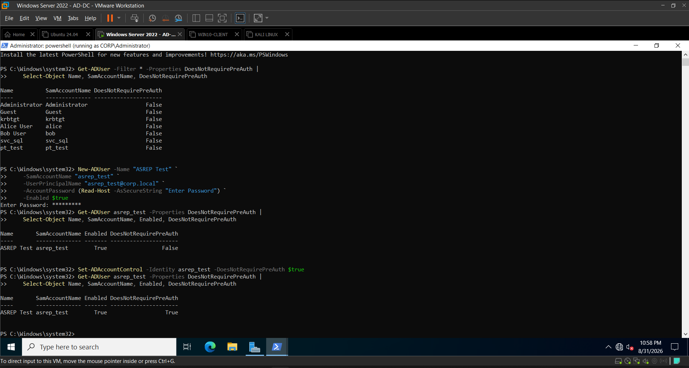
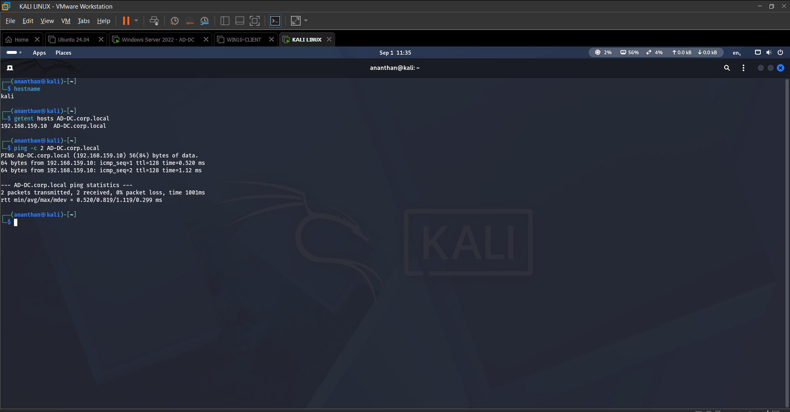
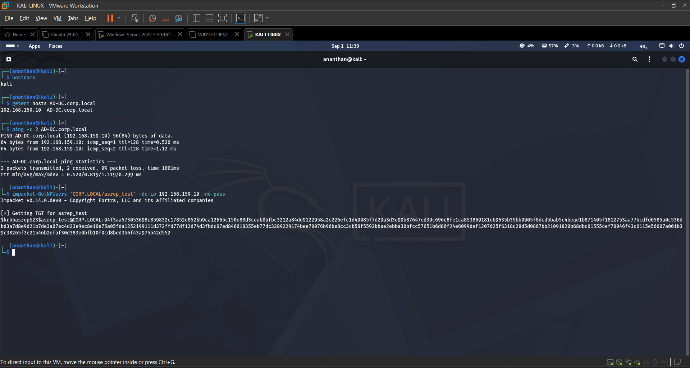
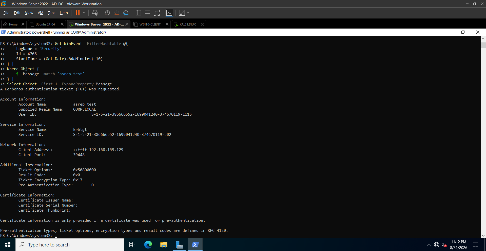
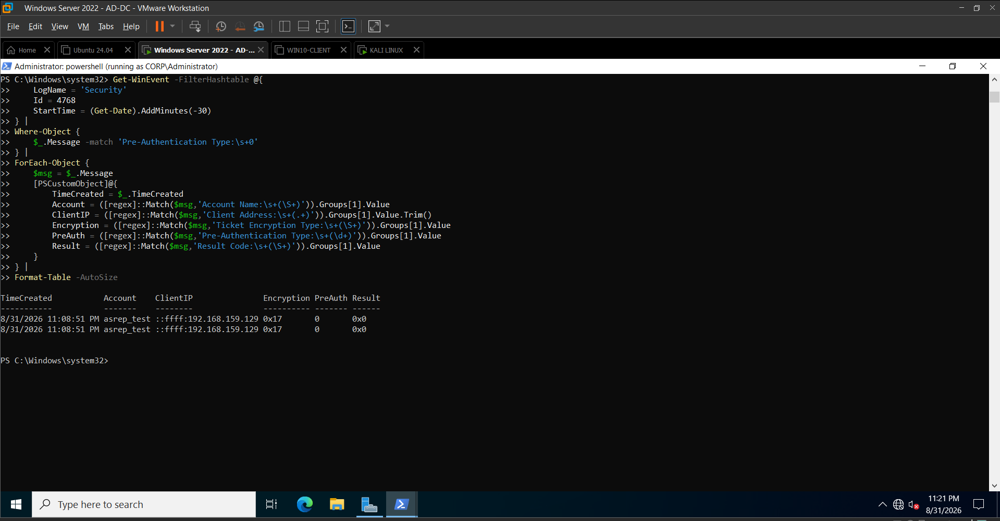
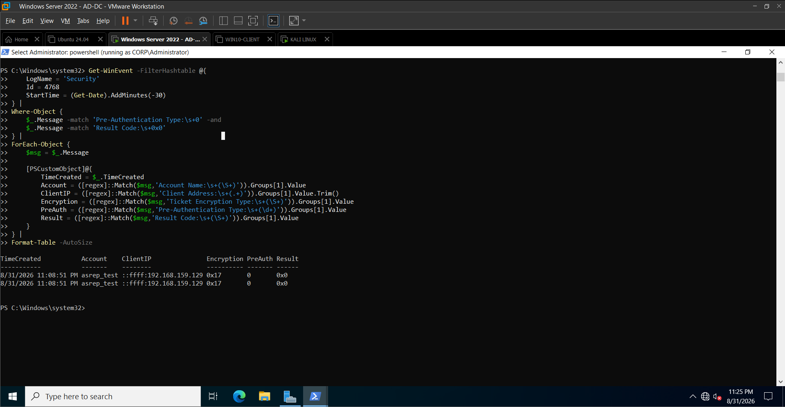
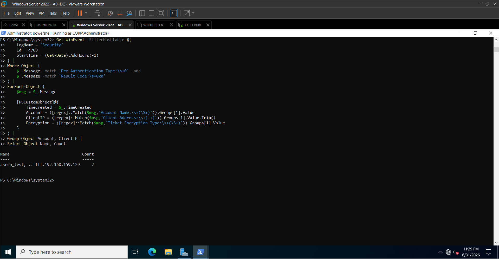
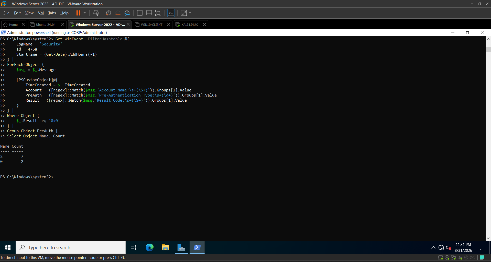

# AS-REP Roasting Attack Simulation

## Overview

This document records a controlled AS-REP Roasting simulation performed against the isolated Active Directory lab environment.

The objective was to demonstrate how an Active Directory account configured without Kerberos pre-authentication can be targeted to obtain an AS-REP response, while simultaneously capturing the Windows security telemetry generated by the activity.

The exercise was performed against a dedicated test account and was followed by authentication-event analysis and behavioral detection validation.

The complete workflow covered:

    Account Configuration
            ↓
    Vulnerable Kerberos Configuration
            ↓
    AS-REP Request from Kali
            ↓
    AS-REP Response
            ↓
    Windows Event ID 4768
            ↓
    Telemetry Analysis
            ↓
    Behavioral Detection
            ↓
    Detection Validation

---

## Attack Objectives

The objectives of this simulation were to:

- Configure a dedicated Active Directory test account without Kerberos pre-authentication.
- Verify connectivity between the Kali attack host and the Domain Controller.
- Perform a controlled AS-REP request against the test account.
- Confirm that AS-REP material was returned.
- Identify the resulting Windows Security Event ID 4768.
- Extract relevant Kerberos authentication fields.
- Correlate the activity with the originating Kali host.
- Compare the observed authentication behavior against the lab baseline.
- Validate a behavioral detection for potential AS-REP Roasting activity.
- Preserve evidence suitable for security investigation and portfolio documentation.

---

## Lab Environment

| Component | Details |
|---|---|
| Active Directory Domain | `CORP.LOCAL` |
| Domain Controller | `AD-DC.corp.local` |
| Domain Controller IP | `192.168.159.10` |
| Attack Host | Kali Linux |
| Kali IP | `192.168.159.129` |
| Target Account | `CORP\asrep_test` |
| Authentication Protocol | Kerberos |
| Primary Windows Event | `4768` |
| Security Log | Windows Security Event Log |

The lab environment was isolated and used exclusively for controlled security testing.

---

## Attack Concept

Kerberos normally uses pre-authentication as part of the authentication process.

AS-REP Roasting targets accounts that do not require Kerberos pre-authentication. When such an account is requested through the Kerberos Authentication Service, the Domain Controller can return an AS-REP containing authentication material that may be subjected to offline password cracking.

The purpose of this exercise was not to crack the recovered material. The objective was to demonstrate the attack condition and capture the resulting authentication telemetry for defensive detection.

The controlled attack flow was:

    CORP\asrep_test
            |
            | DoesNotRequirePreAuth = True
            v
    Kali requests AS-REP
            |
            v
    AD-DC processes Kerberos request
            |
            v
    AS-REP response returned
            |
            v
    Windows Event ID 4768
            |
            v
    Pre-Authentication Type = 0
            |
            v
    Detection and investigation

---

## Phase 1 — Test Account Preparation

A dedicated Active Directory account named `asrep_test` was used for the simulation.

Before introducing the vulnerable configuration, the account was verified.

The initial state showed:

    Name                  : ASREP Test
    SamAccountName        : asrep_test
    Enabled               : True
    DoesNotRequirePreAuth : False

This established that the account did not initially have the AS-REP Roasting condition enabled.

### Evidence

**Evidence:** `Day08-01-ASREP-Test-Account-PreAuth-Disabled.png`

This evidence establishes the initial account configuration before the attack condition was introduced.

---

## Phase 2 — Enabling the AS-REP Roasting Condition

The dedicated test account was configured so that Kerberos pre-authentication was not required.

The configuration was subsequently verified as:

    Name                  : ASREP Test
    SamAccountName        : asrep_test
    Enabled               : True
    DoesNotRequirePreAuth : True

This created the intended AS-REP Roasting test condition.

The change was restricted to the dedicated lab account rather than modifying existing production-style accounts within the lab.

### Security Significance

The `DoesNotRequirePreAuth` setting is significant because it allows the account to receive an AS-REP without completing the normal Kerberos pre-authentication process.

This creates an opportunity for an attacker to request authentication material associated with the account and potentially attempt offline password recovery.

---

## Phase 3 — Kali to Domain Controller Connectivity

Before executing the attack, connectivity from Kali to the Domain Controller was verified.

DNS resolution successfully returned:

    AD-DC.corp.local -> 192.168.159.10

ICMP connectivity was also successful:

    2 packets transmitted
    2 packets received
    0% packet loss

The test confirmed that Kali could communicate with the Domain Controller before the Kerberos request was performed.

### Evidence

**Evidence:** `Day08-02-Kali-ADDC-Connectivity.png`

This establishes the network path required for the controlled attack.

---

## Phase 4 — AS-REP Request

The controlled AS-REP request was performed from Kali against the dedicated account.

The request targeted:

    asrep_test@CORP.LOCAL

The Kerberos tooling successfully obtained a TGT/AS-REP response for the test account.

The terminal output confirmed:

    [*] Getting TGT for asrep_test

followed by returned AS-REP material.

### Evidence

**Evidence:** `Day08-03-ASREP-Roasting-Request.png`

This evidence demonstrates that the AS-REP request was successfully processed by the Domain Controller.

### Evidence Handling Note

The original terminal evidence contains the returned AS-REP material.

For a public GitHub portfolio, the long returned value should be redacted before publishing if it is not necessary for demonstrating the detection workflow.

The purpose of this project is to demonstrate attack simulation, telemetry generation, detection engineering, and investigation rather than password cracking.

---

## Phase 5 — Windows Event ID 4768

After the AS-REP request was performed, the Domain Controller was queried for Event ID `4768`.

Event ID `4768` represents a Kerberos Authentication Service ticket request.

The event was correlated with:

    Account Name: asrep_test

The full event provided the following relevant telemetry:

| Field | Observed Value |
|---|---|
| Event ID | `4768` |
| Account Name | `asrep_test` |
| Realm | `CORP.LOCAL` |
| Service Name | `krbtgt` |
| Client Address | `::ffff:192.168.159.129` |
| Result Code | `0x0` |
| Ticket Encryption Type | `0x17` |
| Pre-Authentication Type | `0` |

### Evidence

**Evidence:** `Day08-04-ASREP-4768-Full-Telemetry.png`

This is the primary telemetry evidence connecting the AS-REP request to the Domain Controller security log.

---

## Phase 6 — Pre-Authentication Type 0 Analysis

The Event ID 4768 telemetry showed:

    Pre-Authentication Type: 0

This was significant because the test account had previously been configured with:

    DoesNotRequirePreAuth = True

The successful event also showed:

    Result Code: 0x0

Therefore, the observed event represented a successful Kerberos TGT request associated with an account that did not perform normal pre-authentication.

The relevant relationship was:

    DoesNotRequirePreAuth = True
                +
    Event ID = 4768
                +
    Pre-Authentication Type = 0
                +
    Result Code = 0x0
                ↓
    AS-REP Roasting activity indicator

---

## Phase 7 — 4768 Baseline Observation

A broader Event ID 4768 query was performed to identify successful Kerberos events with Pre-Authentication Type `0`.

Two matching events were observed during the analysis window.

Both occurred at:

    8/31/2026 11:08:51 PM

### Evidence

**Evidence:** `Day08-05-ASREP-4768-Baseline.png`

The baseline observation established that the Type `0` events were present in the security telemetry generated during the controlled attack.

---

## Phase 8 — Behavioral Detection Query

A behavioral detection query was developed without hard-coding the known test account name.

The detection conditions were:

    Event ID = 4768
    AND
    Pre-Authentication Type = 0
    AND
    Result Code = 0x0

The query extracted:

    TimeCreated
    Account
    ClientIP
    Encryption
    PreAuth
    Result

This approach was intentionally behavior-focused.

Instead of searching specifically for:

    Account = asrep_test

the detection searches for the authentication characteristics associated with the AS-REP Roasting condition.

### Evidence

**Evidence:** `Day08-06-ASREP-Detection-Query.png`

The query successfully identified the controlled AS-REP activity.

---

## Phase 9 — Account and Source Correlation

The detected events were correlated by account and source address.

The observed correlation was:

    Account:
    asrep_test

    Source:
    ::ffff:192.168.159.129

    Count:
    2

The IPv4-mapped IPv6 representation:

    ::ffff:192.168.159.129

corresponds to the Kali host address:

    192.168.159.129

This allowed the authentication activity to be tied directly to the attack host used during the simulation.

### Evidence

**Evidence:** `Day08-07-ASREP-Frequency-Correlation.png`

The evidence shows two matching requests associated with the same account and source.

---

## Phase 10 — Kerberos Authentication Baseline Comparison

A comparison of successful Event ID 4768 records was performed during the one-hour observation window.

The observed distribution was:

    Pre-Authentication Type 2 -> 7 events
    Pre-Authentication Type 0 -> 2 events

The Type `2` events represented the dominant successful Kerberos authentication pattern observed during the selected lab period.

The Type `0` events were associated with the controlled AS-REP Roasting activity.

### Evidence

**Evidence:** `Day08-08-ASREP-PreAuth-Baseline-Comparison.png`

### Detection Engineering Significance

This comparison demonstrates why Event ID `4768` alone should not be treated as an AS-REP Roasting detection.

A large number of legitimate Kerberos authentication events can generate Event ID `4768`.

Additional fields such as:

    Pre-Authentication Type
    Account Name
    Client Address
    Result Code
    Ticket Encryption Type

provide the context required to identify suspicious authentication behavior.

---

## Phase 11 — Analyst-Oriented Detection Output

The final detection query transformed the raw authentication event into an analyst-oriented alert.

The validated output contained:

    Detection : Potential AS-REP Roasting
    Severity  : High
    Account   : asrep_test
    SourceIP  : ::ffff:192.168.159.129
    Encryption: 0x17
    PreAuth   : 0
    Result    : 0x0

Two matching events were returned.

### Evidence

**Evidence:** `Day08-09-ASREP-Analyst-Alert.png`

This represents the final transition from raw Windows telemetry to a security alert that can be investigated by a SOC analyst.

---

## Complete Attack-to-Detection Timeline

The exercise produced the following sequence:

    1. Dedicated account created
           |
           v
    2. Initial account configuration verified
           |
           v
    3. DoesNotRequirePreAuth enabled
           |
           v
    4. Kali connectivity to AD-DC verified
           |
           v
    5. AS-REP request sent for asrep_test
           |
           v
    6. AS-REP response returned
           |
           v
    7. Event ID 4768 generated
           |
           v
    8. Pre-Authentication Type 0 identified
           |
           v
    9. Source IP correlated to Kali
           |
           v
    10. Repeated activity identified
           |
           v
    11. Baseline comparison performed
           |
           v
    12. Behavioral detection created
           |
           v
    13. Detection successfully triggered

---

## Key Attack Indicators

The following combination of indicators was observed during the controlled simulation:

| Indicator | Observed Value |
|---|---|
| Target Account | `asrep_test` |
| Source Host | Kali |
| Source IP | `192.168.159.129` |
| Event ID | `4768` |
| Service | `krbtgt` |
| Pre-Authentication Type | `0` |
| Result Code | `0x0` |
| Ticket Encryption Type | `0x17` |
| Observed Requests | `2` |

The strongest behavioral indicator was the successful Event ID `4768` combined with:

    Pre-Authentication Type = 0

---

## Security Impact

AS-REP Roasting can expose authentication material associated with Active Directory accounts that do not require Kerberos pre-authentication.

An attacker may attempt to recover the account password offline from the obtained material.

If the targeted account has excessive privileges, access to sensitive systems, or password reuse across other services, successful credential recovery could increase the impact of the attack.

The practical impact therefore depends on:

- Password strength.
- Account privileges.
- Resource access.
- Credential reuse.
- Network segmentation.
- Monitoring and detection coverage.
- Incident response capability.

---

## MITRE ATT&CK Mapping

### Tactic

**Credential Access**

### Technique

**T1558.004 — Steal or Forge Kerberos Tickets: AS-REP Roasting**

AS-REP Roasting targets Active Directory accounts that do not require Kerberos pre-authentication and obtains authentication material that can potentially be subjected to offline password cracking.

### Detection Telemetry

Relevant defensive telemetry observed in this exercise included:

- Windows Security Event ID `4768`
- Account Name
- Client Address
- Service Name
- Result Code
- Ticket Encryption Type
- Pre-Authentication Type

---

## Detection Logic

The validated behavioral detection is:

    Event ID = 4768
    AND
    Pre-Authentication Type = 0
    AND
    Result Code = 0x0

The alert should be enriched with:

    Account Name
    Source IP
    Ticket Encryption Type
    Timestamp
    Pre-Authentication Type
    Result Code

### Detection Philosophy

The detection should be treated as a **potential AS-REP Roasting indicator**, rather than automatically declaring a confirmed compromise.

The presence of a Type `0` Kerberos authentication event should trigger investigation into:

- Whether the account legitimately requires pre-authentication to be disabled.
- Whether the source host is expected.
- Whether the account is privileged.
- Whether the activity is repeated.
- Whether the encryption type is unusual.
- Whether related suspicious authentication or lateral-movement activity exists.

---

## Recommended Defensive Actions

### 1. Identify accounts without Kerberos pre-authentication

Regularly audit Active Directory accounts for:

    DoesNotRequirePreAuth = True

Accounts should have a documented business justification for this configuration.

### 2. Re-enable Kerberos pre-authentication where possible

If the configuration is unnecessary, restore the normal Kerberos pre-authentication requirement.

### 3. Monitor Event ID 4768

Monitor Kerberos TGT requests and enrich them with:

- Account.
- Client address.
- Pre-authentication type.
- Encryption type.
- Result code.

### 4. Investigate unexpected source systems

When a suspicious Type `0` event occurs, identify the source workstation and correlate it with additional endpoint and authentication telemetry.

### 5. Review account privilege

A Type `0` event involving a privileged or sensitive account should receive increased investigation priority.

### 6. Monitor for follow-on activity

Correlate potential AS-REP Roasting alerts with:

- Authentication anomalies.
- Credential use.
- SMB activity.
- Remote logons.
- Lateral movement.
- Privilege escalation.
- Other credential-access indicators.

---

## SOC Investigation Workflow

When the detection fires, an analyst can follow this workflow:

    Alert generated
          |
          v
    Identify account
          |
          v
    Identify source IP / workstation
          |
          v
    Verify Pre-Authentication Type
          |
          v
    Confirm Event ID 4768 success
          |
          v
    Review encryption type
          |
          v
    Determine whether pre-authentication
    is intentionally disabled
          |
          v
    Check account privilege and sensitivity
          |
          v
    Search for repeated requests
          |
          v
    Correlate with endpoint/authentication telemetry
          |
          v
    Determine:
    Benign / Suspicious / Malicious
          |
          v
    Apply appropriate response

---

## Lessons Learned

This exercise demonstrated several practical Active Directory and SOC concepts:

- AS-REP Roasting depends on accounts that do not require Kerberos pre-authentication.
- Event ID `4768` provides useful Kerberos authentication telemetry.
- Event ID `4768` alone is not sufficient for AS-REP Roasting detection.
- Pre-Authentication Type `0` provides an important behavioral indicator.
- Source IP correlation helps identify the system initiating the request.
- Successful authentication activity should be analyzed together with its authentication metadata.
- Baseline comparison helps provide context for unusual authentication behavior.
- Detection logic should focus on behavior rather than a hard-coded test account.
- Detection alerts should provide enough context for a SOC analyst to begin investigation.
- Attack simulation, telemetry analysis, and detection validation should be documented as one continuous investigation workflow.

---

## Evidence Summary

All Day 8 evidence is stored under:

    screenshots/Day08/

The captured evidence set is:

| Evidence | Purpose |
|---|---|
| `Day08-01-ASREP-Test-Account-PreAuth-Disabled.png` | Initial test-account configuration and pre-authentication state. |
| `Day08-02-Kali-ADDC-Connectivity.png` | Kali DNS resolution and connectivity to the Domain Controller. |
| `Day08-03-ASREP-Roasting-Request.png` | Successful controlled AS-REP request from Kali. |
| `Day08-04-ASREP-4768-Full-Telemetry.png` | Full Event ID 4768 authentication telemetry. |
| `Day08-05-ASREP-4768-Baseline.png` | Event ID 4768 Type 0 baseline observation. |
| `Day08-06-ASREP-Detection-Query.png` | Behavioral detection query successfully identifying the activity. |
| `Day08-07-ASREP-Frequency-Correlation.png` | Account and source correlation showing repeated activity. |
| `Day08-08-ASREP-PreAuth-Baseline-Comparison.png` | Comparison of successful Kerberos pre-authentication types. |
| `Day08-09-ASREP-Analyst-Alert.png` | Final analyst-oriented detection output. |

---

## Final Assessment

The controlled AS-REP Roasting simulation was successfully executed against the dedicated `CORP\asrep_test` account.

The attack condition was established by configuring the account without Kerberos pre-authentication. A controlled AS-REP request was then performed from the Kali host.

The Domain Controller generated Event ID `4768`, which contained:

    Account Name: asrep_test
    Client Address: ::ffff:192.168.159.129
    Service Name: krbtgt
    Result Code: 0x0
    Ticket Encryption Type: 0x17
    Pre-Authentication Type: 0

The activity was subsequently correlated to the Kali source and identified using behavioral detection logic based on:

    Event ID 4768
    +
    Pre-Authentication Type 0
    +
    Successful Result Code 0x0

The final detection successfully identified the simulated activity and produced an analyst-oriented alert containing the account, source, encryption type, pre-authentication type, and result code.