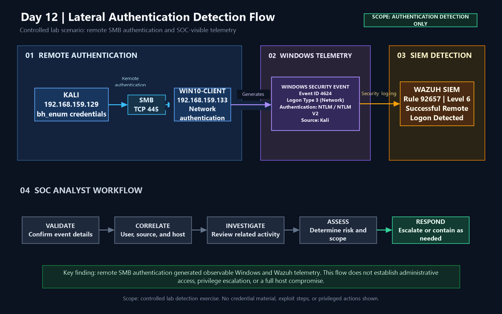

# Lateral Movement — SMB Remote Authentication

## Overview

This document covers the controlled lateral-authentication exercise performed during Day 12 of the Active Directory Attack & Detection Lab.

The exercise demonstrated how a valid low-privileged domain account can be used to authenticate remotely to another Windows endpoint over SMB and how the resulting activity becomes visible through Windows Security telemetry and Wazuh.

The exercise was intentionally limited to **remote authentication**. It did not include privilege escalation, administrative access, command execution, credential dumping, or full host compromise.

---

## Objective

The objectives of this exercise were to:

- Understand the role of remote authentication in lateral movement.
- Validate SMB connectivity between the attacker and target systems.
- Perform controlled SMB authentication using a low-privileged domain account.
- Identify the resulting Windows Security Event ID 4624.
- Analyze Logon Type 3 network authentication.
- Correlate the source IP and workstation.
- Validate SIEM detection through Wazuh Rule 92657.
- Demonstrate the attack-to-detection workflow from a SOC perspective.

---

## Lab Environment

| Component | Value |
|---|---|
| Domain | `CORP.LOCAL` |
| Domain Controller | `AD-DC.corp.local` |
| Domain Controller IP | `192.168.159.10` |
| Attacker | Kali Linux |
| Attacker IP | `192.168.159.129` |
| Target | `WIN10-CLIENT` |
| Target IP | `192.168.159.133` |
| Account | `bh_enum` |
| Protocol | SMB |
| Destination Port | TCP/445 |
| Windows Event | 4624 |
| Logon Type | 3 — Network |
| Authentication | NTLM / NTLM V2 |
| SIEM | Wazuh |
| Wazuh Rule | 92657 |
| Wazuh Level | 6 |

---

# 1. Lateral Movement Concept

Lateral movement is the phase in which an attacker attempts to move from one system or security context to another within a network.

In Windows environments, remote authentication using valid credentials is one mechanism that can facilitate lateral movement.

The controlled scenario used in this exercise was:

**Kali → SMB → WIN10-CLIENT → Remote Domain Authentication**

The purpose was to demonstrate the authentication and detection portion of the workflow rather than establish administrative control over the target.

---

# 2. Baseline Validation

Before performing the controlled authentication, the target's existing authentication and SMB state were reviewed.

Windows Security Event ID 4624 activity was observed, establishing a baseline for successful logon events.

**Evidence:** `Day12-01-Windows10-4624-LateralMovement-Baseline.png`

The SMB session state was also reviewed before the test.

**Evidence:** `Day12-02-Windows10-SMB-Session-Baseline.png`

---

# 3. SMB Connectivity Validation

The attacker-to-target SMB path was validated before authentication.

Kali successfully established TCP connectivity to:

`192.168.159.133:445`

TCP/445 was confirmed as open.

**Evidence:** `Day12-03-Kali-to-Windows10-SMB-Connectivity-Baseline.png`

The failed ICMP ping observed during testing did not prevent SMB communication because ICMP and TCP/445 are independent network protocols.

---

# 4. Controlled SMB Authentication

A dedicated low-privileged domain account, `bh_enum`, was used for the controlled authentication test.

The Kali system authenticated to the Windows endpoint through the SMB IPC$ share.

The authentication successfully established an SMB session.

**Evidence:** `Day12-04-Kali-SMB-Remote-Authentication.png`

This demonstrates the core remote-authentication component of the lateral-movement scenario.

No privileged account was used and no administrative action was performed on the target.

---

# 5. Windows Security Telemetry

The successful remote authentication generated Windows Security Event ID 4624 on WIN10-CLIENT.

The relevant event contained:

| Field | Observed Value |
|---|---|
| Account | `bh_enum` |
| Domain | `CORP` |
| Logon Type | `3` |
| Authentication Package | `NTLM` |
| NTLM Package | `NTLM V2` |
| Source IP | `192.168.159.129` |
| Workstation | `KALI` |

Logon Type 3 represents a network logon and is consistent with remote network authentication such as SMB.

**Evidence:** `Day12-05-Windows10-4624-Lateral-Movement-Network-Logon.png`

---

# 6. SIEM Detection

The Windows authentication telemetry was successfully observed by Wazuh.

Wazuh generated:

**Rule 92657 — Successful Remote Logon Detected**

with:

**Level 6**

The alert contained the authentication context required for further investigation.

**Evidence:** `Day12-06-Wazuh-Lateral-Movement-4624-Document-Details.png`

---

# 7. Detection Context

The Wazuh event provided the following important fields:

- Target account: `bh_enum`
- Target domain: `CORP`
- Target endpoint: `WIN10-CLIENT.corp.local`
- Source IP: `192.168.159.129`
- Workstation: `KALI`
- Event ID: `4624`
- Logon Type: `3`
- Authentication: `NTLM`
- NTLM version: `NTLM V2`
- Logon process: `NtLmSsp`

This combination provides significantly more investigative value than a generic successful-logon event.

---

# 8. Wazuh Rule 92657

The Wazuh rule responsible for the detection was examined to understand its detection logic.

Observed rule information:

- Rule ID: `92657`
- Level: `6`
- Parent rule: `92652`
- Rule group: `authentication_success`
- Rule group: `win_evt_channel`
- Rule group: `windows`

The rule description identifies successful remote logon activity and instructs the analyst to validate the workstation and authentication context.

**Evidence:** `Day12-07-Wazuh-Rule-92657-Detection-Logic.png`

Additional rule information confirmed the rule's ruleset location, severity, and lateral-movement-related context.

**Evidence:** `Day12-08-Wazuh-Rule-92657-Information.png`

---

# 9. Attack-to-Detection Chain

The complete activity can be summarized as:

**Kali — 192.168.159.129**

↓

**SMB / TCP 445**

↓

**WIN10-CLIENT — 192.168.159.133**

↓

**Remote authentication using `bh_enum`**

↓

**Windows Security Event 4624**

↓

**Logon Type 3 — Network**

↓

**NTLM / NTLM V2**

↓

**Wazuh Rule 92657**

↓

**Level 6 — Successful Remote Logon Detected**

↓

**SOC investigation**

This demonstrates the complete transition from controlled activity to security telemetry and SIEM detection.

---

# 10. Analyst Interpretation

A successful remote logon should not automatically be classified as malicious.

The analyst must determine whether the authentication is:

- Expected administrative activity
- Authorized remote access
- Normal file-sharing activity
- IT support activity
- Security testing
- Suspicious credential usage
- Potential credential abuse

For this controlled lab, the activity was intentional and authorized.

The detection is therefore best classified as a **validated security event generated by controlled testing**, rather than a real compromise.

---

# 11. SOC Investigation Workflow

A SOC analyst investigating Rule 92657 should follow a structured process.

### Validate

Confirm:

- Account
- Source IP
- Workstation
- Destination host
- Event ID
- Logon Type
- Authentication protocol

### Correlate

Review:

- Previous authentication activity
- Other logons from the same account
- Other activity from the source host
- Related Windows Security events
- Related SIEM alerts

### Investigate

Determine:

- Whether the account normally accesses the destination.
- Whether the source workstation is authorized.
- Whether the authentication occurred during an expected time.
- Whether suspicious activity occurred before or after the authentication.

### Assess

Determine the risk level based on:

- Account privilege
- Source reputation
- Target criticality
- Authentication method
- Frequency of activity
- Related security events

### Respond

If the authentication is unauthorized:

- Investigate the account.
- Review the source endpoint.
- Search for additional authentication activity.
- Consider credential containment.
- Escalate according to incident-response procedures.

---

# 12. Security Significance

Remote authentication is important because valid credentials can potentially allow an attacker to access additional systems without exploiting a software vulnerability.

This makes identity telemetry particularly valuable for defenders.

The combination of:

`Source IP + Workstation + Account + Logon Type + Authentication Protocol`

allows a SOC analyst to distinguish ordinary local activity from potentially suspicious remote authentication.

---

# 13. False Positive Considerations

Rule 92657 may generate alerts for legitimate activity.

Potential false-positive sources include:

- IT administrators
- Help-desk personnel
- Remote support
- File-sharing operations
- Domain management
- Authorized security testing
- Automated management systems

Detection quality can be improved by correlating:

- Account role
- Source workstation
- Destination host
- Authentication frequency
- Business context
- Time of activity
- Related alerts

The objective should be to reduce unnecessary escalation without suppressing genuinely suspicious remote authentication.

---

# 14. MITRE ATT&CK Relevance

### T1021.002 — SMB/Windows Admin Shares

SMB can be used as a remote-services mechanism for accessing Windows systems.

This exercise demonstrated the **authentication component** of SMB-based remote access without demonstrating administrative share abuse.

### T1078 — Valid Accounts

The exercise used a valid domain account to authenticate remotely to the target endpoint.

### T1550.002 — Pass the Hash

Pass-the-Hash is relevant to the broader Project 3 attack set and was separately demonstrated during Day 9.

**Day 12 did not use Pass-the-Hash.**

This distinction is important because the Day 12 authentication used the account's normal credentials, while Day 9 specifically demonstrated NTLM hash-based authentication.

---

# 15. Diagram

The Day 12 attack-to-detection flow is represented by:

Editable source:

`../diagrams/Day12-Lateral-Movement-Detection-Flow.drawio`

The diagram represents:

**Remote Authentication → Windows Telemetry → Wazuh Detection → SOC Analyst Workflow**

---

# 16. Scope and Limitations

This exercise demonstrates:

- Remote SMB connectivity
- Remote domain authentication
- Windows authentication telemetry
- Network Logon Type 3
- NTLM authentication visibility
- Wazuh detection
- SOC investigation workflow

It does **not** demonstrate:

- Administrative access
- Privilege escalation
- Remote command execution
- Credential dumping
- Persistence
- Exploitation
- Full host compromise

Therefore, the technically accurate conclusion is:

> A controlled remote SMB authentication was successfully performed and detected through Windows and Wazuh telemetry.

---

# 17. Key Takeaways

### 1. Lateral movement can begin with authentication

An attacker does not necessarily need to exploit another host immediately. Valid credentials can provide an initial mechanism for remote access.

### 2. Event 4624 provides valuable context

The event becomes much more useful when combined with Logon Type, source IP, workstation, account, and authentication protocol.

### 3. SIEM detection requires analyst validation

Rule 92657 identifies successful remote logon activity, but the SOC analyst must determine whether that activity is legitimate or suspicious.

### 4. Multiple telemetry layers improve investigation

The strongest workflow combines:

**Authentication Activity → Windows Event → Source Context → SIEM Detection → Analyst Investigation**

### 5. Detection does not equal compromise

A professional analyst must distinguish between:

**Observed authentication**

and

**Confirmed malicious compromise**

---

# 18. Final Assessment

The Day 12 exercise successfully demonstrated a controlled remote SMB authentication from Kali to WIN10-CLIENT using the low-privileged `bh_enum` domain account.

The activity generated:

**Windows Security Event ID 4624**

with:

- Logon Type 3
- NTLM authentication
- Source IP `192.168.159.129`
- Workstation `KALI`
- Target account `bh_enum`

Wazuh detected the activity using:

**Rule 92657 — Successful Remote Logon Detected**

at **Level 6**.

The exercise demonstrates the practical SOC workflow of:

**Generate controlled activity → collect telemetry → identify authentication characteristics → correlate source and destination → validate SIEM detection → assess risk → determine response.**

This provides a realistic example of how a SOC analyst can investigate remote authentication activity without overclaiming that every successful network logon represents a compromise.

---

# 19. Evidence Index

| # | Evidence | Purpose |
|---|---|---|
| 01 | `Day12-01-Windows10-4624-LateralMovement-Baseline.png` | Windows 4624 baseline |
| 02 | `Day12-02-Windows10-SMB-Session-Baseline.png` | SMB session baseline |
| 03 | `Day12-03-Kali-to-Windows10-SMB-Connectivity-Baseline.png` | SMB connectivity validation |
| 04 | `Day12-04-Kali-SMB-Remote-Authentication.png` | Controlled SMB authentication |
| 05 | `Day12-05-Windows10-4624-Lateral-Movement-Network-Logon.png` | Windows network logon telemetry |
| 06 | `Day12-06-Wazuh-Lateral-Movement-4624-Document-Details.png` | Wazuh event correlation |
| 07 | `Day12-07-Wazuh-Rule-92657-Detection-Logic.png` | Wazuh detection logic |
| 08 | `Day12-08-Wazuh-Rule-92657-Information.png` | Wazuh rule metadata |

---

# 20. Portfolio Value

This exercise demonstrates practical experience with:

- Active Directory authentication
- Windows Security Event Logs
- SMB
- Network Logon analysis
- NTLM authentication
- Source and workstation correlation
- Wazuh SIEM
- Detection-rule analysis
- SOC alert triage
- False-positive assessment
- MITRE ATT&CK mapping
- Incident investigation methodology
- Attack-to-detection workflows

The primary portfolio value is not simply demonstrating that remote authentication can be performed.

It demonstrates the ability to connect:

**Attack Activity → Endpoint Telemetry → SIEM Detection → Investigation → Security Assessment**

which is a core workflow for an entry-level SOC/Blue-Team analyst.