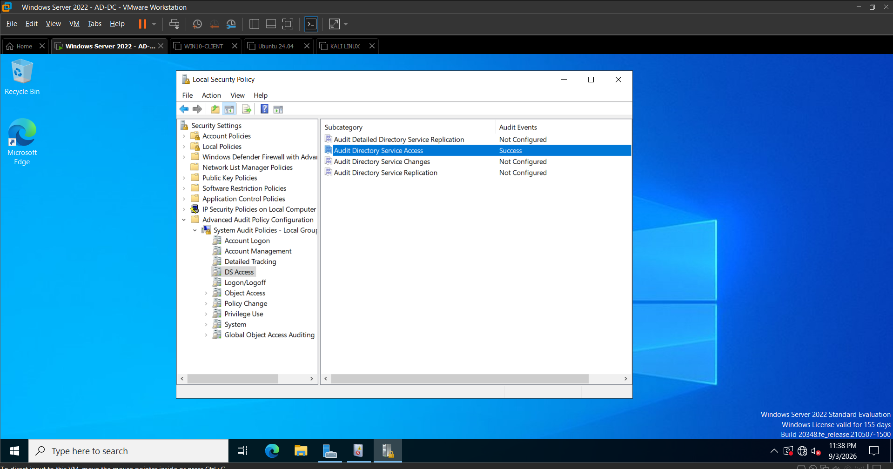
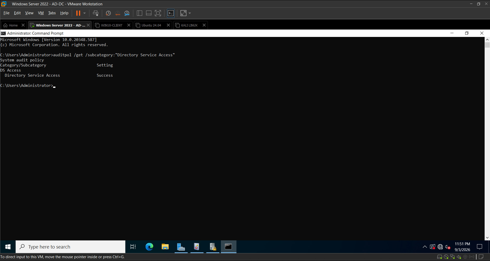
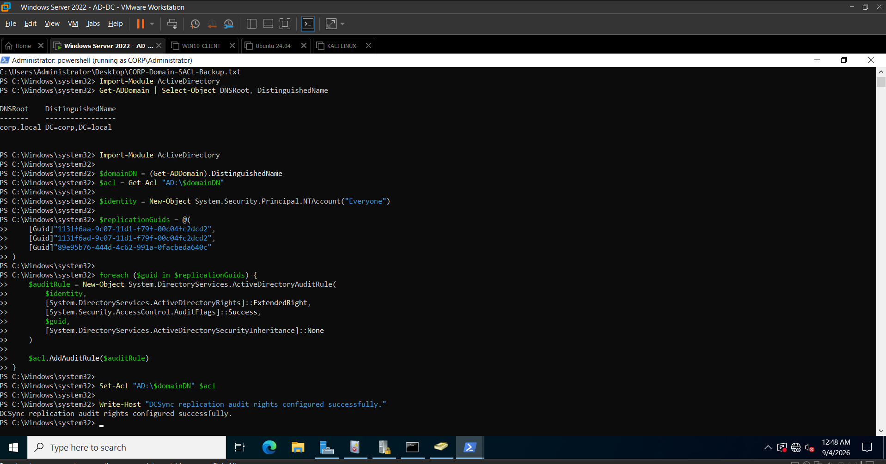
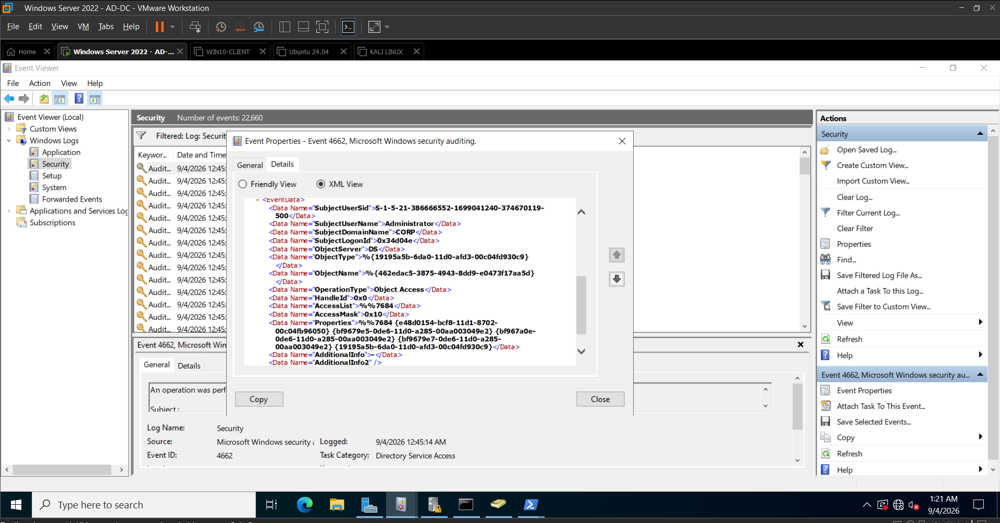
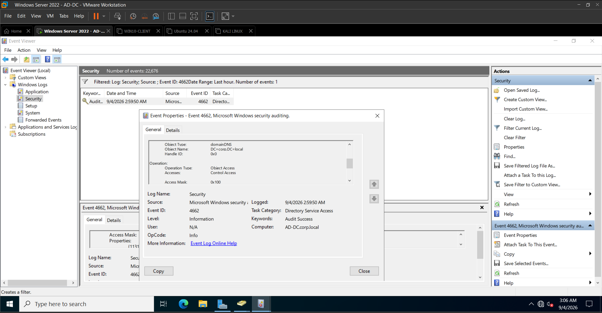
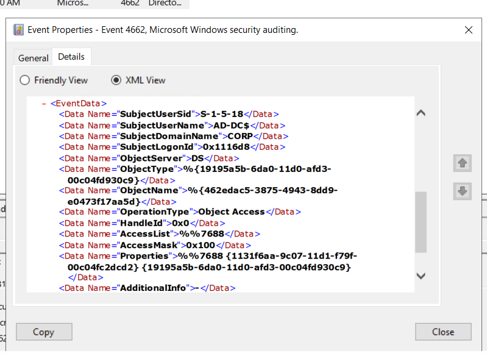
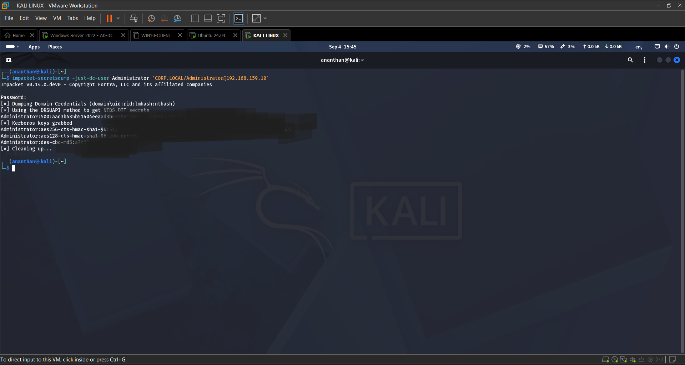
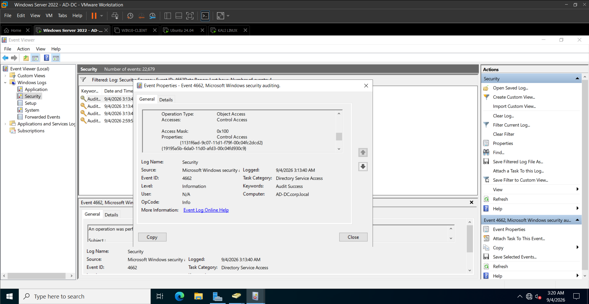
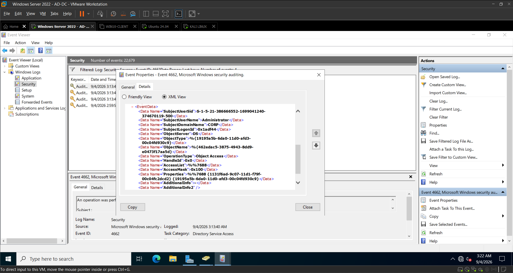

# DCSync Detection — Windows Event ID 4662

## Detection Name

**Potential DCSync Activity — Active Directory Replication Access**

---

## Objective

Detect potential DCSync activity by identifying Active Directory operations that use replication-related extended rights through Windows Security Event ID 4662.

The detection focuses on correlating:

- Event ID `4662`
- Control Access (`0x100`)
- Active Directory replication-related extended rights
- Subject account context
- Legitimate replication baselines

The goal is to distinguish potentially malicious replication-based credential access from normal Active Directory replication activity.

---

## Log Source

| Field | Value |
|---|---|
| Log Source | Windows Security |
| System | `AD-DC` |
| Event ID | `4662` |
| Event Description | An operation was performed on an object |
| Primary Detection Context | Active Directory replication access |

Event ID 4662 provides visibility into operations performed against Active Directory objects when the appropriate Directory Service Access auditing and SACL configuration are enabled.

---

## Detection Prerequisites

DCSync detection using Event ID 4662 requires appropriate auditing on the Domain Controller.

During this lab, **Audit Directory Service Access — Success** was enabled.

### Evidence — Directory Service Access Auditing

The configuration was independently verified using `auditpol`.

### Evidence — Audit Policy Verification

Replication-related directory access auditing was then configured to provide visibility into the relevant Active Directory operations.

### Evidence — Replication Audit Configuration

---

## Detection Logic

The primary detection logic identifies Event ID 4662 operations containing Control Access and Active Directory replication-related extended rights.

### Core Detection Conditions

| Detection Field | Value / Condition |
|---|---|
| Event ID | `4662` |
| Access Mask | `0x100` |
| Access Type | Control Access |
| Properties | Replication-related extended-right GUID |
| Subject | Account performing the directory operation |
| Context | Compare against expected replication behavior |

A single Event 4662 should not automatically be classified as DCSync.

The event becomes significantly more suspicious when `0x100` Control Access is associated with replication-related rights and the operation is performed by an account or system that is not expected to perform directory replication.

---

## Replication Rights of Interest

The following Active Directory extended rights are important when investigating potential DCSync activity:

| Extended Right | GUID |
|---|---|
| DS-Replication-Get-Changes | `1131f6aa-9c07-11d1-f79f-00c04fc2dcd2` |
| DS-Replication-Get-Changes-All | `1131f6ad-9c07-11d1-f79f-00c04fc2dcd2` |
| DS-Replication-Get-Changes-In-Filtered-Set | `89e95b76-444d-4c62-991a-0facbeda640c` |

The presence of these rights provides stronger context than Event ID 4662 alone.

---

## Detection Baseline

Before executing the controlled attack, Event ID 4662 activity was reviewed to establish normal Active Directory behavior.

This is important because legitimate directory operations and Domain Controller replication can generate similar telemetry.

### Event 4662 Baseline

The baseline established that Event 4662 exists within normal Active Directory operations and therefore cannot be treated as malicious solely based on the Event ID.

---

## Replication Control Access Baseline

Replication-related Control Access activity was also examined before classifying DCSync behavior.

### Evidence

This demonstrates an important detection-engineering principle:

> **Replication-related access is not inherently malicious. The account, system, privileges, and surrounding activity determine whether the behavior is suspicious.**

---

## Legitimate Replication Baseline

The raw XML representation of legitimate replication-related activity was reviewed to understand the underlying Windows event structure.

### Evidence

Legitimate machine-account and Domain Controller activity must be considered when tuning a production DCSync detection.

This baseline helps prevent a detection from generating alerts on every normal replication operation.

---

## Observed Attack

A controlled DCSync attack was executed from the Kali Linux attacker system against the Domain Controller.

### Attack Source

`192.168.159.129`

### Target

`AD-DC — 192.168.159.10`

### Tool

Impacket `secretsdump`

### Targeted Account

`Administrator`

The attack used the DRSUAPI replication mechanism to request credential-related directory information from the Domain Controller.

The execution successfully demonstrated DCSync behavior and retrieved credential material through Active Directory replication functionality.

### Evidence — Successful DCSync Execution

> **Evidence Handling:** The original attack output may contain credential hashes, Kerberos keys, or other sensitive credential material. Sensitive values must be redacted before this screenshot is published in a public repository.

---

## Observed Detection Telemetry

Following the controlled DCSync execution, the Domain Controller generated Windows Security Event ID 4662 containing replication-related directory access.

The observed telemetry included:

| Field | Observed Value |
|---|---|
| Event ID | `4662` |
| Subject User | `Administrator` |
| Subject Domain | `CORP` |
| Access Mask | `0x100` |
| Access Type | Control Access |
| Replication Right | DS-Replication-Get-Changes |
| Replication Right | DS-Replication-Get-Changes-All |

The event properties contained replication-related GUIDs including:

`1131f6aa-9c07-11d1-f79f-00c04fc2dcd2`

and

`1131f6ad-9c07-11d1-f79f-00c04fc2dcd2`

### Evidence — DCSync Event 4662

This provides the primary Windows detection evidence for the simulated DCSync activity.

---

## XML-Level Correlation

The Event 4662 XML representation was examined to verify the underlying event fields associated with the DCSync activity.

### Evidence

The XML-level analysis provided additional confirmation of the relationship between:

- Event ID `4662`
- Subject account
- Control Access
- Replication-related properties

Reviewing the raw XML is particularly valuable during detection engineering because SIEM normalization may represent Windows event fields differently from Event Viewer.

---

## Attack-to-Detection Correlation

The complete detection chain observed during the lab was:

**Kali attacker**

↓

**Impacket secretsdump**

↓

**DRSUAPI replication request**

↓

**Active Directory Domain Controller**

↓

**Windows Security Event ID 4662**

↓

**Access Mask `0x100` — Control Access**

↓

**Replication-related extended rights**

↓

**Account and baseline analysis**

↓

**Potential DCSync detection**

This correlation provides significantly stronger evidence than relying on Event ID 4662 alone.

---

## Wazuh Detection Engineering

The Event 4662 telemetry generated by the Domain Controller was successfully ingested and decoded by Wazuh during the lab.

A custom detection rule, **Rule ID `100005`**, was developed to identify DCSync-related telemetry.

The detection logic focused on:

- Windows Event ID `4662`
- Access Mask `0x100`
- Replication-related extended-right information

The custom detection logic was independently validated using `wazuh-logtest`.

The validation confirmed that an event containing the expected DCSync characteristics could match the custom rule and map to the appropriate MITRE ATT&CK technique.

### Validation Status

| Component | Status |
|---|---|
| DCSync execution | Confirmed |
| Windows Event 4662 generation | Confirmed |
| Control Access `0x100` | Confirmed |
| Replication GUIDs | Confirmed |
| Wazuh event ingestion / decoding | Confirmed |
| Custom Rule 100005 syntax | Validated |
| Rule logic using `wazuh-logtest` | Validated |
| Live Rule 100005 alert | Not claimed |

This distinction preserves the integrity of the lab evidence: the attack and telemetry were confirmed, while rule functionality was independently validated through controlled rule testing.

---

## Detection Severity

**Severity: High**

### Rationale

DCSync provides access to highly sensitive Active Directory credential material through directory replication functionality.

Successful abuse may expose:

- Privileged account credential material
- Domain account password hashes
- Kerberos key material
- Other sensitive directory credentials

If performed by an unauthorized account or from an unexpected system, DCSync should be treated as a high-priority credential-access event.

---

## False Positives

Event ID 4662 and replication-related access can occur during legitimate Active Directory operations.

Potential legitimate sources include:

- Domain Controllers
- Domain Controller machine accounts
- Normal Active Directory replication
- Authorized directory administration
- Approved services with replication privileges
- Backup or identity-management infrastructure with legitimate replication permissions

For example, machine-account activity such as:

`AD-DC$`

may represent legitimate infrastructure behavior and should not automatically be classified as DCSync.

---

## False-Positive Reduction

A production-quality detection should correlate Event 4662 with additional context.

### Account Context

Determine whether the subject account legitimately requires replication privileges.

Unexpected replication activity performed by a normal user account should receive greater scrutiny.

### System Context

Determine whether the activity originates from an expected Domain Controller or an unusual endpoint.

### Replication Rights

Verify that the event contains replication-related extended rights rather than unrelated Control Access operations.

### Baseline Comparison

Compare the event against known normal Active Directory replication behavior.

### Authentication Context

Correlate surrounding authentication activity to identify unusual account usage.

---

## Investigation Steps

When this detection is observed, a SOC analyst should perform the following investigation.

### 1. Identify the Subject Account

Review:

- `SubjectUserName`
- `SubjectDomainName`
- `SubjectLogonId`

Determine whether the account normally performs Active Directory replication.

### 2. Validate Event ID

Confirm that the activity generated:

`Event ID 4662`

### 3. Validate Control Access

Confirm:

`Access Mask = 0x100`

This represents Control Access.

### 4. Inspect Replication Rights

Examine the Event 4662 Properties field for replication-related GUIDs.

Pay particular attention to:

`1131f6aa-9c07-11d1-f79f-00c04fc2dcd2`

`1131f6ad-9c07-11d1-f79f-00c04fc2dcd2`

`89e95b76-444d-4c62-991a-0facbeda640c`

### 5. Determine Source Context

Identify the system responsible for the operation where supporting telemetry makes this possible.

Unexpected replication behavior associated with a workstation or attacker-controlled host should be prioritized.

### 6. Review Account Privileges

Determine why the account possesses replication permissions.

Unexpected replication privileges may indicate:

- Excessive permissions
- Privilege escalation
- Account compromise
- Active Directory misconfiguration

### 7. Correlate Authentication Events

Review surrounding authentication telemetry such as:

- Event ID 4624
- Event ID 4672
- Event ID 4768
- Event ID 4769
- Event ID 4776

This can help establish how the account authenticated and whether other suspicious activity occurred.

### 8. Compare Against Baseline

Determine whether the behavior resembles known legitimate Domain Controller replication.

### 9. Review Subsequent Activity

Search for:

- Lateral movement
- Privileged logons
- Credential reuse
- Remote access
- Account modifications
- Additional credential-access activity

### 10. Classify the Event

Classify the activity as one of the following:

- Legitimate replication
- Authorized administrative activity
- Suspicious replication activity
- Confirmed DCSync

---

## MITRE ATT&CK

### T1003.006 — OS Credential Dumping: DCSync

**Tactic:** Credential Access

DCSync allows an attacker with sufficient Active Directory replication permissions to request credential information from a Domain Controller using directory replication functionality.

The behavior observed in this lab directly represents the DCSync sub-technique.

---

## Recommended Response

If DCSync activity is confirmed in a production environment:

1. Identify and contain the originating system.
2. Disable or restrict the compromised account where appropriate.
3. Investigate how replication privileges were obtained.
4. Review Active Directory replication permissions.
5. Determine which credential material may have been exposed.
6. Investigate privileged account usage.
7. Search for lateral movement and credential reuse.
8. Rotate affected credentials according to incident-response procedures.
9. Review other Domain Controllers for related activity.
10. Preserve Windows and SIEM telemetry for further investigation.

Confirmed unauthorized DCSync activity should be treated as a potentially serious Active Directory compromise.

---

## Evidence Summary

| Evidence | Detection Purpose |
|---|---|
| `Day10-01-ADDC-Audit-Directory-Service-Access-Success.png` | Confirms Directory Service Access auditing |
| `Day10-02-ADDC-AuditPol-Directory-Service-Access-Success.png` | Verifies effective audit policy |
| `Day10-03-ADDC-DCSync-Audit-Rights-Configured.png` | Documents replication audit configuration |
| `Day10-04-ADDC-Event4662-Directory-Service-Access-Baseline.png` | Establishes Event 4662 baseline |
| `Day10-05-ADDC-4662-Replication-Control-Access-Baseline.png` | Establishes Control Access replication baseline |
| `Day10-06-ADDC-4662-Legitimate-Replication-Baseline-XML.png` | Demonstrates legitimate replication XML telemetry |
| `Day10-07-Kali-DCSync-SecretsDump-Success.png` | Confirms controlled DCSync execution |
| `Day10-08-ADDC-DCSync-4662-Control-Access-Replication.png` | Primary Event 4662 DCSync detection evidence |
| `Day10-09-ADDC-DCSync-4662-XML-Correlation.png` | Confirms underlying DCSync-related event fields |

---

## Detection Outcome

**Attack:** Confirmed in controlled lab environment

**Primary Detection Event:** Windows Security Event ID `4662`

**Control Access:** `0x100`

**Replication Rights:** Confirmed

**Baseline Comparison:** Completed

**Wazuh Ingestion / Decoding:** Confirmed

**Custom Detection Rule:** Rule `100005`

**Rule Validation:** Independently validated using `wazuh-logtest`

**MITRE ATT&CK:** T1003.006 — DCSync

---

## Analyst Takeaway

This exercise demonstrates that effective DCSync detection requires more than searching for a single Windows Event ID.

Event ID 4662 can represent both legitimate and potentially malicious Active Directory operations. A stronger detection combines **Control Access, replication-related extended rights, account context, system context, authentication telemetry, and a known-good replication baseline**.

The controlled attack demonstrated the complete relationship between DCSync execution and the resulting Active Directory security telemetry, while the baseline analysis highlighted the importance of distinguishing legitimate Domain Controller replication from unauthorized credential-access behavior.