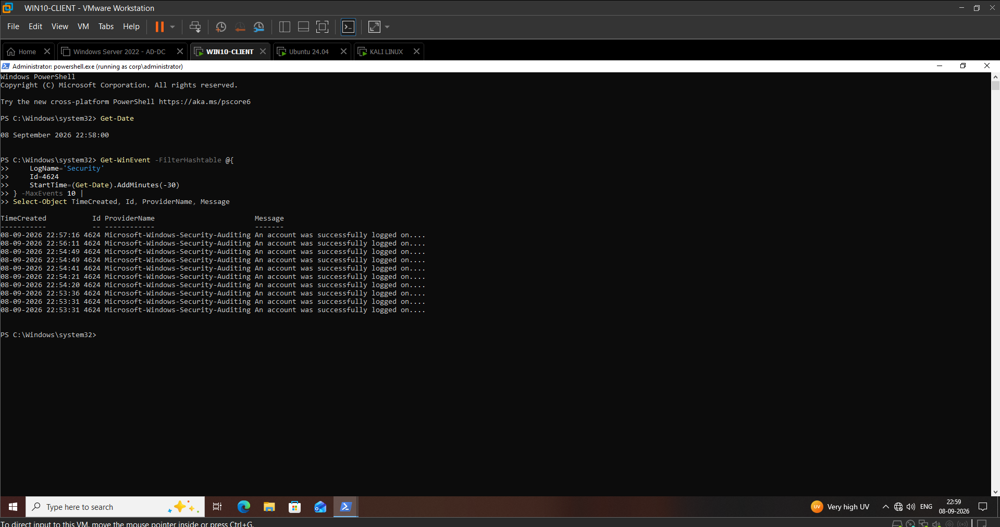
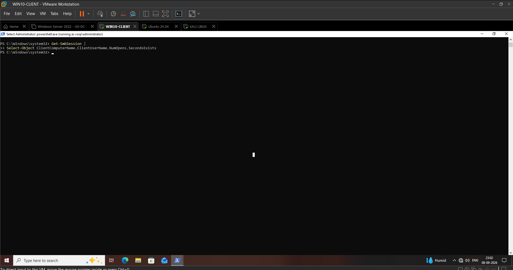
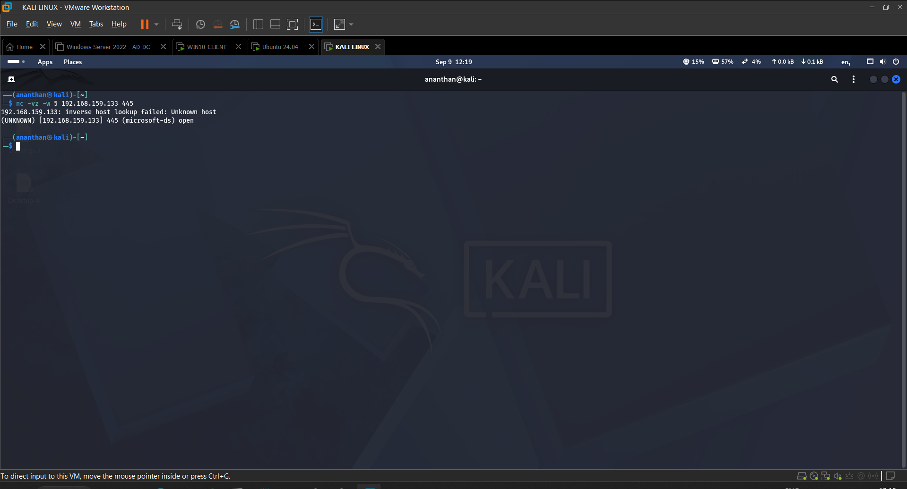
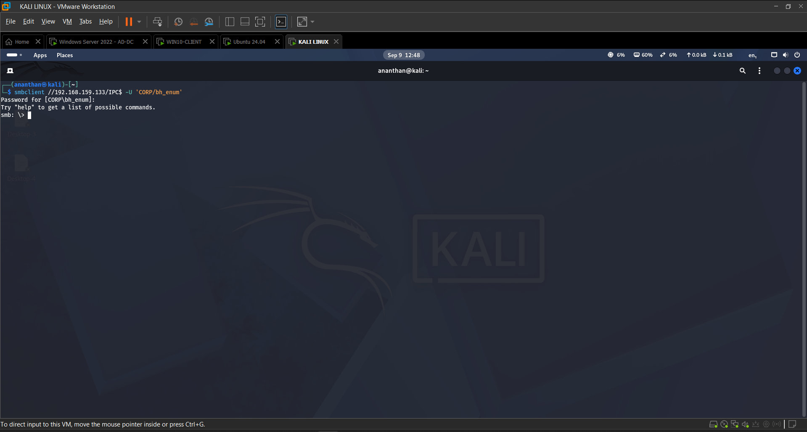
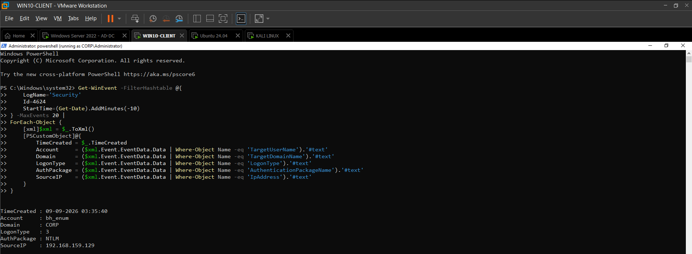
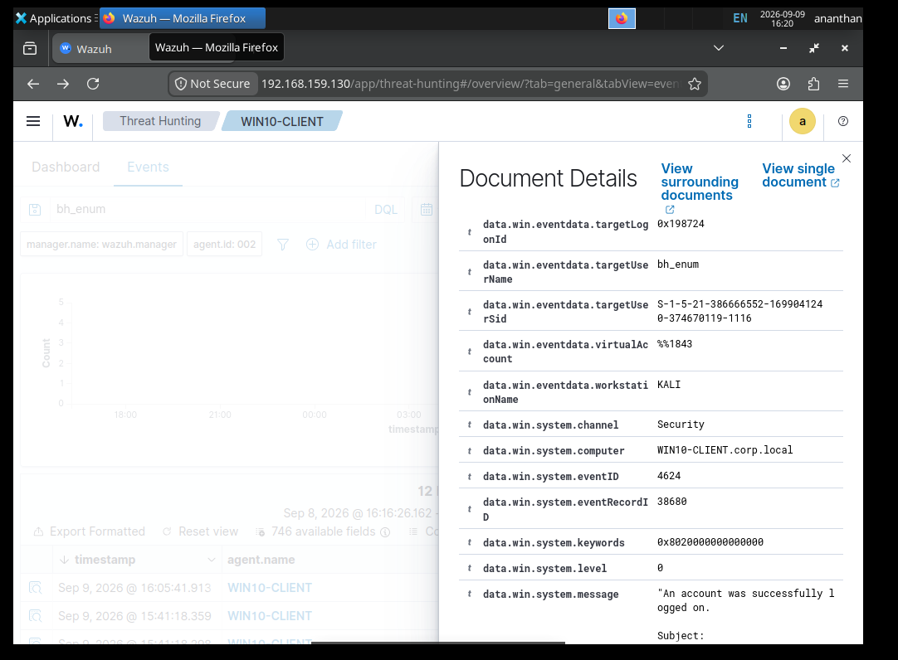
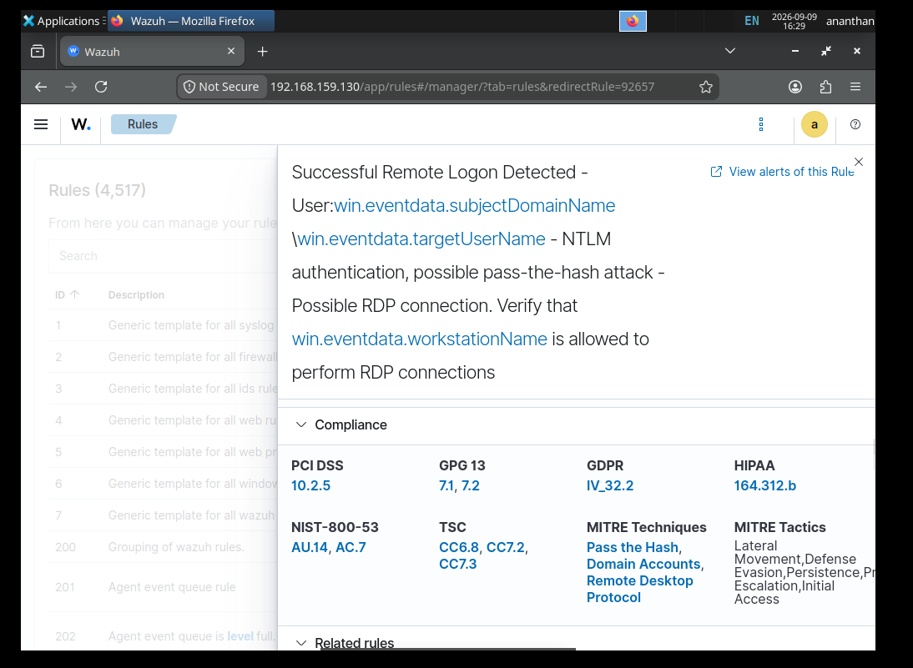
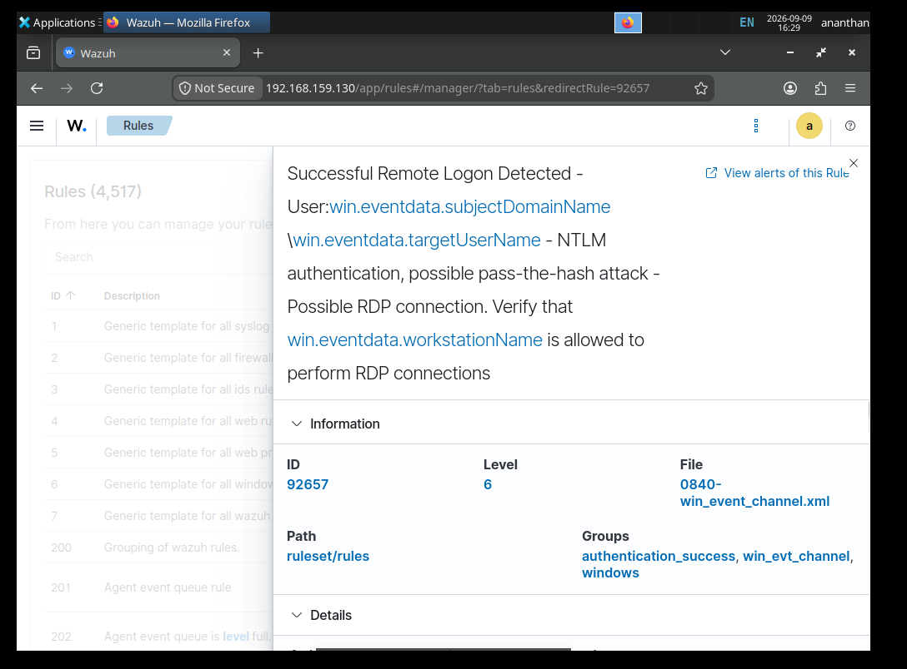

# Lateral Movement Detection — Wazuh Rule 92657

## Detection Overview

This document describes the Wazuh detection validated during Day 12 of the Active Directory Attack & Detection Lab.

The detection identifies successful remote Windows logon activity and provides a SOC analyst with authentication context that can be investigated for potential lateral movement.

The controlled lab activity generated a successful SMB authentication from Kali to WIN10-CLIENT using the low-privileged `bh_enum` domain account.

Wazuh generated:

**Rule 92657 — Successful Remote Logon Detected**

**Severity:** Level 6

The detection was investigated using Windows Security Event ID 4624 and the associated authentication fields.

---

## Detection Objective

The objective of this detection is to identify successful remote authentication activity that may represent:

- Legitimate remote administration
- Authorized file-sharing activity
- IT support activity
- Security testing
- Suspicious credential usage
- Potential lateral movement

The alert should be treated as an **investigation trigger**, not automatic proof of compromise.

---

# 1. Lab Environment

| Component | Value |
|---|---|
| Domain | `CORP.LOCAL` |
| Domain Controller | `AD-DC.corp.local` |
| Domain Controller IP | `192.168.159.10` |
| Source System | Kali Linux |
| Source IP | `192.168.159.129` |
| Target Endpoint | `WIN10-CLIENT` |
| Target IP | `192.168.159.133` |
| Domain Account | `bh_enum` |
| Protocol | SMB |
| Destination Port | TCP/445 |
| Windows Event | 4624 |
| Logon Type | 3 — Network |
| Authentication | NTLM / NTLM V2 |
| Wazuh Rule | 92657 |
| Wazuh Level | 6 |

---

# 2. Detection Principle

Remote authentication is an important source of Windows security telemetry.

A successful Event ID 4624 becomes particularly valuable when the event contains:

- A remote source IP
- A workstation name
- A domain account
- Network Logon Type 3
- NTLM authentication
- A remote destination endpoint

The detection workflow therefore combines authentication telemetry with contextual investigation.

---

# 3. Baseline

Before performing the controlled authentication, existing Windows Security Event ID 4624 activity was reviewed.

This established a baseline for successful authentication events on WIN10-CLIENT.

**Evidence:** `Day12-01-Windows10-4624-LateralMovement-Baseline.png`

The existing SMB session state was also reviewed.

**Evidence:** `Day12-02-Windows10-SMB-Session-Baseline.png`

---

# 4. Controlled Authentication

Connectivity from Kali to the target SMB service was validated before authentication.

The target endpoint was:

`192.168.159.133`

The SMB service was reachable on:

`TCP/445`

**Evidence:** `Day12-03-Kali-to-Windows10-SMB-Connectivity-Baseline.png`

A controlled SMB authentication was then performed using the low-privileged `bh_enum` domain account.

**Evidence:** `Day12-04-Kali-SMB-Remote-Authentication.png`

The successful SMB session demonstrated the remote-authentication component of the scenario.

---

# 5. Windows Event ID 4624

The successful authentication generated Windows Security Event ID 4624 on WIN10-CLIENT.

The relevant telemetry showed:

| Field | Observed Value |
|---|---|
| Target Account | `bh_enum` |
| Target Domain | `CORP` |
| Logon Type | `3` |
| Authentication Package | `NTLM` |
| NTLM Package | `NTLM V2` |
| Source IP | `192.168.159.129` |
| Workstation | `KALI` |

Logon Type 3 represents a network logon and is consistent with remote network authentication such as SMB.

**Evidence:** `Day12-05-Windows10-4624-Lateral-Movement-Network-Logon.png`

---

# 6. Wazuh Alert

Wazuh successfully detected the remote authentication activity.

The resulting alert was:

**Rule ID:** `92657`

**Description:** `Successful Remote Logon Detected`

**Level:** `6`

The Wazuh event provided the following relevant fields:

- Agent: `WIN10-CLIENT`
- Agent IP: `192.168.159.133`
- Target user: `bh_enum`
- Target domain: `CORP`
- Source IP: `192.168.159.129`
- Workstation: `KALI`
- Event ID: `4624`
- Logon Type: `3`
- Authentication Package: `NTLM`
- NTLM Package: `NTLM V2`
- Logon Process: `NtLmSsp`

**Evidence:** `Day12-06-Wazuh-Lateral-Movement-4624-Document-Details.png`

---

# 7. Rule 92657 Detection Logic

The Wazuh Rule 92657 definition was reviewed to understand the detection chain.

Observed rule information:

- Rule ID: `92657`
- Level: `6`
- Parent rule: `92652`
- Ruleset file: `0840-win_event_channel.xml`
- Groups:
  - `authentication_success`
  - `win_evt_channel`
  - `windows`

The rule description identifies successful remote logon activity and advises the analyst to validate the workstation associated with the authentication.

The rule context also references NTLM authentication and potential remote-access scenarios.

**Evidence:** `Day12-07-Wazuh-Rule-92657-Detection-Logic.png`

---

# 8. Rule Metadata

Additional information for Rule 92657 confirmed:

| Attribute | Value |
|---|---|
| Rule ID | `92657` |
| Level | `6` |
| Ruleset Path | `ruleset/rules` |
| Rule File | `0840-win_event_channel.xml` |
| Parent Rule | `92652` |
| Authentication Context | Successful remote authentication |

The rule information also contains MITRE-related context associated with lateral movement.

**Evidence:** `Day12-08-Wazuh-Rule-92657-Information.png`

---

# 9. Detection Correlation

The Day 12 detection can be correlated as follows:

**Source**

`Kali — 192.168.159.129`

↓

**Remote Service**

`SMB / TCP 445`

↓

**Destination**

`WIN10-CLIENT — 192.168.159.133`

↓

**Account**

`CORP\bh_enum`

↓

**Windows Telemetry**

`Event ID 4624`

↓

**Authentication Context**

`Logon Type 3 / NTLM / NTLM V2`

↓

**Wazuh**

`Rule 92657 / Level 6`

↓

**SOC Investigation**

This correlation connects the source, account, destination, authentication method, Windows event and SIEM alert.

---

# 10. Detection Assessment

The detection successfully identified the controlled remote authentication.

The strongest investigative indicators were:

- Successful remote logon
- Network Logon Type 3
- Remote source IP
- Workstation name
- Domain account
- NTLM authentication
- Wazuh correlation
- Rule 92657 Level 6 alert

Together, these fields provide sufficient context for an analyst to determine whether the activity is expected or suspicious.

---

# 11. Analyst Investigation Workflow

When Rule 92657 triggers, the SOC analyst should follow a structured workflow.

## Step 1 — Validate

Confirm:

- User account
- Source IP
- Workstation
- Destination endpoint
- Event ID
- Logon Type
- Authentication protocol
- Event timestamp

## Step 2 — Correlate

Search for:

- Previous logons from the same account
- Other logons from the same source
- Related authentication events
- Other alerts involving the account
- Activity involving the destination host

## Step 3 — Investigate

Determine:

- Whether the account normally accesses the endpoint.
- Whether the source workstation is authorized.
- Whether the authentication occurred during expected activity.
- Whether additional suspicious events occurred around the same time.

## Step 4 — Assess

Evaluate:

- Account privilege
- Source system trust
- Target system criticality
- Authentication method
- Frequency of authentication
- Related security telemetry

## Step 5 — Respond

If the activity is unauthorized:

- Investigate the source endpoint.
- Review the account for additional suspicious activity.
- Consider credential containment.
- Investigate other systems accessed by the account.
- Escalate according to incident-response procedures.

---

# 12. False Positive Analysis

Successful remote logons can be completely legitimate.

Potential sources include:

- IT administrators
- Help-desk personnel
- Remote support
- File-sharing operations
- System management
- Domain administration
- Authorized security testing

Therefore, Rule 92657 should not be treated as a standalone compromise indicator.

The analyst should enrich the alert with:

- User role
- Source workstation
- Destination endpoint
- Authentication history
- Business context
- Time of activity
- Related alerts

---

# 13. Detection Tuning Opportunities

The detection can be improved by adding contextual correlation rather than simply increasing severity.

Potential enrichment includes:

### Account Context

Identify whether the account is:

- Standard user
- Service account
- Help-desk account
- Administrator
- Privileged account

### Source Context

Determine whether the source system is:

- Known corporate workstation
- Approved administrative system
- Server
- Security-testing host
- Unknown endpoint

### Destination Context

Determine whether the target is:

- Standard workstation
- Application server
- Domain Controller
- Security infrastructure
- Critical server

### Behavioral Context

Look for:

- Unusual authentication times
- Multiple destinations
- Multiple accounts from one source
- Repeated remote logons
- Authentication bursts
- Related credential-abuse indicators

---

# 14. Detection Limitations

Rule 92657 identifies successful remote authentication activity.

It does not independently prove:

- Malicious intent
- Credential theft
- Pass-the-Hash
- Privilege escalation
- Administrative access
- Remote command execution
- Full host compromise

Additional telemetry and investigation are required to establish malicious activity.

This distinction is essential for accurate SOC alert classification.

---

# 15. MITRE ATT&CK Relevance

### T1021.002 — SMB/Windows Admin Shares

SMB can provide a mechanism for remote access to Windows systems.

The Day 12 exercise demonstrated the remote authentication component of SMB activity without demonstrating administrative share abuse.

### T1078 — Valid Accounts

The controlled scenario used a valid domain account to authenticate remotely to the target endpoint.

### T1550.002 — Pass the Hash

Pass-the-Hash is part of the broader Project 3 attack set and was separately demonstrated during Day 9.

Day 12 itself used normal account credentials and **did not perform Pass-the-Hash**.

---

# 16. Detection Workflow

The detection lifecycle can be summarized as:

**Remote Authentication**

↓

**Windows Event 4624**

↓

**Logon Type 3 Analysis**

↓

**Source / Account / Workstation Correlation**

↓

**Wazuh Rule 92657**

↓

**Alert Validation**

↓

**SOC Investigation**

↓

**Risk Assessment**

↓

**Response if Required**

This workflow demonstrates how a SOC can move from raw authentication telemetry to an actionable security decision.

---

# 17. Detection Result

### Detection Status

**Validated**

### Activity

Controlled remote SMB authentication

### Source

`192.168.159.129 / KALI`

### Destination

`192.168.159.133 / WIN10-CLIENT`

### Account

`CORP\bh_enum`

### Windows Event

`4624`

### Logon Type

`3 — Network`

### Authentication

`NTLM / NTLM V2`

### Wazuh Detection

`92657 — Successful Remote Logon Detected`

### Severity

`Level 6`

### Analyst Classification

**Expected activity within the controlled security lab**

The alert was successfully generated and investigated, demonstrating that the configured Wazuh environment provides useful visibility into remote Windows authentication.

---

# 18. Evidence Index

| # | Evidence | Purpose |
|---|---|---|
| 01 | `Day12-01-Windows10-4624-LateralMovement-Baseline.png` | Windows authentication baseline |
| 02 | `Day12-02-Windows10-SMB-Session-Baseline.png` | SMB session baseline |
| 03 | `Day12-03-Kali-to-Windows10-SMB-Connectivity-Baseline.png` | SMB connectivity validation |
| 04 | `Day12-04-Kali-SMB-Remote-Authentication.png` | Controlled remote authentication |
| 05 | `Day12-05-Windows10-4624-Lateral-Movement-Network-Logon.png` | Windows 4624 network logon |
| 06 | `Day12-06-Wazuh-Lateral-Movement-4624-Document-Details.png` | Wazuh authentication telemetry |
| 07 | `Day12-07-Wazuh-Rule-92657-Detection-Logic.png` | Rule detection logic |
| 08 | `Day12-08-Wazuh-Rule-92657-Information.png` | Rule metadata and severity |

---

# 19. Blue-Team Takeaway

Remote authentication should be treated as an important source of identity and endpoint telemetry.

A successful network logon becomes significantly more valuable when correlated with:

**Account + Source IP + Workstation + Destination + Logon Type + Authentication Protocol**

Wazuh Rule 92657 provides an initial detection point, while the SOC analyst provides the context required to determine whether the activity is legitimate or suspicious.

The key defensive principle demonstrated by this exercise is:

> **Detection identifies activity; investigation determines significance.**

---

# 20. Portfolio Significance

This detection demonstrates practical experience with:

- Windows Event ID 4624
- SMB authentication
- Network Logon Type 3
- NTLM authentication
- Active Directory domain accounts
- Source and workstation correlation
- Wazuh SIEM
- Wazuh rule analysis
- Detection validation
- SOC alert triage
- False-positive analysis
- MITRE ATT&CK mapping
- Investigation methodology

The exercise demonstrates more than generating a SIEM alert.

It shows the ability to understand the underlying Windows telemetry, determine why a detection fired, correlate authentication context, evaluate false positives, and reach an evidence-based SOC conclusion.