# NTLM Authentication from an Unexpected Source

> **Detection ID:** DET-NTLM-001  
> **Severity:** Medium  
> **Detection Type:** Behavioral / Correlation  
> **Status:** Validated in Lab  
> **Primary Telemetry:** Windows Security Event IDs 4624 and 4776  
> **Protocol:** NTLM / NTLMv2  
> **Lab Project:** Project 03 — Active Directory Attack & Detection Lab

---

## 1. Detection Summary

This detection identifies successful NTLM-based network authentication for a domain account when the authentication originates from an unexpected workstation or source IP.

The detection does **not** treat NTLM authentication itself as malicious.

Instead, it evaluates the authentication context:

- Which account authenticated?
- Which workstation initiated the authentication?
- Which source IP was involved?
- What logon type was used?
- Which authentication package was used?
- Did the Domain Controller successfully validate the credentials?
- Does the source match the account's expected authentication baseline?

During this lab, the dedicated `CORP\pt_test` account was first used to establish a normal authentication baseline from `WIN10-CLIENT`.

The same account was subsequently used from the Kali Linux host.

This produced a different authentication pattern:

**Normal baseline**

`CORP\pt_test → WIN10-CLIENT → NTLM`

**Suspicious test**

`CORP\pt_test → KALI → NTLM`

The suspicious authentication generated correlated Event ID `4624` and Event ID `4776` telemetry.

---

## 2. Security Objective

The objective is to detect potentially suspicious use of valid domain credentials when those credentials are used from an unexpected source.

The detection is based on the principle that:

> A valid authentication can still be suspicious when the authentication context is abnormal.

The lab therefore focuses on **behavioral deviation from a known baseline**, rather than simply alerting on the presence of NTLM.

---

## 3. Lab Environment

| Component | Value |
|---|---|
| Active Directory Domain | `CORP.LOCAL` |
| Domain Controller | `AD-DC` |
| Domain Controller IP | `192.168.159.10` |
| Windows Client | `WIN10-CLIENT` |
| Windows Client IP | `192.168.159.133` |
| Kali Linux | `KALI` |
| Kali IP | `192.168.159.129` |
| Test Account | `CORP\pt_test` |
| Authentication Protocol | NTLM / NTLMv2 |
| SMB Port | TCP/445 |
| Primary Events | 4624, 4776 |

---

## 4. Detection Hypothesis

A successful Type 3 network authentication using NTLM should be investigated when the source workstation or source IP is not an expected authentication source for the account.

The detection hypothesis is:

**If a domain account performs a successful Type 3 NTLM authentication from an unexpected source, and the Domain Controller records successful credential validation for the same account and source, increase the confidence that the authentication requires investigation.**

The detection therefore combines:

1. Account identity
2. Source workstation
3. Source IP
4. Logon Type
5. Authentication Package
6. Successful authentication
7. Domain Controller credential validation
8. Comparison against an expected authentication baseline

---

# 5. Relevant Windows Security Events

## 5.1 Event ID 4624 — Successful Logon

Event ID `4624` records a successful logon.

For this detection, the most relevant fields are:

| Field | Security Value |
|---|---|
| Account Name | Identifies the authenticated account |
| Account Domain | Identifies the domain |
| Logon Type | Identifies the type of authentication |
| Workstation Name | Identifies the originating workstation |
| Source Network Address | Identifies the source IP |
| Logon Process | Provides authentication-process context |
| Authentication Package | Identifies NTLM/Kerberos |
| Package Name | Provides NTLM version information |

The lab demonstrated a Type 3 network logon using NTLM.

Observed suspicious values included:

- Account: `pt_test`
- Domain: `CORP`
- Logon Type: `3`
- Workstation: `KALI`
- Source IP: `192.168.159.129`
- Logon Process: `NtLmSsp`
- Authentication Package: `NTLM`
- Package Name: `NTLM V2`
- Key Length: `128`

---

## 5.2 Event ID 4776 — Credential Validation

Event ID `4776` records an attempt by the system to validate credentials for an account.

For this detection, the most important fields are:

- Authentication Package
- Logon Account
- Source Workstation
- Error Code

The suspicious lab event showed:

- Logon Account: `pt_test`
- Source Workstation: `KALI`
- Error Code: `0x0`

The `0x0` result indicates successful credential validation.

---

# 6. Authentication Baseline

A baseline was established before the suspicious-source test.

The purpose of the baseline was to determine what normal authentication looked like for the dedicated `pt_test` account.

The expected source was:

`WIN10-CLIENT`

Source IP:

`192.168.159.133`

Authentication:

`NTLM`

The baseline is important because an NTLM authentication from `WIN10-CLIENT` is not inherently suspicious.

The same account later authenticating from `KALI` represents a change in authentication context.

---

## 6.1 Baseline — Account and Lab Preparation

The dedicated `pt_test` account was created specifically for controlled authentication testing.

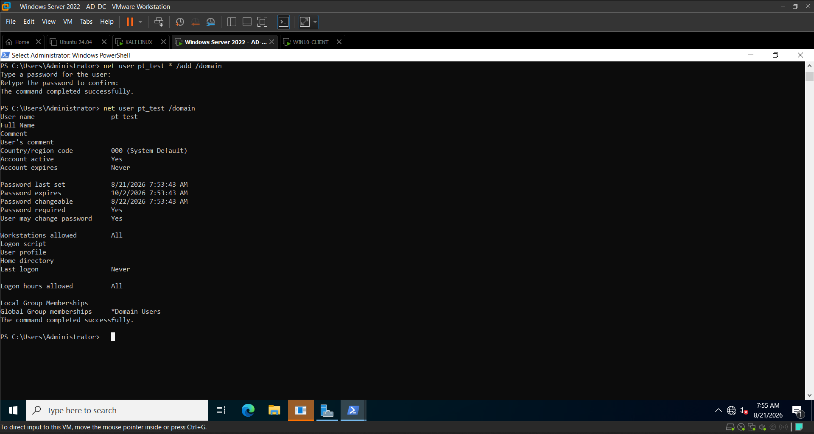

The account was added to the required local test configuration without granting unnecessary administrative privileges.

This provides a controlled identity for detection validation.

---

## 6.2 Baseline — Local Access

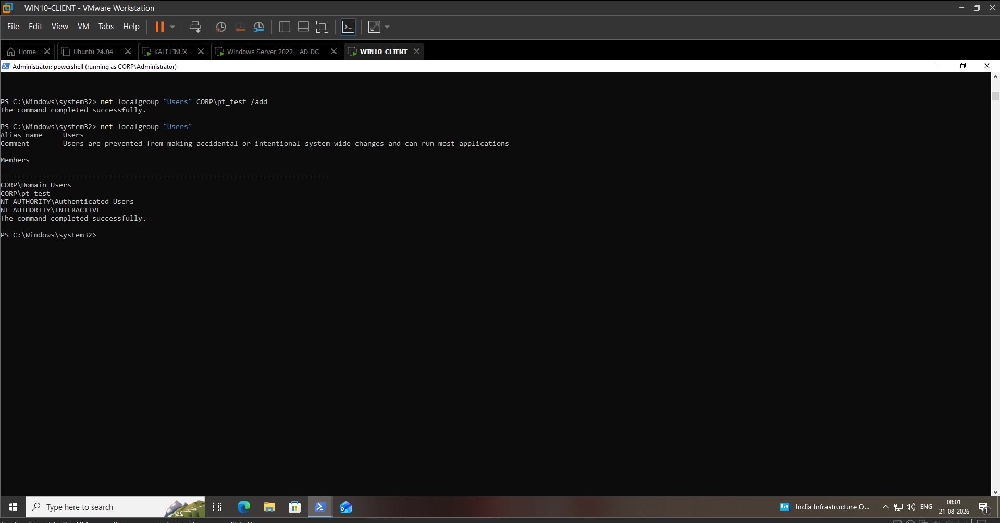

This evidence documents the initial availability and accessibility of the test account within the lab environment.

---

## 6.3 Baseline — Normal Authentication

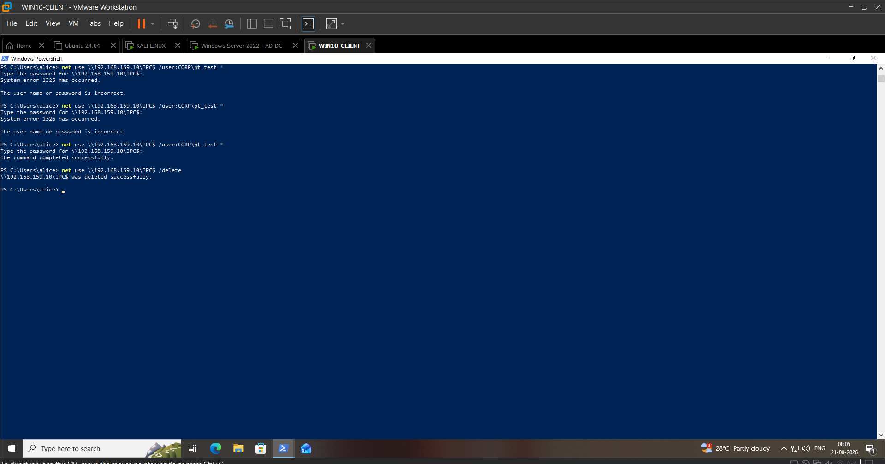

This evidence establishes the normal authentication behavior before the suspicious-source test.

Expected source:

`WIN10-CLIENT`

---

## 6.4 Baseline — Event ID 4776

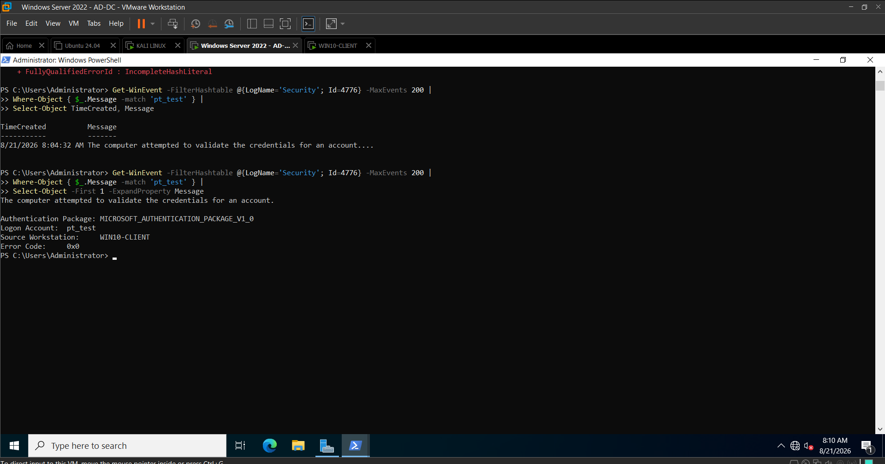

The Domain Controller recorded successful credential validation for `pt_test`.

Observed result:

`Error Code: 0x0`

This establishes successful baseline credential validation.

---

## 6.5 Baseline — Event ID 4624

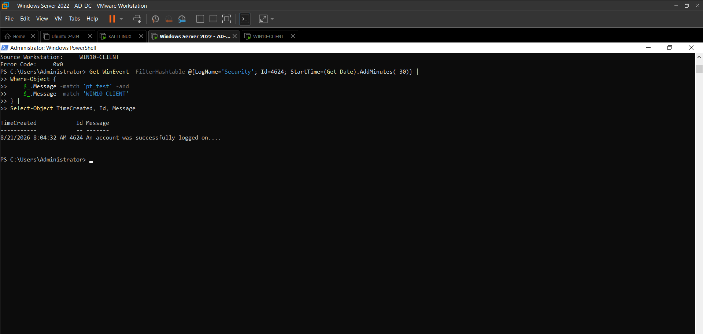

The Windows client recorded successful network authentication for the test account.

The baseline establishes the expected source before the suspicious authentication was generated.

---

# 7. SMB Authentication Test

The test account was then used to perform controlled SMB authentication from the Kali Linux system.

The purpose was to generate realistic Windows authentication telemetry that could be investigated from a SOC perspective.

---

## 7.1 SMB Connectivity Verification

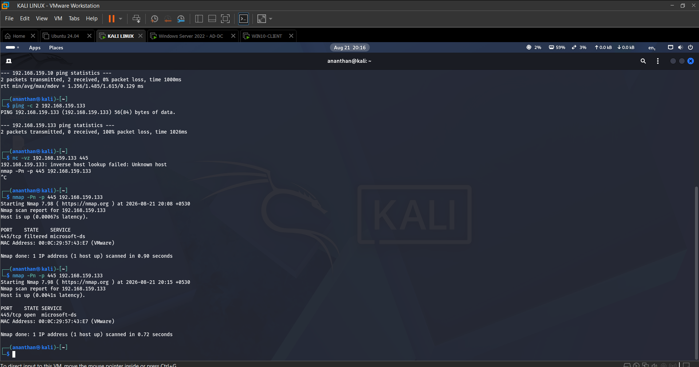

This evidence confirms that SMB connectivity between the relevant lab systems was available before authentication testing.

---

## 7.2 NTLM Authentication Test

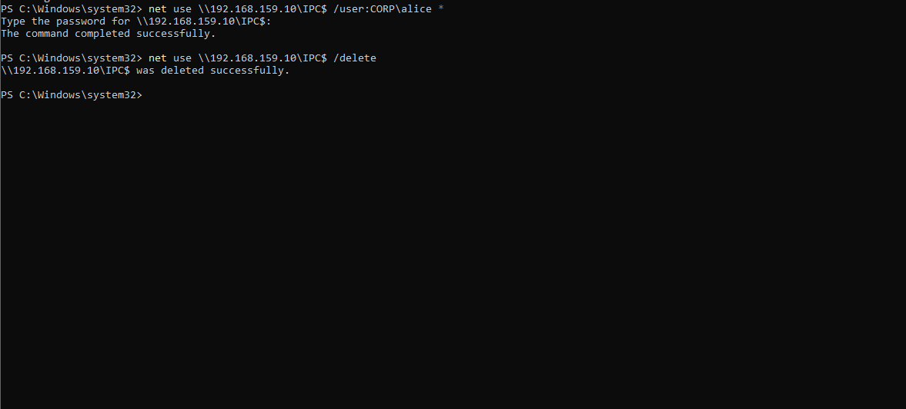

This evidence documents the controlled NTLM authentication test.

The test was performed using the dedicated `CORP\pt_test` account.

---

## 7.3 SMB Authentication

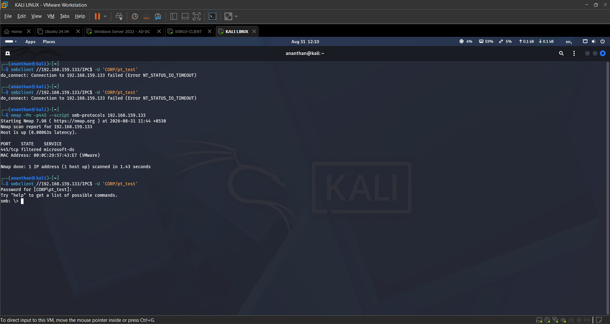

The authentication originated from the Kali system.

Source:

`KALI`

Source IP:

`192.168.159.129`

Destination:

`WIN10-CLIENT`

Protocol:

`SMB`

The authentication was intentionally performed to generate detection telemetry.

---

# 8. Suspicious Authentication — Event ID 4624

The Windows client recorded a successful network authentication originating from the Kali host.

The event represents the primary suspicious authentication signal.

The key behavioral difference is the source.

### Normal

`pt_test → WIN10-CLIENT`

### Suspicious

`pt_test → KALI`

---

## 8.1 Full Event 4624 Telemetry

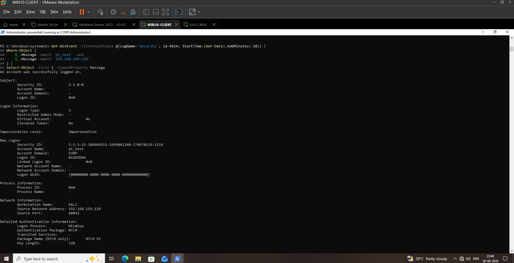

The full Event ID `4624` telemetry showed:

| Field | Observed Value |
|---|---|
| Event ID | `4624` |
| Account Name | `pt_test` |
| Account Domain | `CORP` |
| Logon Type | `3` |
| Workstation Name | `KALI` |
| Source Network Address | `192.168.159.129` |
| Logon Process | `NtLmSsp` |
| Authentication Package | `NTLM` |
| Package Name | `NTLM V2` |
| Key Length | `128` |

### Security interpretation

The authentication was successful, but the source was unexpected for the account's established baseline.

This makes the event worthy of investigation.

---

# 9. Domain Controller Correlation — Event ID 4776

The Domain Controller recorded credential validation for the same account and source.

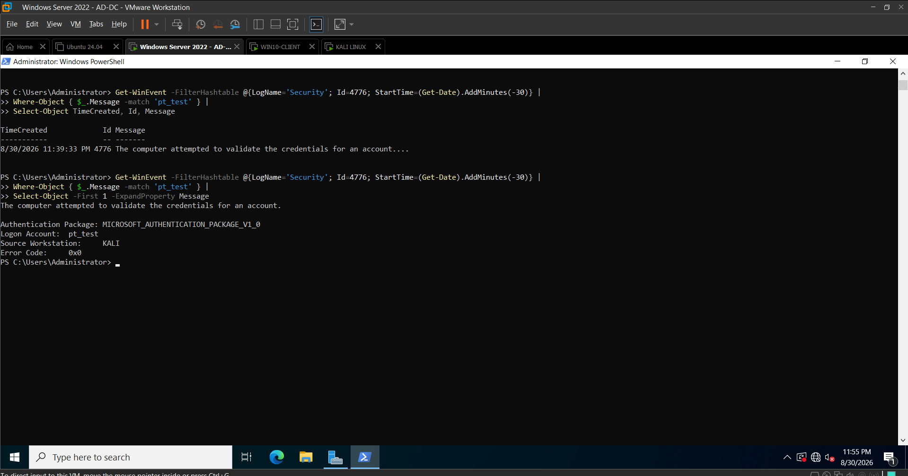

Observed values:

| Field | Observed Value |
|---|---|
| Event ID | `4776` |
| Logon Account | `pt_test` |
| Source Workstation | `KALI` |
| Error Code | `0x0` |

The Domain Controller successfully validated the credentials.

This is important because it confirms that the authentication involved valid credentials rather than merely a failed authentication attempt.

---

# 10. Event Correlation

The strongest detection evidence comes from correlating Event ID `4624` with Event ID `4776`.

The following attributes were consistent across the events:

| Attribute | Event 4624 | Event 4776 |
|---|---|---|
| Account | `pt_test` | `pt_test` |
| Source | `KALI` | `KALI` |
| Authentication | NTLM | Credential validation |
| Result | Successful | `0x0` |
| Timestamp | `23:39:33` | `23:39:33` |

The matching account, source and timestamp provide strong evidence that the two events represent the same controlled authentication activity.

---

# 11. Detection Query — Event ID 4624

The following PowerShell query was used to validate the suspicious authentication.

    Get-WinEvent -FilterHashtable @{LogName='Security'; Id=4624; StartTime=(Get-Date).AddMinutes(-60)} |
    Where-Object {
        $_.Message -match 'pt_test' -and
        $_.Message -match 'KALI' -and
        $_.Message -match 'Authentication Package:\s+NTLM'
    } |
    Select-Object TimeCreated, Id, Message

The query successfully identified the controlled suspicious Event ID `4624`.

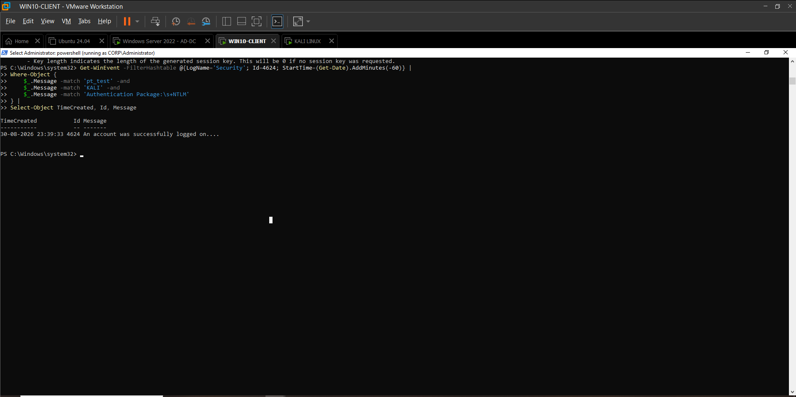

---

# 12. Detection Query — Event ID 4776

The corresponding Domain Controller query was used to identify successful credential validation for the same account and source.

    Get-WinEvent -FilterHashtable @{LogName='Security'; Id=4776; StartTime=(Get-Date).AddMinutes(-60)} |
    Where-Object {
        $_.Message -match 'pt_test' -and
        $_.Message -match 'KALI' -and
        $_.Message -match 'Error Code:\s+0x0'
    } |
    Select-Object TimeCreated, Id, Message

The query successfully identified the controlled suspicious Event ID `4776`.

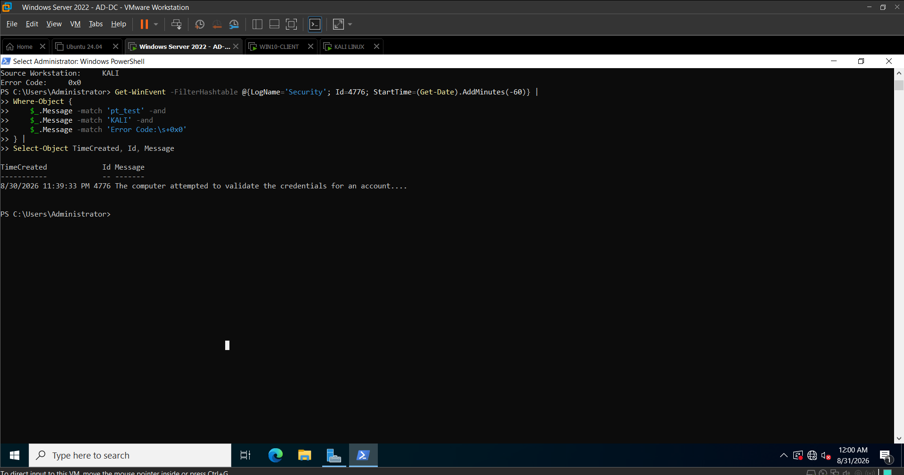

---

# 13. Detection Logic

## Primary Signal

Trigger when the following conditions are observed:

- Event ID `4624`
- Logon Type `3`
- Authentication Package `NTLM`
- Domain account
- Source workstation or IP differs from the account's expected baseline

## Correlation Signal

Increase detection confidence when a corresponding Event ID `4776` is observed with:

- Same account
- Same source workstation
- Successful credential validation
- `Error Code: 0x0`
- Matching or near-matching timestamp

---

# 14. Detection Flow

The complete detection workflow is:

    Authentication Activity
            |
            v
    Event ID 4624
            |
            +-- Logon Type 3
            |
            +-- Authentication = NTLM
            |
            +-- Identify Source
            |
            v
    Compare Against Account Baseline
            |
            +-- Expected Source --> Lower Risk
            |
            +-- Unexpected Source --> Investigate
                                      |
                                      v
                              Event ID 4776
                                      |
                                      +-- Same Account
                                      +-- Same Source
                                      +-- Error 0x0
                                      |
                                      v
                              Correlation Confirmed
                                      |
                                      v
                           SOC Investigation / Triage

---

# 15. Behavioral Comparison

| Attribute | Normal Baseline | Suspicious Test |
|---|---|---|
| Account | `pt_test` | `pt_test` |
| Source Host | `WIN10-CLIENT` | `KALI` |
| Source IP | `192.168.159.133` | `192.168.159.129` |
| Authentication | NTLM | NTLM |
| Logon Type | `3` | `3` |
| Event 4624 | Yes | Yes |
| Event 4776 | Yes | Yes |
| Credential Validation | `0x0` | `0x0` |

### Primary anomaly

The authentication source changed from the expected Windows client to the Kali host.

Therefore:

`Valid Account + Successful Authentication + Unexpected Source`

is the detection condition demonstrated by the lab.

---

# 16. Investigation Workflow

When this detection fires in a SOC environment, the analyst should investigate the authentication context.

## Step 1 — Identify the Account

Determine:

- Account name
- Domain
- Account type
- Privilege level
- Whether the account is a normal user, service account, or administrative account

## Step 2 — Identify the Source

Determine:

- Source workstation
- Source IP
- Whether the host is expected
- Whether the source belongs to an administrative or service infrastructure

## Step 3 — Examine Event 4624

Review:

- Logon Type
- Authentication Package
- Source IP
- Workstation Name
- Logon Process
- Timestamp

## Step 4 — Examine Event 4776

Review:

- Logon Account
- Source Workstation
- Authentication Package
- Error Code

## Step 5 — Correlate

Compare:

- Account
- Source
- Timestamp
- Authentication protocol

## Step 6 — Review Additional Activity

Search for:

- Other successful logons
- Failed authentication attempts
- Multiple destination systems
- SMB activity
- Remote execution
- Privilege escalation
- Process creation
- Additional authentication anomalies

## Step 7 — Determine Legitimacy

Possible legitimate explanations include:

- Authorized administration
- Help-desk activity
- Service account activity
- Legacy applications
- Backup infrastructure
- Monitoring infrastructure
- Security testing

---

# 17. False Positives

This detection can generate legitimate alerts.

Potential causes include:

- Legacy applications using NTLM
- Administrative activity
- Service accounts
- Backup systems
- Monitoring systems
- Remote management
- Application servers
- Security testing infrastructure
- Newly deployed workstations

Therefore, an unexpected NTLM source should be treated as an **investigation signal**, not automatic proof of compromise.

---

# 18. Detection Tuning

A production implementation should maintain an expected-source baseline for important accounts.

Example:

| Account | Expected Source |
|---|---|
| `svc_backup` | `BACKUP01`, `BACKUP02` |
| `admin_user` | `ADMIN-PC01` |
| `service_account` | Approved application servers |

The detection can then increase severity when authentication occurs from a source outside the expected baseline.

Useful tuning dimensions include:

- Account
- Source hostname
- Source IP
- Destination
- Logon Type
- Authentication Package
- Historical behavior
- Time of day

NTLM should not simply be allowlisted because it is common.

---

# 19. Severity Assessment

**Severity: Medium**

The lab demonstrated:

- Successful authentication
- Valid credentials
- NTLM authentication
- Unexpected source
- Domain Controller validation

However, the evidence does **not independently prove malicious credential use**.

Severity should be increased when additional indicators are present, such as:

- Privileged account
- Multiple destination systems
- Untrusted source
- Unusual authentication time
- Credential-access indicators
- Remote execution
- Privilege escalation
- Lateral movement activity

---

# 20. Analyst Response

If the authentication is determined to be unauthorized:

1. Validate the affected account.
2. Identify all recent authentication sources.
3. Investigate the source workstation.
4. Review authentication activity across the environment.
5. Search for lateral movement indicators.
6. Review related process and network activity.
7. Restrict or disable the account if required by incident-response procedures.
8. Reset credentials when appropriate.
9. Preserve relevant logs and evidence.
10. Document the incident timeline.

Response actions should follow the organization's incident-response procedures.

---

# 21. MITRE ATT&CK Mapping

## T1078 — Valid Accounts

**Relationship:** Strongly relevant.

The lab demonstrates successful use of a valid domain account from an unexpected source.

The observable behavior is:

`Valid Account + Successful Authentication + Unexpected Source`

The lab does **not** prove how the credentials were obtained.

---

## T1021.002 — SMB/Windows Admin Shares

**Relationship:** Supporting context.

The controlled authentication used SMB as the network authentication path.

The lab demonstrates SMB-related authentication telemetry.

The lab does **not** claim that administrative-share abuse or malicious lateral movement was successfully performed.

---

# 22. Evidence Index

The Day 07 evidence set contains the following artifacts.

| Evidence | Purpose |
|---|---|
| `Day07-01-NTLM-4776-Baseline.png` | Initial NTLM credential-validation baseline |
| `Day07-02-NTLM-Authentication-Test.png` | Controlled NTLM authentication test |
| `Day07-03-NTLM-4624-Correlation.png` | Initial 4624 correlation evidence |
| `Day07-04-NTLM-Detection-Query.png` | Initial detection query |
| `Day07-05-NTLM-4624-Full-Telemetry.png` | Full Event 4624 telemetry |
| `Day07-06-NTLM-4776-Correlation-Query.png` | 4776 correlation query |
| `Day07-07-SMB-Connectivity-Verified.png` | SMB connectivity validation |
| `Day07-08-PT-Test-Account-Creation.png` | Controlled test account creation |
| `Day07-09-PT-Test-Local-Access.png` | Test account local-access validation |
| `Day07-10-PT-Test-Normal-Authentication.png` | Normal authentication baseline |
| `Day07-11-PT-Test-4776-Success.png` | Successful baseline credential validation |
| `Day07-12-PT-Test-4624-Correlation.png` | Baseline 4624 correlation |
| `Day07-13-PT-Test-4624-Full-NTLM-Telemetry.png` | Full baseline NTLM telemetry |
| `Day07-14-PT-Test-SMB-Authentication.png` | Controlled SMB authentication |
| `Day07-15-PT-Test-Kali-4624-Detection.png` | Suspicious Kali-originated 4624 detection |
| `Day07-16-PT-Test-Kali-4624-Full-Telemetry.png` | Full suspicious 4624 telemetry |
| `Day07-17-PT-Test-Kali-4776-Correlation.png` | Suspicious 4776 correlation |
| `Day07-18-NTLM-Suspicious-4624-Detection-Query.png` | Validated 4624 detection query |
| `Day07-19-NTLM-Suspicious-4776-Detection-Query.png` | Validated 4776 detection query |

---

# 23. Complete Evidence Chain

The evidence collected during Day 7 demonstrates the following progression:

### Phase 1 — Establish Baseline

`pt_test → WIN10-CLIENT → NTLM`

↓

### Phase 2 — Verify SMB Connectivity

`KALI → WIN10-CLIENT:445`

↓

### Phase 3 — Generate Controlled Authentication

`KALI → SMB → WIN10-CLIENT`

↓

### Phase 4 — Endpoint Detection

`4624 → pt_test → KALI → NTLM`

↓

### Phase 5 — Domain Controller Validation

`4776 → pt_test → KALI → 0x0`

↓

### Phase 6 — Correlation

`Same Account + Same Source + Successful Authentication`

↓

### Phase 7 — Detection

**Successful NTLM authentication from an unexpected source**

---

# 24. Detection Limitations

This detection has several limitations.

### NTLM is not inherently malicious

Legitimate Windows environments can still generate NTLM authentication.

### Unexpected source does not automatically mean compromise

An administrator, service, application, or security-testing system may legitimately authenticate from a new host.

### Event 4624 alone is insufficient

Additional context should be considered before classifying the activity.

### Event 4776 alone is insufficient

Successful credential validation confirms authentication processing but does not establish malicious intent.

### Baselines require maintenance

Expected authentication sources can change as infrastructure changes.

### Production deployment requires broader correlation

A production SOC should correlate events across multiple systems and telemetry sources using a SIEM or detection platform.

---

# 25. What This Lab Demonstrates

This lab demonstrates a practical SOC detection-engineering workflow:

1. Establish a normal authentication baseline.
2. Generate controlled authentication activity.
3. Collect Windows Security telemetry.
4. Identify Event ID `4624`.
5. Identify Event ID `4776`.
6. Extract account and source information.
7. Compare authentication behavior against the baseline.
8. Correlate endpoint and Domain Controller telemetry.
9. Build a repeatable detection query.
10. Document investigation and response procedures.

This moves the project beyond simply generating attack traffic.

It demonstrates the complete defensive workflow:

**Attack Simulation → Telemetry → Detection → Correlation → Investigation → Documentation**

---

# 26. Final Detection Statement

> Detect successful Type 3 NTLM authentication for a domain account when the authentication originates from an unexpected workstation or source IP, and increase detection confidence when Event ID 4776 confirms successful credential validation for the same account and source within the correlation window.

---

# 27. Validation Result

**Detection Status: VALIDATED**

The controlled Day 7 test successfully generated and identified:

- Event ID `4624`
- Logon Type `3`
- NTLM authentication
- Account `pt_test`
- Source workstation `KALI`
- Source IP `192.168.159.129`
- Event ID `4776`
- Successful credential validation
- Error Code `0x0`

The detection queries successfully retrieved the expected events.

The evidence demonstrates that a SOC analyst can identify a deviation from an established authentication baseline and correlate endpoint and Domain Controller telemetry to investigate the activity.

---

# 28. Portfolio Takeaway

The key security lesson demonstrated by this detection is:

> **Successful authentication does not automatically mean legitimate authentication. Authentication context matters.**

A valid domain account authenticating through NTLM from an unexpected source can represent an important investigation signal.

This detection therefore focuses on **behavioral context and event correlation**, rather than treating a single authentication protocol as inherently malicious.