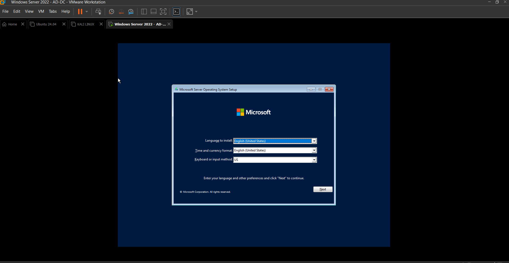
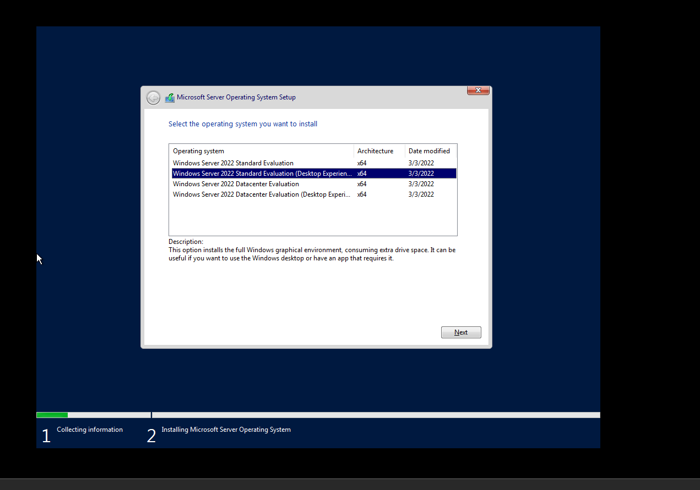
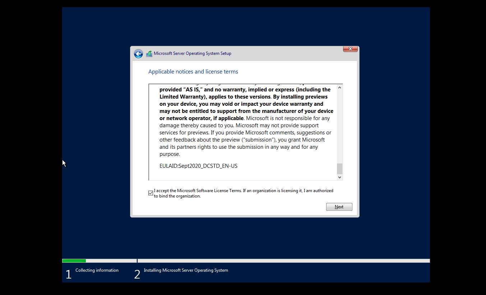
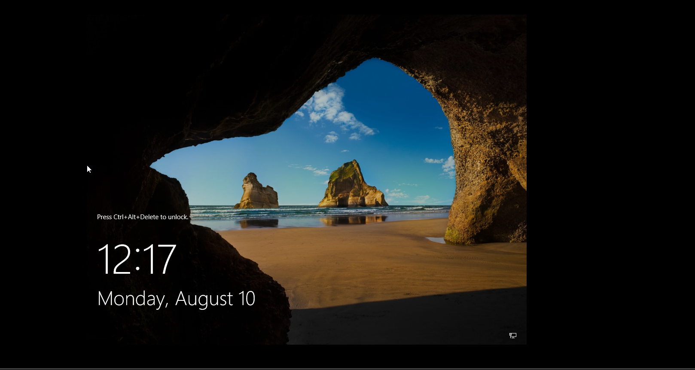
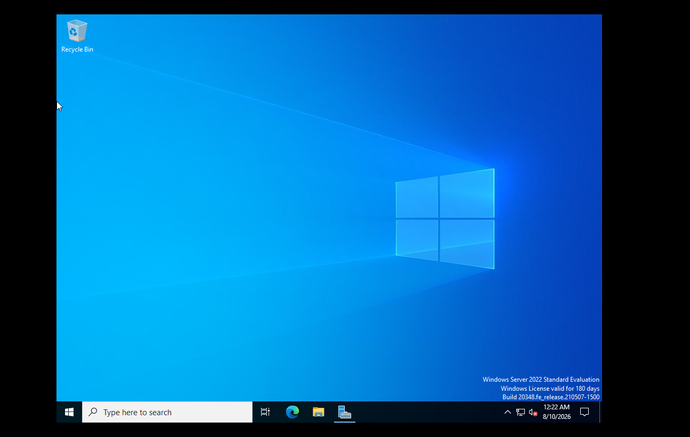
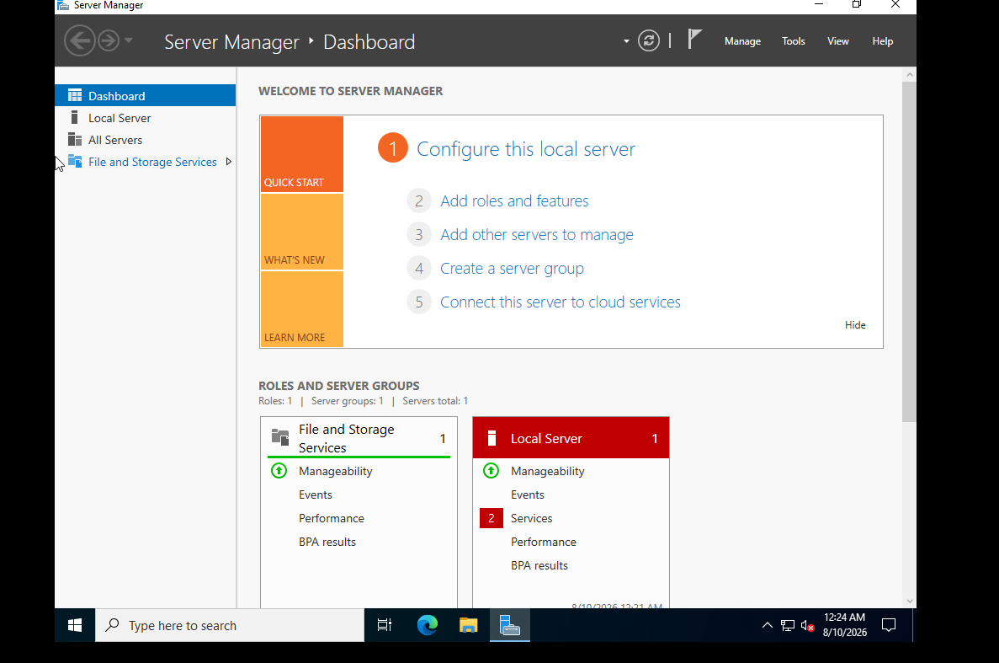
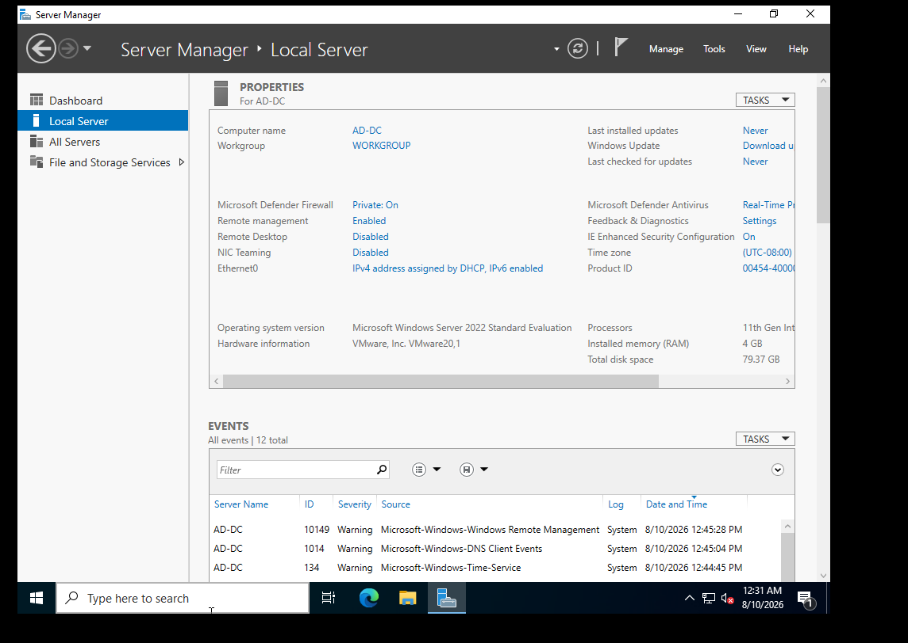
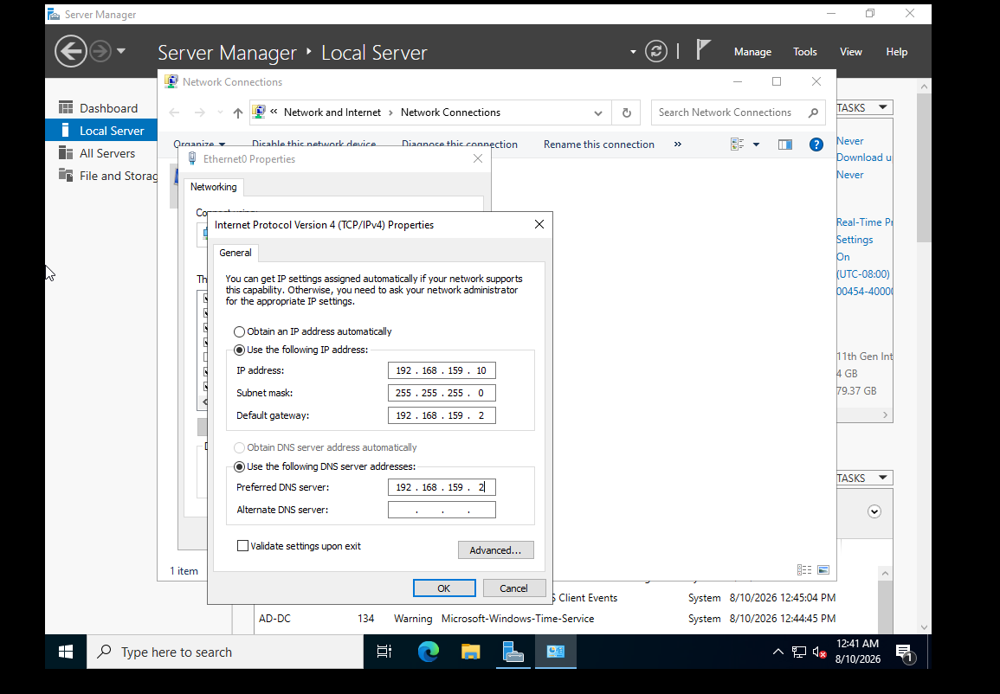
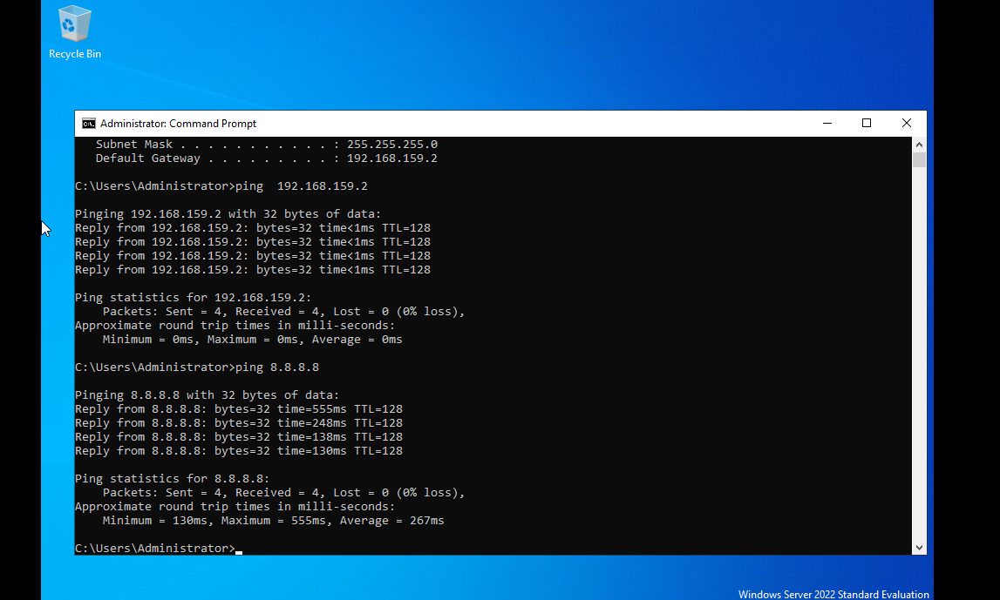

# Day 00 — Project Initialization & Windows Server Preparation

## Project

**Active Directory Attack & Detection Lab**

---

## Objective

The objective of Day 00 was to prepare the foundation of the Active Directory Attack & Detection Lab.

This phase focused on:

- Initializing the project workspace and GitHub repository
- Creating the Windows Server 2022 virtual machine
- Configuring the required VM hardware
- Installing Windows Server 2022
- Configuring the Administrator account
- Verifying the Windows Server installation
- Configuring the server hostname
- Configuring a static IPv4 address
- Verifying network connectivity
- Establishing the project documentation and evidence-management workflow

The Windows Server prepared during this phase will be configured as the Active Directory Domain Controller in a later phase.

---

## Lab Environment

| Component | Configuration |
|---|---|
| Host OS | Windows 11 |
| Virtualization Platform | VMware Workstation |
| Windows Server | Windows Server 2022 Standard Evaluation |
| CPU | 2 cores |
| RAM | 4 GB |
| Storage | 80 GB |
| Network Mode | NAT |
| Server Hostname | `AD-DC` |
| Server IP Address | `192.168.159.10` |
| Subnet Mask | `255.255.255.0` |
| Default Gateway | `192.168.159.2` |
| DNS Server | `192.168.159.2` |
| Existing SIEM | Ubuntu VM with Wazuh |
| Attacker VM | Kali Linux |
| Documentation | Visual Studio Code |
| Version Control | Git and GitHub |

---

## Project Scope

This project will build an isolated Active Directory attack and detection environment.

The lab will demonstrate:

- Active Directory administration
- Windows security monitoring
- Sysmon telemetry
- Windows Event Log analysis
- Controlled attack simulation
- Detection engineering
- MITRE ATT&CK mapping
- SOC investigation
- Security incident reporting

The existing Ubuntu Wazuh environment will be reused as the SIEM infrastructure.

Kali Linux will be used as the attacker system.

The Windows Server 2022 virtual machine prepared during Day 00 will become the Active Directory Domain Controller.

---

## Project Architecture

The planned environment consists of:

    Windows 11 Host
           |
    VMware Workstation
           |
    +------+-------------------+
    |                          |
    |                          |
    v                          v
    Windows Server 2022       Ubuntu Wazuh
    AD-DC                     SIEM
    |
    |
    v
    Active Directory

    Kali Linux
    Attacker
    |
    +------> Controlled Attack Simulation

The Windows Server will later generate security telemetry that will be collected and analyzed through the Wazuh SIEM.

Active Directory, Sysmon, telemetry integration, attack simulation, and detection engineering will be implemented in subsequent phases.

---

## Repository Initialization

A dedicated GitHub repository was created for the project:

`Project-03-AD-Attack-Detection-Lab`

The initial repository structure was created and pushed to the `main` branch.

The repository currently contains:

    Project-03-AD-Attack-Detection-Lab/
    ├── README.md
    ├── .gitignore
    ├── docs/
    │   └── Day00.md
    ├── screenshots/
    │   └── Day00/
    ├── architecture/
    ├── diagrams/
    ├── reports/
    ├── attacks/
    ├── detections/
    ├── scripts/
    └── resources/

The initial Git commit was:

    docs: initialize AD attack and detection lab

This establishes version control and provides the foundation for documenting each subsequent project phase.

---

## Windows Server Virtual Machine

A dedicated Windows Server 2022 virtual machine was created for the future Active Directory environment.

### VM Configuration

| Component | Configuration |
|---|---|
| Operating System | Windows Server 2022 Standard Evaluation |
| CPU | 2 cores |
| RAM | 4 GB |
| Storage | 80 GB |
| Network | NAT |
| Virtualization | VMware Workstation |

The virtual machine was stored in the designated VMware virtual machine location.

### Evidence

---

## Windows Server Installation

Windows Server 2022 Standard Evaluation was installed on the newly created virtual machine.

The installation process included:

1. Starting the Windows Server installation environment
2. Selecting the Windows Server 2022 edition
3. Accepting the Microsoft Software License Terms
4. Selecting the available virtual disk
5. Installing the operating system
6. Configuring the built-in Administrator account
7. Completing the initial Windows Server boot process

### Windows Server Edition

### License Terms

### Windows Server Installation Completed

---

## Initial Server Verification

After installation, the Windows Server successfully booted into the Windows Server desktop.

Server Manager was also successfully launched, confirming that the Windows Server installation was operational.

### Windows Server Desktop

### Server Manager

---

## Hostname Configuration

The Windows Server hostname was configured as:

`AD-DC`

The hostname represents the intended role of this machine as the future Active Directory Domain Controller.

The hostname was verified through the Server Manager Local Server interface.

### Evidence

---

## Static IP Configuration

The Windows Server initially received its network configuration through DHCP.

A static IPv4 configuration was then applied to provide a predictable network identity for the future Domain Controller.

### Network Configuration

| Setting | Value |
|---|---|
| IP Address | `192.168.159.10` |
| Subnet Mask | `255.255.255.0` |
| Default Gateway | `192.168.159.2` |
| DNS Server | `192.168.159.2` |

### Evidence

---

## Network Connectivity Verification

After applying the static IPv4 configuration, network connectivity was verified from the Windows Server.

### Gateway Connectivity

The VMware NAT gateway was tested using:

    ping 192.168.159.2

The result was:

    Packets: Sent = 4, Received = 4, Lost = 0 (0% loss)

This confirmed successful connectivity between the Windows Server and the VMware NAT gateway.

### External Connectivity

External network connectivity was tested using:

    ping 8.8.8.8

The result was:

    Packets: Sent = 4, Received = 4, Lost = 0 (0% loss)

This confirmed that the Windows Server had working external network connectivity.

### Evidence

---

## Evidence Management

Day 00 evidence was stored in:

    screenshots/
    └── Day00/

The project follows a consistent screenshot naming convention:

    DayXX-Number-Description.png

The current Day 00 evidence set is:

    screenshots/
    └── Day00/
        ├── Day00-01-Project-Structure.png
        ├── Day00-02-Windows-Server-Setup.png
        ├── Day00-03-Windows-Server-Edition.png
        ├── Day00-04-License-Terms.png
        ├── Day00-05-Windows-Server-Installed.png
        ├── Day00-06-Windows-Server-Desktop.png
        ├── Day00-07-Server-Manager.png
        ├── Day00-08-Hostname-AD-DC.png
        ├── Day00-09-Static-IP-Configuration.png
        └── Day00-10-Network-Connectivity.png

Only screenshots that were actually captured during the implementation are included as project evidence.

---

## Day 00 Validation

The following activities were completed successfully:

- [x] Project workspace initialized
- [x] GitHub repository created
- [x] Git repository initialized
- [x] Initial project structure created
- [x] Windows Server 2022 VM created
- [x] VM hardware configured
- [x] Windows Server 2022 installed
- [x] Administrator account configured
- [x] Windows Server desktop verified
- [x] Server Manager verified
- [x] Hostname configured as `AD-DC`
- [x] Static IPv4 configuration applied
- [x] Default gateway configured
- [x] DNS server configured
- [x] Gateway connectivity verified
- [x] External connectivity verified
- [x] Day 00 screenshots organized
- [x] Day 00 documentation prepared

---

## Current Lab State

At the end of Day 00, the Windows Server is operational and prepared for Active Directory deployment.

Current configuration:

    Windows Server 2022
        |
        +-- Hostname: AD-DC
        +-- IP Address: 192.168.159.10
        +-- Subnet Mask: 255.255.255.0
        +-- Gateway: 192.168.159.2
        +-- DNS: 192.168.159.2
        +-- Network: VMware NAT

The server is currently operating as a standalone Windows Server.

Active Directory Domain Services have not yet been installed or configured.

---

## Day 00 Outcome

Day 00 successfully established the infrastructure foundation for the Active Directory Attack & Detection Lab.

The Windows Server 2022 virtual machine is:

- Installed
- Operational
- Identified as `AD-DC`
- Configured with a static IPv4 address
- Connected to the lab network
- Verified for gateway connectivity
- Verified for external connectivity

The project also now has a structured GitHub repository, documentation directory, screenshot evidence directory, and version-control workflow.

This provides the foundation required for the next stage of the project.

---

## Next Phase

### Day 01 — Active Directory Domain Controller Deployment

The next phase will focus on transforming the prepared Windows Server into the Active Directory Domain Controller.

Planned activities:

- Install the Active Directory Domain Services role
- Configure the server as a Domain Controller
- Create the lab Active Directory forest
- Configure the Active Directory domain
- Configure Active Directory-integrated DNS
- Verify Domain Controller functionality
- Create the initial domain structure
- Create initial lab users
- Document the Active Directory environment

## Windows Server Virtual Machine

A dedicated Windows Server 2022 virtual machine was created to serve as the future Active Directory Domain Controller.

### VM Configuration

| Component | Configuration |
|---|---|
| Operating System | Windows Server 2022 Standard |
| RAM | 4 GB |
| CPU | 2 cores |
| Storage | 80 GB |
| VM Storage Location | E:\Virtual Machines |
| Network | NAT (temporary) |
| Virtualization | VMware Workstation 17 |

The VM will later be configured as the Active Directory Domain Controller for the lab.

## Progress

### Day 00 — Environment Preparation

- [x] Windows Server 2022 Evaluation ISO obtained
- [x] Windows Server VM created
- [x] VM hardware configured
- [x] VM stored on `E:\Virtual Machines`
- [x] Windows Server 2022 installed
- [x] Administrator account configured
- [x] Server Manager verified
- [x] Server renamed to `AD-DC`
- [x] Static IPv4 address configured
- [x] Gateway connectivity verified
- [x] Internet connectivity verified
