# Day 01 — Active Directory Foundation & Identity Lab Setup

**Project:** Active Directory Attack & Detection Lab  
**Day:** 01  
**Status:** Completed  
**Platform:** Windows Server 2022  
**Domain Controller:** AD-DC  
**Domain:** corp.local  
**NetBIOS Domain:** CORP  
**Domain Controller IP:** 192.168.159.10  
**Client:** WIN10-CLIENT  

---

## 1. Day 01 Objective

The objective of Day 01 was to build and validate the foundational Active Directory environment required for the Active Directory Attack & Detection Lab.

The focus of this day was on establishing the domain infrastructure, creating a structured Active Directory environment, creating test identities and security groups, registering the Windows workstation, and validating the configuration through both graphical tools and PowerShell.

The environment created during Day 01 will be used as the foundation for future attack simulation, Windows security event generation, detection engineering, investigation, and response activities.

---

## 2. Environment Overview

| Component | Configuration |
|---|---|
| Operating System | Windows Server 2022 Standard Evaluation |
| Server Hostname | AD-DC |
| Active Directory Domain | corp.local |
| NetBIOS Domain | CORP |
| Domain Controller IP | 192.168.159.10 |
| Forest | corp.local |
| Domain Functional Level | Windows Server 2016 |
| Forest Functional Level | Windows Server 2016 |
| DNS | Active Directory Integrated DNS |
| Client Computer | WIN10-CLIENT |
| User OU | Lab-Users |
| Group OU | Lab-Groups |
| Workstation OU | Lab-Workstations |
| Server OU | Lab-Servers |

---

# 3. Day 01 Activities

## 3.1 Windows Server Baseline Verification

The first step was to verify the identity and operating system of the Windows Server that would become the Domain Controller.

### Hostname Verification

Command executed:

```powershell
hostname
```

Result:

```text
AD-DC
```

### Operating System and Domain Verification

Command executed:

```powershell
Get-ComputerInfo | Select-Object CsName, CsDomain, WindowsProductName
```

Result confirmed:

```text
CsName             : AD-DC
CsDomain           : corp.local
WindowsProductName : Windows Server 2022 Standard Evaluation
```

This established the expected server hostname, operating system, and domain configuration.

### Evidence

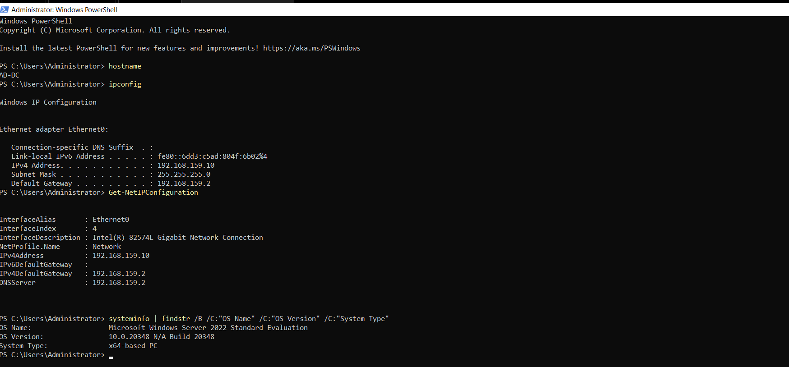

---

## 3.2 Active Directory Domain Services Installation

The Active Directory Domain Services server role was installed on the Windows Server.

AD DS provides the directory services required for centralized identity management, authentication, authorization, computer management, and domain security.

### Evidence

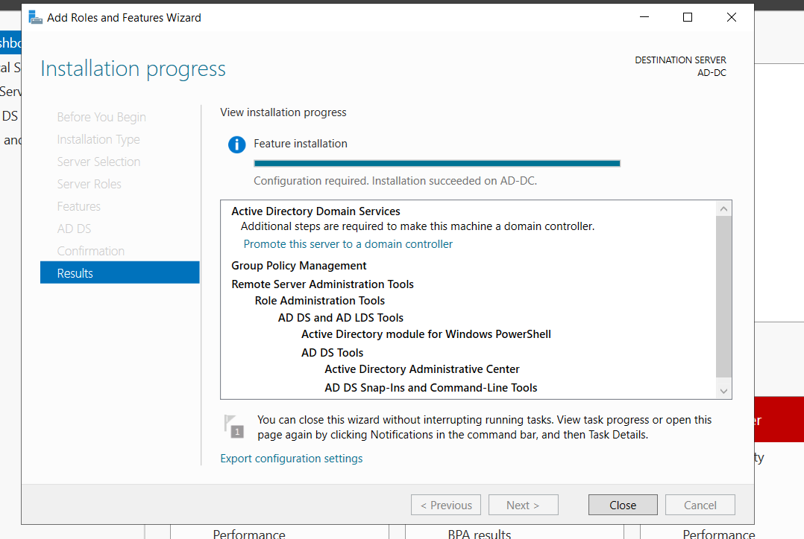

---

## 3.3 AD DS Prerequisite Validation

Before promoting the server to a Domain Controller, the Active Directory Domain Services Configuration Wizard performed its prerequisite validation.

All required prerequisite checks passed successfully.

A DNS delegation warning was displayed because this laboratory environment was creating a new forest and did not have an existing authoritative parent DNS infrastructure.

No DNS delegation was required for this isolated laboratory.

### Evidence

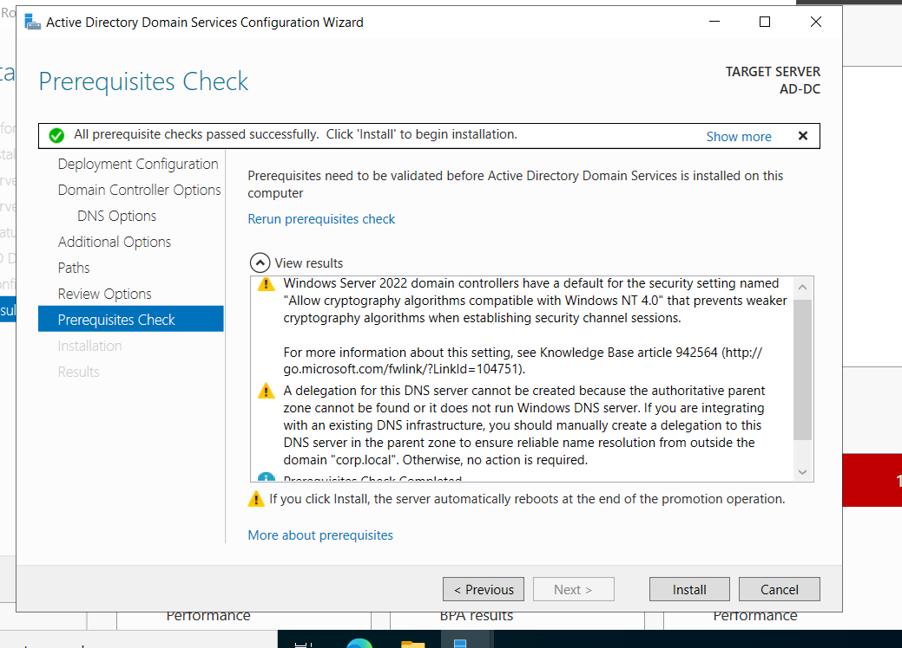

---

## 3.4 Domain Controller Configuration

The server was promoted to the first Domain Controller in a new Active Directory forest.

The following configuration was established:

```text
Domain Name: corp.local
NetBIOS Name: CORP
Forest: corp.local
Domain Controller: AD-DC
DNS Server: Enabled
Global Catalog: Enabled
```

The Domain Controller configuration was subsequently verified using PowerShell.

### Verification Command

```powershell
Get-ADDomainController
```

Important values confirmed:

```text
HostName        : AD-DC.corp.local
Domain          : corp.local
Forest          : corp.local
IPv4Address     : 192.168.159.10
IsGlobalCatalog : True
IsReadOnly      : False
LdapPort        : 389
SslPort         : 636
Name            : AD-DC
```

This confirmed that the server was operating as a writable Domain Controller for the `corp.local` domain.

### Evidence

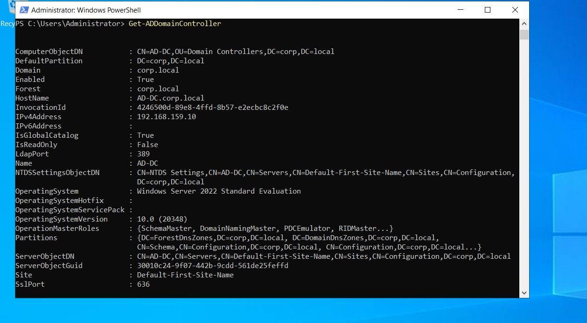

---

# 4. DNS Configuration and Verification

DNS is a critical component of Active Directory because domain services depend heavily on DNS for locating Domain Controllers and other domain resources.

## 4.1 DNS Service Verification

The DNS service was checked using PowerShell.

Command:

```powershell
Get-Service DNS
```

Result:

```text
Status   Name   DisplayName
------   ----   -----------
Running  DNS    DNS Server
```

This confirmed that the DNS Server service was running.

## 4.2 DNS Zone Verification

Command:

```powershell
Get-DnsServerZone
```

Important zones identified:

```text
_msdcs.corp.local
corp.local
0.in-addr.arpa
127.in-addr.arpa
255.in-addr.arpa
```

The presence of the `corp.local` and `_msdcs.corp.local` zones confirmed that Active Directory-integrated DNS was successfully established.

### Evidence

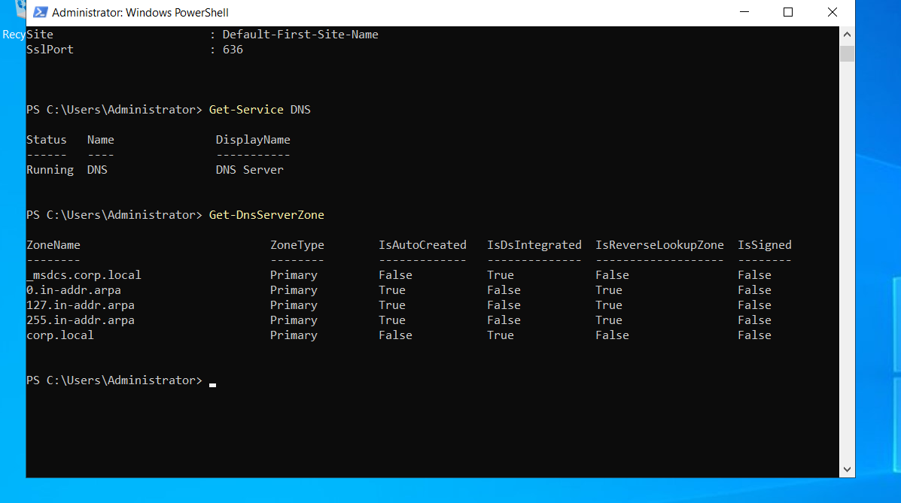

---

# 5. Active Directory Organizational Unit Structure

Instead of placing laboratory objects directly inside the default Active Directory containers, a dedicated OU structure was created.

The following OUs were created:

```text
corp.local
│
├── Lab-Users
├── Lab-Groups
├── Lab-Workstations
└── Lab-Servers
```

This provides logical separation between different categories of laboratory objects.

The structure will also make future Group Policy, privilege management, attack simulation, and detection scenarios easier to organize.

---

## 5.1 Lab-Users OU

The `Lab-Users` OU was created for laboratory user accounts.

### Evidence

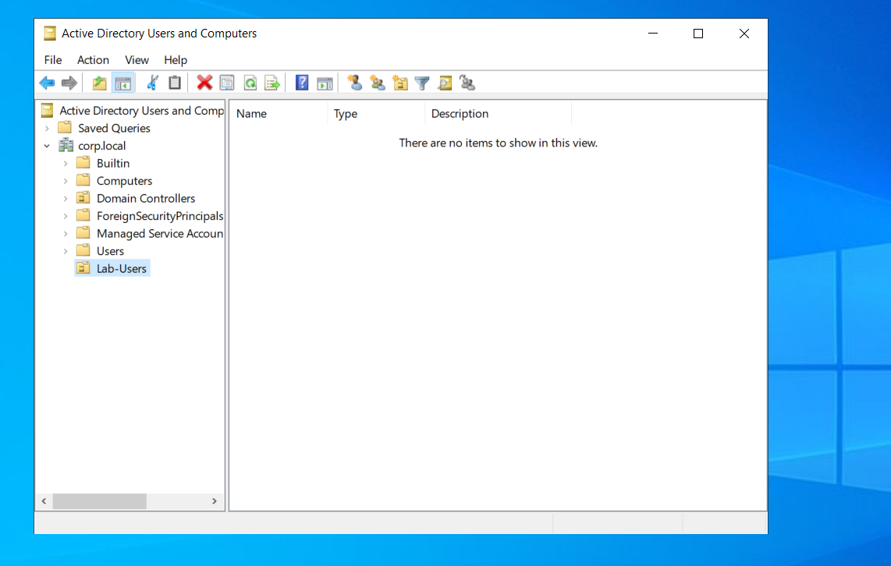

---

## 5.2 Lab-Groups OU

The `Lab-Groups` OU was created to store security groups used by the laboratory.

### Evidence

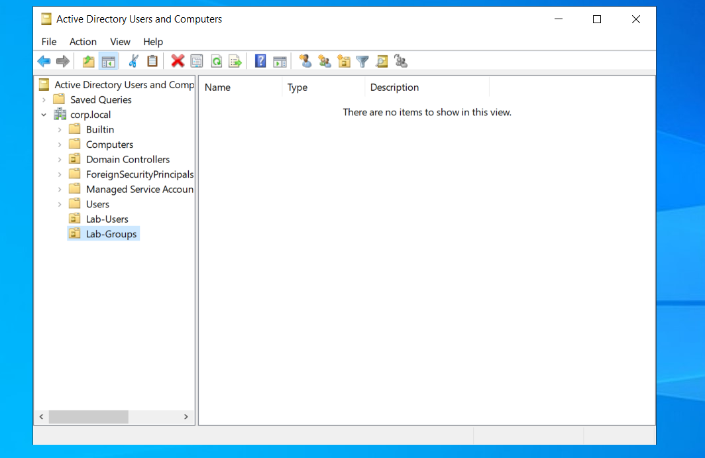

---

## 5.3 Lab-Workstations OU

The `Lab-Workstations` OU was created to contain domain workstation objects.

### Evidence

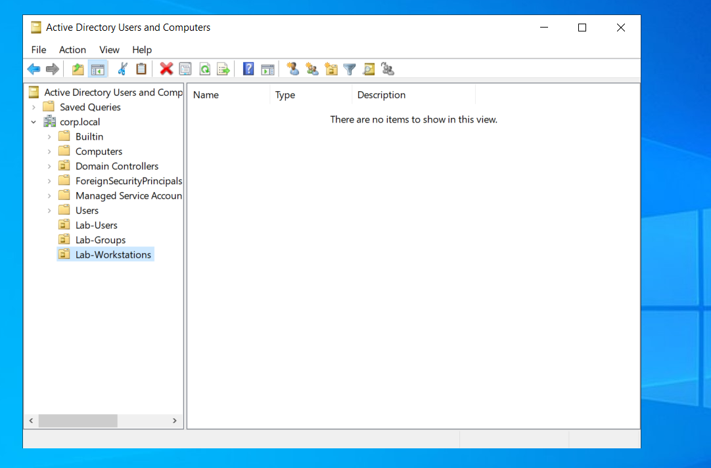

---

## 5.4 Lab-Servers OU

The `Lab-Servers` OU was created to provide a dedicated location for server objects that may be added to the laboratory later.

---

## 5.5 OU Structure Verification

The complete OU structure was verified using PowerShell.

Command:

```powershell
Get-ADOrganizationalUnit -Filter * |
Select-Object Name, DistinguishedName
```

The custom laboratory OUs were confirmed:

```text
Lab-Users
OU=Lab-Users,DC=corp,DC=local

Lab-Groups
OU=Lab-Groups,DC=corp,DC=local

Lab-Workstations
OU=Lab-Workstations,DC=corp,DC=local

Lab-Servers
OU=Lab-Servers,DC=corp,DC=local
```

### Evidence


---

# 6. Domain User Creation

Two standard laboratory domain accounts were created inside the `Lab-Users` OU.

```text
Lab-Users
│
├── Alice User
└── Bob User
```

These accounts will later be used to simulate realistic authentication activity and controlled attack scenarios.

---

# 7. Alice User

The first laboratory user account was created.

```text
Display Name       : Alice User
Username           : alice
User Principal Name: alice@corp.local
OU                 : Lab-Users
Account Status     : Enabled
```

### Evidence

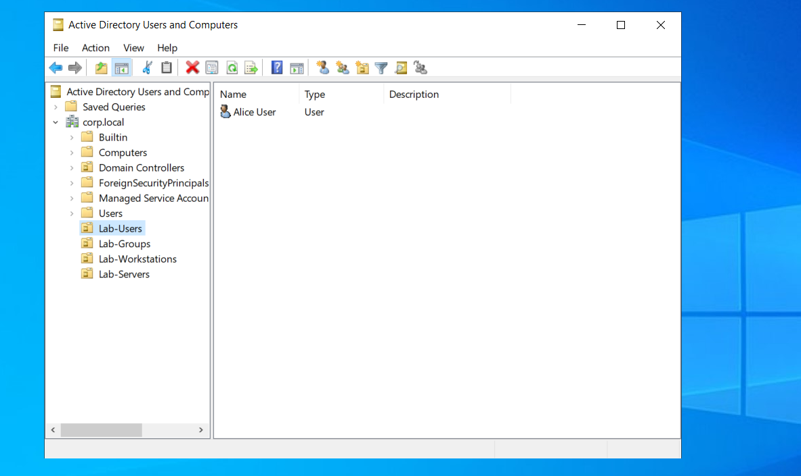

---

## 7.1 Alice PowerShell Verification

The Alice account was independently verified using PowerShell.

Command:

```powershell
Get-ADUser alice -Properties Enabled,UserPrincipalName,DistinguishedName |
Select-Object Name,SamAccountName,UserPrincipalName,Enabled,DistinguishedName
```

Result:

```text
Name               : Alice User
SamAccountName     : alice
UserPrincipalName  : alice@corp.local
Enabled            : True
DistinguishedName  : CN=Alice User,OU=Lab-Users,DC=corp,DC=local
```

This confirmed that Alice was correctly created, enabled, and located inside the intended OU.

### Evidence

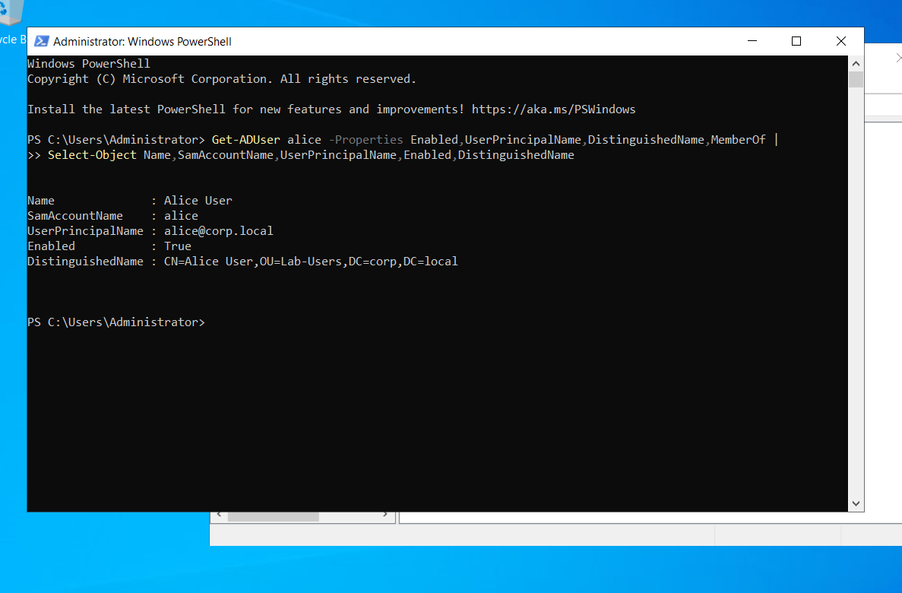

---

# 8. Lab Users Verification

The `Lab-Users` OU was verified after creating the initial user accounts.

The OU contained:

```text
Alice User
Bob User
```

### Evidence

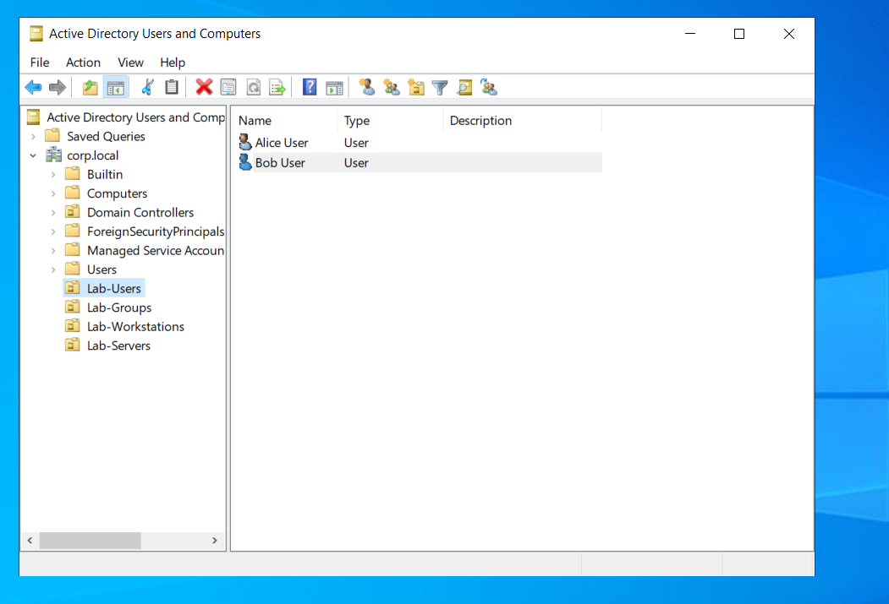

---

# 9. Bob User

The second laboratory user account was created.

```text
Display Name       : Bob User
Username           : bob
User Principal Name: bob@corp.local
OU                 : Lab-Users
Account Status     : Enabled
```

---

## 9.1 Bob PowerShell Verification

The Bob account was verified using PowerShell.

Command:

```powershell
Get-ADUser bob -Properties Enabled,UserPrincipalName,DistinguishedName |
Select-Object Name,SamAccountName,UserPrincipalName,Enabled,DistinguishedName
```

Result:

```text
Name               : Bob User
SamAccountName     : bob
UserPrincipalName  : bob@corp.local
Enabled            : True
DistinguishedName  : CN=Bob User,OU=Lab-Users,DC=corp,DC=local
```

This confirmed that Bob was correctly created and placed inside the `Lab-Users` OU.

### Evidence

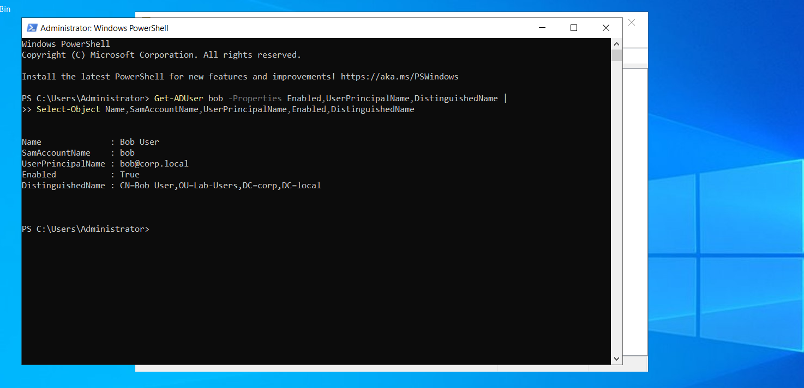

---

# 10. Security Group Creation

Two security groups were created inside the `Lab-Groups` OU.

```text
Lab-Groups
│
├── SOC-Analysts
└── IT-Admins
```

The groups represent different organizational roles and privilege levels within the laboratory.

---

## 10.1 SOC-Analysts

The `SOC-Analysts` security group represents users working in a Security Operations Center role.

The group was created inside:

```text
OU=Lab-Groups,DC=corp,DC=local
```

### Evidence

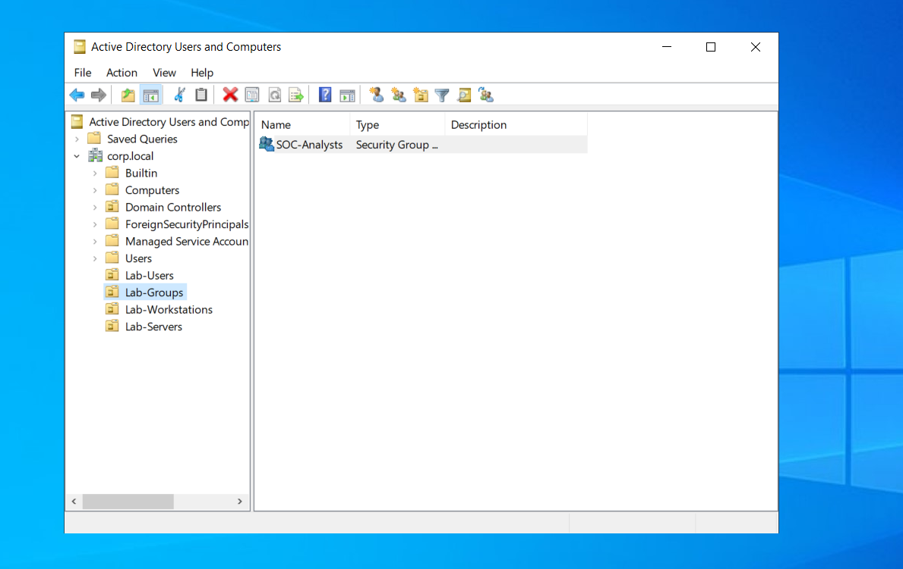

---

## 10.2 Security Groups Verification

The `Lab-Groups` OU was verified to ensure the required security groups were present.

```text
Lab-Groups
│
├── IT-Admins
└── SOC-Analysts
```

### Evidence

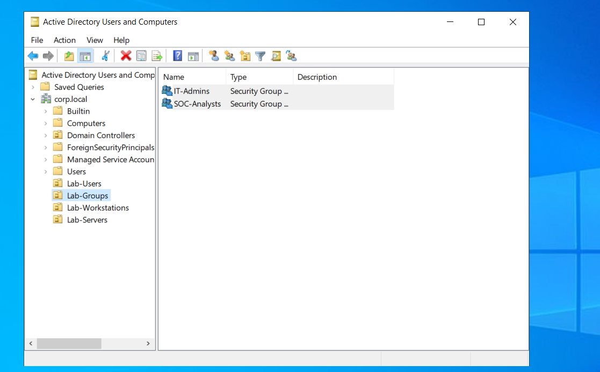

---

# 11. SOC-Analysts Group Membership

Alice and Bob were added to the `SOC-Analysts` security group.

The final membership became:

```text
SOC-Analysts
│
├── Alice User
└── Bob User
```

### Alice Membership

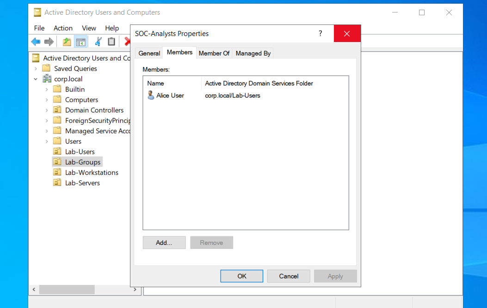

### Final SOC-Analysts Membership

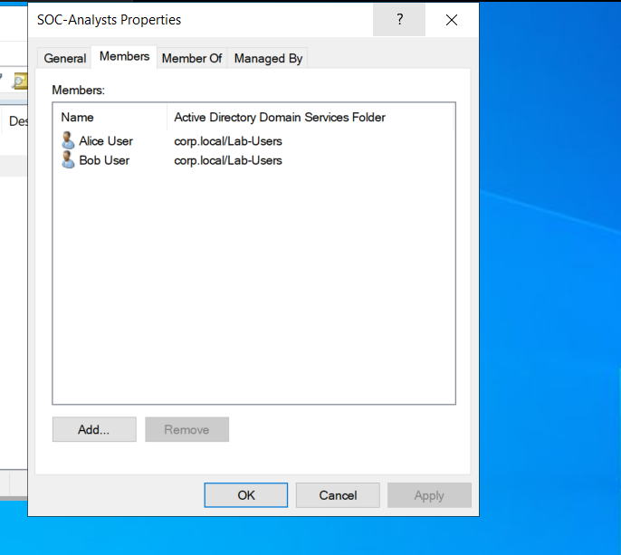

---

## 11.1 SOC-Analysts PowerShell Verification

Group membership was independently verified through PowerShell.

Command:

```powershell
Get-ADGroupMember "SOC-Analysts" |
Select-Object Name,SamAccountName,ObjectClass
```

Result:

```text
Name         SamAccountName   ObjectClass
----         --------------   -----------
Alice User   alice            user
Bob User     bob              user
```

This confirmed that both standard laboratory accounts were members of the intended security group.

### Evidence

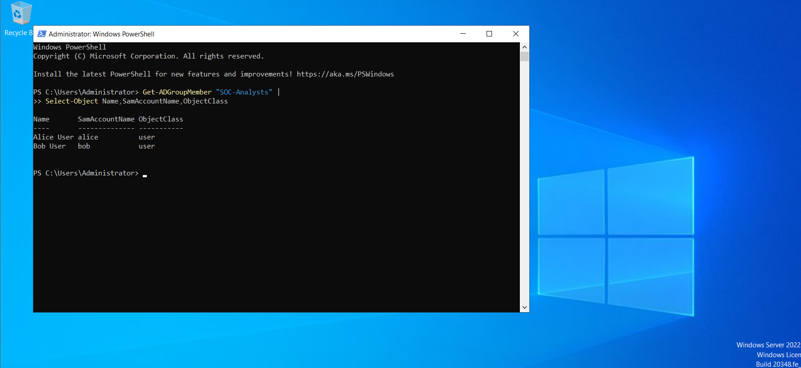

---

# 12. IT-Admins Group

The `IT-Admins` security group was used to represent privileged administrative personnel.

The built-in `Administrator` account was added to the group.

Final membership:

```text
IT-Admins
│
└── Administrator
```

### Evidence

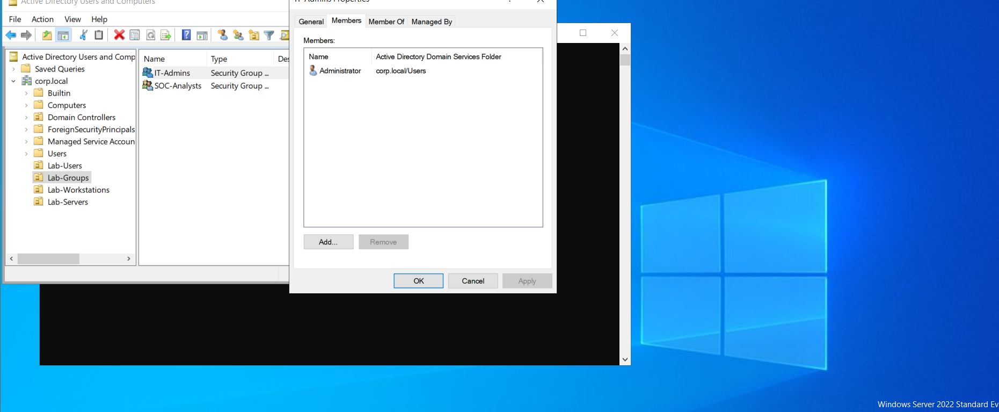

---

## 12.1 IT-Admins PowerShell Verification

The group membership was verified through PowerShell.

Command:

```powershell
Get-ADGroupMember "IT-Admins" |
Select-Object Name,SamAccountName,ObjectClass
```

Result:

```text
Name          SamAccountName   ObjectClass
----          --------------   -----------
Administrator Administrator    user
```

This confirmed that the intended privileged account was present in the `IT-Admins` group.

### Evidence

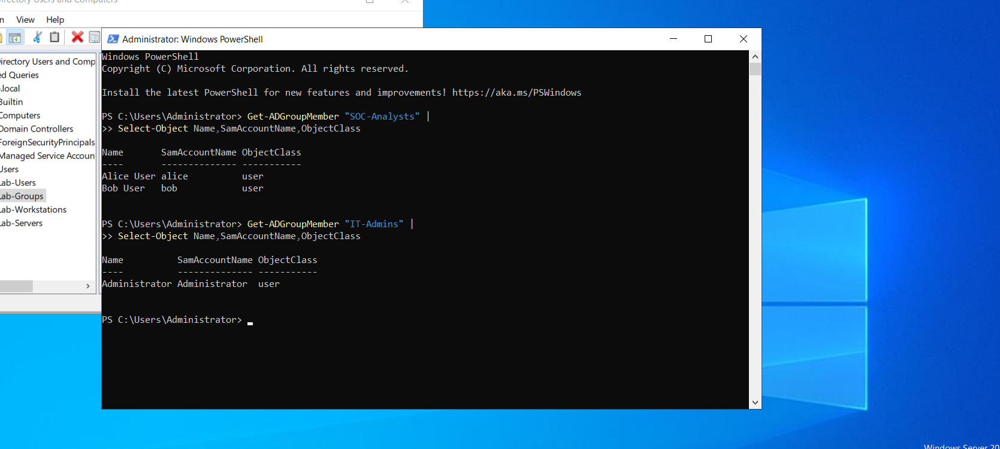

---

# 13. Windows Workstation Object

The laboratory Windows workstation:

```text
WIN10-CLIENT
```

was registered in Active Directory.

The computer object was placed inside:

```text
OU=Lab-Workstations,DC=corp,DC=local
```

This workstation will later serve as the primary endpoint for domain authentication and attack simulation activities.

### Evidence

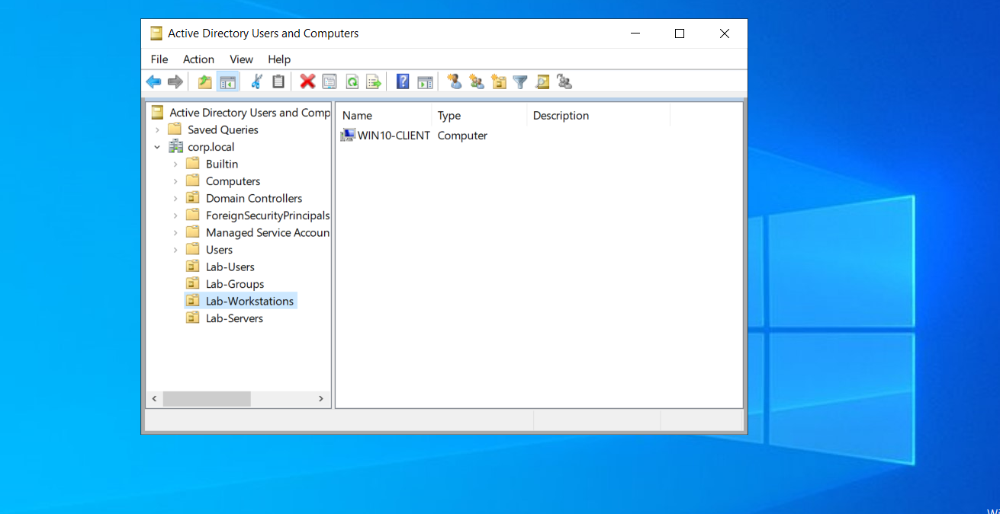

---

## 13.1 Workstation PowerShell Verification

The computer object was verified using PowerShell.

Command:

```powershell
Get-ADComputer "WIN10-CLIENT" -Properties DNSHostName,Enabled,DistinguishedName |
Select-Object Name,DNSHostName,Enabled,DistinguishedName
```

Result:

```text
Name               : WIN10-CLIENT
Enabled            : True
DistinguishedName  : CN=WIN10-CLIENT,OU=Lab-Workstations,DC=corp,DC=local
```

This confirmed that the workstation object was enabled and stored in the correct OU.

### Evidence

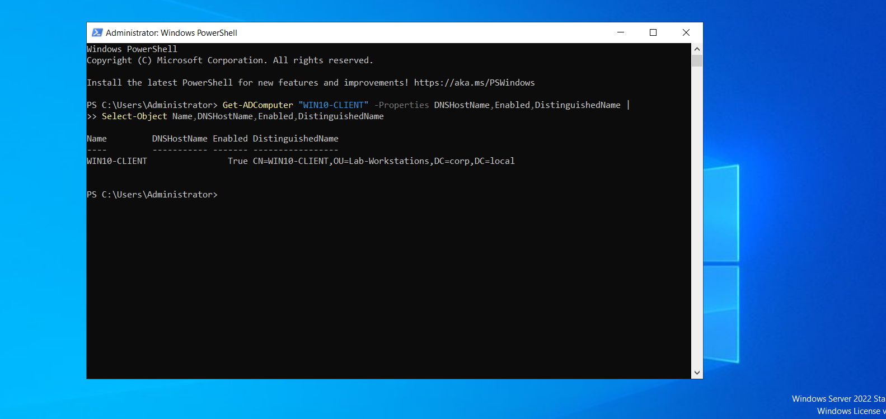

---

# 14. Final Active Directory Baseline Verification

A final verification was performed to confirm the overall Active Directory configuration established during Day 01.

The verification included:

- Organizational Units
- Domain users
- Security groups
- Group membership
- Workstation object
- Active Directory domain structure

### Organizational Units

```powershell
Get-ADOrganizationalUnit -Filter * |
Select-Object Name,DistinguishedName
```

Expected custom OUs:

```text
Lab-Users
Lab-Groups
Lab-Workstations
Lab-Servers
```

### Domain Users

```powershell
Get-ADUser -Filter * |
Where-Object {$_.SamAccountName -in @("alice","bob")} |
Select-Object Name,SamAccountName,Enabled,DistinguishedName
```

Expected users:

```text
Alice User
Bob User
```

### SOC-Analysts Membership

```powershell
Get-ADGroupMember "SOC-Analysts" |
Select-Object Name,SamAccountName,ObjectClass
```

Expected:

```text
Alice User
Bob User
```

### IT-Admins Membership

```powershell
Get-ADGroupMember "IT-Admins" |
Select-Object Name,SamAccountName,ObjectClass
```

Expected:

```text
Administrator
```

### Workstation

```powershell
Get-ADComputer "WIN10-CLIENT" |
Select-Object Name,DistinguishedName
```

Expected:

```text
WIN10-CLIENT
```

### Evidence

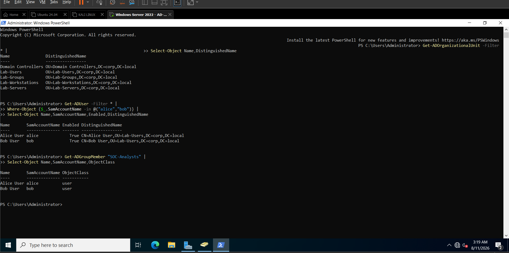

---

# 15. Active Directory Structure After Day 01

The resulting laboratory structure is:

```text
corp.local
│
├── Builtin
├── Computers
├── Domain Controllers
├── ForeignSecurityPrincipals
├── Managed Service Accounts
├── Users
│
├── Lab-Users
│   ├── Alice User
│   └── Bob User
│
├── Lab-Groups
│   ├── SOC-Analysts
│   │   ├── Alice User
│   │   └── Bob User
│   │
│   └── IT-Admins
│       └── Administrator
│
├── Lab-Workstations
│   └── WIN10-CLIENT
│
└── Lab-Servers
```

---

# 16. Configuration Issue Encountered

During the creation of the custom user OU, an attempt was made to create an OU named:

```text
Users
```

directly under `corp.local`.

Active Directory rejected the operation because a default `Users` container already exists in the domain.

The error reported that an object with the same name was already in use.

Rather than modifying the default Active Directory container, the laboratory uses:

```text
Lab-Users
```

for all project-specific user accounts.

This is a cleaner approach because it separates the laboratory environment from the default Active Directory containers.

---

# 17. Security Relevance

The environment created during Day 01 is intentionally structured to support future security testing.

## Standard Accounts

```text
alice@corp.local
bob@corp.local
```

These accounts can later be used for controlled demonstrations involving:

- Authentication
- Failed logons
- Successful logons
- Credential attacks
- Account enumeration
- Password attacks
- Lateral movement
- Privilege escalation

## Privileged Account

```text
CORP\Administrator
```

This account represents a privileged identity that can later be used to demonstrate administrative authentication and controlled privilege-related attack scenarios.

## Security Groups

```text
SOC-Analysts
IT-Admins
```

These groups provide a basic role and privilege structure that can later be used to demonstrate the difference between standard and privileged identities.

## Workstation

```text
WIN10-CLIENT
```

The workstation provides the endpoint component required for future domain authentication and attack simulations.

---

# 18. Why Day 01 Matters

Day 01 was not simply an Active Directory installation exercise.

It established the identity infrastructure required for the entire attack-and-detection workflow.

The project will progressively follow this model:

```text
Active Directory Infrastructure
            ↓
User & Group Identities
            ↓
Windows Endpoint
            ↓
Attack Simulation
            ↓
Windows Security Events
            ↓
Detection
            ↓
Investigation
            ↓
Response
```

Without the domain, identities, groups, and endpoint established during Day 01, the later security scenarios would not represent a realistic enterprise environment.

---

# 19. Evidence Captured

A total of **23 screenshots** were captured during Day 01.

The evidence is stored in:

```text
screenshots/Day01/
```

The screenshots document the major configuration and verification stages:

```text
Day01-01-Server-Baseline.png
Day01-02-ADDS-Role-Installed.png
Day01-03-ADDC-Prerequisites-Passed.png
Day01-04-AD-DC-Verification.png
Day01-05-DNS-Verification.png
Day01-06-Lab-Users-OU.png
Day01-07-Lab-Groups-OU.png
Day01-08-Lab-Workstations-OU.png
Day01-09-AD-Organizational-Structure.png
Day01-10-Alice-AD-User.png
Day01-11-Alice-PowerShell-Verification.png
Day01-12-AD-Lab-Users-Created.png
Day01-13-AD-Bob-User-PowerShell-Verification.png
Day01-14-AD-SOC-Analysts-Group-Created.png
Day01-15-AD-Security-Groups-Created.png
Day01-16-AD-SOC-Analysts-Alice-Membership.png
Day01-17-AD-SOC-Analysts-Members.png
Day01-18-AD-SOC-Analysts-PowerShell-Verification.png
Day01-19-AD-IT-Admins-Membership.png
Day01-20-AD-IT-Admins-PowerShell-Verification.png
Day01-21-AD-Workstation-Object.png
Day01-22-AD-Workstation-PowerShell-Verification.png
Day01-23-AD-Final-Baseline-Verification.png
```

---

# 20. Day 01 Completion Checklist

- [x] Windows Server 2022 baseline verified
- [x] Server hostname verified as `AD-DC`
- [x] Active Directory Domain Services installed
- [x] AD DS prerequisite checks completed
- [x] Domain Controller promotion completed
- [x] `corp.local` domain created
- [x] `CORP` NetBIOS domain established
- [x] DNS service verified
- [x] Active Directory DNS zones verified
- [x] `Lab-Users` OU created
- [x] `Lab-Groups` OU created
- [x] `Lab-Workstations` OU created
- [x] `Lab-Servers` OU created
- [x] Alice User created
- [x] Alice User verified with PowerShell
- [x] Bob User created
- [x] Bob User verified with PowerShell
- [x] `SOC-Analysts` security group created
- [x] `IT-Admins` security group created
- [x] Alice added to `SOC-Analysts`
- [x] Bob added to `SOC-Analysts`
- [x] Administrator added to `IT-Admins`
- [x] Security group memberships verified with PowerShell
- [x] `WIN10-CLIENT` workstation object verified
- [x] Final Active Directory baseline verified
- [x] 23 screenshots captured and organized
- [x] Day 01 documentation completed

---

# 21. Day 01 Final Status

**STATUS: COMPLETED**

The Active Directory foundation is fully operational and verified.

The laboratory now contains:

```text
Domain Controller
      │
      ├── corp.local
      │
      ├── Lab-Users
      │     ├── Alice
      │     └── Bob
      │
      ├── Lab-Groups
      │     ├── SOC-Analysts
      │     └── IT-Admins
      │
      ├── Lab-Workstations
      │     └── WIN10-CLIENT
      │
      └── Lab-Servers
```

All major configuration components were independently validated through Active Directory Users and Computers and PowerShell.

Day 01 therefore establishes the **baseline Active Directory enterprise environment** required for the attack and detection phases of Project 03.

---

# 22. Next Phase

With the Active Directory foundation completed, the next phase will build upon this environment rather than recreate it.

The next stage will focus on preparing the Windows domain environment for:

- Security event generation
- Authentication monitoring
- Attack simulation
- Windows event analysis
- Detection engineering
- SOC investigation workflows

The project will now transition from **environment construction** toward **security operations and attack detection**.