# Day 02 — Windows 10 Domain Client & Security Auditing

## 1. Objective

Day 02 focused on preparing the Windows 10 workstation as a domain-joined endpoint and enabling Windows security telemetry required for Active Directory attack detection and SOC investigation.

### Objectives Completed

- Configured Windows 10 client
- Verified hostname and network configuration
- Configured Active Directory DNS
- Verified Active Directory DNS resolution
- Joined Windows 10 to the `corp.local` domain
- Logged in using the domain account `CORP\alice`
- Enabled Windows Security auditing
- Generated and investigated Windows security events
- Investigated Event ID `4624` — Successful Logon
- Investigated Event ID `4625` — Failed Logon
- Investigated Event ID `4688` — Process Creation
- Investigated Notepad process creation
- Investigated PowerShell process creation
- Investigated Windows Logon IDs
- Correlated authentication and process events

---

## 2. Lab Environment

| Component | Configuration |
|---|---|
| Domain | `corp.local` |
| Domain Controller | `AD-DC` |
| Windows Client | `WIN10-CLIENT` |
| Domain User | `CORP\alice` |
| IPv4 Address | `192.168.159.133` |
| Subnet Mask | `255.255.255.0` |
| Default Gateway | `192.168.159.2` |

---

## 3. Windows 10 Client Configuration

The Windows 10 VM was configured as the endpoint workstation for the Active Directory lab.

The hostname was verified using:

```cmd
hostname
```

Output:

```text
WIN10-CLIENT
```

The network configuration was verified using:

```cmd
ipconfig
```

Observed configuration:

```text
IPv4 Address    : 192.168.159.133
Subnet Mask     : 255.255.255.0
Default Gateway : 192.168.159.2
```

The workstation was successfully connected to the lab network.

### Evidence

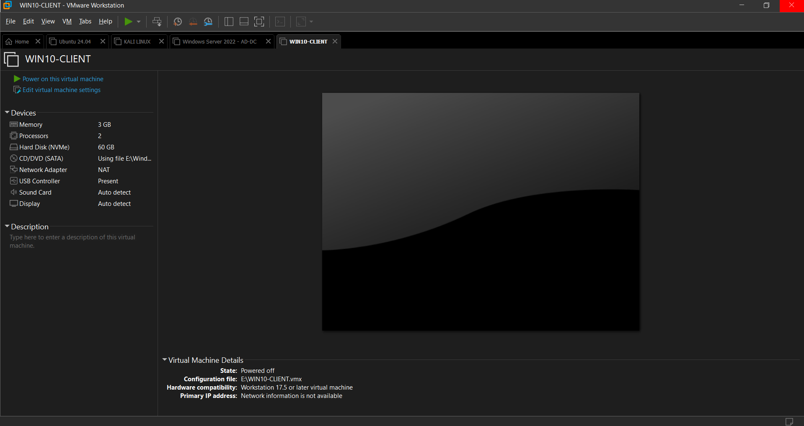

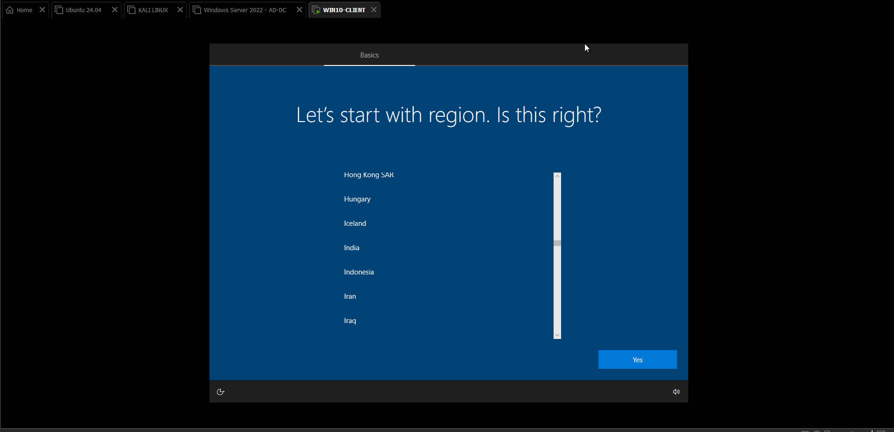

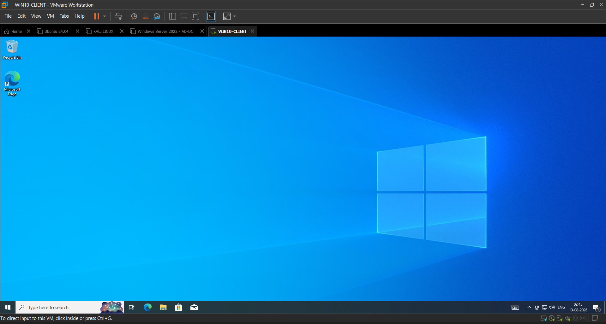

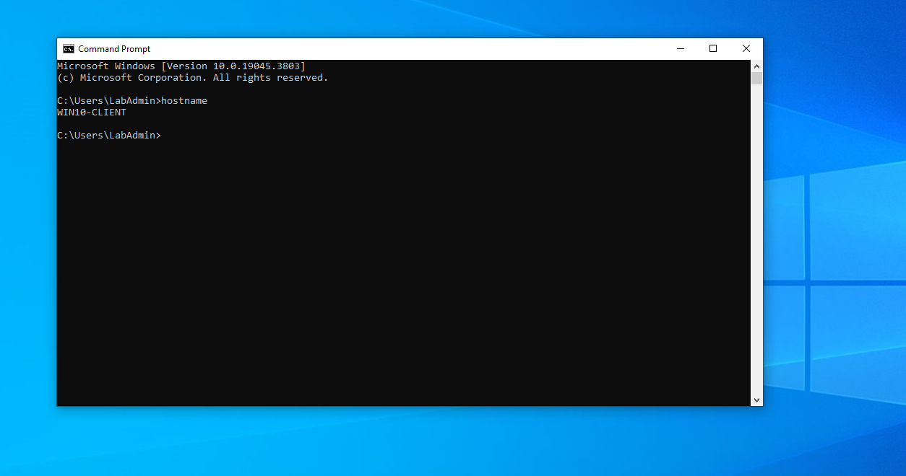

---

## 4. Active Directory DNS Configuration

Active Directory depends heavily on DNS.

The Windows 10 client was configured to use the Active Directory DNS service so that it could locate and communicate with the Domain Controller and resolve the `corp.local` domain.

DNS configuration and resolution were verified before proceeding with domain authentication.

### Why DNS Matters

Correct DNS configuration allows the Windows client to:

- Locate the Domain Controller
- Resolve the `corp.local` domain
- Discover Active Directory services
- Authenticate domain users
- Communicate with domain resources

### Evidence

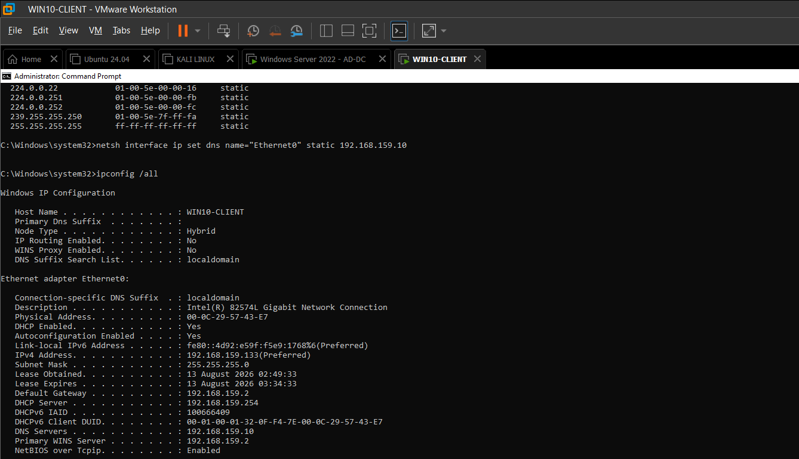

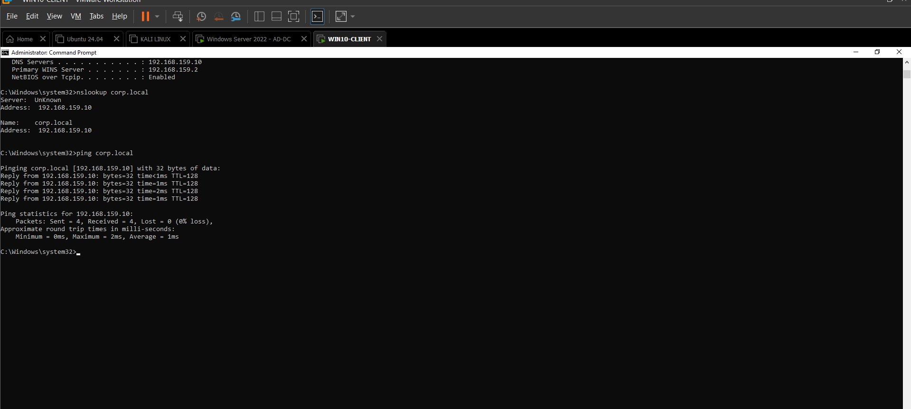

---

## 5. Windows 10 Domain Membership

The Windows 10 workstation was successfully integrated into the Active Directory domain:

```text
corp.local
```

The workstation hostname was:

```text
WIN10-CLIENT
```

Domain membership allows the Windows workstation to authenticate users against the Active Directory environment.

### Evidence

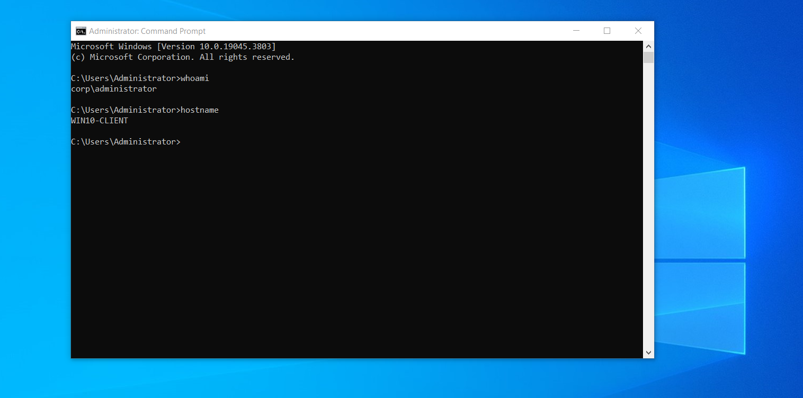

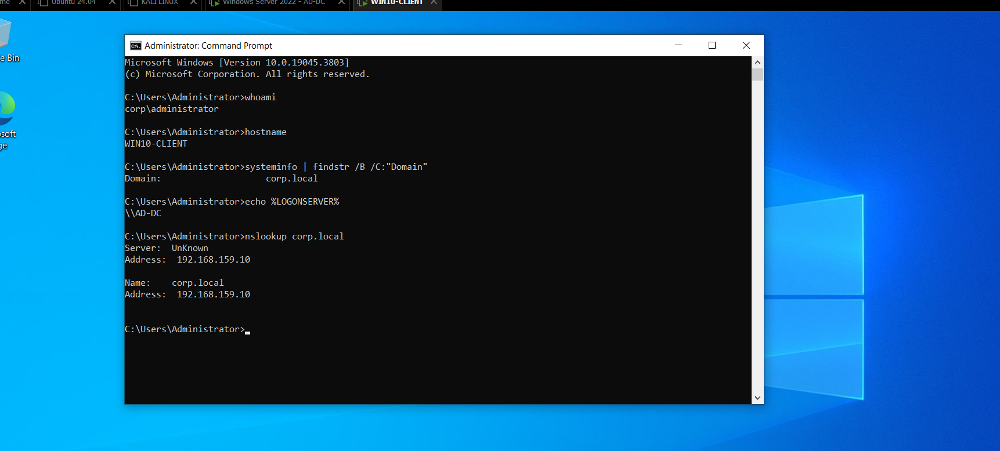

---

## 6. Domain User Authentication

The domain account used for the Windows 10 workstation was:

```text
CORP\alice
```

The authenticated identity was verified using:

```cmd
whoami
```

Output:

```text
corp\alice
```

This confirmed that the workstation session was operating under the Active Directory domain account `CORP\alice`.

### SOC Relevance

During endpoint investigation, identifying the account responsible for an action is critical.

A SOC analyst needs to distinguish between local and domain identities.

For example:

```text
LOCAL\user
```

and:

```text
CORP\user
```

represent different authentication contexts.

### Evidence

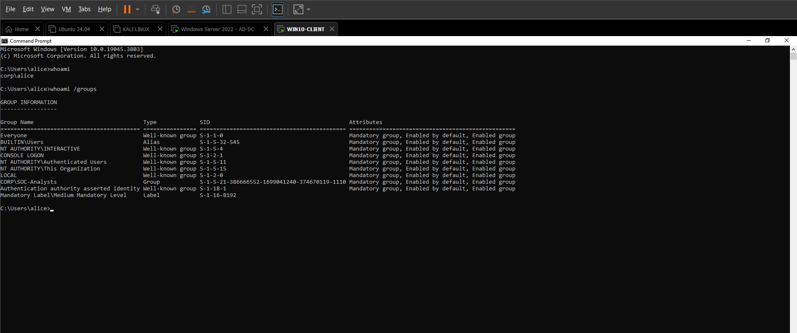

---

## 7. Windows Security Auditing

Windows Security auditing was enabled to generate security telemetry for investigation.

Relevant audit areas included:

- Logon
- Logoff
- Account Lockout
- Process Creation
- Policy Change
- Security Group Management
- User Account Management

The purpose of enabling auditing is to provide visibility into security-relevant activity occurring on the Windows endpoint.

### Basic SOC Telemetry Flow

```text
User Activity
      |
      v
Windows Security Auditing
      |
      v
Windows Security Event Log
      |
      v
SOC Investigation
```

### Evidence

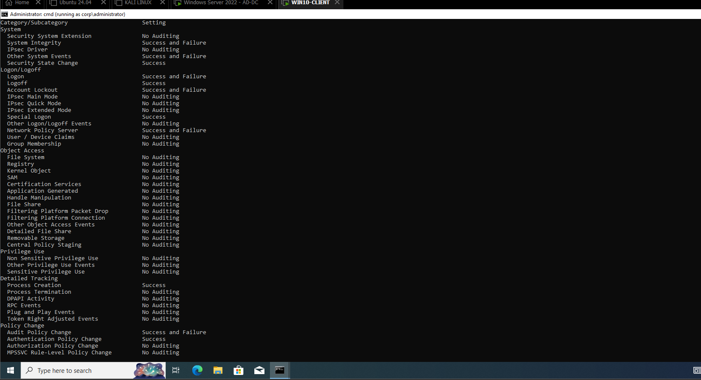

---

## 8. Event ID 4688 — Process Creation

Windows Security Event ID `4688` represents:

```text
A new process has been created.
```

This event is highly useful for endpoint investigation.

Important fields can include:

- Subject User
- Subject Domain
- New Process Name
- Process ID
- Command Line
- Parent Process
- Logon ID

### SOC Importance

Process creation telemetry allows analysts to determine what programs were executed on a Windows endpoint.

The investigation model is:

```text
User
  |
  v
Process
  |
  v
Command Line
  |
  v
Parent Process
  |
  v
Logon Session
```

### Evidence

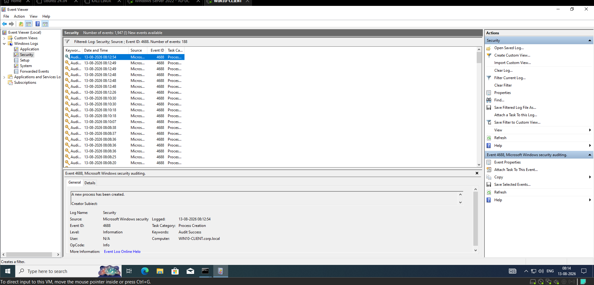

---

## 9. Event ID 4625 — Failed Logon

Windows Security Event ID `4625` represents:

```text
An account failed to log on.
```

A failed authentication event was generated and investigated on the Windows 10 client.

### SOC Importance

Event ID `4625` can help investigate:

- Password guessing
- Brute-force activity
- Password spraying
- Credential misuse
- Account compromise
- User authentication mistakes

A single failed logon does not automatically mean an attack occurred.

A SOC analyst should investigate:

```text
Account
+
Timestamp
+
Source
+
Frequency
+
Number of failures
+
Related events
```

### Evidence

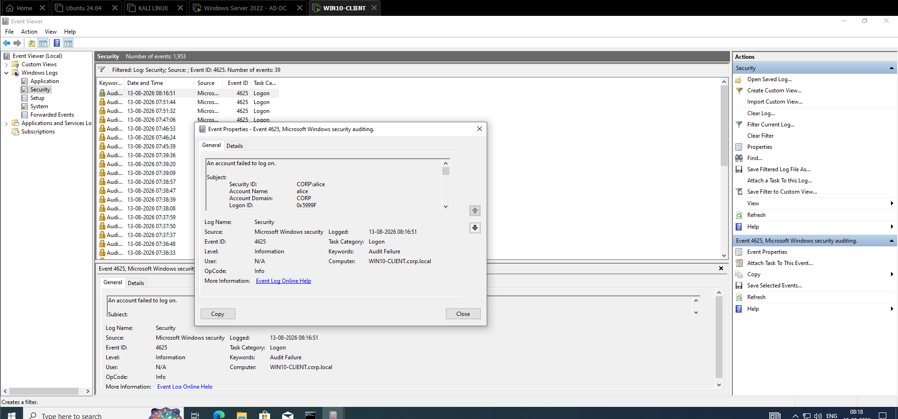

---

## 10. Event ID 4688 — Notepad Process Creation

Notepad was executed to demonstrate Windows process creation auditing.

The Event ID `4688` record contained process information associated with the execution.

Important fields included:

```text
SubjectUserName   : alice
SubjectDomainName : CORP
NewProcessName    : C:\Windows\System32\notepad.exe
CommandLine       : notepad.exe
```

The event also contained a `SubjectLogonId`.

This value can be used to associate the process with a specific Windows logon session.

### Evidence

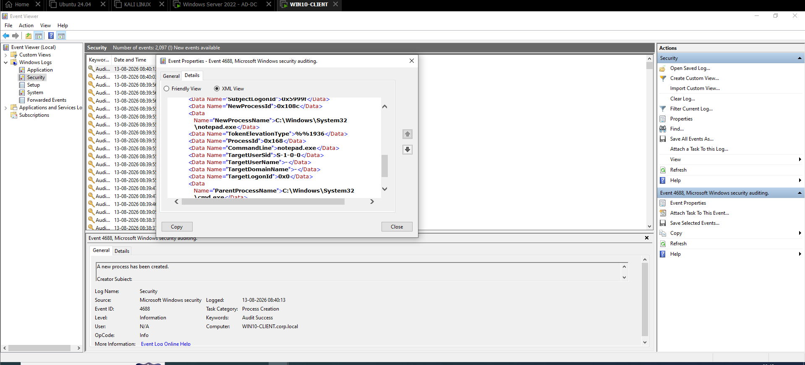

---

## 11. Event ID 4688 — PowerShell Process Creation

PowerShell execution was also captured through Event ID `4688`.

The process creation event contained information including:

```text
NewProcessName
ProcessId
CommandLine
ParentProcessName
SubjectLogonId
```

The PowerShell command used during the lab was:

```text
powershell.exe -NoProfile -Command "Get-Date"
```

This demonstrated that Windows process creation auditing can provide visibility into PowerShell execution and command-line activity.

### Why PowerShell Telemetry Matters

PowerShell is widely used for legitimate Windows administration.

However, attackers also commonly abuse PowerShell during post-exploitation.

Therefore, PowerShell process and command-line telemetry is valuable for SOC investigation.

### Evidence

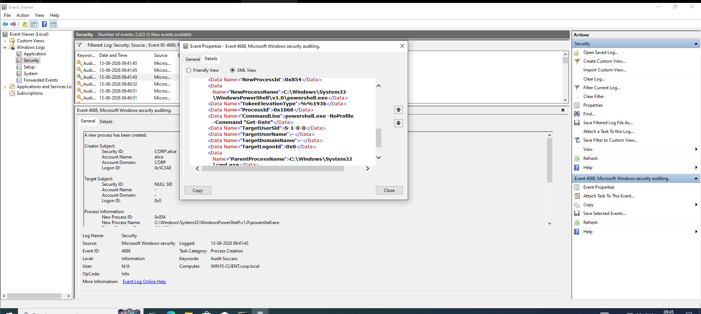

---

## 12. Event ID 4624 — Successful Logon

Windows Security Event ID `4624` represents:

```text
An account was successfully logged on.
```

A successful authentication event associated with the domain environment was investigated.

Important fields included:

```text
TargetUserName
TargetDomainName
TargetLogonId
LogonType
LogonProcessName
AuthenticationPackageName
```

The most important field for the correlation performed during this lab was:

```text
TargetLogonId
```

### Evidence

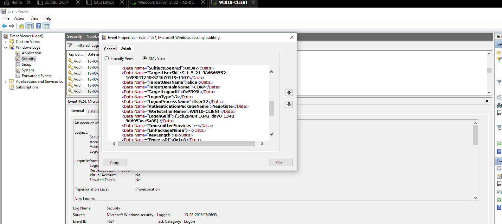

---

## 13. Understanding Windows Logon Sessions

A Windows logon session represents the security context created when an account authenticates to Windows.

A single username can have multiple logon sessions.

Therefore:

```text
Same username != Same session
```

For example:

```text
CORP\alice
    |
    +---- Session A
    |       Logon ID: 0x5999f
    |
    +---- Session B
            Logon ID: Different Value
```

This is an important SOC investigation concept.

When multiple events involve the same username, the analyst should not automatically assume that all events belong to the same authentication session.

The analyst should examine:

- Username
- Domain
- Logon ID
- Timestamp
- Computer
- Process
- Authentication type
- Source information

---

## 14. Why Username Alone Is Not Enough

Consider two events involving:

```text
CORP\alice
```

Event A:

```text
User     : CORP\alice
Logon ID : 0x5999f
```

Event B:

```text
User     : CORP\alice
Logon ID : Different Value
```

Both events involve the same user but may belong to different Windows logon sessions.

Therefore:

```text
Username != Unique Session
```

The SOC analyst should correlate:

```text
Username
+
Domain
+
Logon ID
+
Timestamp
+
Process
```

This produces a more accurate activity timeline.

---

## 15. Logon ID Correlation

One of the key investigations performed during Day 02 was correlating authentication activity with process creation.

The successful logon event contained:

```text
TargetLogonId : 0x5999f
```

The Event ID `4688` Notepad process creation event contained:

```text
SubjectLogonId : 0x5999f
```

This provides a correlation between the authentication event and the process creation event.

### Correlation

```text
Event ID 4624
Successful Logon
      |
      | CORP\alice
      |
      | Logon ID = 0x5999f
      |
      v
Windows Logon Session
      |
      | Same Logon ID
      |
      v
Event ID 4688
Process Creation
      |
      | CORP\alice
      |
      | notepad.exe
      |
      | Logon ID = 0x5999f
```

This demonstrates how a SOC analyst can connect process activity to the authentication session that created it.

---

## 16. Authentication-to-Process Investigation

The Day 02 investigation established the following workflow:

```text
Authentication Event
        |
        v
Identify Account
        |
        v
Identify Logon ID
        |
        v
Find Related Process Creation
        |
        v
Match Logon ID
        |
        v
Identify Process
        |
        v
Investigate Command Line
        |
        v
Investigate Parent Process
```

This is a foundational Windows endpoint investigation workflow.

---

## 17. Authentication Investigation Workflow

```text
Authentication Activity
        |
        v
Identify Event
        |
        +---- 4624 = Successful Logon
        |
        +---- 4625 = Failed Logon
        |
        v
Identify Account
        |
        v
Identify Logon ID
        |
        v
Check Timestamp
        |
        v
Correlate With Other Events
```

---

## 18. Process Investigation Workflow

```text
Process Activity
        |
        v
Event ID 4688
        |
        v
Identify User
        |
        v
Identify Process
        |
        v
Identify Command Line
        |
        v
Identify Parent Process
        |
        v
Identify Logon ID
        |
        v
Correlate With Authentication
```

---

## 19. Day 02 Investigation Timeline

```text
Windows 10 Client
        |
        v
Network Configuration
        |
        v
AD DNS Configuration
        |
        v
Domain Membership
        |
        v
CORP\alice Authentication
        |
        v
Windows Security Auditing
        |
        +---------------------------+
        |                           |
        v                           v
Event ID 4625                 Event ID 4624
Failed Logon                 Successful Logon
                                    |
                                    v
                                Logon ID
                                    |
                                    v
                                Event ID 4688
                              Process Creation
                                    |
                                    v
                               notepad.exe
                                    |
                                    v
                            Logon ID Correlation
```

---

## 20. Key SOC Concepts Learned

### Authentication

Authentication answers:

```text
Who are you?
```

The domain identity used in this lab was:

```text
CORP\alice
```

### Authorization

Authorization answers:

```text
What are you allowed to do?
```

After authentication, Windows determines the permissions and resources available to the account.

### Auditing

Auditing answers:

```text
What happened?
```

Windows records security-relevant activity in event logs when the required audit policies are enabled.

### Event ID 4624

```text
Successful Logon
```

Used to investigate successful authentication.

### Event ID 4625

```text
Failed Logon
```

Used to investigate failed authentication.

### Event ID 4688

```text
Process Creation
```

Used to investigate newly created processes.

### Logon ID

A Logon ID identifies a Windows logon session and can be used as a correlation key between related security events.

---

## 21. SOC Investigation Example

Suppose a SOC alert reports:

```text
Suspicious PowerShell execution detected.
```

The analyst should investigate:

```text
Who executed it?
        |
        v
Which machine?
        |
        v
When did it execute?
        |
        v
Which logon session?
        |
        v
What command was executed?
        |
        v
What was the parent process?
        |
        v
What happened before it?
        |
        v
What happened after it?
```

The Day 02 telemetry provides the foundation for answering these questions.

The investigation chain is:

```text
User
  |
  v
Authentication
  |
  v
Logon Session
  |
  v
Process
  |
  v
Command Line
  |
  v
Event Correlation
  |
  v
Investigation
```

---

## 22. Evidence Collected

All Day 02 evidence was stored inside:

```text
screenshots/Day02/
```

The following evidence files were captured:

```text
Day02-01-WIN10-CLIENT-VM-Configuration.png
Day02-02-Windows10-Region.png
Day02-03-Windows10-Client-Desktop.png
Day02-04-Windows10-Hostname-Configured.png
Day02-05-Windows10-AD-DNS-Configured.png
Day02-06-Windows10-AD-DNS-Verification.png
Day02-07-Windows10-Domain-Login.png
Day02-08-Windows10-Domain-Network-Verification.png
Day02-09-Windows10-Normal-User-Login.png
Day02-10-Windows10-Audit-Policy-Enabled.png
Day02-11-Windows10-Event4688-Process-Creation.png
Day02-12-Windows10-Event4625-Failed-Logon.png
Day02-13-Windows10-Event4688-Notepad-ProcessCreation-XML.png
Day02-14-Windows10-Event4688-PowerShell-ProcessCreation-XML.png
Day02-15-Windows10-Event4624-Alice-LogonID-5999f.png
```

---

## 23. Key Findings

1. The Windows 10 client was successfully configured as the endpoint workstation.
2. The hostname was verified as `WIN10-CLIENT`.
3. The client network configuration was verified.
4. Active Directory DNS configuration was verified.
5. The Windows 10 workstation was joined to `corp.local`.
6. The domain account `CORP\alice` successfully authenticated.
7. Windows Security auditing was enabled.
8. Event ID `4624` was observed and investigated.
9. Event ID `4625` was observed and investigated.
10. Event ID `4688` was observed and investigated.
11. Notepad process creation was investigated.
12. PowerShell process creation was investigated.
13. PowerShell command-line telemetry was observed.
14. Windows Logon IDs were examined as session identifiers.
15. Authentication and process creation were correlated using Logon ID.
16. The investigation demonstrated why username-only correlation is insufficient.

---

## 24. Day 02 Completion Checklist

- [x] Windows 10 client configuration
- [x] Hostname verification
- [x] Network verification
- [x] Active Directory DNS configuration
- [x] DNS verification
- [x] Domain membership
- [x] Domain user authentication
- [x] Windows Security auditing
- [x] Event ID 4624 investigation
- [x] Event ID 4625 investigation
- [x] Event ID 4688 investigation
- [x] Notepad process investigation
- [x] PowerShell process investigation
- [x] Logon ID investigation
- [x] Windows logon-session concept
- [x] Authentication-to-process correlation
- [x] Evidence screenshots captured
- [x] Evidence naming standardized
- [x] Documentation completed

---

## 25. Final Conclusion

Day 02 established the Windows 10 workstation as a functional domain-joined endpoint and configured the security telemetry required for future Active Directory attack detection.

The day progressed from endpoint configuration to domain authentication, security auditing, Windows event analysis, and event correlation.

The most important SOC concept learned was that security events should not be investigated in isolation.

A SOC analyst should connect related events:

```text
4624 — Successful Authentication
              |
              | Logon ID
              v
       Windows Logon Session
              |
              | Logon ID
              v
4688 — Process Creation
              |
              v
       Process Activity
```

This creates the foundation for the attack simulation and detection activities planned for the next stages of the Active Directory Attack & Detection Lab.

# Day 02 Status: COMPLETE