# Day 03 — Sysmon Deployment, Process Monitoring & Authentication Correlation

**Project:** Project 03 — Active Directory Attack & Detection Lab
**Day:** Day 03
**Endpoint:** `WIN10-CLIENT`
**Domain:** `corp.local`
**Domain Controller:** `AD-DC.corp.local`
**Primary Focus:** Sysmon deployment, process telemetry, process-tree analysis, Windows Security Event `4624` correlation, and endpoint process baseline
**Status:** Completed

---

## Objective

The objective of Day 03 was to deploy and validate **Sysmon (System Monitor)** on the Windows 10 endpoint and use its telemetry to improve endpoint visibility beyond the native Windows Security auditing established during Day 02.

The work focused on:

* Deploying Sysmon on `WIN10-CLIENT`
* Verifying the Sysmon installation and service
* Confirming initial Sysmon telemetry
* Understanding Sysmon Event ID `1` — Process Creation
* Investigating Notepad process activity
* Correlating Sysmon process events with Windows Security Event ID `4624`
* Using the Windows Logon ID as a correlation key
* Performing process-tree analysis
* Establishing a known-good process creation baseline

The purpose was not simply to install Sysmon, but to understand how endpoint telemetry can be used to reconstruct user and process activity during a SOC investigation.

---

# Lab Environment

| Component                | Configuration                    |
| ------------------------ | -------------------------------- |
| Domain                   | `corp.local`                     |
| Domain Controller        | `AD-DC.corp.local`               |
| Windows Endpoint         | `WIN10-CLIENT`                   |
| Primary Domain User      | `CORP\alice`                     |
| Telemetry Source         | Sysmon                           |
| Authentication Telemetry | Windows Security Event ID `4624` |
| Process Telemetry        | Sysmon Event ID `1`              |

---

# 1. Sysmon Package Extraction

Sysmon was prepared on the Windows 10 endpoint before installation.

The Sysmon package was extracted locally so that the Sysmon executable and supporting files could be accessed from the Windows client.

This step established the local deployment source for the endpoint telemetry component.

### Why This Matters

In a real enterprise environment, endpoint monitoring software must first be deployed to the systems that require telemetry.

For this lab, `WIN10-CLIENT` acts as the monitored endpoint.

The deployment chain is:

```text
Sysmon Package
      ↓
Windows 10 Endpoint
      ↓
Sysmon Installation
      ↓
Sysmon Service
      ↓
Sysmon Event Log
      ↓
SOC Investigation
```

### Evidence

* `Day03-01-Windows10-Sysmon-Files-Extracted.png`

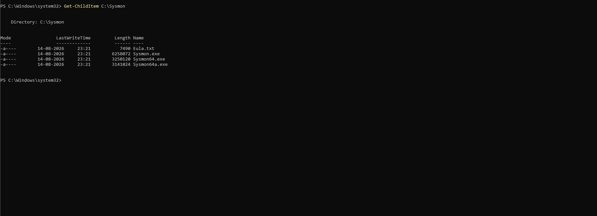

---

# 2. Sysmon Installation

Sysmon was installed on `WIN10-CLIENT`.

The installation configured Sysmon as a Windows service so that endpoint activity could be continuously monitored and recorded.

### Why Sysmon?

Windows already provides native security auditing, including Event ID `4688` for process creation.

However, Sysmon provides additional endpoint telemetry that is highly useful during security investigations.

A simplified comparison is:

```text
Windows Security Auditing
        ↓
Security Event Logs
        ↓
Authentication / Process Events

Sysmon
        ↓
Detailed Endpoint Telemetry
        ↓
Process / Network / File / System Activity
```

This makes Sysmon particularly useful for endpoint detection and response investigations.

### Evidence

* `Day03-02-Windows10-Sysmon-Installation.png`

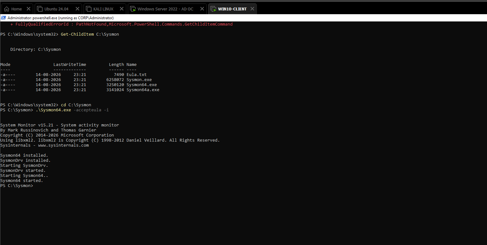

---

# 3. Sysmon Service Verification

After installation, the Sysmon service was verified on the Windows endpoint.

The purpose of this verification was to confirm that the monitoring component was actually running rather than assuming that installation alone meant successful deployment.

### Verification Concept

A SOC analyst should distinguish between:

```text
Software Installed
        ≠
Telemetry Operational
```

The service must be running before useful Sysmon telemetry can be collected.

### Evidence

* `Day03-03-Windows10-Sysmon-Service-Log-Verification.png`

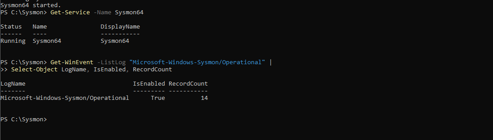

---

# 4. Initial Sysmon Telemetry

Once Sysmon was operational, the Windows endpoint began generating Sysmon telemetry.

The initial telemetry was examined to verify that Sysmon was successfully observing endpoint activity.

This provided the first confirmation that the endpoint had moved from:

```text
Windows Client
      ↓
Windows Security Auditing
```

to:

```text
Windows Client
      ↓
Windows Security Auditing
      +
Sysmon Endpoint Telemetry
```

### SOC Relevance

Endpoint telemetry provides visibility into what is actually happening on a workstation.

Instead of only asking:

> Did a user authenticate?

an analyst can begin asking:

> What did that user execute after authentication?

### Evidence

* `Day03-04-Windows10-Sysmon-Initial-Telemetry.png`

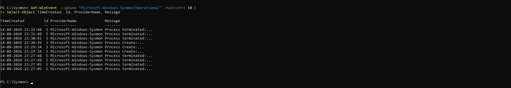

---

# 5. Sysmon Event ID 1 — Process Creation

The primary Sysmon event investigated during Day 03 was:

```text
Sysmon Event ID 1
Process Create
```

This event is generated when a new process is created on the endpoint.

Process creation telemetry is one of the most valuable forms of endpoint visibility because attackers frequently execute commands, scripts, tools, and utilities during post-compromise activity.

### Important Process Information

Sysmon process creation telemetry can provide information such as:

```text
Process Name
Process ID
Parent Process
Command Line
User / Security Context
Timestamp
Process GUID
Logon Information
```

The exact information available depends on the Sysmon configuration and event details.

### SOC Investigation Model

A process should not be investigated only by its filename.

Instead, an analyst should examine:

```text
Who?
 ↓
What Process?
 ↓
Which Command Line?
 ↓
Which Parent?
 ↓
Which Logon Session?
 ↓
When?
 ↓
What Happened Before / After?
```

### Evidence

* `Day03-05-Windows10-Sysmon-Event1-ProcessCreation-Details.png`

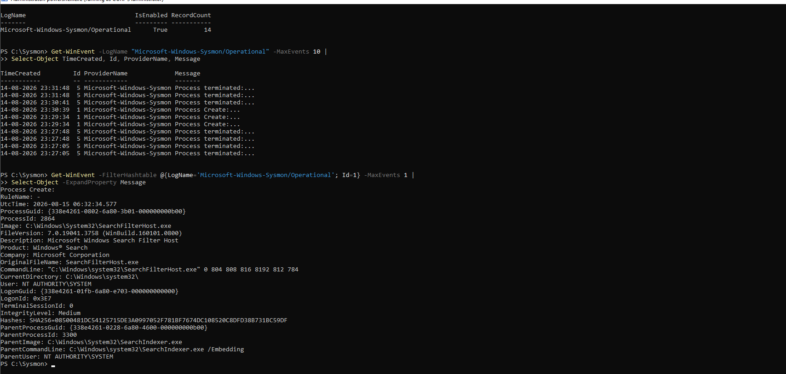

---

# 6. Sysmon Notepad Process Creation

Notepad was used as a controlled and benign process to demonstrate Sysmon process monitoring.

The objective was to generate a predictable process creation event and examine the resulting Sysmon Event ID `1`.

This provides a known-good example before investigating more security-relevant process activity.

### Investigation Concept

A normal process such as:

```text
notepad.exe
```

can be used as a baseline for understanding:

```text
Process
  ↓
Parent Process
  ↓
User Context
  ↓
Command Line
  ↓
Logon Session
```

The same methodology can later be applied to suspicious processes.

### Evidence

* `Day03-06-Windows10-Sysmon-Notepad-ProcessCreation.png`

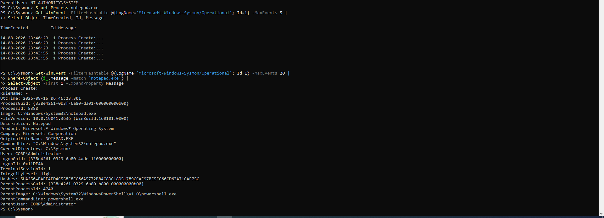

---

# 7. Windows Security Event 4624 + Sysmon Logon ID Correlation

Day 03 extended the Logon ID correlation concept introduced during Day 02.

Windows Security Event ID `4624` represents:

```text
An account was successfully logged on.
```

The authentication event provides information about the Windows logon session.

Sysmon process telemetry can then be examined in relation to that session.

The investigation therefore becomes:

```text
Event ID 4624
Successful Authentication
        |
        | Logon ID
        ↓
Windows Logon Session
        |
        | Related Session
        ↓
Sysmon Event ID 1
Process Creation
```

### Why This Matters

Username-only correlation is weak because the same account can have multiple sessions.

A stronger investigation uses multiple attributes:

```text
Username
+
Domain
+
Logon ID
+
Timestamp
+
Process
+
Parent Process
```

This allows an analyst to build a more reliable activity timeline.

### Evidence

* `Day03-07-Windows10-Security4624-Sysmon-LogonID-Correlation.png`

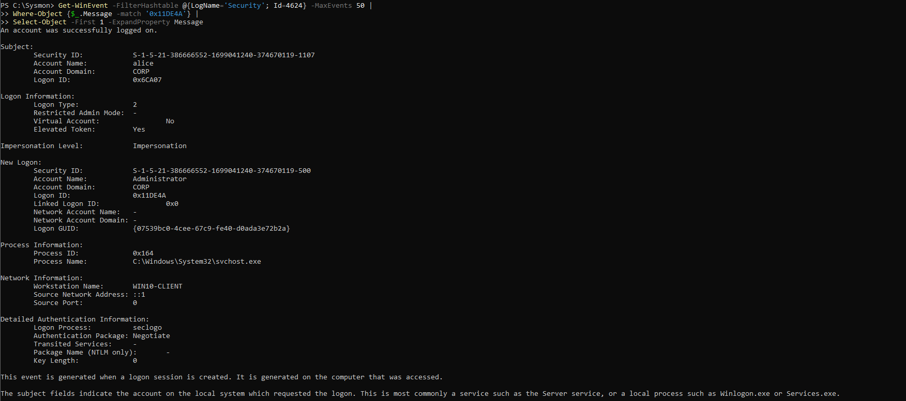

---

# 8. Alice Notepad Process Test

A controlled Notepad execution was performed under the `CORP\alice` user context.

The purpose was to generate endpoint process activity associated with a known domain user.

This created a controlled investigation scenario:

```text
CORP\alice
     ↓
Windows Logon Session
     ↓
Notepad Execution
     ↓
Sysmon Process Creation
```

### SOC Relevance

This demonstrates why endpoint monitoring must consider both:

```text
Identity
```

and:

```text
Activity
```

Knowing that `alice` was logged in is not sufficient.

A SOC analyst also needs to determine what the authenticated user actually executed.

### Evidence

* `Day03-08-Windows10-Alice-Notepad-Process-Test.png`

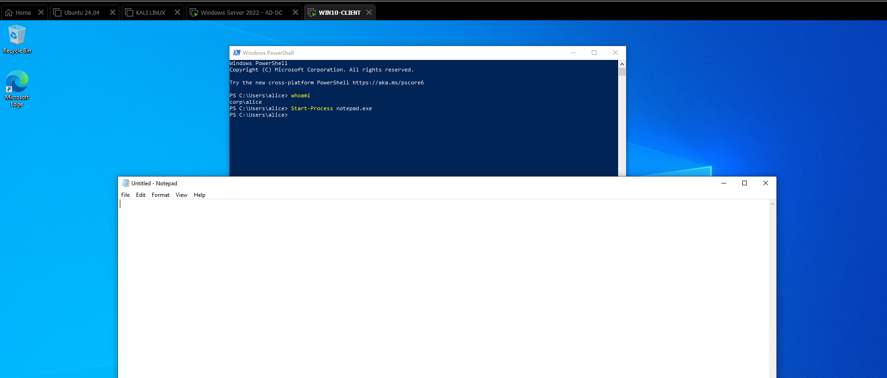

---

# 9. Sysmon Event 1 — Alice Notepad Process Creation

The Notepad process generated a Sysmon Event ID `1`.

This event was examined to identify the process creation activity associated with the `CORP\alice` session.

The investigation connected:

```text
Domain User
    ↓
Windows Session
    ↓
Process Creation
    ↓
notepad.exe
```

This is an important transition from simply observing authentication to investigating actual endpoint activity.

### Evidence

* `Day03-09-Windows10-Sysmon-Alice-Notepad-ProcessCreation.png`

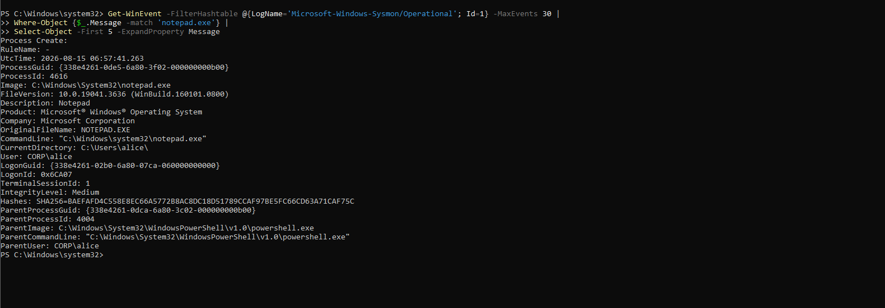

---

# 10. Windows Security 4624 + Alice Logon ID Correlation

The successful authentication event for the `CORP\alice` session was correlated with the corresponding endpoint process activity.

The Logon ID was used as the session-level correlation key.

The investigation model was:

```text
CORP\alice
     |
     ↓
Event ID 4624
Successful Logon
     |
     ↓
Target Logon ID
     |
     ↓
Windows Logon Session
     |
     ↓
Sysmon Event ID 1
     |
     ↓
Notepad Process
```

### Why Logon ID Is Important

The Logon ID provides a stronger relationship between authentication and subsequent activity than username alone.

This allows an analyst to answer:

> Which authenticated Windows session was responsible for this process?

That question becomes especially important when investigating suspicious PowerShell, command shells, scripts, administrative utilities, or malware execution.

### Evidence

* `Day03-10-Windows10-Security4624-Alice-LogonID-Correlation.png`

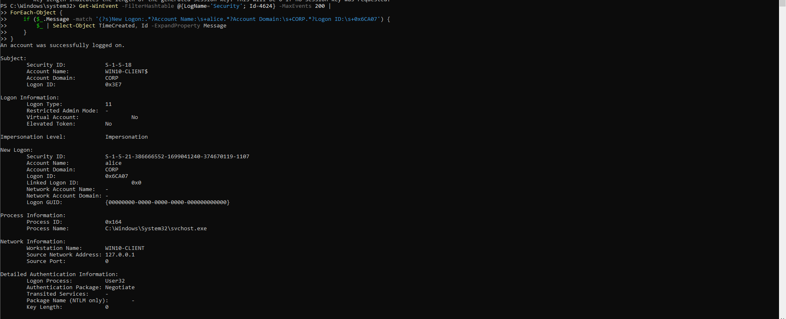

---

# 11. Sysmon Command Process-Tree Analysis

A command-line process was investigated using Sysmon process telemetry to demonstrate process-tree analysis.

Process trees provide context about how a process came into existence.

Instead of investigating:

```text
cmd.exe
```

as an isolated process, a SOC analyst should ask:

```text
Who started cmd.exe?
        ↓
What was the parent process?
        ↓
What command was executed?
        ↓
What child processes were created?
        ↓
Which user/session was involved?
```

A simplified process tree can be represented as:

```text
Parent Process
      |
      ↓
   cmd.exe
      |
      +---- Child Process
      |
      +---- Child Process
```

### Why Process Trees Matter

Attackers frequently use legitimate Windows binaries during post-exploitation.

For example, `cmd.exe`, PowerShell, scripting engines, and administrative utilities may appear completely legitimate when viewed individually.

The surrounding process tree can reveal suspicious execution chains.

Therefore:

```text
Process Name Alone
        ↓
Limited Context

Process + Parent + Child + User + Command Line
        ↓
Better Investigation Context
```

### Evidence

* `Day03-11-Windows10-Sysmon-Cmd-Process-Tree.png`

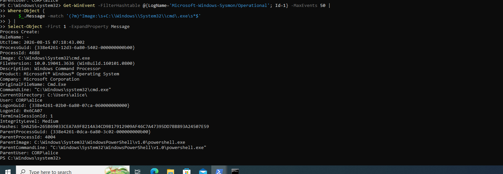

---

# 12. Sysmon Process Creation Baseline

A baseline of normal process creation activity was established from the controlled endpoint activity performed during the lab.

The purpose of a baseline is to understand what normal activity looks like before introducing attack simulations.

A security analyst cannot reliably identify abnormal activity without understanding the normal environment.

### Baseline Concept

```text
Known-Good Endpoint
        ↓
Normal User Activity
        ↓
Normal Process Creation
        ↓
Normal Process Relationships
        ↓
Baseline
```

Future attack activity can then be compared against this known-good behavior.

### SOC Relevance

Baseline information can help an analyst identify:

* Unexpected processes
* Unusual parent-child relationships
* Suspicious command lines
* Processes executed by unexpected users
* Abnormal execution chains
* Changes from normal endpoint behavior

### Evidence

* `Day03-12-Sysmon-Process-Creation-Baseline.png`

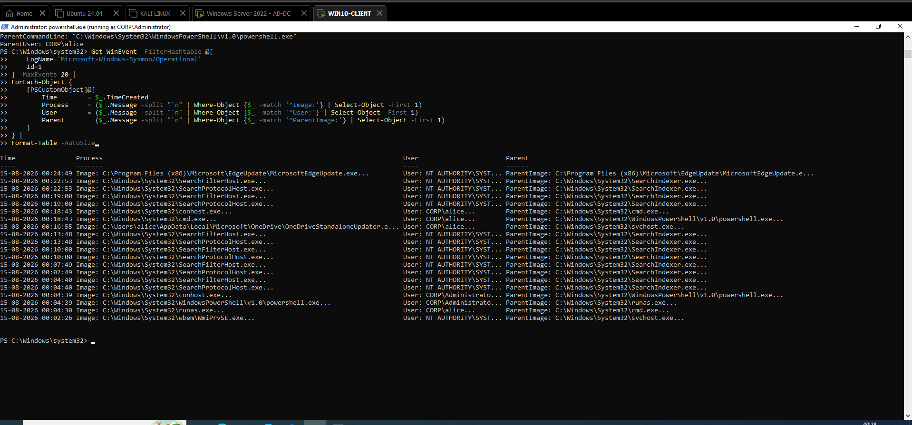

---

# 13. Windows Security 4688 vs Sysmon Event ID 1

Day 03 also demonstrated an important telemetry concept.

Windows Security auditing can provide:

```text
Event ID 4688
New Process Created
```

Sysmon provides:

```text
Event ID 1
Process Create
```

These events describe related activity but come from different telemetry sources.

### Telemetry Model

```text
                    Windows Endpoint
                           |
             +-------------+-------------+
             |                           |
             ↓                           ↓
     Windows Security                 Sysmon
             |                           |
             ↓                           ↓
        Event ID 4688              Event ID 1
      Process Creation           Process Creation
             |                           |
             +-------------+-------------+
                           |
                           ↓
                  SOC Correlation
```

The advantage of having multiple telemetry sources is that an analyst can compare and correlate information instead of relying on a single event source.

---

# 14. Authentication-to-Process Investigation Workflow

The combined investigation methodology developed during Days 02 and 03 can be represented as:

```text
User Authentication
        ↓
Event ID 4624
        ↓
Identify Account
        ↓
Identify Logon ID
        ↓
Identify Windows Session
        ↓
Find Related Sysmon Events
        ↓
Sysmon Event ID 1
        ↓
Identify Process
        ↓
Inspect Command Line
        ↓
Inspect Parent Process
        ↓
Analyze Process Tree
        ↓
Compare Against Baseline
        ↓
Determine Whether Activity Is Normal or Suspicious
```

This represents a practical endpoint investigation workflow that can be applied to future attack simulations.

---

# 15. Key SOC Concepts Learned

## Sysmon

Sysmon is a Windows system monitoring component that provides detailed endpoint telemetry useful for security monitoring and investigation.

---

## Sysmon Event ID 1

```text
Process Create
```

Used to investigate newly created processes and their associated execution context.

---

## Windows Security Event ID 4624

```text
Successful Logon
```

Used to investigate successful authentication and identify the Windows logon session.

---

## Logon ID

A Windows Logon ID identifies a particular logon session and can be used as a correlation key between authentication and subsequent endpoint activity.

The key principle is:

```text
Username
    ≠
Unique Session
```

Therefore:

```text
Username + Logon ID
```

provides stronger correlation than username alone.

---

## Process Tree

A process tree represents the parent-child relationships between processes.

It helps answer:

```text
Who started this?
        ↓
What started it?
        ↓
What did it start?
```

This context is extremely valuable when investigating suspicious execution.

---

## Endpoint Baseline

A baseline represents known-good endpoint behavior.

It provides a reference point for identifying deviations during future attack simulations.

---

# 16. Day 03 Investigation Timeline

The overall Day 03 workflow can be represented as:

```text
Windows 10 Endpoint
        |
        ↓
Sysmon Deployment
        |
        ↓
Sysmon Service Verification
        |
        ↓
Initial Sysmon Telemetry
        |
        ↓
Sysmon Event ID 1
        |
        ↓
Notepad Process Creation
        |
        ↓
CORP\alice Activity
        |
        ↓
Windows Security Event ID 4624
        |
        ↓
Logon ID Correlation
        |
        ↓
Sysmon Process Event
        |
        ↓
Process Tree Analysis
        |
        ↓
Normal Process Baseline
```

---

# 17. Day 03 Evidence Collected

The following screenshots were captured and preserved as Day 03 evidence:

```text
Day03-01-Windows10-Sysmon-Files-Extracted.png
Day03-02-Windows10-Sysmon-Installation.png
Day03-03-Windows10-Sysmon-Service-Log-Verification.png
Day03-04-Windows10-Sysmon-Initial-Telemetry.png
Day03-05-Windows10-Sysmon-Event1-ProcessCreation-Details.png
Day03-06-Windows10-Sysmon-Notepad-ProcessCreation.png
Day03-07-Windows10-Security4624-Sysmon-LogonID-Correlation.png
Day03-08-Windows10-Alice-Notepad-Process-Test.png
Day03-09-Windows10-Sysmon-Alice-Notepad-ProcessCreation.png
Day03-10-Windows10-Security4624-Alice-LogonID-Correlation.png
Day03-11-Windows10-Sysmon-Cmd-Process-Tree.png
Day03-12-Sysmon-Process-Creation-Baseline.png
```

All Day 03 evidence is stored under:

```text
screenshots/Day03/
```

---

# 18. Key Findings

1. Sysmon was successfully deployed on the Windows 10 endpoint.
2. The Sysmon service was verified as operational.
3. Initial Sysmon telemetry was successfully observed.
4. Sysmon Event ID `1` was investigated.
5. Process creation telemetry was examined from a SOC investigation perspective.
6. Notepad was used as a controlled benign process.
7. `CORP\alice` activity was investigated through endpoint telemetry.
8. Windows Security Event ID `4624` was used to identify successful authentication.
9. Logon ID was used as a correlation key between authentication and process activity.
10. Sysmon process creation telemetry was correlated with Windows authentication activity.
11. Process-tree analysis was performed using command-process activity.
12. Parent-child process relationships were recognized as important investigation context.
13. A known-good process creation baseline was established.
14. The difference between Windows Security process telemetry and Sysmon process telemetry was demonstrated.
15. The investigation moved from isolated events toward correlated endpoint activity.

---

# 19. Day 03 Completion Checklist

* [x] Sysmon package extracted
* [x] Sysmon installed on `WIN10-CLIENT`
* [x] Sysmon service verified
* [x] Initial Sysmon telemetry verified
* [x] Sysmon Event ID `1` investigated
* [x] Notepad process creation investigated
* [x] `CORP\alice` process activity investigated
* [x] Windows Security Event ID `4624` reviewed
* [x] Logon ID correlation performed
* [x] Sysmon and Windows authentication telemetry correlated
* [x] Command process-tree analysis performed
* [x] Process creation baseline established
* [x] Evidence screenshots captured
* [x] Documentation completed

---

# 20. Security Relevance

Day 03 significantly increased the visibility available on the Windows endpoint.

Day 02 established the authentication and Windows Security auditing foundation.

Day 03 added Sysmon-based endpoint telemetry:

```text
                    Day 02
                       |
                       ↓
             Windows Security Logs
                       |
              +--------+--------+
              |                 |
              ↓                 ↓
          4624 Logon        4688 Process
              |                 |
              +--------+--------+
                       |
                       ↓
                  Logon ID
                       |
                       ↓
                    Day 03
                       |
                       ↓
                     Sysmon
                       |
                       ↓
                  Event ID 1
                       |
                       ↓
               Process Details
                       |
                       ↓
                 Process Tree
                       |
                       ↓
                  Baseline
```

This creates a much stronger foundation for future attack detection.

Instead of investigating an event in isolation, the analyst can begin constructing an endpoint timeline:

```text
Authentication
      ↓
Logon Session
      ↓
Process Creation
      ↓
Parent Process
      ↓
Command Line
      ↓
Child Processes
      ↓
Baseline Comparison
      ↓
Detection / Investigation
```

This is the core mindset required for endpoint-focused SOC analysis.

---

# 21. Day 03 Final Conclusion

Day 03 successfully transitioned the laboratory from basic Windows security auditing toward **endpoint telemetry and process-level investigation**.

Sysmon was deployed and verified on `WIN10-CLIENT`, and Sysmon Event ID `1` was used to investigate process creation.

Controlled Notepad and command-process activity provided safe examples for understanding:

```text
Process Creation
Parent-Child Relationships
User Context
Logon Sessions
Process Trees
```

The most important investigation concept developed during Day 03 was the correlation of **identity with endpoint activity**.

The investigation chain can be summarized as:

```text
CORP\alice
     ↓
Successful Authentication
     ↓
Event ID 4624
     ↓
Logon ID
     ↓
Windows Logon Session
     ↓
Sysmon Event ID 1
     ↓
Process Creation
     ↓
Parent / Child Relationship
     ↓
Process Tree
     ↓
Known-Good Baseline
     ↓
Future Detection
```

This provides the foundation for the next stage of the Active Directory Attack & Detection Lab, where endpoint telemetry can be used to investigate controlled attack activity and identify suspicious behavior.

---

# Day 03 Status: COMPLETE

**Evidence Captured:** 12 screenshots

**Evidence Location:**

```text
screenshots/Day03/
```

**Primary Telemetry Sources:**

```text
Windows Security Event ID 4624
Sysmon Event ID 1
```

**Primary Investigation Concepts:**

```text
Authentication
Logon ID Correlation
Process Creation
Process Trees
Endpoint Telemetry
Baseline Analysis
```

**Day 03 completed successfully.**
