# Day 04 — Sysmon Deployment, Process Monitoring & Authentication Correlation

## Project Information

| Field | Details |
|---|---|
| Project | Active Directory Attack & Detection Lab |
| Day | Day 04 |
| Endpoint | WIN10-CLIENT |
| Domain | CORP / corp.local |
| Domain Controller | AD-DC.corp.local |
| Wazuh Manager | 192.168.159.130 |
| Wazuh Agent | WIN10-CLIENT |
| Wazuh Agent ID | 002 |
| Wazuh Agent IP | 192.168.159.133 |
| Primary Telemetry | Sysmon |
| SIEM | Wazuh |
| Windows Authentication Event | Security Event ID 4624 |
| Sysmon Process Event | Event ID 1 |

---

# 1. Day 04 Objective

The objective of Day 04 was to establish and validate detailed Windows endpoint telemetry and demonstrate how a SOC analyst can correlate authentication activity with subsequent process execution.

The day focused on:

- Wazuh Manager connectivity validation
- Wazuh Agent deployment and verification
- Wazuh Agent enrollment
- Sysmon configuration
- Sysmon configuration validation
- Windows process-creation monitoring
- Wazuh ingestion of Sysmon events
- CMD process monitoring
- Process-tree analysis
- Windows Security Event ID 4624 investigation
- Logon ID investigation
- Authentication-to-process correlation

The overall investigation workflow was:

**Authentication → Logon Session → Process Creation → Process Tree → Command Execution → Cross-Source Correlation**

---

# 2. Lab Architecture

The Day 04 telemetry architecture consisted of the Windows endpoint generating security telemetry, the Wazuh Agent forwarding the telemetry, and the Wazuh Manager providing centralized analysis and visualization.

The telemetry flow was:

**WIN10-CLIENT → Sysmon / Windows Security Logs → Wazuh Agent → Wazuh Manager → Wazuh Dashboard**

This architecture allows a SOC analyst to investigate endpoint activity centrally instead of relying only on the local Windows Event Viewer.

---

# 3. Wazuh Manager Network Connectivity

The first step was to verify that WIN10-CLIENT could communicate with the Wazuh Manager.

The Wazuh Manager was hosted at:

`192.168.159.130`

Connectivity validation confirmed that the Windows endpoint could reach the Wazuh Manager.

### Evidence

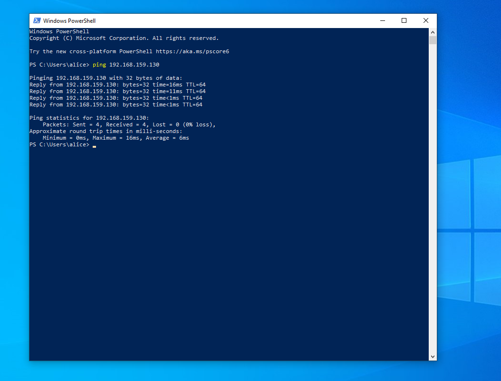

---

# 4. Wazuh Agent Package Preparation

The Wazuh Agent package was downloaded as part of the Windows endpoint deployment process.

The Wazuh Agent is responsible for collecting endpoint telemetry and forwarding relevant events to the Wazuh Manager.

### Evidence

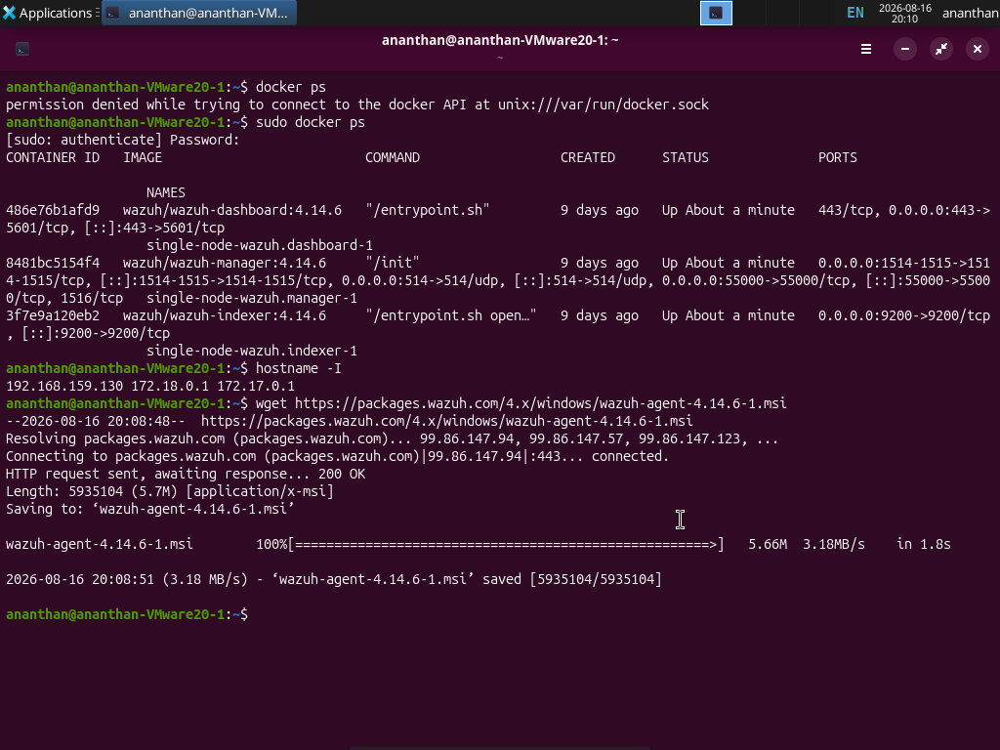

---

# 5. Wazuh Agent Service Verification

After installation, the Wazuh Agent service was verified to ensure that the monitoring component was operational.

### Evidence

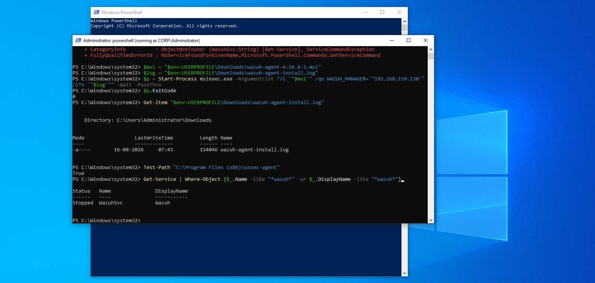

---

# 6. Wazuh Manager Port Validation

Wazuh uses specific ports for agent communication and enrollment.

| Port | Purpose |
|---|---|
| 1514 | Wazuh Agent communication |
| 1515 | Wazuh Agent enrollment |

The required ports were tested from the Windows environment.

### Port 1515 Validation

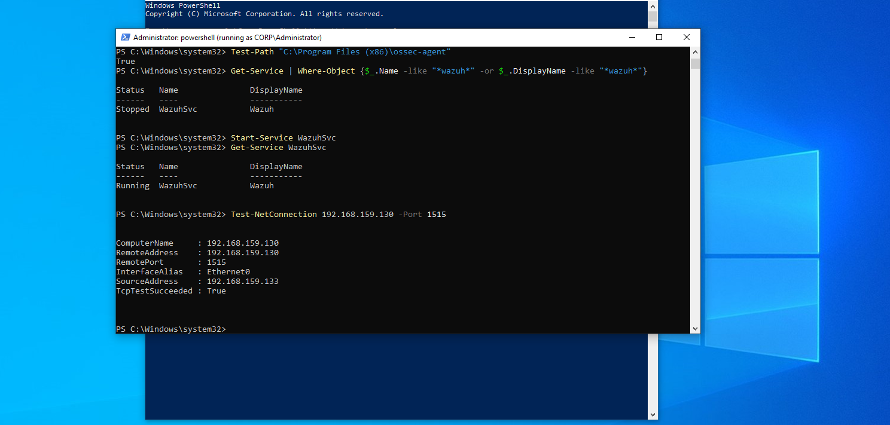

### Ports 1514 and 1515 Validation

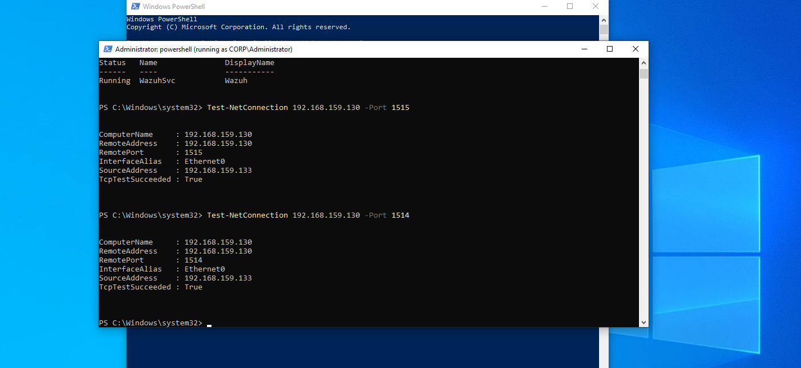

---

# 7. Wazuh Agent Enrollment

WIN10-CLIENT was enrolled with the Wazuh Manager.

The enrolled endpoint was identified as:

- Agent Name: `WIN10-CLIENT`
- Agent ID: `002`
- Agent IP: `192.168.159.133`

### Evidence

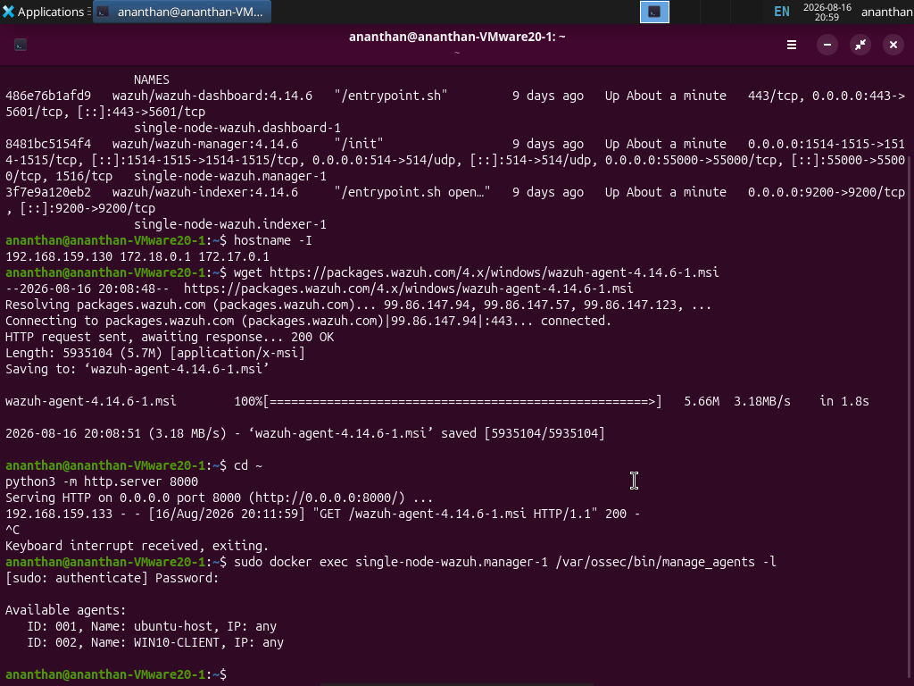

---

# 8. Sysmon Configuration

Sysmon was configured on WIN10-CLIENT to provide detailed endpoint process telemetry.

Sysmon provides important process-level information such as:

- Process GUID
- Process ID
- Image path
- Command line
- User
- Logon ID
- Parent process ID
- Parent image
- Parent command line
- Integrity level
- File hashes

This telemetry is particularly valuable during endpoint investigations.

### Evidence

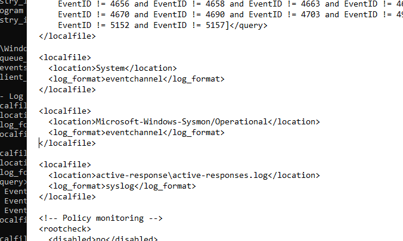

---

# 9. Sysmon XML Configuration Validation

The Sysmon XML configuration was validated after deployment to ensure that the expected configuration was loaded correctly.

### Evidence

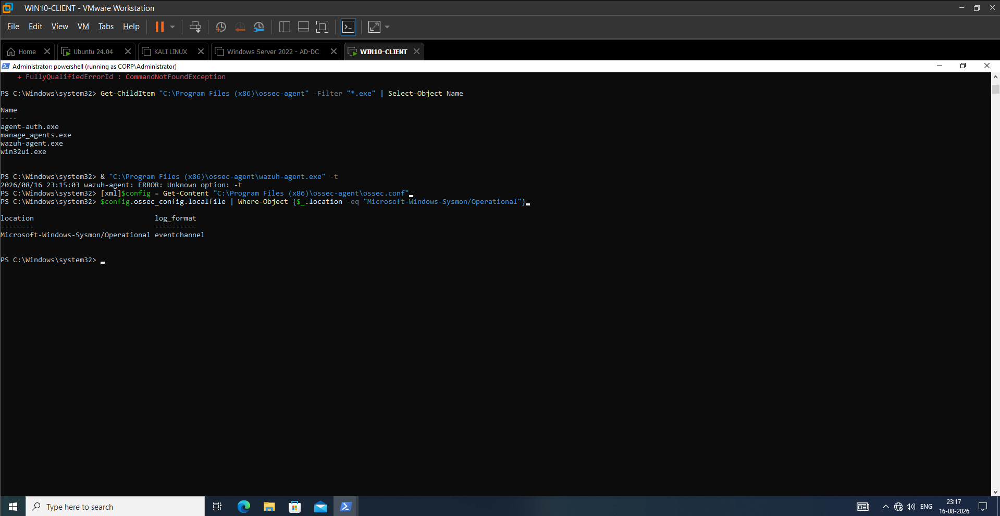

---

# 10. Sysmon Event ID 1 — Process Creation

Sysmon Event ID 1 was used to monitor process creation on WIN10-CLIENT.

A controlled Notepad execution was performed as an initial telemetry test.

The generated event provided detailed process information including:

- Process GUID
- Process ID
- Image
- Command line
- User
- Logon ID
- Parent process ID
- Parent image
- Parent command line
- Integrity level
- Hashes

### Evidence

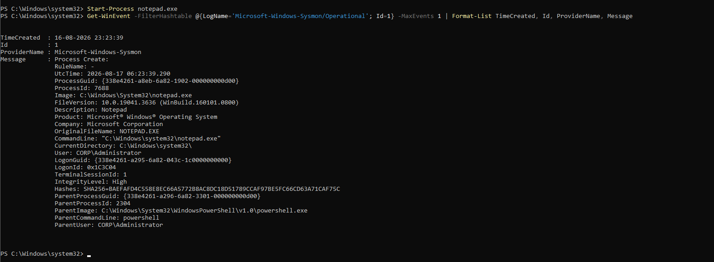

---

# 11. Wazuh Ingestion of Sysmon Telemetry

The Sysmon Notepad process-creation event was verified in Wazuh.

This confirmed the complete telemetry pipeline:

**WIN10-CLIENT → Sysmon → Wazuh Agent → Wazuh Manager → Wazuh Dashboard**

### Evidence

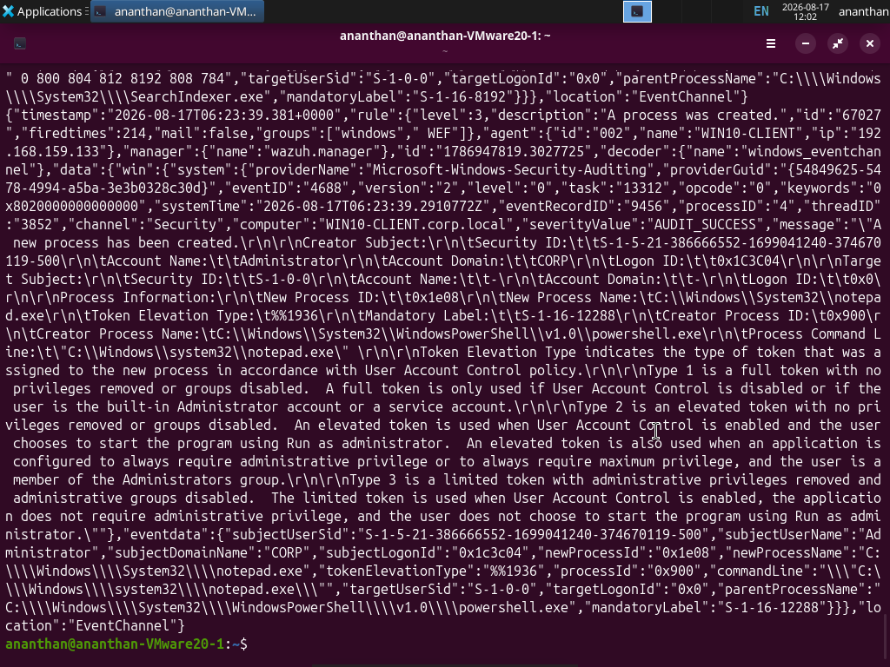

---

# 12. Wazuh Dashboard — Notepad Process Details

The Wazuh Dashboard was used to inspect the detailed Notepad process event received from WIN10-CLIENT.

The event demonstrated that centralized Wazuh monitoring was receiving endpoint process telemetry.

### Evidence

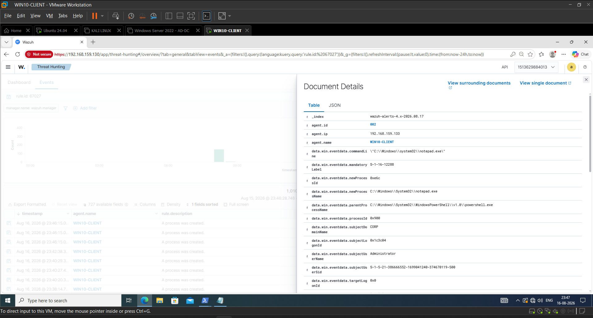

---

# 13. CMD Process Creation

A controlled CMD execution was generated on WIN10-CLIENT to test command-line process telemetry.

The command executed was:

    "C:\Windows\system32\cmd.exe" /c whoami

Sysmon captured the resulting process-creation event.

The event showed execution under:

`CORP\Administrator`

The command line was also captured, providing visibility into the actual operation performed.

### Evidence

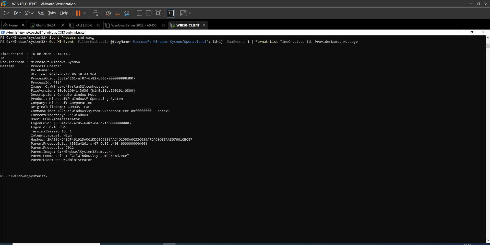

---

# 14. Wazuh Dashboard — CMD Process Creation

The CMD process-creation event was subsequently verified through the Wazuh Dashboard.

This confirmed that Wazuh was successfully receiving and displaying Sysmon process telemetry generated on WIN10-CLIENT.

### Evidence

---

# 15. Process Tree Analysis

The process relationship was investigated using Sysmon telemetry.

The observed process chain was:

**powershell.exe → cmd.exe → whoami.exe**

The CMD process executed:

    "C:\Windows\system32\cmd.exe" /c whoami

The resulting `whoami.exe` process contained parent-process information showing that it was launched from `cmd.exe`.

Important fields included:

- ParentProcessId
- ParentImage
- ParentCommandLine
- ProcessId
- Image
- CommandLine
- User
- LogonId

### Evidence

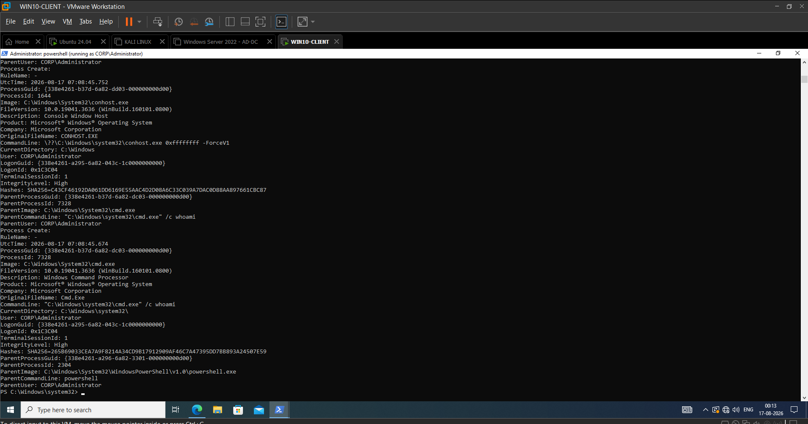

---

# 16. Windows Security Event ID 4624

Windows Security Event ID 4624 represents a successful logon.

The event was investigated to determine the authentication context associated with activity on WIN10-CLIENT.

Relevant fields included:

- Subject account
- Target account
- Target domain
- Target Logon ID
- Target user SID
- Workstation name
- Logon Type
- Process name
- Authentication package

### Evidence

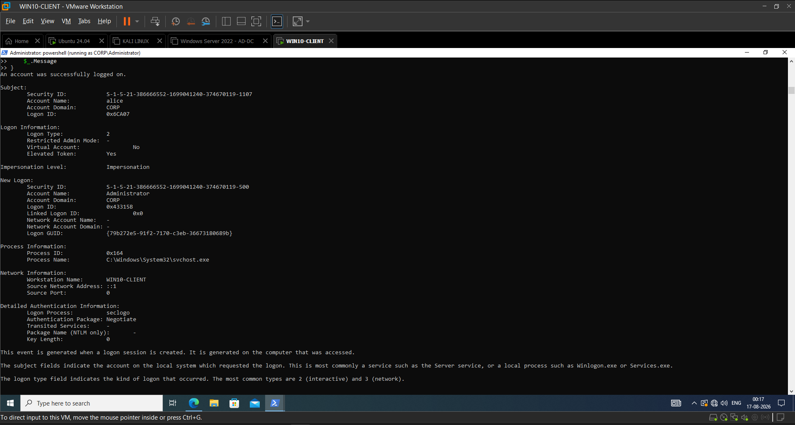

---

# 17. Logon ID Investigation

Multiple successful logon events were present on WIN10-CLIENT.

Therefore, the investigation could not rely only on the username.

For example, an observed 4624 event identified:

- Target Domain: `CORP`
- Target User: `alice`
- Target Logon ID: `0xBF9C5`

This demonstrated why a unique session identifier such as the Logon ID is important when correlating Windows authentication and process activity.

### Evidence

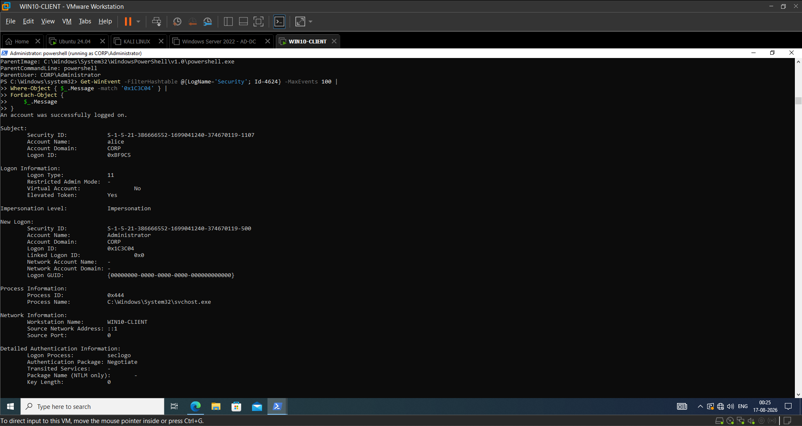

---

# 18. Administrator Logon Correlation

The relevant authentication event was identified by matching the Logon ID associated with the Sysmon process telemetry.

The relevant Windows Security Event ID 4624 contained:

| Field | Value |
|---|---|
| Event ID | `4624` |
| Target Domain | `CORP` |
| Target User | `Administrator` |
| Target Logon ID | `0x1C3C04` |
| Workstation | `WIN10-CLIENT` |
| Channel | `Security` |

The critical correlation value was:

`0x1C3C04`

The same Logon ID appeared in the Sysmon process telemetry associated with:

`CORP\Administrator`

This established that the authentication event and subsequent process activity belonged to the same Windows logon session.

### Evidence

---

# 19. Cross-Source Authentication and Process Correlation

The most important result of Day 04 was the successful correlation between Windows Security Event ID 4624 and Sysmon Event ID 1.

The correlation was:

**Security Event 4624 → CORP\Administrator → Logon ID 0x1C3C04 → Sysmon Event ID 1 → cmd.exe → whoami.exe**

The Windows Security event established the authentication context.

Sysmon then provided process-level visibility associated with the same user and Logon ID.

The command executed was:

    "C:\Windows\system32\cmd.exe" /c whoami

The process tree showed:

**powershell.exe → cmd.exe → whoami.exe**

This demonstrated how authentication telemetry can be correlated with endpoint process activity.

---

# 20. Why the Logon ID Was Important

A Windows endpoint can contain many authentication events and many process events.

Searching only for:

`Administrator`

could return multiple unrelated events.

The Logon ID provides a stronger correlation mechanism because it identifies a specific Windows logon session.

In this investigation:

**Security 4624 TargetLogonId = 0x1C3C04**

matched:

**Sysmon LogonId = 0x1C3C04**

This matching value linked the authentication event with the process activity.

---

# 21. SOC Investigation Timeline

The Day 04 investigation can be summarized as:

1. `CORP\Administrator` successfully authenticated on `WIN10-CLIENT`.
2. Windows Security generated Event ID `4624`.
3. The authentication event was associated with Logon ID `0x1C3C04`.
4. Sysmon recorded process creation activity associated with the same user context.
5. `cmd.exe` was executed.
6. The command line was `"C:\Windows\system32\cmd.exe" /c whoami`.
7. `whoami.exe` was spawned by `cmd.exe`.
8. The Logon ID was used to correlate authentication and process activity.
9. Wazuh provided centralized visibility into the endpoint telemetry.

The resulting investigation chain was:

**Authentication → Logon Session → Process Creation → Command Execution → Process Tree → Cross-Source Correlation**

---

# 22. SOC Interpretation

The presence of `cmd.exe`, PowerShell, or `whoami.exe` does not automatically indicate malicious activity.

These are legitimate Windows utilities and can be used during normal administrative operations.

A SOC analyst should investigate the surrounding context:

- Which user executed the process?
- Was the authentication legitimate?
- Which logon session was involved?
- Which parent process launched the command?
- What command line was executed?
- What child process was created?
- Is the behavior expected?
- Are there additional suspicious events?

Day 04 demonstrated how these questions can be answered using Windows Security logs and Sysmon telemetry.

---

# 23. Wazuh Investigation Workflow

The Day 04 workflow was:

**Windows Endpoint → Sysmon / Security Logs → Wazuh Agent → Wazuh Manager → Wazuh Dashboard → SOC Investigation**

The investigation used multiple telemetry sources rather than relying on a single event.

This demonstrates the SOC principle:

**Individual Event → Context → Correlation → Investigation**

---

# 24. Evidence Summary

| Evidence | Purpose |
|---|---|
| Day04-01 | Wazuh Manager network connectivity |
| Day04-02 | Wazuh Agent package download |
| Day04-03 | Wazuh Agent service verification |
| Day04-04 | Wazuh Manager port 1515 validation |
| Day04-04 | Wazuh Manager ports 1514/1515 validation |
| Day04-05 | Wazuh Agent enrollment |
| Day04-06 | Sysmon configuration |
| Day04-07 | Sysmon XML configuration validation |
| Day04-08 | Sysmon Notepad process creation |
| Day04-09 | Wazuh Sysmon event ingestion |
| Day04-10 | Wazuh Dashboard Notepad process details |
| Day04-11 | CMD process creation |
| Day04-12 | Wazuh Dashboard CMD process creation |
| Day04-13 | Process-tree analysis |
| Day04-14 | Windows Security Event 4624 |
| Day04-15 | Logon ID investigation |
| Day04-16 | Administrator authentication correlation |

---

# 25. Key Findings

## Finding 1 — Wazuh Connectivity

WIN10-CLIENT successfully communicated with the Wazuh Manager and was enrolled as Agent `002`.

## Finding 2 — Sysmon Telemetry

Sysmon successfully generated Event ID `1` process-creation telemetry.

## Finding 3 — Command-Line Visibility

The endpoint telemetry captured:

    "C:\Windows\system32\cmd.exe" /c whoami

This provided visibility into the actual command executed.

## Finding 4 — Process-Tree Visibility

The process relationship was reconstructed as:

**powershell.exe → cmd.exe → whoami.exe**

## Finding 5 — Successful Authentication

Windows Security Event ID `4624` confirmed successful authentication activity.

## Finding 6 — Administrator Session Identification

The relevant authentication event identified:

`CORP\Administrator`

with Logon ID:

`0x1C3C04`

## Finding 7 — Cross-Source Correlation

The same Logon ID `0x1C3C04` was observed in the authentication and process telemetry.

This linked the `CORP\Administrator` authentication session with subsequent process execution.

---

# 26. Security Significance

The investigation demonstrated why endpoint telemetry should be analyzed across multiple sources.

An attacker who gains access to a Windows environment may:

- Authenticate with a compromised account
- Execute command shells
- Perform system discovery
- Execute additional processes
- Attempt privilege escalation
- Move laterally
- Establish persistence

A SOC analyst can investigate these behaviors by correlating:

**Authentication Events + Process Creation + Command-Line Telemetry + Parent/Child Relationships + User Context**

Day 04 demonstrated this methodology in a controlled Active Directory environment.

---

# 27. Lessons Learned

### 27.1 Telemetry Must Be Validated

Before performing detection or investigation, the analyst must verify that telemetry is generated and delivered to the SIEM.

### 27.2 Process Names Alone Are Not Enough

A process such as `cmd.exe` is not automatically malicious.

Command-line arguments, user context, parent process, and Logon ID provide additional investigative context.

### 27.3 Process Trees Provide Behavioral Context

The relationship:

**powershell.exe → cmd.exe → whoami.exe**

provides more information than viewing `cmd.exe` as an isolated event.

### 27.4 Authentication Events Provide User Context

Security Event ID `4624` allows the analyst to determine which account established a successful logon session.

### 27.5 Logon IDs Enable Stronger Correlation

The matching Logon ID `0x1C3C04` allowed authentication and Sysmon process activity to be linked to the same Windows session.

### 27.6 Correlation Is More Valuable Than Isolated Events

The investigation became meaningful when authentication, process creation, command-line activity, and process relationships were analyzed together.

---

# 28. Day 04 Final Outcome

Day 04 successfully established and validated a Windows endpoint telemetry pipeline using Wazuh and Sysmon.

The lab demonstrated:

- Wazuh Agent connectivity
- Wazuh Agent enrollment
- Sysmon deployment
- Sysmon configuration validation
- Sysmon Event ID 1 process creation
- Wazuh ingestion of Sysmon telemetry
- CMD process monitoring
- Command-line visibility
- Parent-child process analysis
- Windows Security Event ID 4624
- Administrator authentication analysis
- Logon ID correlation
- Cross-source authentication-to-process investigation

The final correlation was:

**Security Event 4624 → CORP\Administrator → Logon ID 0x1C3C04 → Sysmon Event ID 1 → cmd.exe → whoami.exe**

---

# 29. SOC Analyst Takeaway

The primary lesson from Day 04 is that individual security events rarely provide the complete story.

A stronger investigation asks:

**Who authenticated?**

**Which session was created?**

**Which processes executed within that session?**

**What commands were executed?**

**Which process launched the activity?**

**Can the events be correlated using a reliable identifier?**

In this investigation, the shared Logon ID `0x1C3C04` provided the link between the Windows Security authentication event and Sysmon process telemetry.

The resulting investigation chain was:

**Authentication → Logon Session → Process Creation → Command Execution → Process Tree → Cross-Source Correlation**

---

# Day 04 Status

**COMPLETED**

