# Day 05 — Active Directory Identity, Privilege & Security Baseline

## Project

**Project:** Active Directory Attack & Detection Lab  
**Day:** Day 05  
**Endpoint:** WIN10-CLIENT  
**Domain Controller:** AD-DC.corp.local  
**Domain:** CORP / corp.local  
**Primary Focus:** Active Directory identity enumeration, domain users and groups, privileged accounts, local administrator baseline, account policy, Group Policy, Kerberos, domain trust, and secure-channel validation.

---

# 1. Day 05 Overview

Day 05 focused on establishing a detailed **identity and security baseline** for the Active Directory environment.

The objective was to understand:

- The current domain and domain controller configuration.
- Domain users and their memberships.
- Privileged Active Directory groups.
- Local administrator accounts.
- Domain and local security contexts.
- Password and account policies.
- Applied Group Policy Objects.
- Active user sessions.
- Kerberos authentication tickets.
- Domain trust relationships.
- The secure channel between WIN10-CLIENT and the domain controller.

This baseline will be used during later attack-simulation and detection activities to distinguish normal Active Directory behavior from suspicious authentication, privilege, and lateral-movement activity.

---

# 2. Objectives

The following objectives were completed during Day 05:

1. Verify the Active Directory domain and domain controller.
2. Identify the current Windows security context.
3. Enumerate domain users.
4. Enumerate domain groups.
5. Identify privileged group memberships.
6. Baseline domain administrator accounts.
7. Baseline local administrator accounts.
8. Verify active user sessions.
9. Review domain account and password policies.
10. Verify applied Group Policy.
11. Enumerate domain trust relationships.
12. Establish an authentication and privilege baseline.
13. Inspect Kerberos tickets.
14. Verify the domain secure channel.
15. Organize all Day 05 evidence.

---

# 3. Environment

| Component | Configuration |
|---|---|
| Endpoint | WIN10-CLIENT |
| Operating System | Windows 10 |
| Domain Controller | AD-DC.corp.local |
| Domain | corp.local |
| NetBIOS Domain | CORP |
| Domain Users | Administrator, alice, bob |
| SOC Group | SOC-Analysts |
| IT Group | IT-Admins |
| Wazuh | Monitoring WIN10-CLIENT |
| Authentication | Active Directory / Kerberos |
| Evidence Directory | screenshots/Day05/ |

---

# 4. Domain Controller and Domain Discovery

## Purpose

The first objective was to verify the Active Directory environment from the Windows client.

The domain controller discovery command was used to identify the DC responsible for the `corp.local` domain.

Command:

    nltest /dsgetdc:corp.local

The output confirmed:

- Domain Controller: `AD-DC.corp.local`
- Domain: `corp.local`
- Forest: `corp.local`
- Primary domain configuration
- Default AD site information
- Successful domain controller discovery

### Evidence

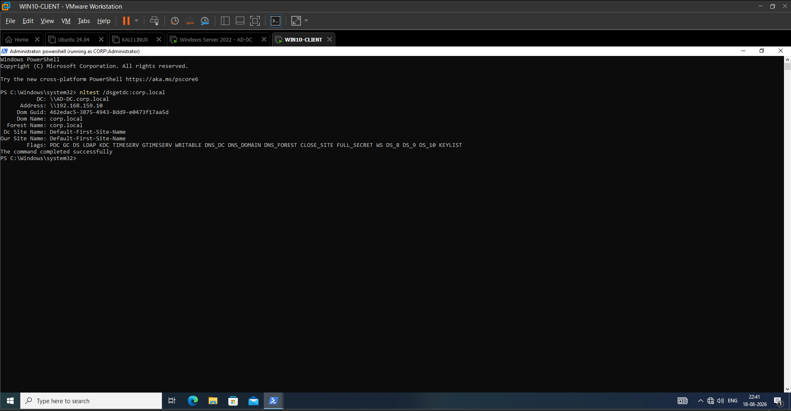

---

# 5. Current Windows Security Context

## Purpose

Before performing identity and privilege enumeration, the current security context of the session was verified.

Command:

    whoami

Result:

    corp\administrator

This confirmed that the session was operating under the domain Administrator account.

### Evidence

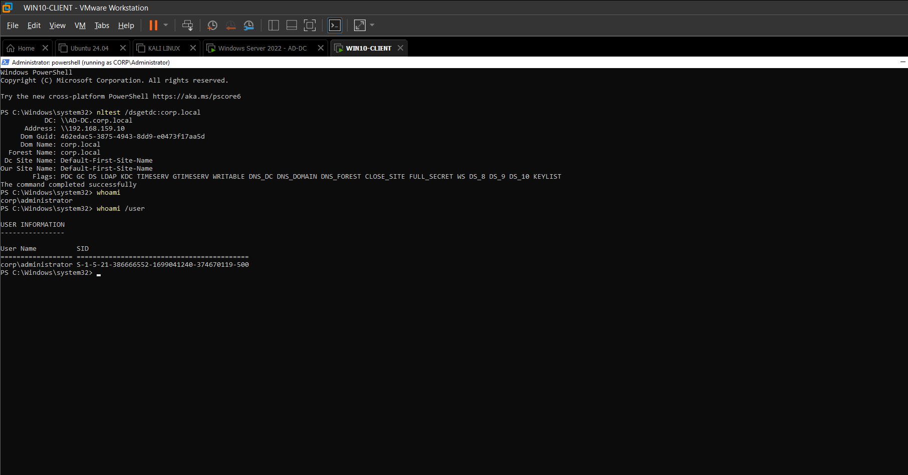

---

# 6. Domain User Enumeration

## Purpose

Domain user enumeration establishes the known user population within the lab environment.

Command:

    net user /domain

The domain controller returned the available domain accounts, including:

- Administrator
- alice
- bob
- krbtgt
- Guest

This provides the initial identity inventory for later authentication and attack simulations.

### Evidence

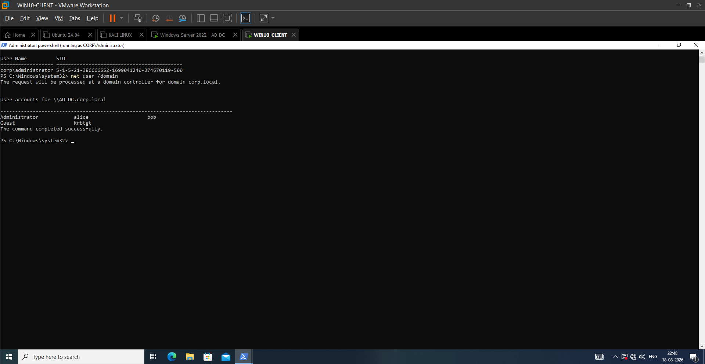

---

# 7. Domain Group Enumeration

## Purpose

Group enumeration identifies the security groups available within the Active Directory domain.

Command:

    net group /domain

The output confirmed the presence of standard Active Directory groups as well as lab-created groups.

Notable groups included:

- Domain Admins
- Domain Users
- Enterprise Admins
- Schema Admins
- IT-Admins
- SOC-Analysts
- Group Policy Creator Owners
- Domain Controllers
- Protected Users

### Evidence

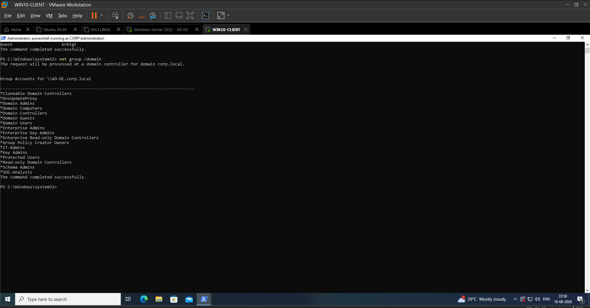

---

# 8. Domain Admins Membership

## Purpose

The Domain Admins group is one of the most privileged security groups in the Active Directory domain.

Command:

    net group "Domain Admins" /domain

The result confirmed:

    Administrator

as a member of the Domain Admins group.

### Evidence

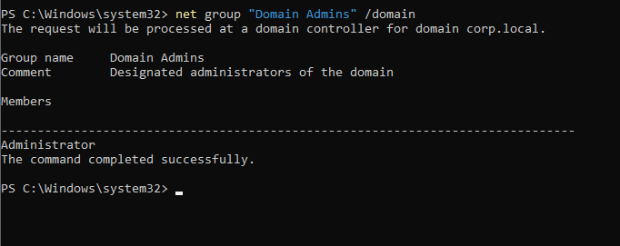

---

# 9. IT-Admins Membership

## Purpose

The custom `IT-Admins` group was reviewed to identify its current membership.

Command:

    net group "IT-Admins" /domain

The result showed:

    Administrator

as a member.

### Evidence

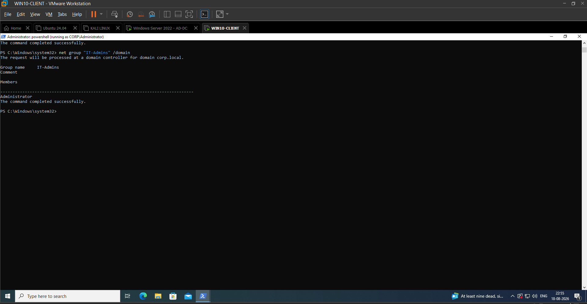

---

# 10. SOC-Analysts Membership

## Purpose

The `SOC-Analysts` group represents the security operations role within the lab.

Command:

    net group "SOC-Analysts" /domain

The result showed:

    alice
    bob

as members.

This creates a useful distinction between administrative users and security-operations users within the lab.

### Evidence

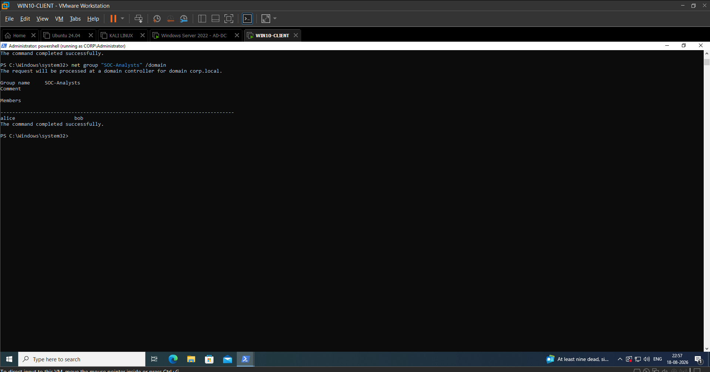

---

# 11. Alice Domain Account Enumeration

## Purpose

The `alice` account was examined to establish its account state, password information, and group membership.

Command:

    net user alice /domain

Important observations included:

- Account is active.
- Account belongs to Domain Users.
- Account belongs to SOC-Analysts.
- Password policy information was returned by the domain controller.
- Last logon information was available.

### Evidence

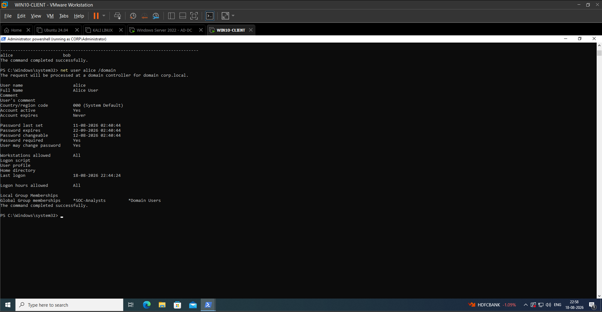

---

# 12. Bob Domain Account Enumeration

## Purpose

The `bob` account was similarly reviewed.

Command:

    net user bob /domain

The result confirmed:

- Account is active.
- Account belongs to Domain Users.
- Account belongs to SOC-Analysts.
- Account configuration and logon information were returned.

### Evidence

---

# 13. Administrator Account Baseline

## Purpose

The domain Administrator account represents a highly privileged identity and therefore requires a clear baseline.

Command:

    net user Administrator /domain

The output showed:

- Domain Administrator account.
- Active account state.
- Domain Admins membership.
- Enterprise Admins membership.
- IT-Admins membership.
- Schema Admins membership.
- Group Policy Creator Owners membership.
- Domain Users membership.

This confirms that the Administrator account has extensive domain privileges.

### Evidence

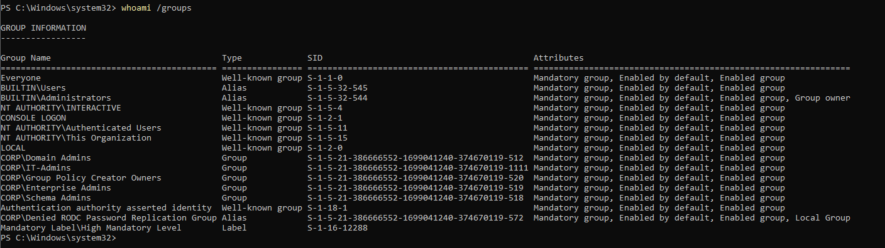

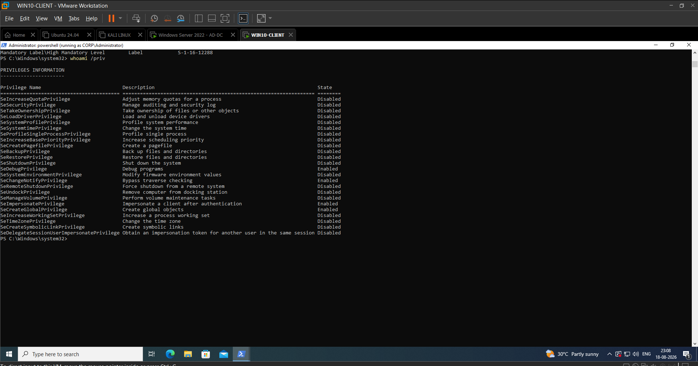

---

# 14. Local Administrators Group Membership

## Purpose

The local Administrators group was reviewed to determine which accounts have administrative access to WIN10-CLIENT.

Command:

    net localgroup Administrators

The baseline confirmed the presence of:

- Administrator
- CORP\Domain Admins
- LabAdmin

This is significant because membership in the local Administrators group provides administrative control over the endpoint.

### Evidence

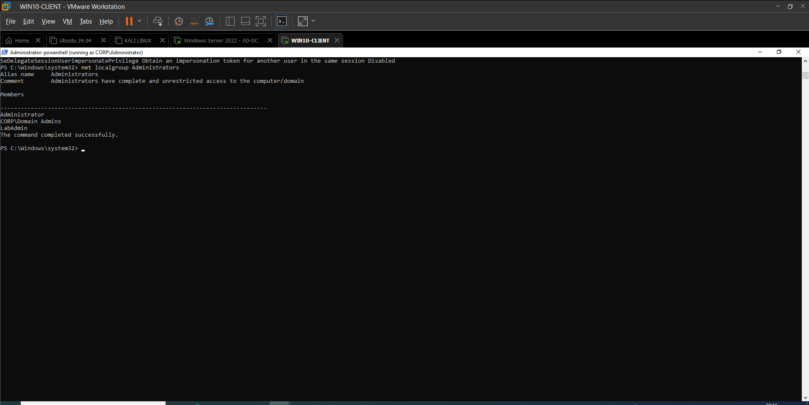

---

# 15. LabAdmin Account Enumeration

## Purpose

The intentionally created `LabAdmin` account was reviewed as part of the local privilege baseline.

Command:

    net user LabAdmin

The output confirmed:

- Account is active.
- Account is a local account.
- Account belongs to the local Administrators group.
- Account does not belong to domain groups.

### Evidence

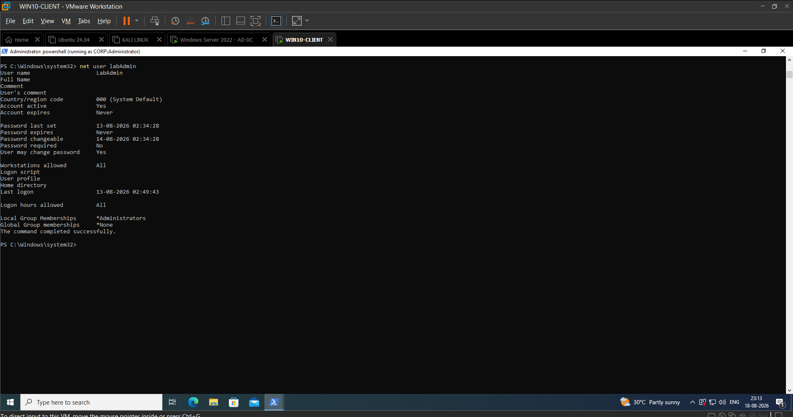

---

# 16. LabAdmin Local Identity Verification

## Purpose

The PowerShell Local User API was used to verify the identity source and SID of `LabAdmin`.

Command:

    Get-LocalUser -Name "LabAdmin" | Select-Object Name, Enabled, SID, PrincipalSource

The output confirmed:

- Name: `LabAdmin`
- Enabled: `True`
- PrincipalSource: `Local`
- A unique local SID was assigned.

### Evidence

---

# 17. Built-in Administrator Identity

## Purpose

The built-in local Administrator account was reviewed to establish its current state.

Command:

    Get-LocalUser | Select-Object Name, Enabled, PrincipalSource, LastLogon

The output showed the local accounts and their enabled state.

The built-in Administrator account was disabled while `LabAdmin` remained enabled.

### Evidence

---

# 18. Local User Security Baseline

The local user configuration was reviewed to understand the endpoint's local authentication surface.

The baseline identified:

- Built-in Administrator
- DefaultAccount
- Guest
- LabAdmin
- WDAGUtilityAccount

Only `LabAdmin` was enabled among the displayed local accounts.

### Evidence

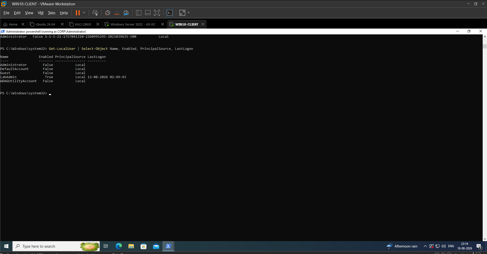

---

# 19. Local Administrator Privilege Baseline

The local Administrators group was reviewed again to establish the effective administrative access path.

Command:

    net localgroup Administrators

The output confirmed:

    Administrator
    CORP\Domain Admins
    LabAdmin

This demonstrates that both domain-level and local-level identities can obtain administrative privileges on WIN10-CLIENT.

### Evidence

---

# 20. LabAdmin Privilege Baseline

The LabAdmin account was specifically verified again to document its local administrative membership.

Command:

    net user LabAdmin

The result confirmed:

    Local Group Memberships    *Administrators

This establishes LabAdmin as an intentional local privileged account in the lab.

### Evidence

---

# 21. Domain Administrator Account Baseline

The domain Administrator account was examined for its current Active Directory privileges.

Command:

    net user Administrator /domain

The output confirmed membership in multiple privileged groups, including:

- Domain Admins
- Enterprise Admins
- IT-Admins
- Schema Admins
- Group Policy Creator Owners
- Domain Users

### Evidence

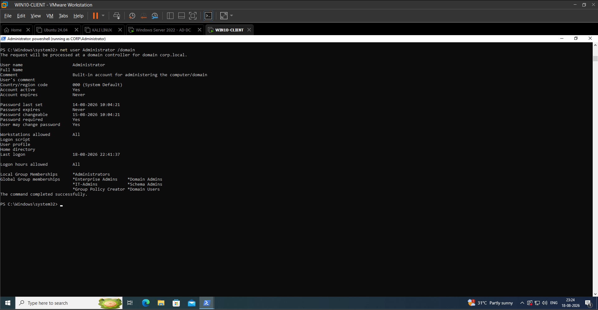

---

# 22. Domain Admins Membership Baseline

The membership of the Domain Admins group was verified again for documentation and correlation purposes.

Command:

    net group "Domain Admins" /domain

Result:

    Administrator

### Evidence

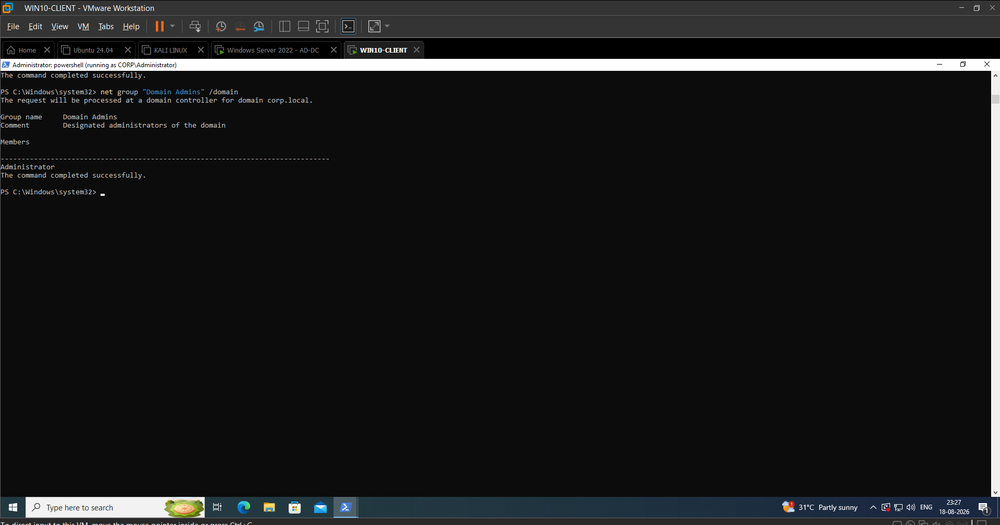

---

# 23. IT-Admins Membership Baseline

The custom IT-Admins group was validated.

Command:

    net group "IT-Admins" /domain

Result:

    Administrator

### Evidence

---

# 24. SOC-Analysts Membership Baseline

The SOC-Analysts group was validated.

Command:

    net group "SOC-Analysts" /domain

Result:

    alice
    bob

### Evidence

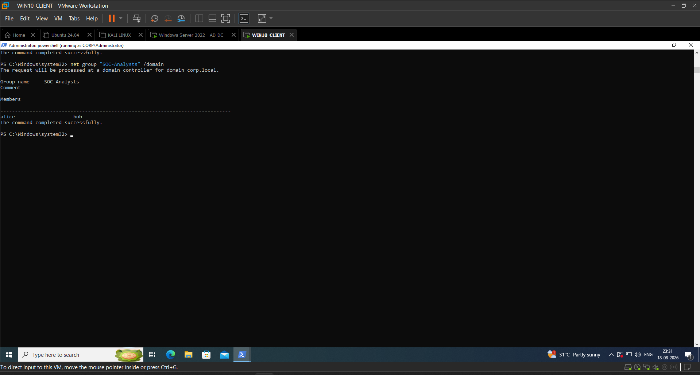

---

# 25. Domain Users Membership Baseline

The Domain Users group was reviewed to understand the standard domain-user population.

The baseline showed the expected domain-user structure and provided context for comparing privileged and non-privileged identities.

### Evidence

---

# 26. Enterprise Admins Membership

## Purpose

Enterprise Admins is a forest-level privileged group.

Command:

    net group "Enterprise Admins" /domain

The result confirmed:

    Administrator

as a member.

This demonstrates that the lab Administrator has forest-level administrative capability.

### Evidence

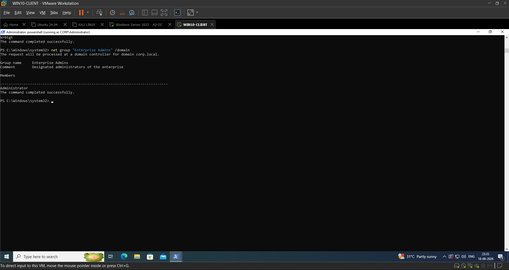

---

# 27. Schema Admins Membership

## Purpose

Schema Admins has permissions to modify the Active Directory schema.

Command:

    net group "Schema Admins" /domain

The result confirmed:

    Administrator

as a member.

### Evidence

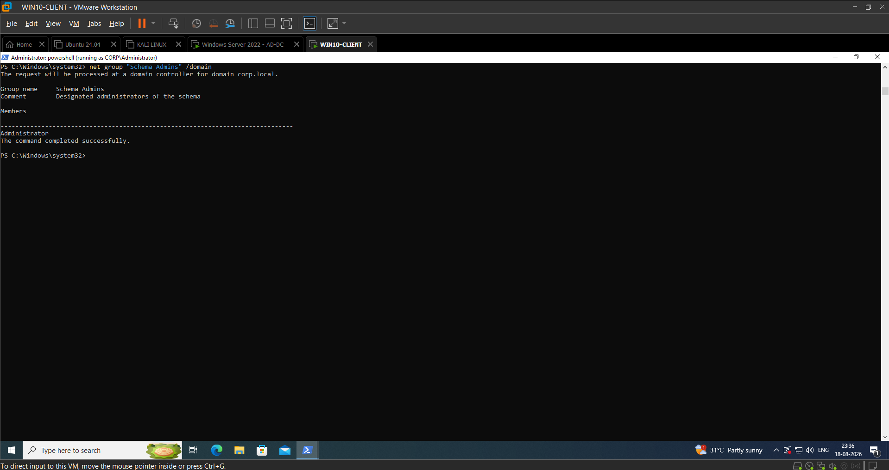

---

# 28. Group Policy Creator Owners Membership

## Purpose

The Group Policy Creator Owners group provides the ability to create Group Policy Objects.

Command:

    net group "Group Policy Creator Owners" /domain

The result confirmed:

    Administrator

as a member.

### Evidence

---

# 29. Active User Session Verification

## Purpose

The currently logged-on interactive session was identified.

Command:

    query user

The output showed:

- User: `alice`
- Session: `console`
- State: `Active`

This provides a baseline for currently active interactive user sessions on the endpoint.

### Evidence

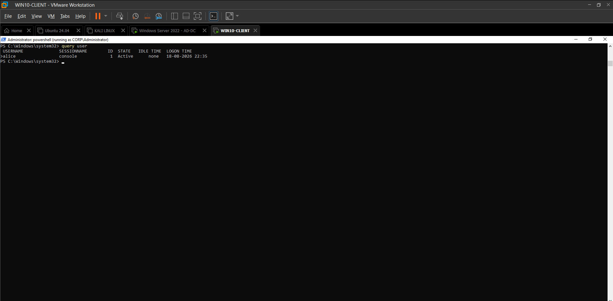

---

# 30. Domain Account Policy Baseline

## Purpose

The domain password and account-lockout policy was reviewed to establish the authentication baseline.

Command:

    net accounts /domain

Observed policy values included:

- Minimum password age: 1 day
- Maximum password age: 42 days
- Minimum password length: 7 characters
- Password history: 24 passwords
- Lockout threshold: Never
- Lockout duration: 30 minutes
- Lockout observation window: 30 minutes

These settings are important for understanding the domain's authentication security posture.

### Evidence

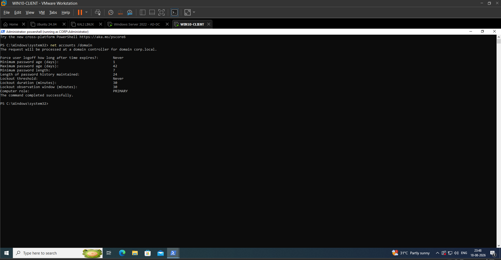

---

# 31. Applied Group Policy — Computer Configuration

## Purpose

The effective Group Policy configuration applied to WIN10-CLIENT was examined.

Command:

    gpresult /r

The output confirmed:

- Domain: `CORP`
- Domain Controller: `AD-DC.corp.local`
- Computer OU: `Lab-Workstations`
- Applied GPO: `Default Domain Policy`
- Local Group Policy was not applied because it was empty.

### Evidence

---

# 32. Applied Group Policy — User Configuration

The user section of the Group Policy result was also reviewed.

The output confirmed the effective user context for:

    CORP\Administrator

and showed the user's Active Directory security-group memberships.

### Evidence

---

# 33. Group Policy HTML Report

## Purpose

A complete HTML Group Policy report was generated to provide a more detailed and reviewable representation of the effective policy configuration.

The report was generated using:

    gpresult /h C:\Users\Administrator\Desktop\Day05-GPReport.html

Because the Administrator desktop required elevated access, the report was copied to a location accessible to the normal user session for review.

The HTML report provides additional Group Policy information beyond the abbreviated `gpresult /r` output.

### Evidence

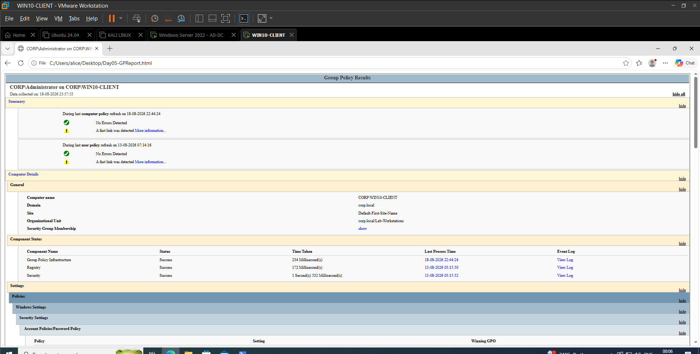

---

# 34. Domain Trust Enumeration

## Purpose

The domain trust configuration was enumerated to identify whether additional trusted domains were present.

Command:

    nltest /domain_trusts

The output showed:

    CORP corp.local (NT 5) (Forest Tree Root) (Primary Domain) (Native)

No additional external domain trust was displayed.

This establishes `corp.local` as the primary domain in the lab environment.

### Evidence

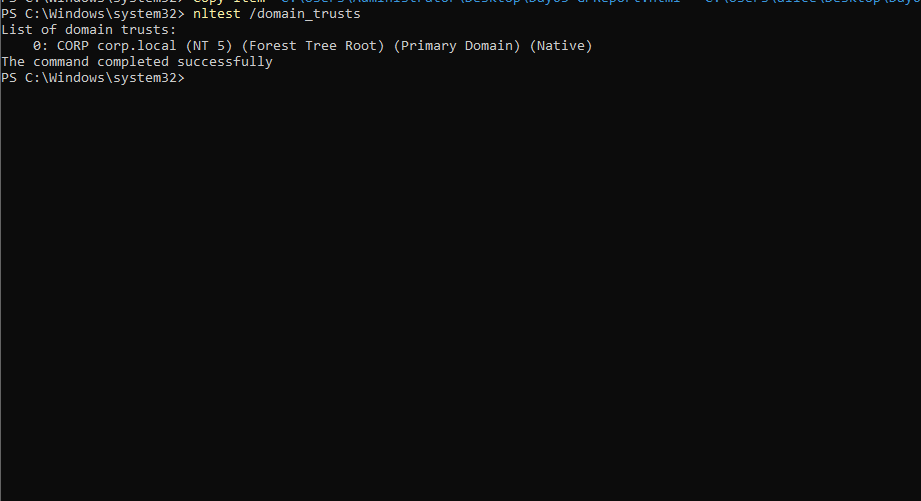

---

# 35. Authentication and Privilege Baseline

The current Administrator security context was validated using:

    whoami

    whoami /groups

    whoami /priv

The results confirmed:

- Current identity: `CORP\Administrator`
- Membership in `CORP\Domain Admins`
- Membership in other privileged domain groups
- Administrative security context
- Enabled and disabled Windows privileges

These results establish the baseline security token before later attack simulations.

### Evidence

The authentication and privilege baseline was captured during the Day 05 enumeration process and is represented in the Day 05 evidence set.

---

# 36. Kerberos Ticket Baseline

## Purpose

Kerberos ticket enumeration was performed to establish the authentication state of the Administrator session.

Command:

    klist

The output showed:

- Current LogonId
- 5 cached Kerberos tickets
- Client: `Administrator @ CORP.LOCAL`
- KDC: `AD-DC.corp.local`
- `krbtgt/CORP.LOCAL`
- CIFS service ticket
- LDAP service ticket
- AES-256 encryption
- Ticket start, end, and renewal times

This establishes a baseline for normal Kerberos authentication activity.

During future attack simulations, abnormal ticket acquisition or unusual service-ticket behavior can be compared against this baseline.

### Evidence

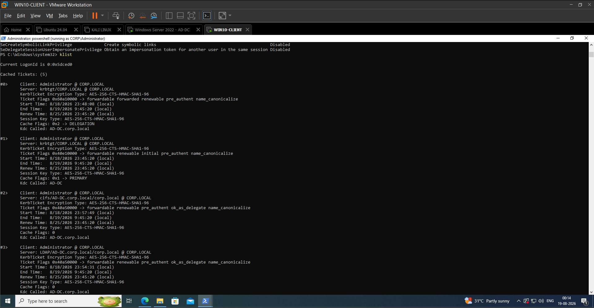

---

# 37. Domain Secure Channel Verification

## Purpose

The secure communication channel between WIN10-CLIENT and the Active Directory domain was verified.

Command:

    nltest /sc_verify:corp.local

The result confirmed:

    Trusted DC Name: \\AD-DC.corp.local

    Trusted DC Connection Status Status = 0 0x0 NERR_Success

    Trusted Verification Status = 0 0x0 NERR_Success

This confirms that the workstation has a healthy secure channel with the domain controller.

### Evidence

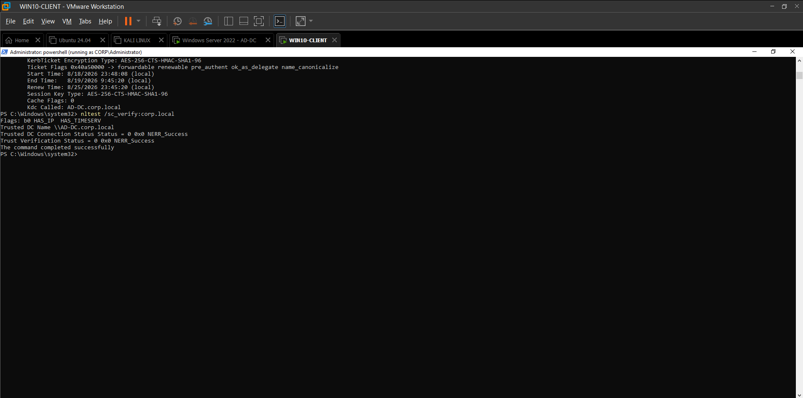

---

# 38. Security Observations

The Day 05 baseline produced several important security observations.

## 38.1 Highly Privileged Administrator

The domain Administrator account has extensive privileges across the Active Directory environment.

Observed memberships include:

- Domain Admins
- Enterprise Admins
- Schema Admins
- IT-Admins
- Group Policy Creator Owners
- Domain Users

This account represents a high-value identity for future attack simulations.

## 38.2 Local Administrative Access

WIN10-CLIENT contains a local `LabAdmin` account with membership in the local Administrators group.

The workstation's local Administrators group also contains:

- Administrator
- CORP\Domain Admins
- LabAdmin

This creates multiple administrative paths to the endpoint.

## 38.3 SOC User Separation

The `SOC-Analysts` group contains:

- alice
- bob

This provides a lower-privileged security-operations identity structure that can be used in future authentication and privilege-related scenarios.

## 38.4 Account Policy

The domain password policy requires a minimum password length of 7 characters and has a 42-day maximum password age.

The account-lockout threshold is configured as `Never`, which is a potentially important security weakness because repeated authentication attempts may not trigger automatic account lockout.

## 38.5 Group Policy

WIN10-CLIENT receives the `Default Domain Policy` from `AD-DC.corp.local`.

The workstation belongs to the `Lab-Workstations` OU.

## 38.6 Kerberos

The Administrator session has normal Kerberos tickets issued by the domain controller.

The baseline includes the domain TGT and service tickets for resources such as CIFS and LDAP.

## 38.7 Domain Trust

The trust enumeration showed the primary `corp.local` domain without additional external trusts.

## 38.8 Secure Channel

The secure channel between WIN10-CLIENT and AD-DC.corp.local returned `NERR_Success`, confirming healthy domain communication.

---

# 39. Detection Engineering Relevance

The identity baseline established on Day 05 will support later SOC detection activities.

Important future detection areas include:

### Account Discovery

Potential telemetry:

- Domain user enumeration
- Domain group enumeration
- Privileged group enumeration

### Privilege Discovery

Potential telemetry:

- `whoami`
- `whoami /groups`
- `whoami /priv`
- Local Administrators enumeration

### Account Manipulation

Potential telemetry:

- Creation of new local or domain accounts
- Addition of users to privileged groups
- Modification of existing privileged accounts

### Authentication Activity

Potential telemetry:

- Windows Security Event ID 4624
- Windows Security Event ID 4625
- Kerberos authentication events
- Unusual logon types
- Unusual source hosts

### Kerberos Abuse

The normal `klist` baseline can later be compared against suspicious Kerberos activity.

### Group Policy Abuse

The Administrator's membership in Group Policy Creator Owners is important because unauthorized Group Policy modification can have broad security impact.

---

# 40. Evidence Summary

Day 05 contains **33 evidence screenshots**.

| Evidence | Description |
|---|---|
| Day05-01 | Windows 10 Domain Controller Discovery |
| Day05-02 | Windows 10 Current User Security Context |
| Day05-03 | Windows 10 Domain User Enumeration |
| Day05-04 | Windows 10 Domain Group Enumeration |
| Day05-05 | Windows 10 Domain Admins Membership |
| Day05-06 | Windows 10 IT-Admins Membership |
| Day05-07 | Windows 10 SOC-Analysts Membership |
| Day05-08 | Windows 10 Alice Domain Account Enumeration |
| Day05-09 | Windows 10 Bob Domain Account Enumeration |
| Day05-10 | Windows 10 Administrator Group Privileges |
| Day05-11 | Windows 10 Administrator Token Privileges |
| Day05-12 | Windows 10 Local Administrators Membership |
| Day05-13 | Windows 10 LabAdmin Account Enumeration |
| Day05-14 | Windows 10 LabAdmin Local Identity Verification |
| Day05-15 | Windows 10 Built-In Administrator Identity |
| Day05-16 | Windows 10 Local User Baseline |
| Day05-17 | Windows 10 Local Administrator Baseline |
| Day05-18 | Windows 10 Local LabAdmin Privilege Baseline |
| Day05-19 | Domain Administrator Account Baseline |
| Day05-20 | Domain Admins Membership Baseline |
| Day05-21 | IT-Admins Membership Baseline |
| Day05-22 | SOC-Analysts Membership Baseline |
| Day05-23 | Domain Users Membership Baseline |
| Day05-24 | Enterprise Admins Membership Baseline |
| Day05-25 | Schema Admins Membership Baseline |
| Day05-26 | Group Policy Creator Owners Membership |
| Day05-27 | Windows 10 Active User Sessions |
| Day05-28 | Domain Account Policy Baseline |
| Day05-29 | Applied Group Policy - Computer |
| Day05-29 | Applied Group Policy - User |
| Day05-30 | Group Policy HTML Report |
| Day05-31 | Domain Trust Enumeration |
| Day05-32 | Kerberos Ticket Baseline |
| Day05-33 | Secure Channel Verification |

---

# 41. Day 05 Final Validation

The following validation checks were successfully completed:

- [x] Domain controller discovered.
- [x] Current domain identity verified.
- [x] Domain users enumerated.
- [x] Domain groups enumerated.
- [x] Domain Admins membership verified.
- [x] IT-Admins membership verified.
- [x] SOC-Analysts membership verified.
- [x] Alice account reviewed.
- [x] Bob account reviewed.
- [x] Administrator account reviewed.
- [x] Local Administrators membership verified.
- [x] LabAdmin account verified.
- [x] Local account baseline established.
- [x] Active user session verified.
- [x] Domain account policy reviewed.
- [x] Group Policy result reviewed.
- [x] Group Policy HTML report generated.
- [x] Domain trust relationships enumerated.
- [x] Authentication and privilege baseline established.
- [x] Kerberos tickets enumerated.
- [x] Domain secure channel verified.
- [x] Evidence organized under `screenshots/Day05/`.
- [x] 33 Day 05 evidence items documented.

---

# 42. Day 05 Outcome

Day 05 established a comprehensive **Active Directory identity, privilege, authentication, and policy baseline** for WIN10-CLIENT.

The environment now has documented information about:

- Domain structure
- Domain controller
- Domain users
- Domain groups
- Privileged identities
- Local administrators
- Account policy
- Group Policy
- Active sessions
- Kerberos tickets
- Domain trusts
- Secure-channel health

This baseline will serve as a reference point for the next stages of the Active Directory Attack & Detection Lab.

The key principle established today is:

> **Understand the normal identity and authentication environment before attempting to detect abnormal behavior.**

---

# 43. Day 05 Status

**Status:** COMPLETE

**Endpoint:** WIN10-CLIENT

**Domain:** CORP / corp.local

**Domain Controller:** AD-DC.corp.local

**Evidence Captured:** 33

**Primary Security Areas:**

- Active Directory Enumeration
- Identity Management
- Privileged Groups
- Local Administration
- Account Policy
- Group Policy
- Authentication
- Kerberos
- Domain Trust
- Secure Channel Validation

