# Day 06 — Kerberoasting Attack Simulation & Detection Engineering

## Project

**Project:** Active Directory Attack & Detection Lab  
**Day:** Day 06  
**Primary Endpoint:** AD-DC / Kali Linux  
**Domain:** CORP / corp.local  
**Domain Controller:** AD-DC.corp.local  
**Client:** WIN10-CLIENT  
**Primary Focus:** SPN enumeration, service-account analysis, Kerberoasting simulation, Kerberos Event ID 4769 investigation, RC4 detection, baseline analysis, event correlation, SOC investigation, and MITRE ATT&CK mapping.

---

# 1. Day 06 Overview

Day 06 focused on simulating and detecting a controlled **Kerberoasting attack** within the Active Directory lab.

The objective was not simply to execute a Kerberoasting tool. The primary Blue Team objective was to understand the complete attack-to-detection lifecycle:

**SPN Enumeration → Service Account Identification → TGS Request → Windows Event 4769 → Detection Engineering → Baseline Analysis → Correlation → SOC Investigation → MITRE ATT&CK Mapping**

A controlled domain service account, `svc_sql`, was configured with an MSSQL Service Principal Name (SPN):

`MSSQLSvc/AD-DC.corp.local:1433`

The low-privileged domain account `alice` was then used from Kali Linux to enumerate the SPN and request a Kerberos service ticket.

The Domain Controller generated Windows Security Event ID **4769**, which was investigated to identify the requester, target service, source address, encryption type, and request status.

The investigation ultimately identified:

- Requesting account: `alice@CORP.LOCAL`
- Target service account: `svc_sql`
- SPN: `MSSQLSvc/AD-DC.corp.local:1433`
- Source IP: `192.168.159.129`
- Ticket Encryption Type: `0x17`
- Failure Code: `0x0`
- Windows Event ID: `4769`

A Kerberos encryption baseline was also established. The observed environment contained predominantly AES-256 (`0x12`) tickets, while the simulated attack generated an RC4 (`0x17`) request.

---

# 2. Day 06 Objectives

The objectives for Day 06 were:

1. Enumerate Service Principal Names in the Active Directory environment.
2. Identify an SPN-backed service account.
3. Prepare a controlled service account for Kerberoasting simulation.
4. Verify the SPN configuration.
5. Establish a pre-attack Kerberos Event 4769 baseline.
6. Perform a controlled Kerberoasting TGS request.
7. Investigate the resulting Windows Security Event 4769.
8. Identify suspicious RC4 Kerberos activity.
9. Develop detection queries.
10. Correlate the requester, service account, SPN, source IP, and encryption type.
11. Compare the suspicious activity against a Kerberos encryption baseline.
12. Map the activity to MITRE ATT&CK.
13. Develop a professional SOC investigation and response workflow.

---

# 3. Lab Environment

| Component | Configuration |
|---|---|
| Active Directory Domain | `corp.local` |
| NetBIOS Domain | `CORP` |
| Domain Controller | `AD-DC.corp.local` |
| Domain Controller IP | `192.168.159.10` |
| Windows Client | `WIN10-CLIENT` |
| Attack Host | Kali Linux |
| Domain User | `alice` |
| Service Account | `svc_sql` |
| SPN | `MSSQLSvc/AD-DC.corp.local:1433` |
| Primary Security Event | 4769 |
| Suspicious Encryption Type | `0x17` / RC4 |

---

# 4. Evidence 01 — SPN Enumeration Baseline

## Purpose

The first stage established a baseline of Service Principal Names (SPNs) present in the Active Directory environment.

SPNs are important to Kerberoasting because they identify services that can receive Kerberos service tickets. Service accounts associated with SPNs are therefore important investigation targets.

## Command

The Active Directory SPN configuration was queried to identify existing registered service principals.

## Result

The environment was confirmed to contain Kerberos service principals associated with domain resources.

This established the initial SPN baseline before introducing the controlled `svc_sql` service account.

## Evidence

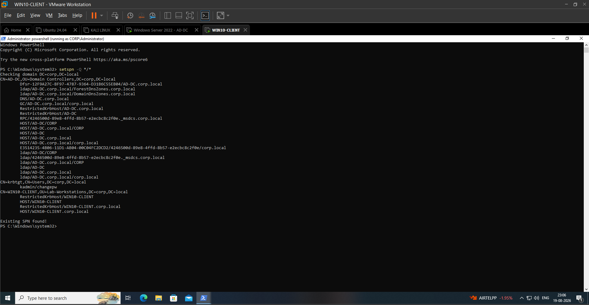

**Evidence File:** `screenshots/Day06/Day06-01-SPN-Enumeration-Baseline.png`

---

# 5. Evidence 02 — Service Account Creation

## Purpose

A dedicated service account was created specifically for the controlled Kerberoasting simulation.

The account was named:

`svc_sql`

Using a dedicated account ensured that the attack simulation remained controlled and that the resulting telemetry could be clearly correlated.

## Account

`CORP\svc_sql`

The account was created as a normal domain user and was not intentionally granted administrative privileges.

## Result

The service account was successfully created in the `corp.local` domain.

## Evidence

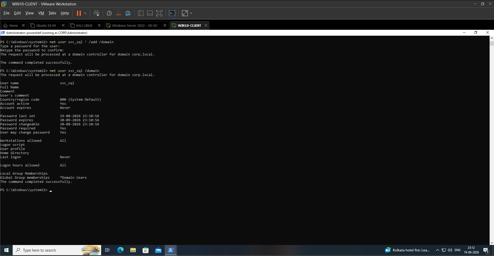

**Evidence File:** `screenshots/Day06/Day06-02-Service-Account-Creation.png`

---

# 6. Evidence 03 — Service Account SPN Configuration

## Purpose

The newly created `svc_sql` account was configured with an MSSQL Service Principal Name.

The SPN used for the lab was:

`MSSQLSvc/AD-DC.corp.local:1433`

## Command

    setspn -S MSSQLSvc/AD-DC.corp.local:1433 CORP\svc_sql

## Result

The SPN was successfully registered against the `svc_sql` service account.

This created the required relationship:

    svc_sql
        |
        +---- MSSQLSvc/AD-DC.corp.local:1433

This SPN became the controlled target of the Kerberoasting simulation.

## Evidence

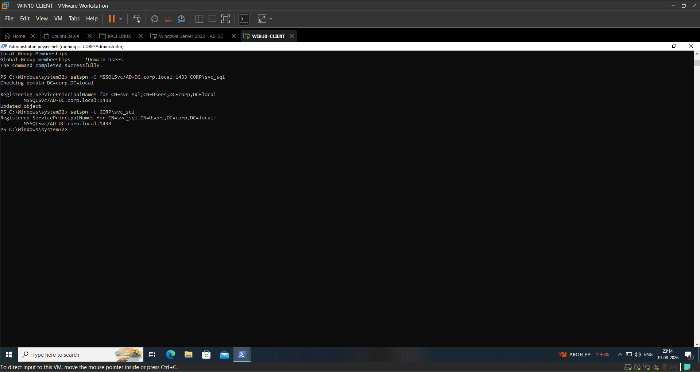

**Evidence File:** `screenshots/Day06/Day06-03-Service-Account-SPN-Configuration.png`

---

# 7. Evidence 04 — SPN Uniqueness Verification

## Purpose

Before beginning the attack simulation, the SPN was checked for uniqueness.

Duplicate SPNs can create authentication and service-resolution problems and would reduce the reliability of the lab experiment.

## Verification

The configured SPN was queried and verified against the `svc_sql` account.

## Result

The SPN was confirmed as:

`MSSQLSvc/AD-DC.corp.local:1433`

The service principal was associated with the intended service account.

This confirmed that the controlled attack target was correctly configured.

## Evidence

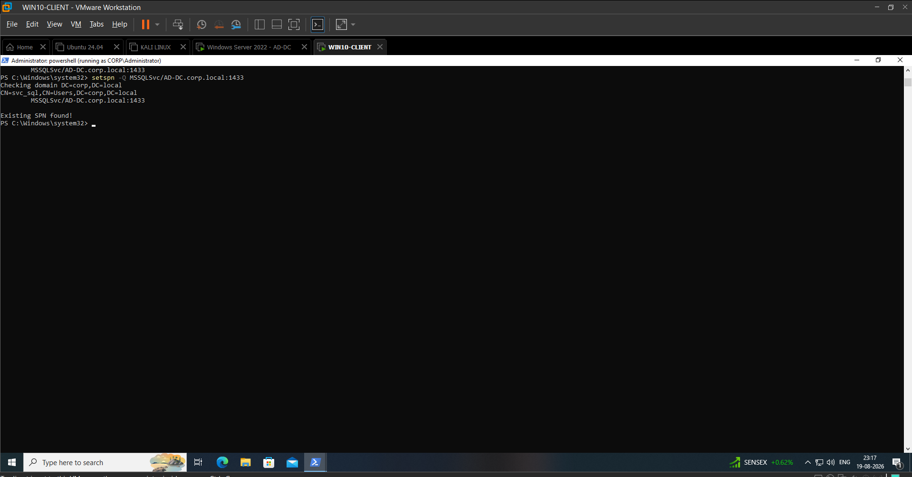

**Evidence File:** `screenshots/Day06/Day06-04-SPN-Uniqueness-Verification.png`

---

# 8. Evidence 05 — Pre-Attack Kerberos 4769 Baseline

## Purpose

Before performing the Kerberoasting simulation, Kerberos Event ID 4769 activity was observed.

This established a pre-attack telemetry baseline that could later be compared with the activity generated by the simulated attack.

## Event

**Windows Security Event ID:** `4769`

**Description:** A Kerberos service ticket was requested.

## Baseline Objective

The purpose of this baseline was to determine:

- Existing Kerberos service-ticket activity
- Existing encryption types
- Normal event frequency
- Whether RC4 activity was already common in the environment

Establishing a baseline is important because detection engineering should distinguish anomalous activity from normal authentication behavior.

## Result

The baseline established the normal Kerberos activity present before the controlled attack.

## Evidence

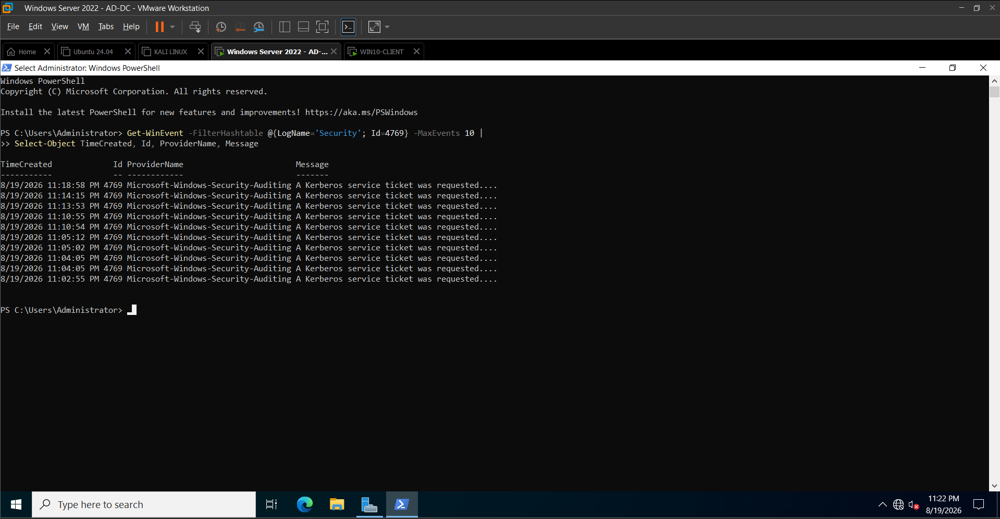

**Evidence File:** `screenshots/Day06/Day06-05-PreAttack-Kerberos-4769-Baseline.png`

---

# 9. Evidence 06 — Kerberoasting TGS Request

## Purpose

The controlled Kerberoasting simulation was performed from Kali Linux using the low-privileged domain account `alice`.

The purpose was to request a Kerberos service ticket for the SPN-backed `svc_sql` account.

## Tool

Impacket `GetUserSPNs`

## Command

    impacket-GetUserSPNs corp.local/alice -dc-host AD-DC.corp.local -request

## Result

The command successfully identified:

    ServicePrincipalName
    MSSQLSvc/AD-DC.corp.local:1433

associated with:

    svc_sql

A Kerberos service ticket was then requested for the SPN.

The resulting ticket material was returned by the tool.

The ticket was **not cracked** because the primary objective of the project is Blue Team detection and investigation rather than password cracking.

## Attack Flow

    alice
      |
      v
    SPN Enumeration
      |
      v
    MSSQLSvc/AD-DC.corp.local:1433
      |
      v
    svc_sql
      |
      v
    Kerberos TGS Request
      |
      v
    AD-DC

## Evidence

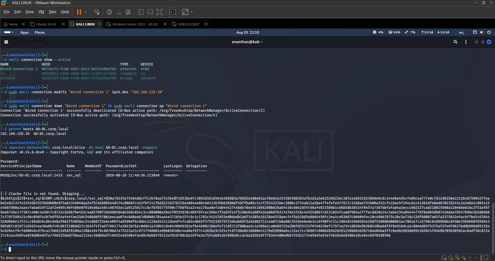

**Evidence File:** `screenshots/Day06/Day06-06-Kerberoasting-TGS-Request.png`

---

# 10. Evidence 07 — Kerberos Event 4769 Attack Evidence

## Purpose

After the TGS request was generated, the Domain Controller was investigated for the Windows Security event associated with the Kerberos service-ticket request.

## Event ID

`4769`

## Relevant Event Details

The investigation identified:

**Account Name:**

`alice@CORP.LOCAL`

**Account Domain:**

`CORP.LOCAL`

**Service Name:**

`svc_sql`

**Client Address:**

`192.168.159.129`

**Ticket Encryption Type:**

`0x17`

**Failure Code:**

`0x0`

The successful request and its relationship to the SPN-backed service account provided the primary Windows telemetry for the attack.

## Interpretation

The event demonstrated that the `alice` account successfully requested a Kerberos service ticket for `svc_sql`.

The request originated from:

`192.168.159.129`

The request used:

`0x17 / RC4`

The successful request was represented by:

`Failure Code 0x0`

## Evidence

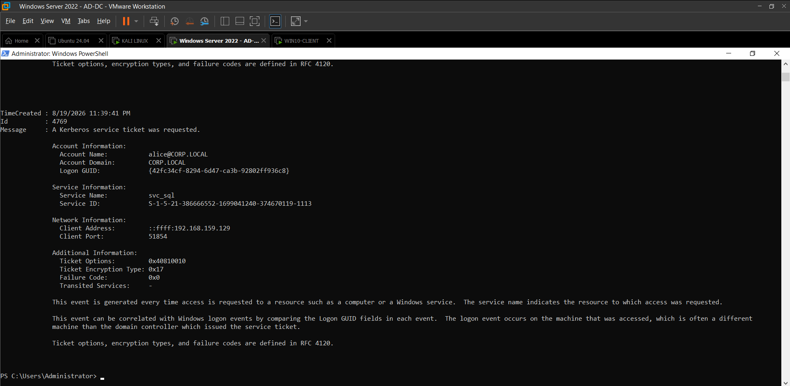

**Evidence File:** `screenshots/Day06/Day06-07-Kerberos-4769-Attack-Evidence.png`

---

# 11. Evidence 08 — Kerberoasting Detection Query

## Purpose

A targeted detection query was created to isolate the known simulated Kerberoasting event.

## Detection Query

    Get-WinEvent -FilterHashtable @{LogName='Security'; Id=4769} |
    Where-Object { $_.Message -match 'svc_sql' -and $_.Message -match '0x17' } |
    Select-Object -First 10 TimeCreated, Id, Message

## Detection Logic

The query searches for:

- Security Event ID `4769`
- Target service account `svc_sql`
- RC4 encryption indicator `0x17`

## Result

The query successfully identified the attack-related Event 4769.

The relevant event occurred at approximately:

`08/19/2026 11:39:41 PM`

This validated that the attack generated detectable Windows Security telemetry.

## Evidence

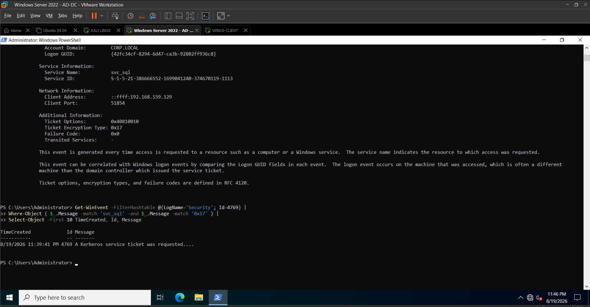

**Evidence File:** `screenshots/Day06/Day06-08-Kerberoasting-Detection-Query.png`

---

# 12. Evidence 09 — Generalized RC4 Kerberos Detection

## Purpose

The previous detection query depended on knowing the target account `svc_sql`.

A more generalized detection was therefore developed to identify suspicious RC4-based Kerberos service-ticket requests without hardcoding the service account.

## Detection Query

    Get-WinEvent -FilterHashtable @{LogName='Security'; Id=4769} |
    Where-Object { $_.Message -match '0x17' } |
    Select-Object -First 20 TimeCreated, Id, Message

## Result

The query successfully identified the same attack-related Event 4769 based on the RC4 encryption indicator.

This demonstrated that the detection can identify suspicious RC4 TGS activity even when the targeted service account is not known in advance.

## Detection Consideration

RC4 alone should not automatically be considered proof of Kerberoasting.

The RC4 indicator becomes significantly more useful when correlated with:

- Event ID 4769
- SPN-backed service account
- Unusual requester
- Unusual source host
- Multiple TGS requests
- Baseline deviation

## Evidence

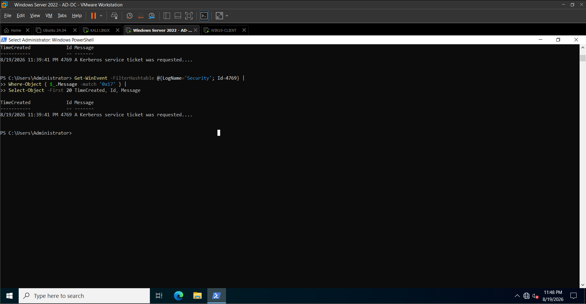

**Evidence File:** `screenshots/Day06/Day06-09-RC4-Kerberos-Detection.png`

---

# 13. Evidence 10 — Kerberoasting Correlation

## Purpose

The suspicious Event 4769 was correlated with the previously identified SPN and service account.

This moved the investigation from simple indicator detection to contextual SOC analysis.

## SPN

    MSSQLSvc/AD-DC.corp.local:1433

## Service Account

    svc_sql

## Requesting Account

    alice@CORP.LOCAL

## Source IP

    192.168.159.129

## Encryption Type

    0x17 / RC4

## Failure Code

    0x0

## Correlation

The complete relationship was:

    alice@CORP.LOCAL
            |
            | Kerberos TGS request
            v
    svc_sql
            |
            | SPN
            v
    MSSQLSvc/AD-DC.corp.local:1433
            |
            | Event 4769
            v
    RC4 / 0x17
            |
            v
    Source: 192.168.159.129

This correlation provided strong evidence that the observed event was generated by the controlled Kerberoasting simulation.

## Evidence

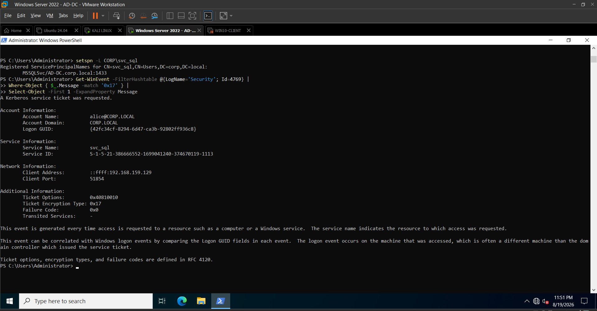

**Evidence File:** `screenshots/Day06/Day06-10-Kerberoasting-Correlation-Evidence.png`

---

# 14. Evidence 11 — Kerberos Encryption Baseline

## Purpose

The final stage of the detection validation process was to compare the suspicious RC4 request against the existing Kerberos encryption baseline.

## Query

    Get-WinEvent -FilterHashtable @{LogName='Security'; Id=4769} -MaxEvents 50 |
    ForEach-Object {
        if ($_.Message -match 'Ticket Encryption Type:\s+(0x[0-9a-fA-F]+)') {
            [PSCustomObject]@{
                Time = $_.TimeCreated
                EncryptionType = $matches[1]
            }
        }
    } |
    Group-Object EncryptionType |
    Sort-Object Count -Descending

## Observed Result

The observed baseline contained:

| Encryption Type | Count |
|---|---:|
| `0x12` / AES-256 | 49 |
| `0x17` / RC4 | 1 |

The environment was therefore overwhelmingly using AES-256 in the observed sample.

The simulated Kerberoasting request generated the single observed RC4 event.

## Detection Significance

This does **not** mean:

`0x17 = automatically malicious`

Instead, the stronger detection logic is:

    Event 4769
        +
    RC4 / 0x17
        +
    SPN-backed service account
        +
    Unusual requester/source
        +
    Baseline deviation
        =
    High-confidence Kerberoasting indicator

The baseline therefore provides important environmental context for the detection.

## Evidence

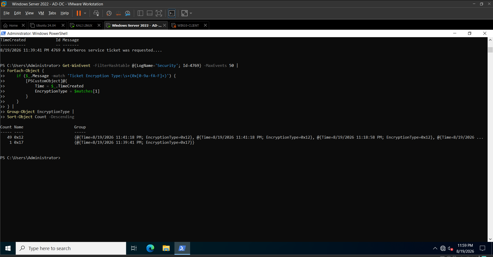

**Evidence File:** `screenshots/Day06/Day06-11-Kerberos-Encryption-Baseline.png`

---

# 15. Detection Engineering

The reusable detection logic was documented separately in:

`detections/Kerberoasting-4769.md`

## Detection Name

**Suspicious Kerberos RC4 TGS Request**

## Primary Log Source

Windows Security Event Log

## Primary Event

`4769 — A Kerberos service ticket was requested`

## Core Detection Conditions

    Event ID = 4769
        AND
    Ticket Encryption Type = 0x17
        AND
    Failure Code = 0x0

## Contextual Indicators

Detection confidence should increase when:

- The target is an SPN-backed service account.
- The requester is unusual.
- The source host is unusual.
- Multiple service tickets are requested.
- RC4 is rare within the environment.
- Other credential-access indicators are observed.

---

# 16. Detection Severity

## Medium

An isolated RC4 (`0x17`) TGS request without additional suspicious context.

## High

RC4 combined with multiple contextual indicators such as:

- SPN-backed service account
- Unexpected requester
- Unusual source IP or workstation
- Multiple TGS requests
- Successful Event 4769
- Additional credential-access telemetry
- Significant deviation from the established Kerberos baseline

## Lab Assessment

Within this lab, the observed RC4 event was considered a high-value investigation signal because:

- AES-256 was dominant.
- RC4 was rare.
- The request targeted an SPN-backed service account.
- The requester was `alice`.
- The source was `192.168.159.129`.
- The request was successful.
- The event was generated during the controlled Kerberoasting simulation.

---

# 17. False Positive Considerations

RC4-based Kerberos activity may occur legitimately in environments containing:

- Legacy applications
- Older service accounts
- Legacy authentication dependencies
- Systems that have not migrated to stronger Kerberos encryption

Therefore:

**An Event 4769 containing RC4 is not automatically proof of Kerberoasting.**

The detection should use contextual correlation.

Confidence increases when:

- RC4 is rare in the environment.
- The requester normally does not access the target service.
- The target account has an SPN.
- Multiple TGS requests occur in a short period.
- The source system is unusual.
- Additional endpoint telemetry supports credential-access activity.

---

# 18. SOC Investigation Workflow

When the detection triggers, the SOC analyst should follow the following workflow:

    1. Identify the requesting account.
           |
           v
    2. Identify the target service account.
           |
           v
    3. Identify the registered SPN.
           |
           v
    4. Identify the source IP / hostname.
           |
           v
    5. Review the Ticket Encryption Type.
           |
           v
    6. Check the Failure Code.
           |
           v
    7. Review nearby Event 4769 activity.
           |
           v
    8. Compare activity against the baseline.
           |
           v
    9. Correlate with endpoint telemetry.
           |
           v
    10. Determine whether activity is legitimate or malicious.

---

# 19. MITRE ATT&CK Mapping

## Tactic

**Credential Access**

## Technique

**T1558 — Steal or Forge Kerberos Tickets**

## Sub-technique

**T1558.003 — Kerberoasting**

## Attack Mapping

    Low-privileged domain account
                |
                v
        SPN Enumeration
                |
                v
        SPN-backed Service Account
                |
                v
        Kerberos TGS Request
                |
                v
        Service Ticket Material
                |
                v
        Potential Credential Access

The simulated activity maps to:

**MITRE ATT&CK T1558.003 — Kerberoasting**

---

# 20. Recommended Defensive Response

If similar activity is confirmed in a production environment:

1. Investigate the source workstation.
2. Validate the requesting user's activity.
3. Review the targeted service account.
4. Determine whether the SPN is required.
5. Reset the affected service-account credentials if compromise is suspected.
6. Review unnecessary SPNs.
7. Prefer AES-based Kerberos encryption where supported.
8. Review surrounding authentication events.
9. Investigate endpoint telemetry from the source host.
10. Monitor for additional credential-access activity.

---

# 21. Investigation Summary

The investigation established the following attack chain:

    Kali
      |
      | alice authentication
      v
    SPN Enumeration
      |
      | MSSQLSvc/AD-DC.corp.local:1433
      v
    svc_sql
      |
      | TGS Request
      v
    AD-DC
      |
      | Event 4769
      v
    Security Log
      |
      +---- Requester: alice@CORP.LOCAL
      +---- Service: svc_sql
      +---- Source: 192.168.159.129
      +---- Encryption: 0x17
      +---- Failure Code: 0x0
      |
      v
    Detection
      |
      v
    Baseline Comparison
      |
      v
    SOC Investigation
      |
      v
    MITRE T1558.003

---

# 22. Evidence Index

All Day 06 evidence is stored under:

`screenshots/Day06/`

| # | Evidence | File |
|---:|---|---|
| 01 | SPN Enumeration Baseline | `Day06-01-SPN-Enumeration-Baseline.png` |
| 02 | Service Account Creation | `Day06-02-Service-Account-Creation.png` |
| 03 | Service Account SPN Configuration | `Day06-03-Service-Account-SPN-Configuration.png` |
| 04 | SPN Uniqueness Verification | `Day06-04-SPN-Uniqueness-Verification.png` |
| 05 | Pre-Attack Kerberos 4769 Baseline | `Day06-05-PreAttack-Kerberos-4769-Baseline.png` |
| 06 | Kerberoasting TGS Request | `Day06-06-Kerberoasting-TGS-Request.png` |
| 07 | Kerberos 4769 Attack Evidence | `Day06-07-Kerberos-4769-Attack-Evidence.png` |
| 08 | Kerberoasting Detection Query | `Day06-08-Kerberoasting-Detection-Query.png` |
| 09 | RC4 Kerberos Detection | `Day06-09-RC4-Kerberos-Detection.png` |
| 10 | Kerberoasting Correlation Evidence | `Day06-10-Kerberoasting-Correlation-Evidence.png` |
| 11 | Kerberos Encryption Baseline | `Day06-11-Kerberos-Encryption-Baseline.png` |

---

# 23. Day 06 Deliverables

Day 06 produced the following project artifacts:

### Attack Simulation

- Controlled SPN-backed service account
- Kerberoasting TGS request
- Kerberos ticket/hash material

### Detection Engineering

- Event ID 4769 detection query
- RC4-based detection query
- Contextual correlation logic
- Kerberos encryption baseline
- False-positive considerations

### SOC Investigation

- Requester identification
- Service-account identification
- SPN identification
- Source IP identification
- Encryption analysis
- Baseline comparison
- Investigation workflow
- Response recommendations

### MITRE ATT&CK

- T1558 — Steal or Forge Kerberos Tickets
- T1558.003 — Kerberoasting

### Documentation

- `docs/Day06.md`
- `detections/Kerberoasting-4769.md`
- 11 Day 06 evidence screenshots

---

# 24. Key SOC Skills Demonstrated

Day 06 demonstrated practical experience with:

- Active Directory attack simulation
- Kerberos authentication
- Service Principal Names
- Kerberoasting
- Impacket
- Windows Security Event Logs
- Event ID 4769
- Kerberos encryption types
- RC4 detection
- Detection engineering
- Security telemetry analysis
- Baseline creation
- Event correlation
- False-positive analysis
- SOC investigation
- MITRE ATT&CK mapping
- Defensive response planning

---

# 25. Day 06 Conclusion

Day 06 successfully demonstrated an end-to-end Active Directory attack detection workflow.

The controlled Kerberoasting simulation began with SPN enumeration and service-account preparation. The `svc_sql` account was configured with an MSSQL SPN, after which the low-privileged `alice` account was used to request a Kerberos service ticket from Kali Linux.

The Domain Controller generated Event ID 4769, allowing the activity to be investigated from a Blue Team perspective.

The investigation identified:

    Requester:
    alice@CORP.LOCAL

    Target:
    svc_sql

    SPN:
    MSSQLSvc/AD-DC.corp.local:1433

    Source:
    192.168.159.129

    Encryption:
    0x17 / RC4

    Failure Code:
    0x0

The detection was then generalized beyond the known `svc_sql` account and validated against the observed Kerberos encryption baseline.

The baseline contained:

    49 × AES-256 / 0x12
    1 × RC4 / 0x17

This made the observed RC4 request anomalous within the lab environment and increased the confidence of the detection.

The final workflow demonstrated:

**Attack Simulation → SPN Discovery → TGS Request → Event 4769 → Detection Engineering → Baseline Analysis → Event Correlation → SOC Investigation → MITRE ATT&CK Mapping → Defensive Response**

