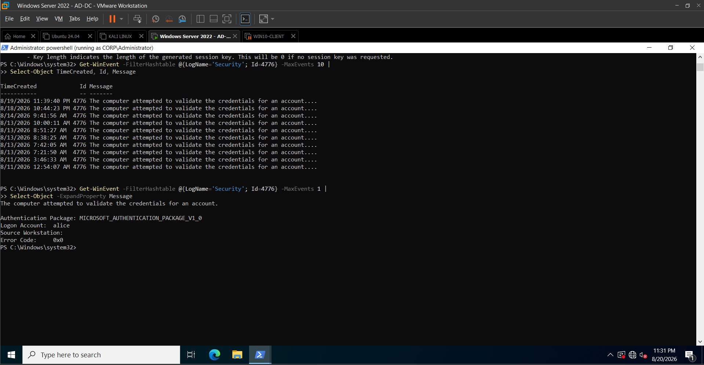
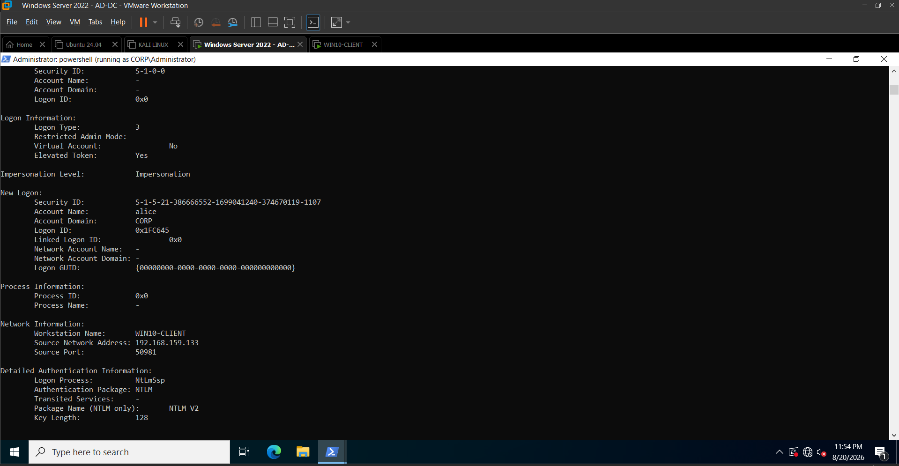
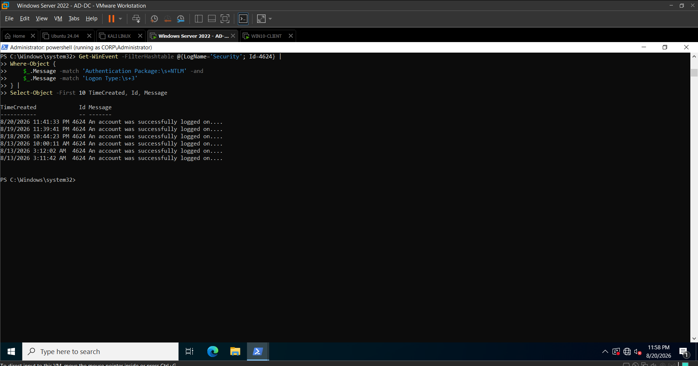
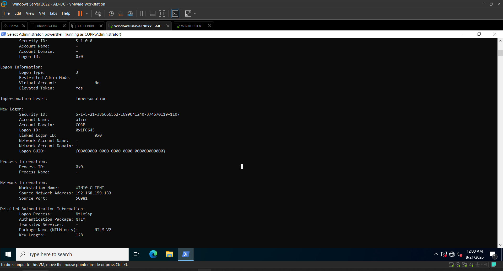
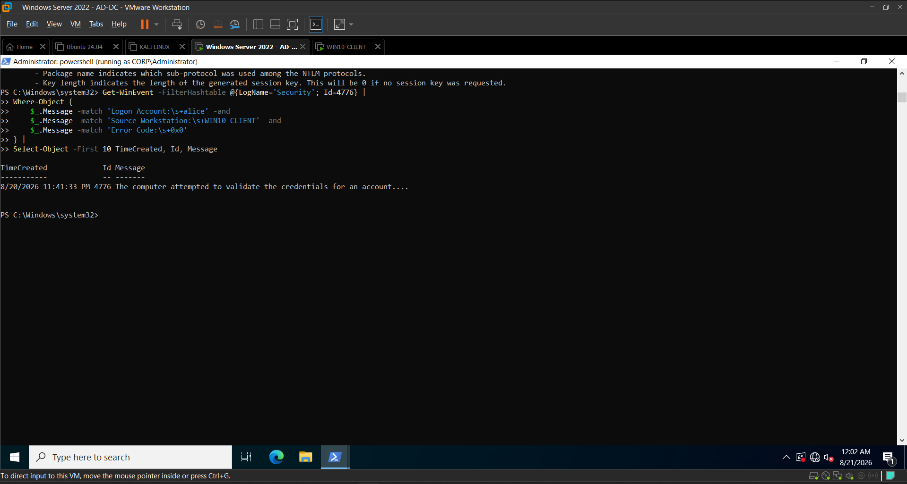
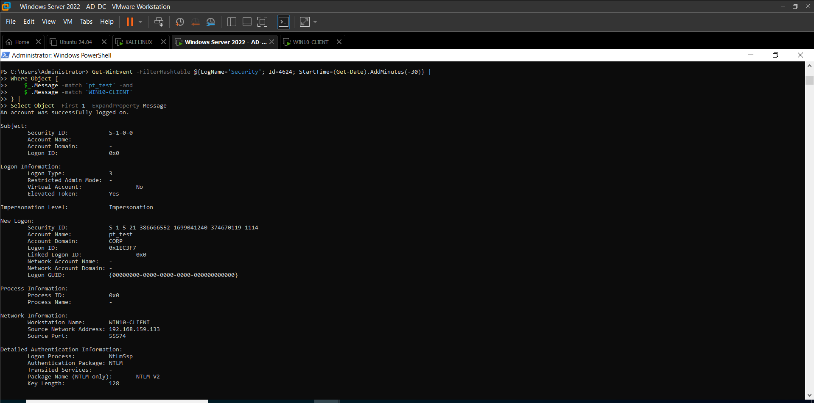

# Day 07 — NTLM Authentication Investigation, Correlation & Detection Engineering

## Project

**Project:** Active Directory Attack & Detection Lab  
**Day:** Day 07  
**Primary Endpoints:** AD-DC / WIN10-CLIENT / Kali Linux  
**Domain:** CORP / corp.local  
**Domain Controller:** AD-DC.corp.local  
**Client:** WIN10-CLIENT  
**Attack/Test Host:** Kali Linux  
**Primary Focus:** NTLM authentication analysis, Event ID 4624, Event ID 4776, authentication baselining, SMB authentication, unexpected-source detection, event correlation, detection engineering, SOC investigation, and MITRE ATT&CK mapping.

---

# 1. Day 07 Overview

Day 07 focused on investigating and detecting suspicious NTLM authentication within the Active Directory lab.

The primary Blue Team objective was to understand how a successful authentication can still become suspicious when the authentication context differs from the established baseline.

The investigation followed the lifecycle:

**Authentication Theory → Baseline → SMB Connectivity → Controlled Authentication → Event 4624 → Event 4776 → Correlation → Detection Query → Investigation → Documentation**

A dedicated test account, `pt_test`, was used to keep the experiment controlled.

First, normal authentication behavior was established from the Windows client.

The same account was then used from the Kali Linux system to generate an unexpected-source NTLM authentication.

The resulting telemetry demonstrated:

- Successful network logon
- Logon Type `3`
- NTLM authentication
- NTLM V2
- Source workstation `KALI`
- Source IP `192.168.159.129`
- Account `pt_test`
- Windows Event ID `4624`
- Domain Controller Event ID `4776`
- Successful credential validation with Error Code `0x0`

The investigation demonstrated how endpoint and Domain Controller telemetry can be correlated to identify authentication anomalies.

---

# 2. Day 07 Objectives

The objectives for Day 07 were:

1. Understand NTLM authentication from a Blue Team perspective.
2. Understand the purpose of Windows Security Event ID `4624`.
3. Understand the purpose of Windows Security Event ID `4776`.
4. Establish a normal authentication baseline.
5. Create a dedicated test account for controlled testing.
6. Verify SMB connectivity between the lab systems.
7. Generate controlled NTLM authentication from Kali Linux.
8. Investigate the resulting Event ID `4624`.
9. Investigate the corresponding Event ID `4776`.
10. Correlate account, source, timestamp, and authentication information.
11. Identify an unexpected-source authentication anomaly.
12. Build repeatable PowerShell detection queries.
13. Validate the detection against real lab telemetry.
14. Document false positives and detection limitations.
15. Map the observed behavior to MITRE ATT&CK.
16. Produce a professional SOC detection artifact.

---

# 3. Lab Environment

| Component | Configuration |
|---|---|
| Active Directory Domain | `corp.local` |
| NetBIOS Domain | `CORP` |
| Domain Controller | `AD-DC.corp.local` |
| Domain Controller IP | `192.168.159.10` |
| Windows Client | `WIN10-CLIENT` |
| Windows Client IP | `192.168.159.133` |
| Attack/Test Host | Kali Linux |
| Kali IP | `192.168.159.129` |
| Test Account | `CORP\pt_test` |
| Authentication Protocol | NTLM / NTLMv2 |
| SMB Port | TCP/445 |
| Primary Security Events | `4624`, `4776` |

---

# 4. NTLM Theory

## 4.1 What is NTLM?

NTLM is a Microsoft authentication protocol used to authenticate users and computers in Windows environments.

Unlike Kerberos, NTLM relies on a challenge-response authentication mechanism.

In a domain environment, NTLM can still appear when:

- Kerberos cannot be used
- A legacy application requires NTLM
- SMB or other network authentication falls back to NTLM
- Authentication is performed using compatible Windows protocols

Therefore:

**NTLM authentication alone is not malicious.**

A SOC analyst must examine the surrounding context.

---

## 4.2 Why NTLM Authentication Matters to a SOC Analyst

NTLM becomes more interesting when an account authenticates from an unexpected source.

For example:

**Normal**

`pt_test → WIN10-CLIENT → NTLM`

**Suspicious**

`pt_test → KALI → NTLM`

The authentication protocol is the same.

The important change is the **authentication source**.

This demonstrates why authentication baselining is important in detection engineering.

---

# 5. Windows Event ID 4624

Event ID `4624` represents a successful logon.

For this investigation, the most important fields were:

- Account Name
- Account Domain
- Logon Type
- Workstation Name
- Source Network Address
- Logon Process
- Authentication Package
- Package Name

The investigation focused particularly on:

`Logon Type 3`

and:

`Authentication Package: NTLM`

Logon Type `3` represents a network logon.

This is particularly useful when investigating network-based authentication such as SMB.

---

# 6. Windows Event ID 4776

Event ID `4776` represents credential validation activity.

For this investigation, the important fields were:

- Authentication Package
- Logon Account
- Source Workstation
- Error Code

The key success indicator was:

`Error Code: 0x0`

A `0x0` result indicates successful credential validation.

Event ID `4776` therefore provided Domain Controller-side authentication context that could be correlated with the client-side Event ID `4624`.

---

# 7. Evidence 01 — Initial NTLM 4776 Baseline

## Purpose

The first stage established an initial baseline for NTLM-related credential validation activity.

## Evidence

**Evidence File:** `screenshots/Day07/Day07-01-NTLM-4776-Baseline.png`

This established the initial Event ID `4776` telemetry available in the environment before the dedicated test-account workflow.

---

# 8. Evidence 02 — NTLM Authentication Test

## Purpose

A controlled NTLM authentication test was performed to understand the telemetry generated by network authentication.

## Evidence

**Evidence File:** `screenshots/Day07/Day07-02-NTLM-Authentication-Test.png`

The test was used to establish the relationship between authentication activity and the Windows Security events generated by the environment.

---

# 9. Evidence 03 — Initial 4624 Correlation

## Purpose

The Windows client was investigated for successful logon telemetry associated with the authentication test.

## Evidence

**Evidence File:** `screenshots/Day07/Day07-03-NTLM-4624-Correlation.png`

This provided an initial view of the Event ID `4624` authentication telemetry.

---

# 10. Evidence 04 — Initial Detection Query

## Purpose

A preliminary query was developed to identify NTLM-related successful authentication activity.

## Evidence

**Evidence File:** `screenshots/Day07/Day07-04-NTLM-Detection-Query.png`

This represented the initial detection-engineering stage before the dedicated `pt_test` investigation.

---

# 11. Evidence 05 — Full Event 4624 Telemetry

## Purpose

The full Event ID `4624` event was inspected to identify authentication details that could be useful for detection.

## Evidence

**Evidence File:** `screenshots/Day07/Day07-05-NTLM-4624-Full-Telemetry.png`

Important fields considered during the investigation included:

- Account
- Logon Type
- Workstation
- Source IP
- Authentication Package
- Logon Process

---

# 12. Evidence 06 — 4776 Correlation Query

## Purpose

A Domain Controller-side query was developed to investigate Event ID `4776` and correlate authentication activity.

## Evidence

**Evidence File:** `screenshots/Day07/Day07-06-NTLM-4776-Correlation-Query.png`

This established the second telemetry source required for the later 4624/4776 correlation.

---

# 13. Evidence 07 — SMB Connectivity Verification

## Purpose

Before performing the controlled network authentication test, SMB connectivity was verified.

SMB uses TCP port `445` and is one of the common Windows network protocols through which authentication telemetry can be generated.

## Evidence

**Evidence File:** `screenshots/Day07/Day07-07-SMB-Connectivity-Verified.png`

The connectivity verification confirmed that the lab environment was ready for controlled SMB authentication testing.

---

# 14. Evidence 08 — Test Account Creation

## Purpose

A dedicated account was created specifically for the controlled authentication experiment.

The account was:

`CORP\pt_test`

Using a dedicated account reduced ambiguity and prevented the investigation from depending on an existing administrative identity.

## Evidence

**Evidence File:** `screenshots/Day07/Day07-08-PT-Test-Account-Creation.png`

The account was used only for controlled lab authentication testing.

---

# 15. Evidence 09 — Test Account Local Access

## Purpose

The newly created test account was validated within the Windows environment before performing the network authentication test.

## Evidence

**Evidence File:** `screenshots/Day07/Day07-09-PT-Test-Local-Access.png`

This confirmed that the test account was available for the planned authentication workflow.

---

# 16. Evidence 10 — Normal Authentication Baseline

## Purpose

A normal authentication baseline was established before introducing the unexpected-source condition.

The expected authentication source was:

`WIN10-CLIENT`

The account used was:

`pt_test`

## Evidence

**Evidence File:** `screenshots/Day07/Day07-10-PT-Test-Normal-Authentication.png`

The baseline provided the reference point for determining whether authentication from another workstation should be considered anomalous.

---

# 17. Evidence 11 — Successful 4776 Baseline

## Purpose

The Domain Controller was investigated for successful credential validation associated with the normal authentication.

## Evidence

**Evidence File:** `screenshots/Day07/Day07-11-PT-Test-4776-Success.png`

The baseline demonstrated successful credential validation for the `pt_test` account.

---

# 18. Evidence 12 — Normal 4624 Correlation

## Purpose

The corresponding successful logon on the Windows client was investigated.

## Evidence

**Evidence File:** `screenshots/Day07/Day07-12-PT-Test-4624-Correlation.png`

The normal authentication established the expected authentication context before the suspicious-source test.

---

# 19. Evidence 13 — Full Normal NTLM Telemetry

## Purpose

The complete Event ID `4624` telemetry for the normal authentication was inspected.

## Evidence

**Evidence File:** `screenshots/Day07/Day07-13-PT-Test-4624-Full-NTLM-Telemetry.png`

The normal authentication demonstrated:

- Account: `pt_test`
- Domain: `CORP`
- Logon Type: `3`
- Source: `WIN10-CLIENT`
- Source IP: `192.168.159.133`
- Authentication Package: `NTLM`
- Package Name: `NTLM V2`

This became the expected baseline for the later comparison.

---

# 20. Evidence 14 — Controlled SMB Authentication

## Purpose

The same dedicated account was used to perform controlled SMB authentication from Kali Linux.

The purpose was to generate realistic Windows authentication telemetry for detection validation.

## Evidence

**Evidence File:** `screenshots/Day07/Day07-14-PT-Test-SMB-Authentication.png`

The controlled authentication originated from:

`KALI`

Source IP:

`192.168.159.129`

The destination Windows client was:

`WIN10-CLIENT`

---

# 21. Evidence 15 — Suspicious 4624 Detection

## Purpose

After the controlled authentication, the Windows client was investigated for a successful logon originating from Kali.

## Evidence

**Evidence File:** `screenshots/Day07/Day07-15-PT-Test-Kali-4624-Detection.png`

The event represented the primary suspicious authentication signal.

The key difference from the baseline was:

**Baseline Source:**

`WIN10-CLIENT`

**Suspicious Source:**

`KALI`

---

# 22. Evidence 16 — Full Suspicious 4624 Telemetry

## Purpose

The full Event ID `4624` telemetry was inspected to determine the exact authentication context.

## Evidence

**Evidence File:** `screenshots/Day07/Day07-16-PT-Test-Kali-4624-Full-Telemetry.png`

Observed values:

| Field | Value |
|---|---|
| Event ID | `4624` |
| Account Name | `pt_test` |
| Account Domain | `CORP` |
| Logon Type | `3` |
| Workstation Name | `KALI` |
| Source Network Address | `192.168.159.129` |
| Logon Process | `NtLmSsp` |
| Authentication Package | `NTLM` |
| Package Name | `NTLM V2` |
| Key Length | `128` |

The authentication was successful.

The anomaly was the unexpected authentication source.

---

# 23. Evidence 17 — Suspicious 4776 Correlation

## Purpose

The Domain Controller was investigated for credential validation associated with the same suspicious authentication.

## Evidence

**Evidence File:** `screenshots/Day07/Day07-17-PT-Test-Kali-4776-Correlation.png`

Observed values:

| Field | Value |
|---|---|
| Event ID | `4776` |
| Logon Account | `pt_test` |
| Source Workstation | `KALI` |
| Error Code | `0x0` |

The Domain Controller successfully validated the credentials.

This provided the second side of the authentication correlation.

---

# 24. Event Correlation

The most important part of the investigation was correlating Event ID `4624` with Event ID `4776`.

The observed relationship was:

| Attribute | Event 4624 | Event 4776 |
|---|---|---|
| Account | `pt_test` | `pt_test` |
| Source | `KALI` | `KALI` |
| Authentication | NTLM | Credential validation |
| Result | Successful | `0x0` |
| Timestamp | `23:39:33` | `23:39:33` |

The matching account, source workstation, and timestamp provided strong evidence that the two events represented the same controlled authentication activity.

---

# 25. Detection Query — Event ID 4624

The following PowerShell query was used to validate the suspicious authentication on the Windows client.

    Get-WinEvent -FilterHashtable @{LogName='Security'; Id=4624; StartTime=(Get-Date).AddMinutes(-60)} |
    Where-Object {
        $_.Message -match 'pt_test' -and
        $_.Message -match 'KALI' -and
        $_.Message -match 'Authentication Package:\s+NTLM'
    } |
    Select-Object TimeCreated, Id, Message

The query successfully returned the controlled suspicious Event ID `4624`.

---

# 26. Evidence 18 — Validated 4624 Detection Query

**Evidence File:** `screenshots/Day07/Day07-18-NTLM-Suspicious-4624-Detection-Query.png`

The query identified the expected:

- `pt_test`
- `KALI`
- NTLM authentication
- Event ID `4624`

This validated the endpoint-side detection condition.

---

# 27. Detection Query — Event ID 4776

The corresponding Domain Controller query was used to identify successful credential validation for the same account and source.

    Get-WinEvent -FilterHashtable @{LogName='Security'; Id=4776; StartTime=(Get-Date).AddMinutes(-60)} |
    Where-Object {
        $_.Message -match 'pt_test' -and
        $_.Message -match 'KALI' -and
        $_.Message -match 'Error Code:\s+0x0'
    } |
    Select-Object TimeCreated, Id, Message

The query successfully returned the controlled suspicious Event ID `4776`.

---

# 28. Evidence 19 — Validated 4776 Detection Query

**Evidence File:** `screenshots/Day07/Day07-19-NTLM-Suspicious-4776-Detection-Query.png`

The query identified:

- `pt_test`
- `KALI`
- Successful credential validation
- Error Code `0x0`
- Event ID `4776`

This validated the Domain Controller-side detection condition.

---

# 29. Detection Logic

The detection developed during Day 7 uses authentication context rather than simply detecting NTLM.

## Primary Signal

Identify:

- Event ID `4624`
- Logon Type `3`
- Authentication Package `NTLM`
- Domain account
- Unexpected source workstation or IP

## Correlation Signal

Increase confidence when Event ID `4776` also shows:

- Same account
- Same source workstation
- Successful credential validation
- Error Code `0x0`
- Matching or near-matching timestamp

The conceptual logic is:

    Event 4624
        |
        +-- Logon Type 3
        |
        +-- Authentication = NTLM
        |
        +-- Identify source
        |
        v
    Compare with expected baseline
        |
        +-- Expected source
        |       |
        |       +--> Lower investigation priority
        |
        +-- Unexpected source
                |
                v
            Event 4776
                |
                +-- Same account
                +-- Same source
                +-- Error 0x0
                |
                v
        Correlation Confirmed
                |
                v
        SOC Investigation

---

# 30. Baseline vs Suspicious Authentication

| Attribute | Normal Baseline | Suspicious Test |
|---|---|---|
| Account | `pt_test` | `pt_test` |
| Source Host | `WIN10-CLIENT` | `KALI` |
| Source IP | `192.168.159.133` | `192.168.159.129` |
| Authentication | NTLM | NTLM |
| Logon Type | `3` | `3` |
| Event 4624 | Yes | Yes |
| Event 4776 | Yes | Yes |
| Credential Validation | `0x0` | `0x0` |

The key difference was the source of authentication.

### Normal

`pt_test → WIN10-CLIENT → NTLM`

### Suspicious

`pt_test → KALI → NTLM`

This demonstrates the value of authentication baselines.

---

# 31. SOC Investigation Workflow

When the detection fires, an analyst should investigate the authentication context.

## Step 1 — Identify the Account

Determine:

- Account name
- Domain
- Account type
- Privilege level
- Whether it is a user or service account

## Step 2 — Identify the Source

Determine:

- Source workstation
- Source IP
- Whether the host is expected
- Whether the source is an administrative system
- Whether the source has known security-testing or management purposes

## Step 3 — Review Event 4624

Inspect:

- Logon Type
- Authentication Package
- Source IP
- Workstation
- Logon Process
- Timestamp

## Step 4 — Review Event 4776

Inspect:

- Logon Account
- Source Workstation
- Authentication Package
- Error Code

## Step 5 — Correlate

Compare:

- Account
- Source
- Timestamp
- Authentication protocol

## Step 6 — Review Surrounding Activity

Search for:

- Additional successful logons
- Failed authentications
- Authentication from multiple hosts
- SMB activity
- Remote execution
- Privilege escalation
- Suspicious process creation
- Additional lateral-movement indicators

## Step 7 — Determine Legitimacy

Possible legitimate explanations include:

- Authorized administration
- Service account activity
- Legacy application
- Backup infrastructure
- Monitoring infrastructure
- Help-desk activity
- Security testing

---

# 32. False Positives

NTLM authentication is not inherently malicious.

Potential false positives include:

- Legacy applications
- Administrative activity
- Service accounts
- Backup systems
- Monitoring systems
- Remote management
- Application servers
- Newly deployed workstations
- Authorized security testing

Therefore, an unexpected NTLM source should be treated as an investigation signal rather than automatic proof of compromise.

---

# 33. Detection Tuning

A production implementation should maintain an expected-source baseline for important accounts.

Example:

| Account | Expected Source |
|---|---|
| `svc_backup` | Approved backup servers |
| `admin_user` | Approved administrative workstation |
| `service_account` | Approved application servers |

The detection can then increase risk when authentication originates outside the expected source set.

Useful tuning dimensions include:

- Account
- Source hostname
- Source IP
- Destination host
- Logon Type
- Authentication Package
- Historical authentication behavior
- Time of day

NTLM should not simply be blocked or ignored because it is common.

---

# 34. Severity Assessment

## Severity: Medium

The observed behavior included:

- Successful authentication
- Valid domain credentials
- NTLM authentication
- Type 3 network logon
- Unexpected source
- Successful Domain Controller credential validation

However, the evidence alone does not prove:

- Credential theft
- Credential dumping
- Pass-the-Hash
- Account compromise
- Malicious lateral movement

Additional telemetry would be required to make those conclusions.

The Medium severity reflects the fact that the authentication is suspicious enough to investigate but is not independently proof of compromise.

---

# 35. Analyst Response

If the authentication is determined to be unauthorized:

1. Validate the affected account.
2. Identify recent authentication sources.
3. Investigate the source workstation.
4. Review authentication activity across the environment.
5. Search for lateral movement indicators.
6. Review related process and network activity.
7. Restrict or disable the account when appropriate.
8. Reset credentials according to incident-response procedures.
9. Preserve relevant event logs.
10. Document the incident timeline and affected systems.

Response actions should follow the organization's incident-response procedures.

---

# 36. MITRE ATT&CK Mapping

## T1078 — Valid Accounts

The lab demonstrated successful authentication using a valid domain account.

The observable behavior was:

`Valid Account + Successful Authentication + Unexpected Source`

The lab does not establish how the credentials were obtained.

Therefore, the detection should be described as identifying behavior consistent with potential misuse of valid credentials rather than proving credential theft.

---

## T1021.002 — SMB/Windows Admin Shares

The controlled authentication used SMB as the network authentication path.

The lab demonstrates SMB-related authentication telemetry.

The experiment does not claim that malicious administrative-share abuse or successful lateral movement was performed.

---

# 37. Evidence Summary

The Day 7 evidence set documents the complete investigation.

### Initial NTLM Investigation

- `Day07-01-NTLM-4776-Baseline.png`
- `Day07-02-NTLM-Authentication-Test.png`
- `Day07-03-NTLM-4624-Correlation.png`
- `Day07-04-NTLM-Detection-Query.png`
- `Day07-05-NTLM-4624-Full-Telemetry.png`
- `Day07-06-NTLM-4776-Correlation-Query.png`

### Environment and Test Preparation

- `Day07-07-SMB-Connectivity-Verified.png`
- `Day07-08-PT-Test-Account-Creation.png`
- `Day07-09-PT-Test-Local-Access.png`

### Normal Baseline

- `Day07-10-PT-Test-Normal-Authentication.png`
- `Day07-11-PT-Test-4776-Success.png`
- `Day07-12-PT-Test-4624-Correlation.png`
- `Day07-13-PT-Test-4624-Full-NTLM-Telemetry.png`

### Controlled Suspicious Authentication

- `Day07-14-PT-Test-SMB-Authentication.png`
- `Day07-15-PT-Test-Kali-4624-Detection.png`
- `Day07-16-PT-Test-Kali-4624-Full-Telemetry.png`
- `Day07-17-PT-Test-Kali-4776-Correlation.png`

### Detection Validation

- `Day07-18-NTLM-Suspicious-4624-Detection-Query.png`
- `Day07-19-NTLM-Suspicious-4776-Detection-Query.png`

---

# 38. Complete Evidence Chain

The complete Day 7 workflow can be represented as:

    Establish NTLM Baseline
            |
            v
    Create Dedicated Test Account
            |
            v
    Verify SMB Connectivity
            |
            v
    Normal Authentication
            |
            +----> WIN10-CLIENT
            |
            v
    Establish Expected Source
            |
            v
    Controlled SMB Authentication
            |
            +----> KALI
            |
            v
    Windows Event 4624
            |
            +----> pt_test
            +----> Logon Type 3
            +----> NTLM
            +----> KALI
            +----> 192.168.159.129
            |
            v
    Domain Controller Event 4776
            |
            +----> pt_test
            +----> KALI
            +----> Error 0x0
            |
            v
    Correlation
            |
            +----> Same Account
            +----> Same Source
            +----> Same Authentication Activity
            |
            v
    Detection Query Validation
            |
            v
    SOC Investigation
            |
            v
    Unexpected-Source NTLM Detection

---

# 39. What Was Successfully Demonstrated

Day 7 successfully demonstrated that:

1. NTLM authentication generates identifiable Windows Security telemetry.
2. Event ID `4624` provides successful logon context.
3. Event ID `4776` provides credential-validation context.
4. Logon Type `3` identifies the observed network authentication.
5. The `pt_test` account successfully authenticated from the normal Windows client.
6. The same account successfully authenticated from Kali.
7. The Kali-originated authentication generated Event ID `4624`.
8. The authentication used NTLM / NTLMv2.
9. The source workstation was identified as `KALI`.
10. The source IP was identified as `192.168.159.129`.
11. The Domain Controller generated Event ID `4776`.
12. The Domain Controller identified `KALI` as the source workstation.
13. Credential validation succeeded with Error Code `0x0`.
14. The 4624 and 4776 events could be correlated.
15. Repeatable PowerShell detection queries successfully identified the suspicious activity.
16. The authentication differed from the established source baseline.

---

# 40. What the Lab Does Not Prove

The evidence collected during Day 7 does not independently prove:

- Credential theft
- Credential dumping
- Pass-the-Hash
- Password cracking
- Account compromise
- Malicious lateral movement
- Persistence

The experiment demonstrates an authentication anomaly and provides the telemetry required for further investigation.

This distinction is important for professional SOC reporting.

A detection should accurately describe what the telemetry proves rather than overstating the conclusion.

---

# 41. Key SOC Lessons

### Lesson 1 — Successful does not mean legitimate

A successful authentication can still be suspicious.

### Lesson 2 — Context matters

Account identity, source, destination, authentication protocol, and timing should be analyzed together.

### Lesson 3 — Baselines improve detection quality

Knowing the normal authentication source makes unexpected authentication easier to identify.

### Lesson 4 — One event is rarely enough

Event ID `4624` provided endpoint-side evidence, while Event ID `4776` provided Domain Controller-side validation.

### Lesson 5 — Correlation increases confidence

Matching account, source, and timestamp provided stronger evidence than either event considered independently.

### Lesson 6 — NTLM is not automatically malicious

The protocol must be evaluated in context.

### Lesson 7 — Detection engineering should be evidence-driven

The detection query was created from observed telemetry rather than an assumption about what the attack should look like.

---

# 42. Final Detection Statement

**Detect successful Type 3 NTLM authentication for a domain account when the authentication originates from an unexpected workstation or source IP, and increase detection confidence when Event ID 4776 confirms successful credential validation for the same account and source within the correlation window.**

---

# 43. Day 07 Outcome

**Day 07 Status: COMPLETED**

Day 7 progressed from raw authentication activity to a validated defensive detection.

The final workflow was:

**Theory**

→ NTLM authentication

**Baseline**

→ Expected authentication source

**Simulation**

→ Controlled SMB authentication from Kali

**Telemetry**

→ Event ID 4624

**Domain Controller Validation**

→ Event ID 4776

**Correlation**

→ Same account + same source + matching authentication activity

**Detection Engineering**

→ Repeatable PowerShell queries

**Investigation**

→ Unexpected-source authentication analysis

**Documentation**

→ Professional detection artifact

The primary security lesson from Day 7 is:

> **Authentication success alone does not establish legitimacy. The source and context of authentication are critical to SOC detection and investigation.**

---

# 44. Related Project Artifacts

### Detection

`detections/NTLM-Unexpected-Source-4624-4776.md`

### Attack / Test Documentation

`attacks/`

### Investigation Reports

`reports/`

### Evidence

`screenshots/Day07/`

### Daily Documentation

`docs/Day07.md`

---

# 45. Final Validation Checklist

- [x] NTLM theory reviewed
- [x] Event ID 4624 investigated
- [x] Event ID 4776 investigated
- [x] SMB connectivity verified
- [x] Dedicated test account created
- [x] Normal authentication baseline established
- [x] Controlled SMB authentication performed
- [x] Suspicious NTLM authentication identified
- [x] Full Event 4624 telemetry captured
- [x] Event 4776 correlation confirmed
- [x] 4624 detection query validated
- [x] 4776 detection query validated
- [x] Evidence captured
- [x] False positives documented
- [x] Detection limitations documented
- [x] MITRE ATT&CK mapping documented
- [x] Detection documentation completed
- [x] Day 07 documentation completed

**Day 07: COMPLETE**