# Day 09 — Pass-the-Hash Attack & Detection

## Overview

Day 09 focused on simulating, detecting, and investigating a **Pass-the-Hash (PtH)** attack within the Active Directory lab environment.

The objective was to understand how an attacker can authenticate to a Windows system using an **NTLM hash instead of the user's plaintext password**, and how a SOC analyst can correlate endpoint and domain-controller telemetry to identify suspicious NTLM-based remote authentication.

The exercise followed a complete Blue Team workflow:

**Baseline → Attack Simulation → Windows Telemetry → Domain Controller Correlation → Wazuh Detection → Investigation → MITRE ATT&CK Mapping → Response**

---

## Objectives

- Understand the Pass-the-Hash attack technique.
- Establish a normal authentication baseline before the attack.
- Perform a controlled PtH authentication using a dedicated low-privilege lab account.
- Observe Windows Security Event ID **4624** on the target endpoint.
- Correlate authentication activity with Domain Controller Event ID **4776**.
- Validate detection through Wazuh.
- Analyze the authentication context and identify indicators associated with PtH.
- Map the activity to MITRE ATT&CK.
- Document the attack, detection logic, investigation workflow, and response recommendations.

---

## Lab Environment

| Component | Hostname | IP Address | Role |
|---|---|---|---|
| Domain Controller | `AD-DC` | `192.168.159.10` | Active Directory / Authentication |
| Windows Endpoint | `WIN10-CLIENT` | `192.168.159.133` | Attack Target |
| Kali Linux | — | `192.168.159.129` | Attacker Simulation |
| Ubuntu / Wazuh | — | `192.168.159.130` | SIEM / Detection Platform |

### Attack Account

- Username: `CORP\pt_test`
- Account Type: Dedicated low-privilege lab account
- Privilege: Standard domain user
- Purpose: Controlled Pass-the-Hash simulation

> The account was created specifically for the lab and was not used as a privileged administrative identity.

---

# 1. Pass-the-Hash — Concept

Pass-the-Hash is an authentication technique in which an attacker uses a captured **NTLM password hash** to authenticate to a Windows system without needing to know the corresponding plaintext password.

In a traditional authentication scenario:

**Username + Password → Authentication**

In a Pass-the-Hash scenario:

**Username + NTLM Hash → NTLM Authentication → Access**

This makes NTLM credentials particularly valuable to attackers. If an attacker obtains a valid NTLM hash, they may be able to reuse it to authenticate to other systems where that account has access.

Pass-the-Hash is therefore commonly associated with:

- Credential Access
- Lateral Movement
- NTLM authentication abuse
- Credential reuse
- Movement between Windows systems

---

# 2. Why This Attack Matters to a SOC Analyst

A successful NTLM network authentication does not automatically prove Pass-the-Hash.

A SOC analyst must distinguish between:

- Normal NTLM authentication
- Legacy applications using NTLM
- Administrative activity
- Service accounts
- Remote authentication
- Suspicious NTLM authentication from unexpected systems
- Potential credential reuse using a stolen hash

Therefore, detection should rely on **correlation and context**, rather than simply alerting on every NTLM authentication event.

For this lab, the investigation correlated:

**Kali Source → Windows 4624 → AD-DC 4776 → Wazuh Rule 92652**

---

# 3. Authentication Baseline

Before performing the attack, normal authentication activity was observed on the Windows endpoint and Domain Controller.

The baseline included:

- Current Windows user/session state
- Normal Domain Controller NTLM validation activity
- Normal Sysmon process creation telemetry
- Normal Windows successful logon events

Establishing this baseline is important because security monitoring depends on understanding what normal activity looks like before attempting to identify anomalous behavior.

### Evidence — Windows User Session Baseline

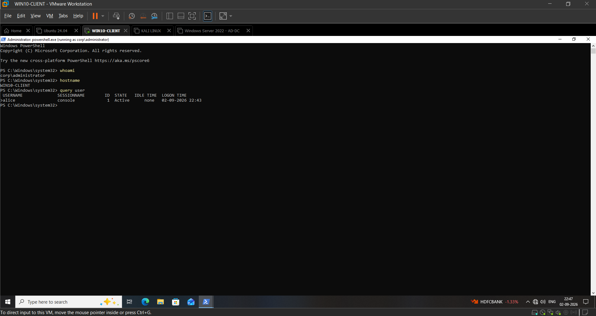

### Evidence — Domain Controller NTLM Baseline

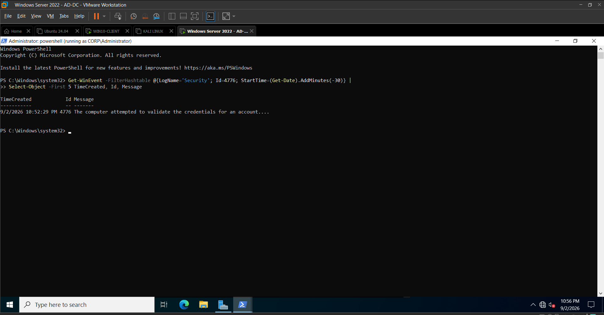

### Evidence — Sysmon Process Baseline

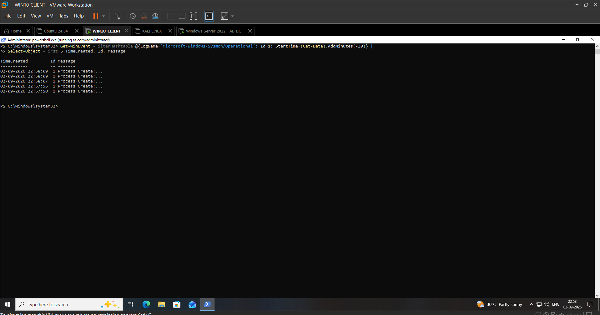

### Evidence — Windows 4624 Authentication Baseline

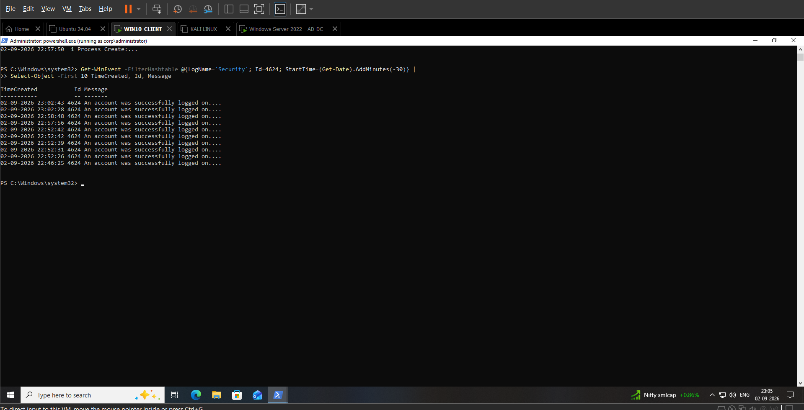

---

# 4. Controlled Pass-the-Hash Simulation

A dedicated low-privilege account, `pt_test`, was used for the attack simulation.

The attack was performed from the Kali Linux host against:

`WIN10-CLIENT — 192.168.159.133`

The authentication was performed using the account's NTLM hash rather than the plaintext password.

The purpose was to reproduce the authentication behavior associated with Pass-the-Hash while keeping the exercise isolated to the lab environment.

### Attack Flow

**Kali Linux**

`192.168.159.129`

↓

**NTLM Hash Authentication**

↓

**WIN10-CLIENT**

`192.168.159.133`

↓

**Windows Security Event 4624**

↓

**AD-DC NTLM Validation — Event 4776**

↓

**Wazuh Detection**

↓

**Rule 92652 — Successful NTLM Remote Logon**

---

# 5. Attack Execution Evidence

The controlled authentication successfully established SMB access to the Windows endpoint using the test account's NTLM credential material.

### Evidence — Pass-the-Hash SMB Authentication

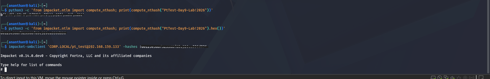

The successful authentication demonstrated that the supplied NTLM credential material could be used to authenticate to the target without providing the plaintext password.

---

# 6. Windows Endpoint Telemetry

Following the authentication attempt, Windows Security Event ID **4624** was observed on `WIN10-CLIENT`.

Important fields included:

| Field | Observed Value |
|---|---|
| Account | `CORP\pt_test` |
| Logon Type | `3` — Network |
| Authentication Package | `NTLM` |
| NTLM Package | `NTLM V2` |
| Logon Process | `NtLmSsp` |
| Source IP | `192.168.159.129` |
| Target | `WIN10-CLIENT` |

The combination of:

- Network logon
- NTLM authentication
- Remote source IP
- Controlled PtH activity

provided the primary endpoint-side evidence for the investigation.

### Evidence — Windows 4624 NTLM Network Logon

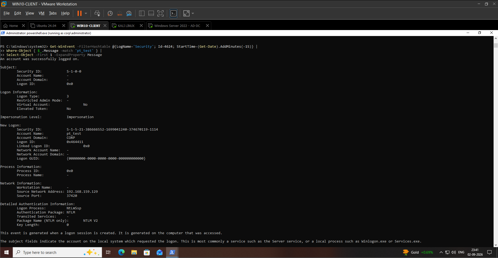

---

# 7. Domain Controller Correlation

The Domain Controller generated Security Event ID **4776** during the authentication process.

Event ID 4776 represents NTLM credential validation activity handled by the Domain Controller.

The event showed:

- Account: `pt_test`
- Authentication Package: `MICROSOFT_AUTHENTICATION_PACKAGE_V1_0`
- Error Code: `0x0`

An error code of `0x0` indicates that the credential validation was successful.

### Evidence — AD-DC 4776 Correlation

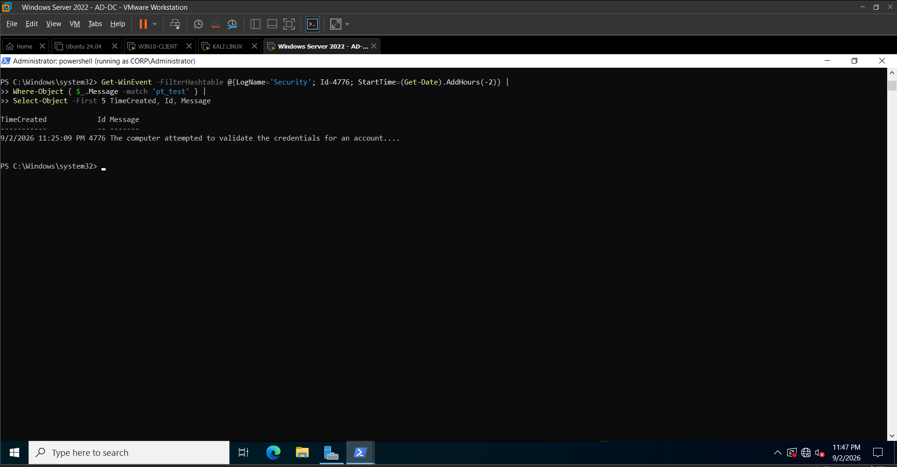

### Evidence — AD-DC 4776 Full Telemetry

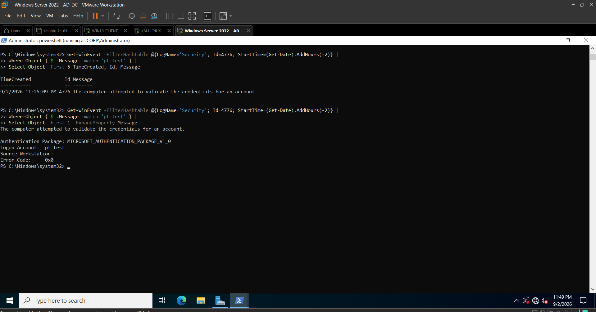

---

# 8. Wazuh Detection

The Windows endpoint was monitored by Wazuh during the controlled authentication test.

The resulting telemetry triggered the Wazuh detection chain associated with successful remote NTLM authentication.

The primary alert was:

**Rule ID: 92652**

**Description: Successful Remote Logon Detected**

**Level: 6**

The detection chain can be understood as:

**60106 — Windows Logon Success**

↓

**92651 — Successful Remote Logon**

↓

**92652 — NTLM Authentication**

The resulting alert provided useful context for SOC investigation, including:

- Target username
- Source IP
- Logon type
- Authentication package
- NTLM version
- Logon process
- Windows Event ID
- Agent information

### Evidence — PtH Authentication with Wazuh Online

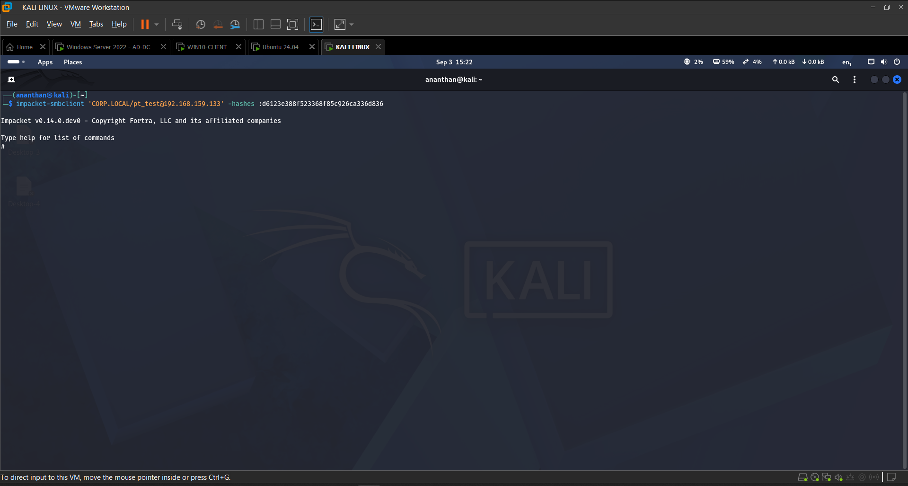

---

# 9. Wazuh Alert Analysis

The primary Wazuh detection occurred on:

**September 3, 2026 @ 15:22:03.826**

The alert originated from:

`WIN10-CLIENT`

Agent:

`002`

The relevant authentication telemetry included:

| Field | Value |
|---|---|
| Event ID | `4624` |
| Username | `pt_test` |
| Logon Type | `3` |
| Authentication Package | `NTLM` |
| NTLM Package | `NTLM V2` |
| Logon Process | `NtLmSsp` |
| Source IP | `192.168.159.129` |
| Wazuh Rule | `92652` |
| Wazuh Level | `6` |

### Evidence — Wazuh Document Details

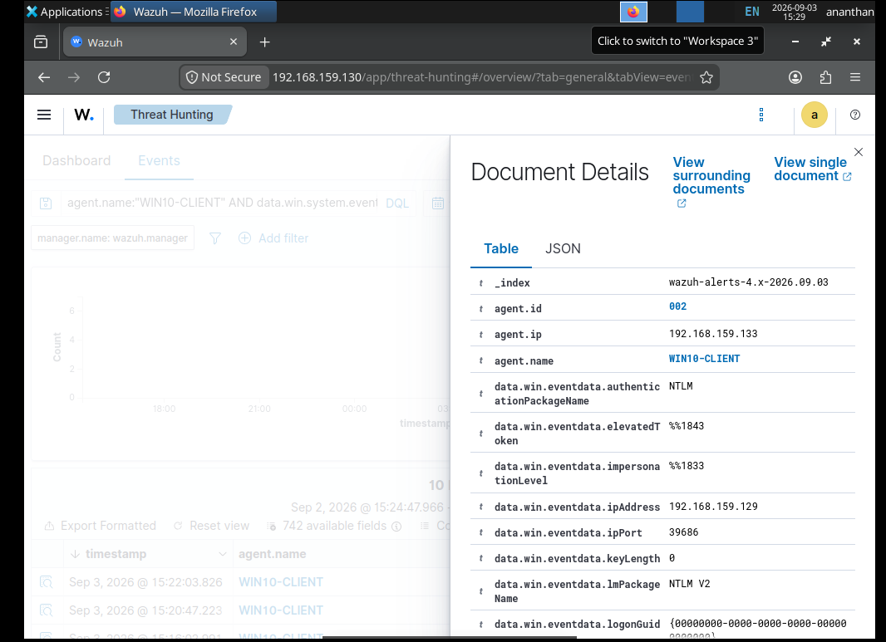

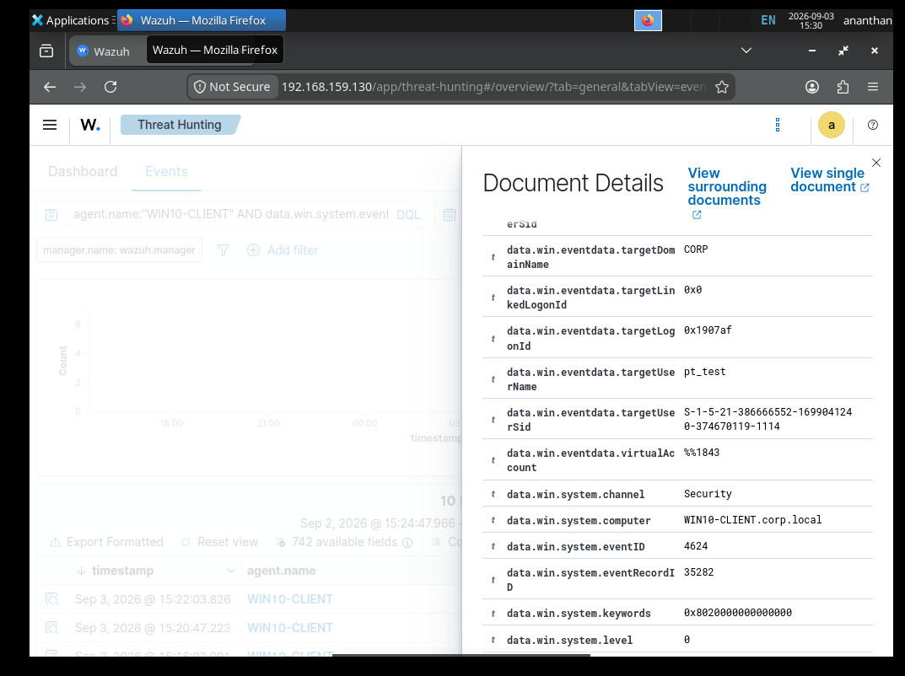

### Evidence — Key Authentication Fields

---

# 10. Detection Logic

The detection should not rely solely on the presence of NTLM.

A more useful SOC detection approach is to correlate multiple conditions:

### Detection Conditions

1. Successful Windows logon.
2. Logon Type `3` indicating a network logon.
3. Authentication package is `NTLM`.
4. Source IP is remote/non-loopback.
5. Account is authenticating from an unexpected or unusual source.
6. Authentication occurs outside the expected baseline.
7. Additional evidence indicates credential reuse or lateral movement.

### Detection Concept

**Successful Logon**

`Event ID 4624`

+

**Network Logon**

`Logon Type 3`

+

**NTLM Authentication**

`Authentication Package = NTLM`

+

**Remote Source**

`Source IP != Localhost`

↓

**Potential Suspicious NTLM Remote Authentication**

↓

**Investigate for Pass-the-Hash**

---

# 11. Sysmon Correlation

Sysmon Event ID **1** was reviewed as part of the endpoint investigation.

Sysmon process creation telemetry is valuable for identifying:

- Command execution
- Tool execution
- Parent-child process relationships
- Suspicious binaries
- PowerShell activity
- Credential-access tooling

However, the PtH authentication itself did not produce a directly attributable Sysmon process-creation event that could be confidently used as proof of the attack.

This is an important SOC observation:

> Not every authentication attack produces a unique process-creation event on the target endpoint.

Therefore, authentication telemetry and domain-controller telemetry remain critical for investigating credential-based attacks.

---

# 12. Event Correlation

The investigation correlated telemetry from multiple systems.

| Source | Event / Evidence | Significance |
|---|---|---|
| Kali Linux | SMB authentication | Demonstrates controlled attack execution |
| WIN10-CLIENT | Event ID 4624 | Successful remote NTLM logon |
| AD-DC | Event ID 4776 | NTLM credential validation |
| Wazuh | Rule 92652 | Detection of successful remote NTLM authentication |
| Sysmon | Event ID 1 | Endpoint process visibility / contextual investigation |

### Correlation Chain

**192.168.159.129 — Kali**

↓

**NTLM Hash Authentication**

↓

**WIN10-CLIENT**

↓

**4624 — Successful Network Logon**

↓

**AD-DC**

↓

**4776 — NTLM Credential Validation**

↓

**Wazuh**

↓

**92652 — Successful Remote NTLM Logon**

↓

**SOC Investigation**

---

# 13. Investigation Timeline

| Sequence | Activity | Evidence |
|---|---|---|
| 1 | Authentication baseline established | Day09-01 to Day09-04 |
| 2 | Controlled PtH SMB authentication initiated | Day09-05 |
| 3 | Windows endpoint records successful network logon | Day09-06 |
| 4 | Domain Controller records NTLM validation | Day09-07 / Day09-08 |
| 5 | Wazuh receives endpoint telemetry | Day09-09 |
| 6 | Wazuh Rule 92652 generates detection | Day09-10 / Day09-11 |
| 7 | Authentication fields reviewed and correlated | Day09-12 |
| 8 | Analyst determines activity is consistent with controlled PtH | Investigation report |

---

# 14. MITRE ATT&CK Mapping

The activity was mapped to the following MITRE ATT&CK techniques:

| Technique | ID | Relevance |
|---|---|---|
| Use Alternate Authentication Material: Pass the Hash | **T1550.002** | Primary technique demonstrated by the attack |
| Valid Accounts | **T1078** | Valid domain credentials were used for authentication |

### Primary Technique

**T1550.002 — Pass the Hash**

The attack demonstrates the reuse of NTLM authentication material to authenticate to a remote Windows system.

### Supporting Technique

**T1078 — Valid Accounts**

The authentication used a valid domain account, demonstrating how stolen authentication material can be abused while appearing as legitimate account activity.

---

# 15. Severity Assessment

**Severity: High**

### Rationale

Pass-the-Hash can enable attackers to:

- Reuse compromised credentials.
- Authenticate to additional systems.
- Move laterally.
- Access resources without knowing the plaintext password.
- Potentially escalate impact if privileged credentials are compromised.

The severity of a real-world incident would depend heavily on:

- Account privileges
- Destination systems
- Number of affected hosts
- Source of the credential material
- Whether lateral movement is occurring
- Whether privileged accounts are involved

In this lab, the activity was intentionally performed using a dedicated low-privilege test account.

---

# 16. False Positives

Legitimate NTLM network authentication can occur because of:

- Legacy applications
- Older Windows systems
- File servers
- Service accounts
- Administrative workflows
- Applications that do not support Kerberos
- Compatibility authentication

Therefore, an alert for NTLM authentication should not automatically be classified as malicious.

### Analyst Validation

The analyst should investigate:

1. Is the source host expected?
2. Is the destination expected?
3. Is the account expected to use NTLM?
4. Is the authentication occurring during normal working hours?
5. Is the source IP associated with the user?
6. Is the account privileged?
7. Are there multiple authentication attempts?
8. Are other lateral-movement indicators present?
9. Are suspicious processes or tools present on the source endpoint?
10. Is the same account authenticating to multiple systems?

---

# 17. Recommended SOC Investigation Workflow

When a similar alert is generated in a production environment:

### Step 1 — Validate the Account

Determine:

- Username
- Account type
- Privileges
- Group memberships
- Recent password changes
- Whether the account is expected to perform remote authentication

### Step 2 — Identify the Source

Investigate:

- Source IP
- Hostname
- Asset owner
- Geographic/network location
- Whether the source is a known workstation or server

### Step 3 — Identify the Destination

Determine:

- Target hostname
- Server role
- Criticality
- Accessible resources
- Whether remote access is expected

### Step 4 — Analyze Authentication

Review:

- Event ID 4624
- Logon Type
- Authentication Package
- NTLM version
- Logon Process
- Source address

### Step 5 — Correlate Domain Controller Events

Review:

- Event ID 4776
- Authentication validation
- Account activity
- Related authentication events

### Step 6 — Search for Lateral Movement

Look for:

- Additional remote logons
- SMB activity
- RDP authentication
- Administrative shares
- Multiple destination hosts
- Unusual account usage

### Step 7 — Investigate Endpoint Activity

Review:

- Sysmon Event ID 1
- PowerShell
- Command Prompt
- Remote administration tools
- Credential-access tools
- Suspicious parent-child process relationships

### Step 8 — Contain if Confirmed

Depending on the investigation:

- Disable or lock the compromised account.
- Reset the affected credentials.
- Isolate compromised endpoints.
- Revoke active sessions where applicable.
- Investigate credential exposure.
- Search for additional systems accessed with the same credentials.

---

# 18. Detection Limitations

This lab demonstrates an important limitation of authentication-based detection:

**NTLM authentication alone does not prove Pass-the-Hash.**

A production detection should combine:

- Authentication context
- Source/destination relationships
- User behavior
- Asset identity
- Historical baseline
- Endpoint telemetry
- Domain Controller telemetry
- Lateral-movement indicators

The Wazuh Rule 92652 alert is therefore best treated as a **high-value investigation trigger**, rather than cryptographic proof that a hash was used.

---

# 19. Key Blue Team Lessons

### 1. Authentication telemetry is extremely valuable

Windows Security events can provide detailed visibility into remote authentication behavior.

### 2. Correlation is more powerful than a single event

Event ID 4624 becomes significantly more useful when correlated with Domain Controller Event ID 4776 and source/destination context.

### 3. NTLM deserves monitoring

Although NTLM may still be required for compatibility, unexpected NTLM usage can be an important indicator of suspicious activity.

### 4. Baselines reduce false positives

Understanding normal authentication behavior allows analysts to identify unusual source systems and account behavior.

### 5. Sysmon is complementary

Sysmon provides strong endpoint process visibility, but authentication-based attacks may not always generate a directly attributable process event on the target.

### 6. Detection is not the same as attribution

A detection can identify suspicious behavior without proving exactly how the attacker obtained the credential material.

---

# 20. Security Recommendations

For production environments, organizations should consider:

- Reduce unnecessary NTLM usage.
- Prefer Kerberos where possible.
- Monitor NTLM authentication from unusual hosts.
- Protect privileged accounts.
- Apply least privilege.
- Avoid unnecessary local administrator access.
- Use strong credential hygiene.
- Deploy endpoint detection and response capabilities.
- Monitor lateral movement patterns.
- Investigate abnormal authentication source/destination combinations.
- Protect Domain Controllers as high-value assets.
- Use dedicated administrative accounts.
- Implement privileged access management where appropriate.

---

# 21. Evidence Gallery

## Attack Execution

## Windows Authentication Telemetry

## Domain Controller Correlation

## Wazuh Detection

---

# 22. Day 09 Deliverables

The following project artifacts were created during Day 09:

- `attacks/Pass-the-Hash.md`
- `detections/Pass-the-Hash-92652.md`
- `reports/Pass-the-Hash-Investigation.md`
- `docs/Day09.md`

Supporting evidence:

- 12 Day 09 screenshots
- Windows Security Event 4624 telemetry
- Domain Controller Event 4776 telemetry
- Wazuh Rule 92652 detection
- MITRE ATT&CK mapping
- Investigation timeline
- SOC response recommendations

---

# 23. Final Analyst Assessment

The controlled lab activity successfully demonstrated a **Pass-the-Hash authentication scenario** using a dedicated low-privilege domain account.

The attack was supported by:

- Successful NTLM-based SMB authentication from the Kali host.
- Windows Security Event ID 4624 showing a successful remote NTLM network logon.
- Domain Controller Event ID 4776 showing successful NTLM credential validation.
- Wazuh Rule 92652 identifying the successful remote NTLM authentication.
- Correlated source, account, authentication package, and logon-type information.

The investigation demonstrates how a SOC analyst can move from a single authentication alert toward a broader investigation using **endpoint telemetry, Domain Controller events, SIEM detection, behavioral context, and MITRE ATT&CK mapping**.

The exercise also reinforces an important detection-engineering principle:

> A strong SOC investigation does not depend on one event. It correlates multiple pieces of telemetry to establish confidence.

---

## Day 09 Status

**Status: Completed**

**Attack:** Pass-the-Hash  
**Primary MITRE Technique:** T1550.002  
**Supporting Technique:** T1078  
**Windows Telemetry:** 4624 / 4776  
**SIEM Detection:** Wazuh Rule 92652  
**Investigation:** Completed  
**Evidence:** 12 screenshots  
**Documentation:** Completed