# Day 11 — BloodHound Active Directory Attack-Path Analysis & Remediation

## Objective

Day 11 focused on **Active Directory attack-path analysis using BloodHound Community Edition (CE)**.

The objective was to understand how a low-privileged domain account can become indirectly connected to highly privileged Active Directory groups through nested group membership, identify the resulting attack path, validate the security exposure, remediate the misconfiguration, and confirm that the attack path no longer exists.

### Objectives completed

- Established the Active Directory security baseline.
- Reviewed privileged Active Directory groups.
- Validated a dedicated low-privileged BloodHound enumeration account.
- Collected Active Directory relationship data using BloodHound Python.
- Ingested the dataset into BloodHound CE.
- Identified the Domain Administrator as a Tier Zero asset.
- Established a controlled nested-group misconfiguration.
- Re-collected Active Directory relationship data.
- Identified a low-privileged-to-privileged attack path.
- Validated effective group membership independently.
- Removed the temporary privilege relationship.
- Performed a fresh BloodHound collection.
- Re-ingested the clean dataset.
- Verified that the previously identified attack path was removed.

> **Lab Safety:** The privilege relationships used for attack-path demonstration were intentionally created in a controlled lab environment and removed after validation.

---

# 1. Lab Environment

| Component | Configuration |
|---|---|
| Active Directory Domain | `corp.local` |
| Domain DN | `DC=corp,DC=local` |
| Domain Controller | `AD-DC.corp.local` |
| Domain Controller IP | `192.168.159.10` |
| Windows Client | `WIN10-CLIENT.corp.local` |
| BloodHound Enumeration Account | `bh_enum` |
| BloodHound Platform | BloodHound Community Edition |
| Collector | BloodHound Python |
| Analysis Host | Kali Linux |
| Primary Security Focus | Active Directory attack-path analysis |

---

# 2. Why BloodHound Matters

Active Directory security cannot be evaluated effectively by looking only at individual users and their direct group memberships.

A user may appear to be low privileged while indirectly inheriting access through:

`User → Group → Nested Group → Privileged Group`

BloodHound represents Active Directory as a graph of relationships.

This allows a security analyst to investigate questions such as:

- Which users can reach privileged groups?
- Which nested groups create privilege exposure?
- Which identities can potentially reach Tier Zero assets?
- Where are excessive permissions or memberships present?
- Did a remediation actually remove the attack path?

From a SOC and Blue-Team perspective, BloodHound complements SIEM and endpoint telemetry by providing **identity and privilege context**.

---

# 3. Phase 1 — Active Directory Domain Baseline

The Active Directory domain and Domain Controller were verified before performing the attack-path analysis.

The environment was confirmed as:

- Domain: `corp.local`
- Domain DN: `DC=corp,DC=local`
- Domain Controller: `AD-DC.corp.local`
- IP Address: `192.168.159.10`
- Site: `Default-First-Site-Name`

### Evidence

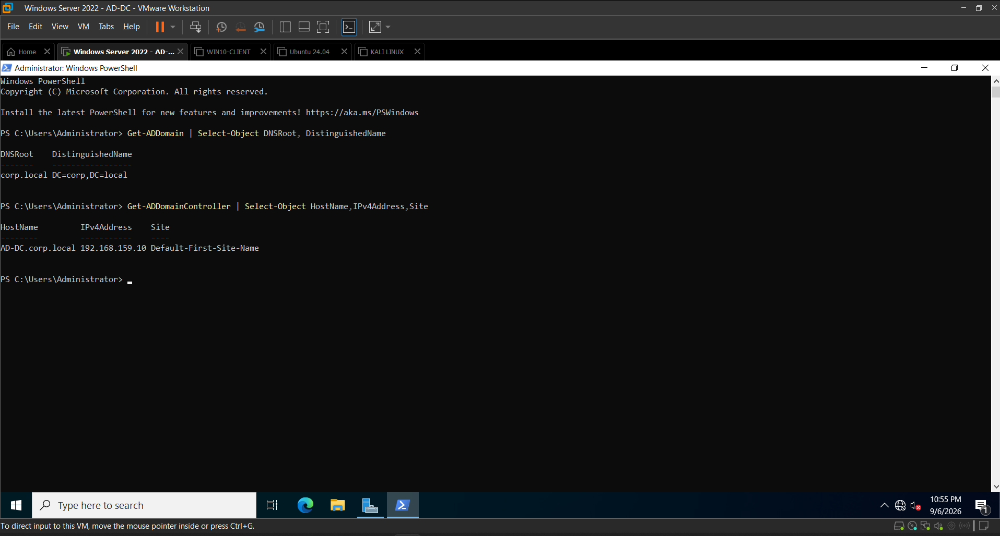

---

# 4. Phase 2 — Privileged Group Baseline

Existing privileged groups were reviewed before introducing the controlled attack-path scenario.

The baseline identified:

### Domain Admins

- `Administrator`

### Enterprise Admins

- `Administrator`

### Administrators

- `Domain Admins`
- `Enterprise Admins`
- `Administrator`

### IT-Admins

- `Administrator`

### SOC-Analysts

- `alice`
- `bob`

This baseline provided the reference point for determining how the later controlled group relationship changed the privilege graph.

### Evidence


---

# 5. Phase 3 — Low-Privilege BloodHound Enumeration Account

A dedicated account named `bh_enum` was used for BloodHound enumeration.

The account was intentionally maintained as a low-privileged identity.

Its direct `MemberOf` property was empty, establishing that it was not directly assigned to a privileged group.

This was important because the attack-path scenario was designed to demonstrate **indirect privilege exposure** rather than direct administrative membership.

### Evidence

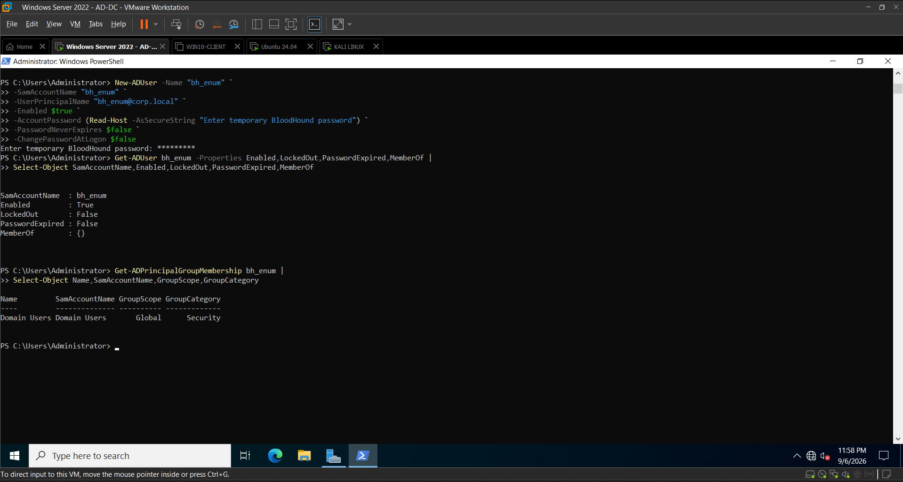

---

# 6. Phase 4 — BloodHound Active Directory Collection

BloodHound Python was executed from Kali Linux to enumerate the Active Directory environment.

The collector successfully identified:

- 1 Active Directory domain
- 1 forest
- 2 computers
- 10 users
- Active Directory groups
- 2 GPOs
- 5 OUs
- Active Directory containers
- 0 domain trusts

The collected information provided the relationship data required for graph-based analysis.

### Evidence

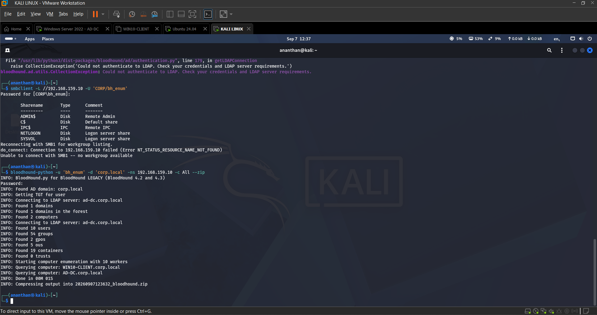

---

# 7. Phase 5 — BloodHound Collection Dataset

The BloodHound collector generated a compressed dataset containing the Active Directory relationship information.

The dataset contained object information for areas including:

- Users
- Groups
- Computers
- Domains
- GPOs
- OUs
- Containers

The collection was extracted locally before being ingested into BloodHound CE.

### Evidence

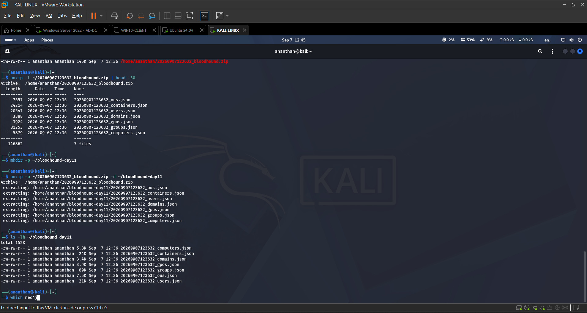

---

# 8. Phase 6 — BloodHound Community Edition

BloodHound Community Edition was used as the graph-analysis platform.

The BloodHound CE interface was successfully accessed from the Kali Linux environment.

### Evidence

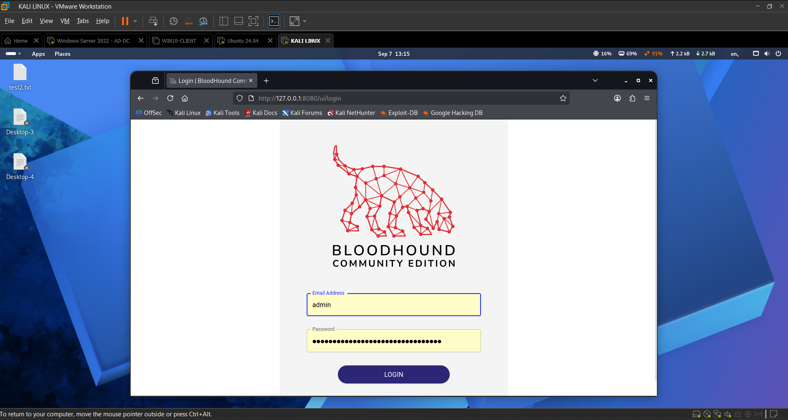

---

# 9. Phase 7 — Initial Dataset Ingestion

The collected Active Directory dataset was uploaded into BloodHound CE.

The ingestion completed successfully and processed the seven collected files.

This confirmed that the Active Directory relationship data was available for graph analysis.

### Evidence

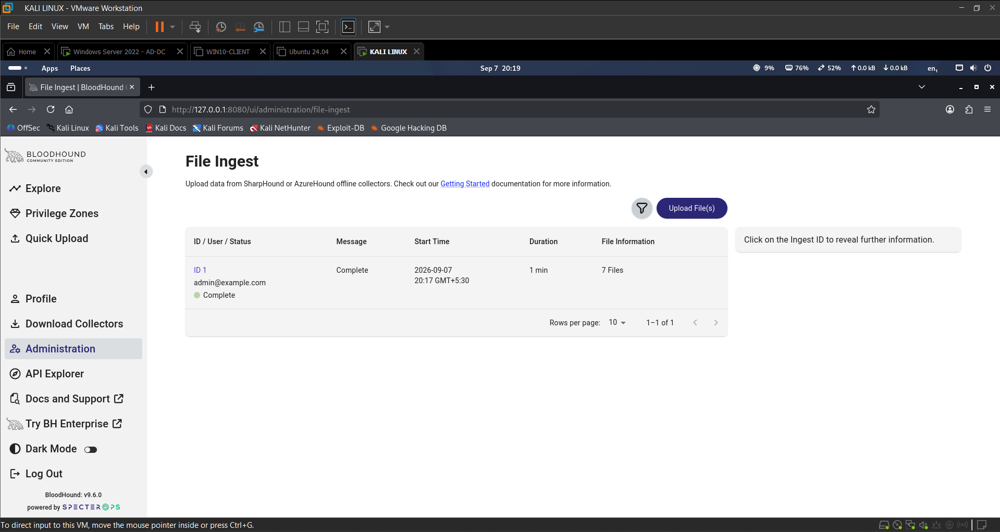

---

# 10. Phase 8 — Tier Zero Administrator Analysis

The built-in `Administrator` account was examined within BloodHound.

BloodHound identified the account as:

- Active Directory User
- Enabled
- Admin Count: `TRUE`
- Tier Zero asset

Tier Zero represents highly privileged identities and assets that have significant control over the Active Directory security boundary.

The objective was to determine whether a lower-privileged identity could have an indirect relationship leading toward this privileged target.

### Evidence

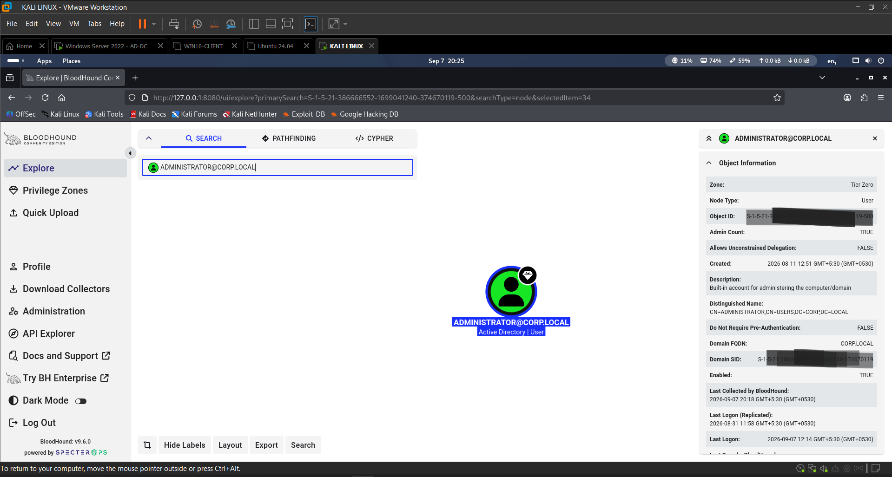

---

# 11. Phase 9 — Clean Attack-Path Baseline

The initial BloodHound pathfinding analysis used:

**Starting Node:** `BH_ENUM@CORP.LOCAL`

**Target:** `ADMINISTRATOR@CORP.LOCAL`

The initial graph reported:

**Path Not Found**

This established the clean baseline before introducing the controlled Active Directory group relationships.

### Evidence

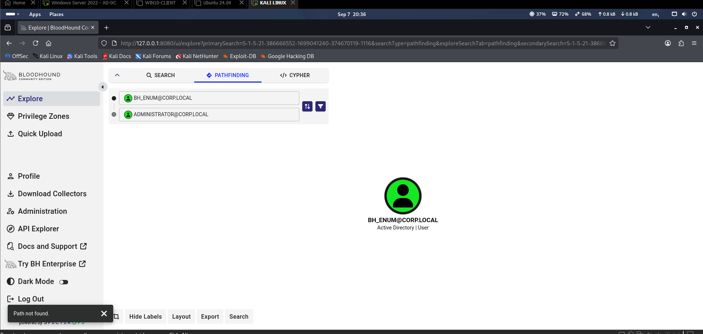

---

# 12. Phase 10 — Controlled Attack-Path Scenario

A temporary Active Directory security group named:

`Helpdesk-Tier1`

was created specifically for the controlled attack-path demonstration.

The purpose was to model a realistic identity-management weakness where a helpdesk group becomes indirectly connected to a privileged administrative group.

The scenario was intentionally created for analysis and was removed during the remediation phase.

---

# 13. Phase 11 — bh_enum Added to Helpdesk-Tier1

The low-privileged `bh_enum` account was added to:

`Helpdesk-Tier1`

This created the first relationship:

`BH_ENUM → MemberOf → Helpdesk-Tier1`

The relationship represents how an ordinary domain identity can become part of an intermediate group.

### Evidence

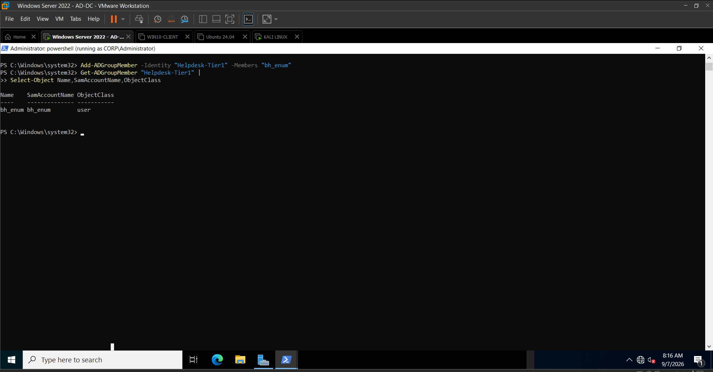

---

# 14. Phase 12 — Helpdesk-Tier1 Nested into IT-Admins

The `Helpdesk-Tier1` group was added as a member of:

`IT-Admins`

This created the nested relationship:

`BH_ENUM → Helpdesk-Tier1 → IT-Admins`

This demonstrates why nested group membership must be considered when performing Active Directory privilege reviews.

### Evidence


---

# 15. Phase 13 — Post-Misconfiguration BloodHound Collection

After introducing the controlled group relationships, a fresh BloodHound collection was performed.

A new collection was required so that the updated Active Directory relationships would be represented in the BloodHound dataset.

### Evidence

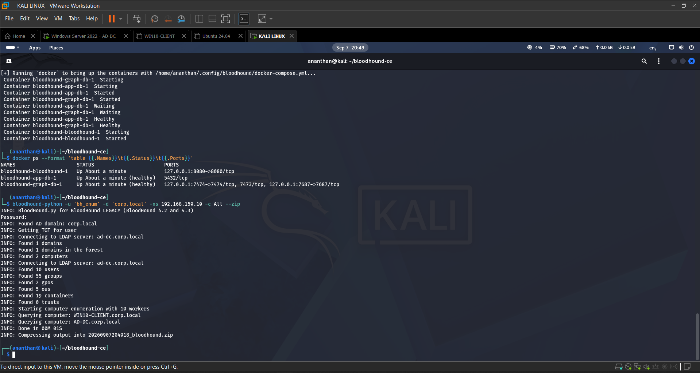

---

# 16. Phase 14 — Post-Misconfiguration Dataset Ingestion

The updated BloodHound dataset was successfully ingested into BloodHound CE.

This ensured that the newly created nested-group relationships were available for attack-path analysis.

### Evidence

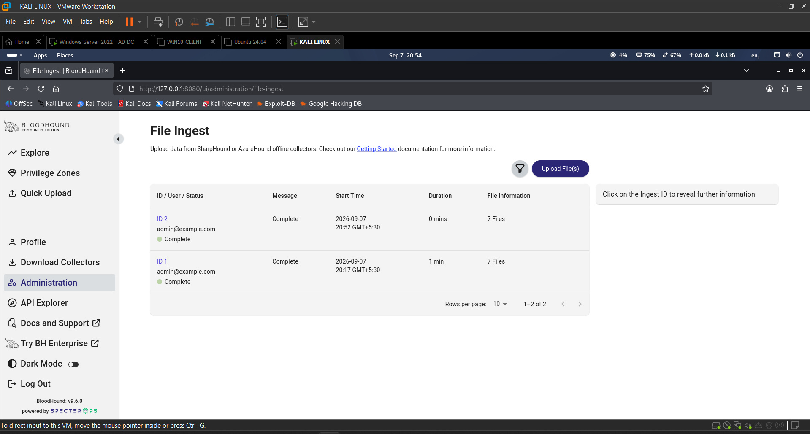

---

# 17. Phase 15 — IT-Admins Nested into Domain Admins

The controlled scenario was extended by placing:

`IT-Admins`

inside:

`Domain Admins`

This created the complete relationship chain:

`BH_ENUM → Helpdesk-Tier1 → IT-Admins → Domain Admins`

Because the `Administrator` account was already a member of `Domain Admins`, this relationship created an indirect route toward a Tier Zero identity.

### Evidence

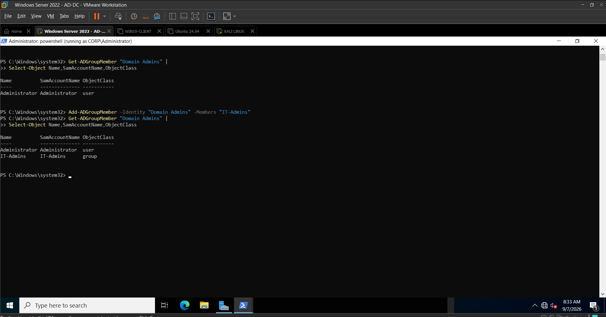

---

# 18. Phase 16 — Final BloodHound Collection

A further BloodHound collection was performed to ensure that the complete controlled group relationship structure was represented in the graph.

### Evidence

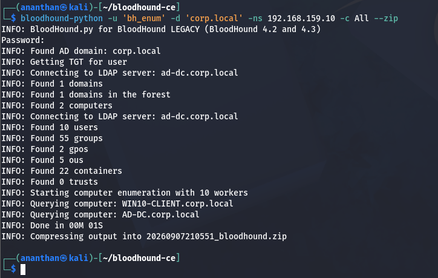

---

# 19. Phase 17 — Final Dataset Ingestion

The final collected dataset was successfully ingested into BloodHound CE.

The graph now contained the controlled nested-group relationships required for attack-path analysis.

### Evidence

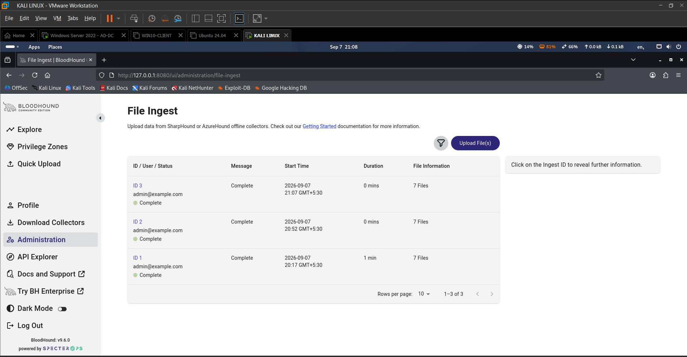

---

# 20. Phase 18 — Attack Path Identified

BloodHound pathfinding was performed from:

**Starting Node:** `BH_ENUM@CORP.LOCAL`

**Target:** `DOMAIN ADMINS@CORP.LOCAL`

BloodHound identified the following path:

`BH_ENUM`

↓

`Helpdesk-Tier1`

↓

`IT-Admins`

↓

`Domain Admins`

This demonstrated how a low-privileged identity can become indirectly connected to a highly privileged Active Directory group through nested group membership.

### Identified Attack Path

**BH_ENUM → Helpdesk-Tier1 → IT-Admins → Domain Admins**

This was the primary security finding of the Day 11 exercise.

### Evidence


---

# 21. Phase 19 — Individual Relationship Analysis

Each relationship in the discovered path was analyzed separately.

## Relationship 1

`BH_ENUM → Helpdesk-Tier1`

Relationship type:

`MemberOf`

### Evidence

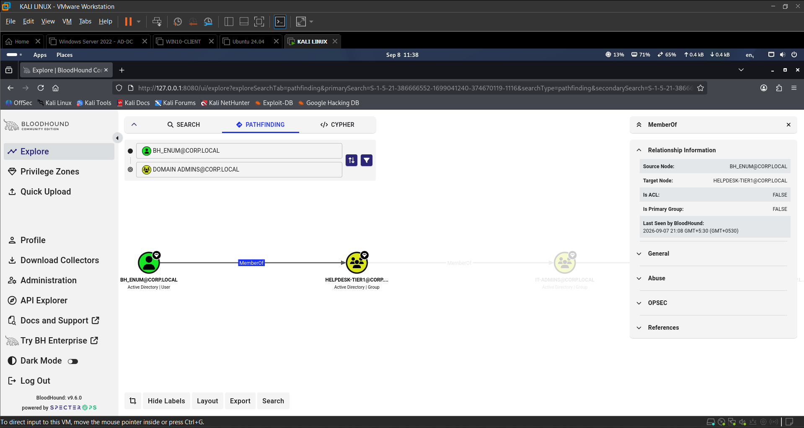

---

## Relationship 2

`Helpdesk-Tier1 → IT-Admins`

Relationship type:

`MemberOf`

### Evidence

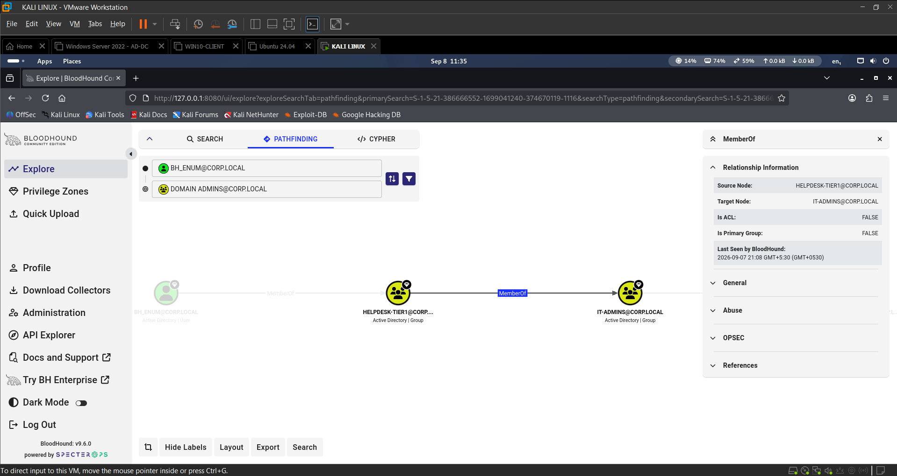

---

## Relationship 3

`IT-Admins → Domain Admins`

Relationship type:

`MemberOf`

### Evidence

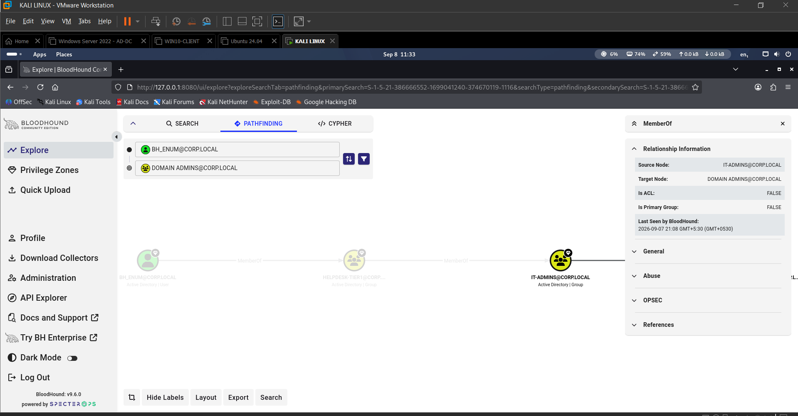

---

# 22. Phase 20 — Effective Privilege Validation

The nested group configuration was independently validated from Active Directory.

Recursive group membership enumeration demonstrated that `bh_enum` was effectively represented within the `Domain Admins` hierarchy during the controlled scenario.

This is an important security observation:

> Reviewing only direct user memberships can miss effective privileges inherited through nested groups.

### Evidence


---

# 23. Security Finding

## Finding: Privilege Exposure Through Nested Group Membership

**Severity:** High

**Category:** Identity and Access Management / Active Directory Privilege Exposure

### Description

A low-privileged domain identity was intentionally placed into a helpdesk group that was then nested into a privileged administrative group.

The resulting relationship was:

`BH_ENUM → Helpdesk-Tier1 → IT-Admins → Domain Admins`

This demonstrates how excessive or poorly controlled nested group membership can create an indirect privilege escalation path.

### Potential Security Impact

In a real enterprise environment, an equivalent misconfiguration could increase the ability of a compromised low-privileged identity to reach administrative resources.

Potential consequences include:

- Privilege escalation
- Unauthorized administrative access
- Increased lateral movement capability
- Access to sensitive systems
- Increased exposure of Tier Zero assets
- Potential domain-wide compromise depending on additional permissions and controls

---

# 24. Phase 21 — Remediation

After validating the attack path, the temporary group relationships were removed.

The `IT-Admins` membership of `Helpdesk-Tier1` was removed.

The temporary `Helpdesk-Tier1` group was subsequently deleted.

This returned the lab to the intended clean privilege structure.

### Evidence

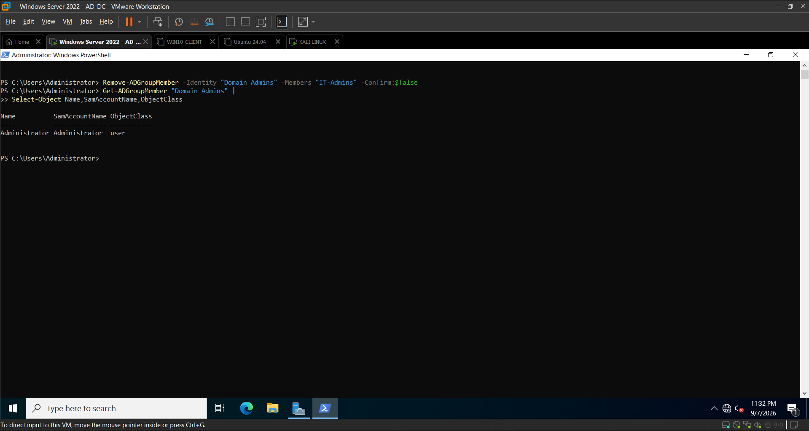

---

# 25. Phase 22 — Post-Remediation BloodHound Collection

A fresh BloodHound collection was performed after remediation.

This step was critical because changing the Active Directory configuration alone does not prove that the security exposure has been removed from the analysis perspective.

A new collection was required to provide an updated representation of the Active Directory relationship graph.

### Evidence

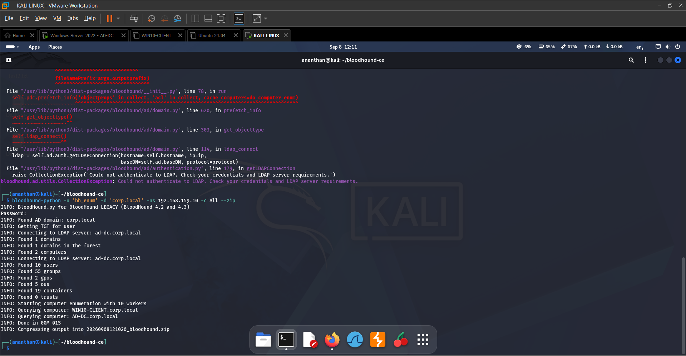

---

# 26. Phase 23 — Clean Post-Remediation Ingestion

The clean BloodHound dataset was successfully ingested into BloodHound CE.

The updated dataset represented the remediated Active Directory relationship structure.

### Evidence

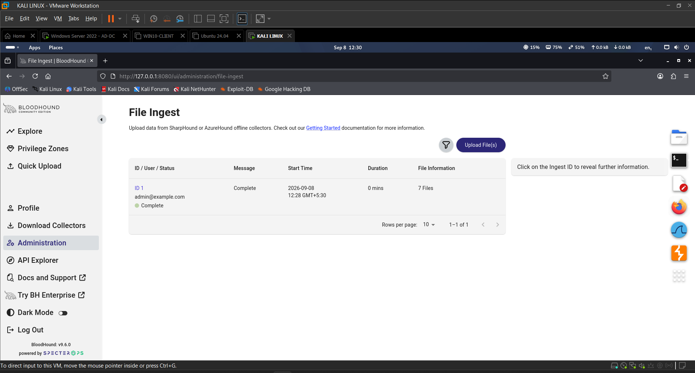

---

# 27. Phase 24 — Attack-Path Removal Validation

The same attack-path analysis was repeated after remediation.

The previously identified relationship chain:

`BH_ENUM → Helpdesk-Tier1 → IT-Admins → Domain Admins`

was no longer present in the clean BloodHound graph.

The remediation therefore removed the previously identified attack path.

This established the following defensive validation workflow:

**Configuration Change → Fresh Collection → Fresh Ingestion → Path Analysis → Risk Removed**

### Evidence

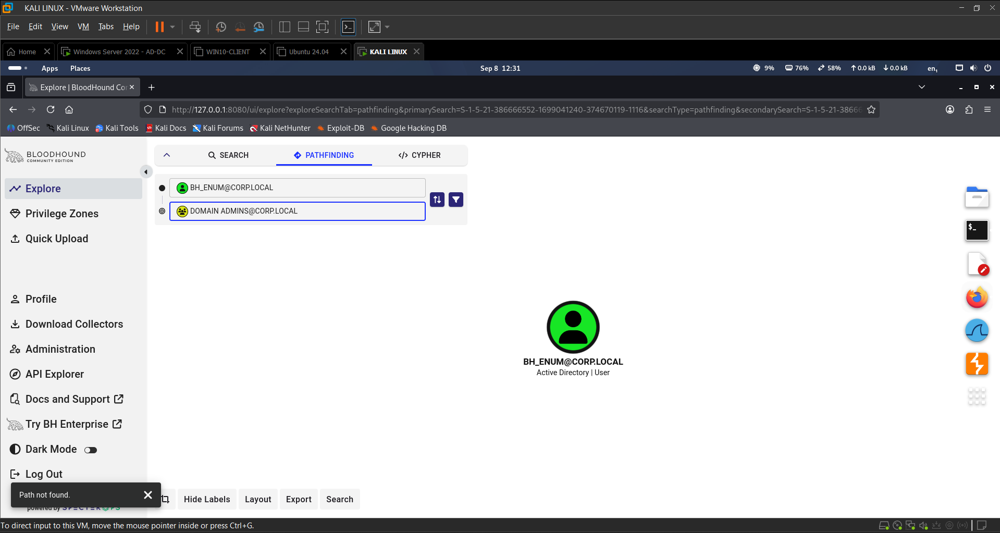

---

# 28. Attack-Path Lifecycle

The complete Day 11 workflow can be summarized as:

```text
AD Baseline
    ↓
BloodHound Collection
    ↓
Clean Graph Analysis
    ↓
No Path Found
    ↓
Controlled Group Misconfiguration
    ↓
Fresh BloodHound Collection
    ↓
Attack Path Identified
    ↓
Effective Membership Validation
    ↓
Remediation
    ↓
Fresh BloodHound Collection
    ↓
Clean Dataset Ingestion
    ↓
Path Analysis
    ↓
Attack Path Removed
```

This demonstrates both offensive understanding and defensive remediation validation.

---

# 29. BloodHound Attack-Path Model

The controlled scenario produced the following relationship model:

```text
BH_ENUM
   │
   │ MemberOf
   ▼
Helpdesk-Tier1
   │
   │ MemberOf
   ▼
IT-Admins
   │
   │ MemberOf
   ▼
Domain Admins
   │
   │ MemberOf
   ▼
Administrator
```

The key security lesson is that privilege exposure can be **indirect**.

A user does not need to be directly listed as a member of `Domain Admins` for nested relationships to create an effective path toward privileged access.

---

# 30. Day 11 Diagram

The complete Day 11 attack-path validation and remediation workflow is represented in the project diagram:

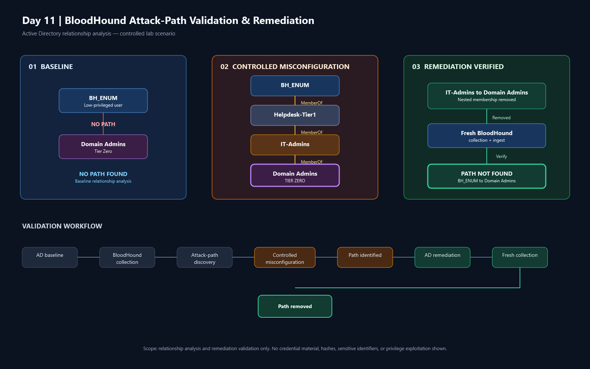

Editable Draw.io source:

[Day11 BloodHound Attack-Path Remediation Diagram](../diagrams/Day11-BloodHound-Attack-Path-Remediation.drawio)

---

# 31. Defensive Lessons Learned

## 1. Direct membership is not enough

A user may have no direct privileged-group membership while still inheriting significant privileges through nested groups.

## 2. Nested groups require continuous review

Administrative groups should be reviewed for unexpected or unnecessary nesting.

## 3. Identity relationships create attack paths

A sequence of individually valid group relationships can collectively create a high-risk privilege path.

## 4. Tier Zero assets require additional protection

Identities and groups capable of controlling the Active Directory environment should receive stronger access controls and monitoring.

## 5. Remediation must be validated

Removing a group relationship is only the remediation action.

A fresh BloodHound collection and path analysis provides stronger evidence that the previously identified exposure has actually been removed.

---

# 32. SOC Relevance

BloodHound findings can help a SOC prioritize monitoring and investigation.

Attack-path findings can be used to identify identities and groups that deserve additional monitoring for:

- Privileged group membership changes
- Unexpected administrative relationships
- Suspicious authentication
- Privileged logons
- Lateral movement
- Account privilege escalation
- Changes to Tier Zero identities

BloodHound and SIEM telemetry therefore provide complementary perspectives.

### BloodHound answers:

**"What privilege paths exist?"**

### SIEM / endpoint telemetry answers:

**"What activity actually occurred?"**

Combining both perspectives provides stronger defensive context.

---

# 33. MITRE ATT&CK Relevance

The Day 11 exercise focused primarily on **Active Directory relationship and privilege analysis** rather than direct credential theft.

Relevant ATT&CK techniques and concepts include:

- **T1069.002 — Permission Groups Discovery: Domain Groups**
- **T1087.002 — Account Discovery: Domain Account**
- **T1078 — Valid Accounts**
- **T1484.001 — Domain Policy Modification: Group Policy Modification**

The central finding was an Active Directory privilege exposure created through nested group membership.

---

# 34. Analyst Assessment

### Initial State

`BH_ENUM` had no identified BloodHound path to the Administrator target.

### Controlled Modification

A temporary relationship was created:

`BH_ENUM → Helpdesk-Tier1 → IT-Admins → Domain Admins`

### Discovery

BloodHound identified the resulting attack path.

### Validation

Recursive Active Directory membership analysis confirmed the effective relationship.

### Remediation

The temporary group relationship was removed and the temporary group was deleted.

### Final State

A fresh BloodHound collection and ingestion were performed.

The previously identified attack path was no longer present.

---

# 35. Final Outcome

Day 11 successfully demonstrated an end-to-end Active Directory attack-path analysis workflow:

- Active Directory baseline established.
- Privileged groups identified.
- Low-privileged enumeration account validated.
- BloodHound Python collection completed.
- BloodHound CE deployed and accessed.
- Active Directory dataset ingested.
- Tier Zero Administrator analyzed.
- Clean attack-path baseline established.
- Controlled nested-group misconfiguration created.
- Attack path identified.
- Individual relationships analyzed.
- Effective privilege relationship independently validated.
- Misconfiguration remediated.
- Fresh BloodHound collection performed.
- Clean dataset ingested.
- Attack path removal validated.

The exercise demonstrates an important identity-security principle:

> **Security is not only about who has privileged access directly. It is also about what paths existing relationships create.**

---

# 36. Evidence Index

| # | Evidence |
|---:|---|
| 01 | `Day11-01-ADDC-Domain-Baseline.png` |
| 02 | `Day11-02-AD-Privileged-Groups-Baseline.png` |
| 03 | `Day11-03-bh_enum-LowPrivilege-Baseline.png` |
| 04 | `Day11-04-BloodHound-AD-Collection-Success.png` |
| 05 | `Day11-05-BloodHound-Collection-Dataset-Extracted.png` |
| 06 | `Day11-06-BloodHound-CE-Login.png` |
| 07 | `Day11-07-BloodHound-AD-Dataset-Ingest-Complete.png` |
| 08 | `Day11-08-BloodHound-Administrator-TierZero-Analysis.png` |
| 09 | `Day11-09-BloodHound-No-Path-BH_ENUM-to-Administrator.png` |
| 10 | `Day11-10-BH_ENUM-Helpdesk-Tier1-Membership.png` |
| 11 | `Day11-11-IT-Admins-Helpdesk-Tier1-Nested-Group.png` |
| 12 | `Day11-12-BloodHound-Post-Misconfiguration-Collection.png` |
| 13 | `Day11-13-BloodHound-Post-Misconfiguration-Ingest-Complete.png` |
| 14 | `Day11-14-Domain-Admins-IT-Admins-Nested-Group.png` |
| 15 | `Day11-15-BloodHound-Final-Collection-Success.png` |
| 16 | `Day11-16-BloodHound-Final-Ingest-Complete.png` |
| 17 | `Day11-17-BloodHound-BH_ENUM-to-Domain-Admins-Attack-Path.png` |
| 18 | `Day11-18-BloodHound-IT-Admins-to-Domain-Admins-MemberOf-Relationship.png` |
| 19 | `Day11-19-BloodHound-Helpdesk-Tier1-to-IT-Admins-MemberOf.png` |
| 20 | `Day11-20-BloodHound-BH_ENUM-to-Helpdesk-Tier1-MemberOf.png` |
| 21 | `Day11-21-BH_ENUM-Effective-Domain-Admins-Membership.png` |
| 22 | `Day11-22-Domain-Admins-Remediation-IT-Admins-Removed.png` |
| 23 | `Day11-23-BloodHound-Post-Remediation-Collection.png` |
| 24 | `Day11-24-BloodHound-Clean-Post-Remediation-Ingest.png` |
| 25 | `Day11-25-BloodHound-Remediation-Path-Removed.png` |

---

# 37. Portfolio Significance

Day 11 demonstrates practical experience with:

- Active Directory security
- BloodHound Community Edition
- BloodHound Python
- Identity and Access Management
- Privileged group analysis
- Nested group analysis
- Tier Zero analysis
- Attack-path discovery
- Privilege exposure assessment
- Security misconfiguration analysis
- Effective privilege validation
- Remediation
- Post-remediation validation
- Evidence-based security documentation

More importantly, the exercise demonstrates a complete security workflow rather than simply using a security tool:

**Baseline → Analyze → Identify Risk → Validate → Remediate → Re-collect → Re-analyze → Confirm Closure**